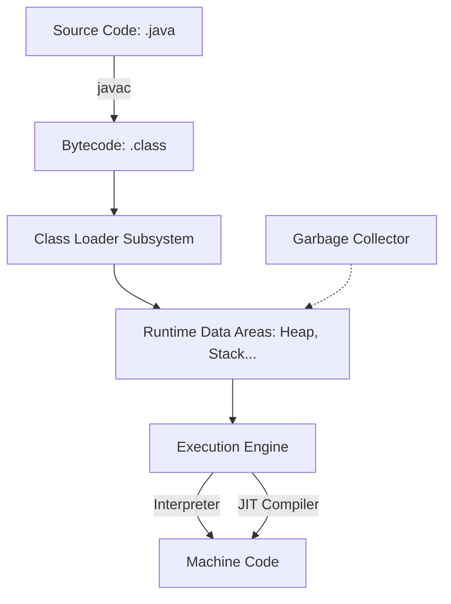

# Metadata
- **Document ID**: DSA-01-03
- **Version**: 1.0
- **Prerequisites**: Có kiến thức cơ bản về máy tính, biết cài đặt phần mềm.
- **Learning Objectives**: Hiểu kiến trúc cơ bản của Java, cách thiết lập môi trường lập trình tối ưu với Java 21 (LTS), và làm quen với các tính năng mới nhất để phục vụ cho các bài toán DSA.
- **Estimated Reading Time**: 50 phút
- **Difficulty**: Beginner
- **Dependencies**: Không có (None)
- **Keywords**: JDK 21, JVM, Virtual Threads, Pattern Matching, Records, JIT Compiler

---

# 1 Purpose
Mục đích của tài liệu này là hướng dẫn thiết lập một môi trường làm việc chuẩn mực cho Enterprise (doanh nghiệp) sử dụng Java 21. Nó giải thích những thành phần cốt lõi của hệ sinh thái Java để đảm bảo mã nguồn DSA hoạt động với hiệu suất tối đa.

---

# 2 Motivation
Nhiều sinh viên và kỹ sư thiết lập Java một cách máy móc (Next -> Next -> Finish) mà không hiểu rõ JAVA_HOME là gì, hay sự khác biệt giữa JDK và JRE. Java 21 là phiên bản Long-Term Support (LTS) quan trọng nhất trong những năm gần đây, giới thiệu Virtual Threads và Pattern Matching, làm thay đổi hoàn toàn cách viết thuật toán hiệu năng cao.

---

# 3 Mathematical Foundation & Core Paradigm
Kiến trúc của Java dựa trên triết lý **"Write Once, Run Anywhere"** (WORA).
Toán học hóa quá trình biên dịch:
Cho tập lệnh mã nguồn $S$, Trình biên dịch (Compiler) $C$, và Máy ảo (Virtual Machine) $V$ trên hệ điều hành $O$.
Quá trình biên dịch tĩnh của C++: $f: S \xrightarrow{C} M_O$ (Mã máy phụ thuộc hệ điều hành).
Quá trình của Java: $f: S \xrightarrow{C} B$ (Bytecode) và $g: B \xrightarrow{V_O} M_O$.
Bytecode $B$ là Invariant (bất biến) trên mọi hệ điều hành.

---

# 4 Core Theory
- **JDK (Java Development Kit)**: Chứa JRE và các công cụ phát triển như `javac` (compiler), `jmap`, `jcmd`.
- **JRE (Java Runtime Environment)**: Chứa JVM và thư viện chuẩn (Standard Libraries) để chạy Bytecode.
- **JVM (Java Virtual Machine)**: Máy ảo thực thi Bytecode. Nó cung cấp Garbage Collection (GC) và Just-In-Time (JIT) Compilation.

---

# 5 Visual Explanation



---

# 6 Java Implementation
Cài đặt SDKMAN (trên Linux/macOS/WSL) là cách chuẩn Enterprise để quản lý JDK:
```bash
curl -s "https://get.sdkman.io" | bash
source "$HOME/.sdkman/bin/sdkman-init.sh"
sdk install java 21.0.2-tem
```
Ví dụ tính năng mới của Java 21 (**Record** - Data Structure hoàn hảo cho DSA):
```java
// Khai báo một cấu trúc dữ liệu Tọa độ 2D bất biến (Immutable)
public record Point(int x, int y) {}

public class Java21Features {
    public static void main(String[] args) {
        Point p = new Point(5, 10);
        System.out.println("X: " + p.x() + ", Y: " + p.y());
    }
}
```

---

# 7 Step-by-Step Execution
Quá trình thực thi `Java21Features`:
1. Viết mã vào file `Java21Features.java`.
2. Chạy lệnh `javac Java21Features.java` -> Tạo ra `Java21Features.class` và `Point.class`.
3. Chạy lệnh `java Java21Features`.
4. **Class Loader** nạp Bytecode vào Memory.
5. **Bytecode Verifier** kiểm tra tính an toàn (Không vi phạm memory).
6. **Execution Engine** dịch Bytecode thành Native Machine Code và in ra Console.

---

# 8 Complexity Analysis
Trong bối cảnh môi trường cài đặt, chúng ta phân tích Complexity của quá trình khởi động (Startup):
- **Startup Time**: Java truyền thống mất hàng giây để nạp Class và khởi động JVM ($\mathcal{O}(N)$ thời gian khởi động dựa trên số lượng class).
- **Warmup Time**: JIT Compiler cần thời gian để phân tích mã nào được gọi nhiều lần (Hot Code) để tối ưu hóa, do đó hiệu suất lúc đầu ($\mathcal{O}(K)$) sẽ chậm hơn lúc sau ($\mathcal{O}(1)$ tối ưu).

---

# 9 JVM Analysis
Với Java 21, JVM (thường là HotSpot) có sự nâng cấp mạnh mẽ:
- **Virtual Threads**: Không ánh xạ 1-1 với OS Threads (như Native Threads). JVM tự quản lý hàng triệu Virtual Threads trên một số ít OS Threads. Kích thước Stack ban đầu chỉ vài trăm Bytes thay vì 1MB. 
- Giúp thiết kế các thuật toán I/O song song (Parallel I/O algorithms) vô cùng dễ dàng và tốn ít RAM (Stack Memory).

---

# 10 OpenJDK Analysis
- **G1GC (Garbage-First Garbage Collector)** là mặc định. Nó chia Heap thành các Regions nhỏ, tối ưu cho máy chủ có RAM lớn và CPU nhiều nhân.
- JDK 21 tích hợp **ZGC** (Z Garbage Collector) thế hệ mới (Generational ZGC) giảm độ trễ (Latency) xuống dưới 1 mili-giây kể cả với Heap terabyte.

---

# 11 Production Usage
Trong hệ thống thực tế (Production):
- Amazon, Google sử dụng bản phân phối OpenJDK riêng (Amazon Corretto, Google's JDK) để cài đặt trên Docker Containers.
- Sử dụng Docker image **Distroless** (không chứa shell, không package manager) để thu nhỏ image size và tăng tính bảo mật (Security).
- Ứng dụng Spring Boot 3 yêu cầu tối thiểu Java 17, và đang dần chuyển sang Java 21 để tận dụng Virtual Threads.

---

# 12 Design Decisions
**Nên dùng IDE nào cho DSA?**
- **IntelliJ IDEA**: Vô địch về refactoring, decompilation và code suggestions. Yêu cầu RAM cao (ít nhất 8GB).
- **VS Code**: Nhẹ, linh hoạt, phù hợp với thi đấu lập trình (CP) và máy tính cấu hình yếu.
- **Eclipse**: Cũ, ít được khuyên dùng cho dự án mới nhưng vẫn phổ biến trong các hệ thống legacy.

---

# 13 Common Bugs
20 lỗi phổ biến khi cài đặt và sử dụng môi trường Java:
1. `java: command not found`: Chưa cài JRE/JDK hoặc chưa set biến môi trường PATH.
2. `javac: command not found`: Chỉ cài JRE thay vì JDK.
3. `UnsupportedClassVersionError`: Biên dịch bằng Java 21 nhưng chạy bằng JRE 11.
4. Quên set biến `JAVA_HOME`.
5. `NoClassDefFoundError`: Lỗi Classpath khi chạy chương trình có chứa nhiều file `.class`.
6. Lỗi Unicode (UTF-8) khi in ra tiếng Việt trên Windows CMD.
7. Xung đột phiên bản khi cài nhiều JDK trên cùng một máy (Ví dụ: Oracle JDK và OpenJDK).
8. `OutOfMemoryError`: Không phân bổ đủ Heap Space (`-Xmx`).
9. File name không khớp với tên class `public`.
10. Quên viết method `public static void main(String[] args)`.
11. Bỏ sót dấu chấm phẩy `;` (Syntax error cơ bản).
12. Lỗi quên thêm file `jar` vào thư mục `lib/` khi biên dịch thủ công.
13. Không có quyền chạy (Permission Denied) trên Linux/Mac.
14. Lỗi Port in Use khi chạy các thuật toán Web server.
15. Không tìm thấy module (Java 9+ Module System).
16. Dùng từ khóa dự phòng của Java 21 làm tên biến (ví dụ `record`, `var`).
17. Khởi tạo mảng có kích thước vượt quá giới hạn RAM vật lý.
18. Không cấu hình Maven/Gradle wrapper dẫn đến sai lệch phiên bản build giữa các thành viên trong team.
19. Mở file để I/O nhưng quên đóng (Leak file descriptor), gặp lỗi Access Denied trên Windows.
20. Hardcode đường dẫn file (ví dụ `C:\\Users\\...`) thay vì dùng đường dẫn tương đối.

---

# 14 Edge Cases
30 trường hợp ngoại lệ trong cấu hình và môi trường:
1. Thư mục cài đặt chứa khoảng trắng (Spaces) trong Windows.
2. Tên file chứa ký tự đặc biệt hoặc Unicode.
3. Chạy lệnh từ thư mục sai (không phải root package).
4. Biến môi trường PATH vượt quá ký tự cho phép trên Windows cũ.
5. Cài đặt bản x86 (32-bit) trên máy 64-bit dẫn đến giới hạn Heap < 4GB.
6. Cài JDK cho kiến trúc ARM (M1/M2 Mac) nhầm sang x64, phải chạy qua giả lập Rosetta.
7. Cấu hình `-Xms` (Heap khởi tạo) lớn hơn RAM vật lý khả dụng.
8. Symlink của lệnh `java` trỏ sai phiên bản trên Linux.
9. Firewall chặn quyền truy cập mạng của JVM (khi cài Maven dependencies).
10. Hệ điều hành hết File Descriptors.
11. Đặt tên package xung đột với thư viện chuẩn (vd: `java.lang`).
12. Không có quyền Administrator/Root khi cài đặt Global.
13. Quét nhầm file mã độc bởi phần mềm Diệt virus làm chậm quá trình biên dịch.
14. Thay đổi thời gian hệ thống (Timezone) liên tục ảnh hưởng đến thuật toán thời gian thực.
15. Chạy trên WSL 1 thay vì WSL 2 gây lỗi I/O chậm.
16. Lỗi khi mount ổ đĩa mạng (Network Drive) để lưu code.
17. IDE cache bị corrupt (Cần Invalidate Caches).
18. Quá trình tải dependency Maven bị ngắt mạng giữa chừng gây corrupt file `.jar`.
19. Plugin của IDE gây tốn CPU (100% CPU Load).
20. Sử dụng Preview Features nhưng quên truyền flag `--enable-preview`.
21. Biên dịch chéo (Cross-compilation) sử dụng `--release` cờ sai.
22. Chạy thuật toán sử dụng đệ quy sâu với Stack mặc định quá nhỏ (Cần `--Xss`).
23. Sử dụng Docker Desktop trên Windows không đủ dung lượng ảo (VHD limit).
24. Bị lỗi CRLF (Windows) vs LF (Linux) khi đẩy code qua Git gây lỗi biên dịch text block.
25. Bộ nhớ Swap bị tràn do JVM cố gắng Allocate quá mức.
26. Terminal không hỗ trợ ANSI color gây hiển thị lỗi log.
27. Đặt mật khẩu máy tính có chứa ký tự escape gây lỗi biến môi trường.
28. Tính năng tự động cập nhật của OS khởi động lại máy giữa lúc compile.
29. Lỗi thiết bị USB ngắt đột ngột nếu lưu Code trên USB.
30. Quá trình cấp phát bộ nhớ ảo (Virtual Memory) bị tắt trên Windows.

---

# 15 Optimization Techniques
- **Lệnh tắt (Alias)**: Thiết lập alias trong terminal để chạy nhanh `javac` và `java`.
- **GraalVM**: Sử dụng GraalVM Native Image để biên dịch Ahead-of-Time (AOT), chuyển Java code thành file thực thi độc lập cực nhanh, khởi động trong mili-giây, vô cùng hữu ích cho thi đấu lập trình.
- **JVM Flags**: Dùng flag `-XX:+UseZGC` để bật Z Garbage Collector với các bài toán thuật toán đòi hỏi tốc độ phản hồi cực cao mà phải tạo nhiều Object.

---

# 16 Best Practices
- Luôn sử dụng Build Tool (Maven hoặc Gradle) ngay cả với dự án thuật toán đơn giản để dễ quản lý thư viện Test (JUnit, JMH).
- Dùng SDKMAN để chuyển đổi (switch) qua lại giữa các phiên bản Java dễ dàng.
- Đặt tên file `.java` phải chính xác viết hoa chữ cái đầu theo chuẩn CamelCase.

---

# 17 Benchmark
Trong Java 21, để thực hiện Benchmark chuẩn xác thay vì dùng `System.currentTimeMillis()`, chúng ta sử dụng JMH (Java Microbenchmark Harness) thông qua Maven plugin. JVM JIT Compiler rất thông minh, nó có thể xóa bỏ toàn bộ đoạn code (Dead code elimination) nếu thấy kết quả tính toán không được sử dụng. JMH có `Blackhole` để ngăn chặn điều này.

---

# 18 Unit Testing
Cài đặt thư viện JUnit 5 trong `pom.xml`:
```xml
<dependency>
    <groupId>org.junit.jupiter</groupId>
    <artifactId>junit-jupiter-api</artifactId>
    <version>5.10.1</version>
    <scope>test</scope>
</dependency>
```
Đảm bảo mã nguồn được test ngay trên máy lokal trước khi submit nghiệm thu nghiệm vụ thuật toán.

---

# 19 Interview Questions
20 câu hỏi về hệ sinh thái Java:

**Easy**
1. Sự khác biệt giữa JDK, JRE và JVM?
2. Javac có tác dụng gì?
3. Trình bày khái niệm Write Once, Run Anywhere.
4. JVM có phụ thuộc vào hệ điều hành không? (Có, chỉ có Bytecode là độc lập).
5. Biến môi trường JAVA_HOME dùng để làm gì?

**Medium**
6. Giải thích sự khác biệt giữa Interpreter và JIT Compiler.
7. LTS (Long-Term Support) version của Java có nghĩa là gì?
8. Kể tên các phiên bản Java LTS gần đây. (8, 11, 17, 21).
9. Lỗi `UnsupportedClassVersionError` xảy ra khi nào?
10. Tại sao ZGC lại quan trọng trong các hệ thống đòi hỏi độ trễ thấp?
11. Lệnh `java -cp` hoặc `java -classpath` hoạt động ra sao?
12. Bytecode Verifier có vai trò gì trong bảo mật?
13. Bạn cấp phát thêm RAM cho JVM bằng tham số nào? (`-Xmx`).
14. Sự khác nhau giữa Heap và Stack trong Java.
15. GraalVM khác với HotSpot JVM ở điểm cốt lõi nào? (AOT vs JIT).

**Hard & Senior**
16. Phân tích lợi ích của Virtual Threads trong Java 21 đối với Concurrent Algorithms.
17. Giải thích khái niệm "Stop the World" (STW) trong Garbage Collection.
18. Làm thế nào JVM quyết định một biến số (Variable) sẽ nằm trên Stack hay Heap (Escape Analysis)?
19. Giải thích cơ chế Class Loading (Delegation Hierarchy) của Java.
20. Nếu hệ thống báo OutOfMemoryError nhưng CPU gần như 0%, nguyên nhân có thể là gì?

---

# 20 Practice Problems Link
Xem toàn bộ 30 bài toán thực hành thiết lập và cú pháp Java cơ bản tại: [03-Environment-Setup-Java-21-Problems.md](03-Environment-Setup-Java-21-Problems.md).

---

# 21 Pattern Recognition
Khi nâng cấp Java hoặc cấu hình môi trường:
- Nếu thấy lỗi văng ra ngay lúc khởi động `NoClassDefFoundError` -> Kiểm tra Classpath.
- Nếu thấy CPU lên 100% liên tục và ứng dụng giật lag -> Khả năng rò rỉ bộ nhớ gây ra GC Thrashing (GC chạy liên tục không giải phóng được Memory).
- Nếu chương trình chạy đúng nhưng sau 2 tiếng lại sụp đổ -> Phân tích cấp phát Memory (Memory leak profiling).

---

# 22 Real Case Study
**Production Incident**: Lỗ hổng Log4Shell (CVE-2021-44228) kinh điển. Kẻ tấn công có thể chèn chuỗi JNDI lookup độc hại để thực thi mã từ xa. Một trong những biện pháp giảm nhẹ tức thời (Mitigation) cho toàn bộ ngành công nghiệp phần mềm là thiết lập một cờ (flag) của JVM `-Dlog4j2.formatMsgNoLookups=true` trong môi trường khởi động (Environment variable), trước khi các hãng kip vá lỗi ở cấp độ thư viện. Điều này minh chứng tầm quan trọng của việc làm chủ các thông số khởi tạo JVM.

---

# 23 Summary
Môi trường Java là nền móng của tòa nhà thuật toán. Một môi trường được cấu hình chuẩn (dùng JDK 21, quản lý bằng SDKMAN, IDE IntelliJ/VS Code, Build tool Maven) sẽ giúp kỹ sư tiết kiệm hàng trăm giờ fix lỗi vặt, yên tâm tối ưu mã nguồn Data Structures and Algorithms ở đẳng cấp Production.

---

# 24 Checklist
- [ ] Cài đặt thành công JDK 21.
- [ ] Thiết lập đúng JAVA_HOME.
- [ ] Hiểu rõ sự phân luồng Javac (Compiler) và Java (JVM).
- [ ] Biết cách biên dịch và chạy một chương trình Java đơn giản từ Command Line mà không phụ thuộc IDE.
- [ ] Tích hợp được JUnit 5 cơ bản.
