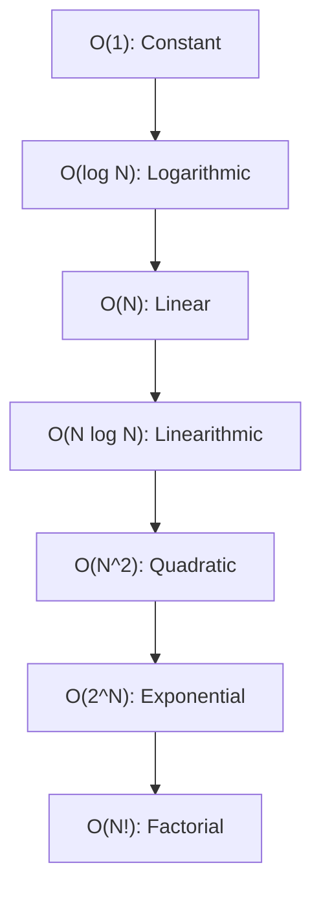

# Metadata
- **Document ID**: DSA-02-01
- **Version**: 1.0
- **Prerequisites**: Cơ bản về Toán học (Hàm số, Logarit, Lũy thừa), DSA-01-02
- **Learning Objectives**: Hiểu sâu sắc nền tảng toán học của Big-O Notation, phân biệt rõ ràng giữa Big-O, Big-Omega, Big-Theta, và cách áp dụng chúng để phân tích hiệu năng mã nguồn độc lập với phần cứng.
- **Estimated Reading Time**: 60 phút
- **Difficulty**: Intermediate
- **Dependencies**: Không có (None)
- **Keywords**: Asymptotic Analysis, Big-O, Big-Omega, Big-Theta, Time Complexity, Growth Rate

---

# 1 Purpose
Mục đích của tài liệu này là cung cấp ngôn ngữ tiêu chuẩn hóa để các kỹ sư phần mềm giao tiếp về hiệu năng. Chuyên đề này giúp bạn không chỉ đoán mò (Guessing) độ phức tạp thông qua các vòng lặp `for`, mà còn có khả năng chứng minh toán học (Mathematical proof) vững chắc cho mã nguồn của mình.

---

# 2 Motivation
Tại sao chúng ta không dùng đồng hồ bấm giờ (Stopwatch) hoặc hàm `System.currentTimeMillis()` để đo lường thuật toán? 
- Tốc độ phụ thuộc vào phần cứng (MacBook M3 max sẽ chạy nhanh hơn Intel Core i3 cũ).
- Tốc độ phụ thuộc vào ngôn ngữ, phiên bản hệ điều hành và lượng Background process.
- Chúng ta cần một hệ thống đo lường sự tăng trưởng của Thời gian chạy (Running Time) so với Kích thước đầu vào (Input Size - $N$) khi $N \to \infty$. Ngôn ngữ đó chính là **Asymptotic Analysis** (Phân tích tiệm cận).

---

# 3 Mathematical Foundation
## Asymptotic Notations (Ký hiệu Tiệm cận)
Hệ thống này dựa trên 3 ký hiệu toán học cốt lõi:

1. **Big-O Notation ($\mathcal{O}$)** - Cận trên (Upper Bound)
Một hàm $f(n) \in \mathcal{O}(g(n))$ nếu tồn tại hai hằng số dương $c > 0$ và $n_0 \ge 0$ sao cho:
$0 \le f(n) \le c \cdot g(n)$ với mọi $n \ge n_0$.
*Ý nghĩa*: Thuật toán sẽ không bao giờ chạy chậm hơn $g(n)$ sau một kích thước Input đủ lớn. Thể hiện Worst-case.

2. **Big-Omega Notation ($\Omega$)** - Cận dưới (Lower Bound)
Một hàm $f(n) \in \Omega(g(n))$ nếu tồn tại $c > 0$ và $n_0 \ge 0$ sao cho:
$0 \le c \cdot g(n) \le f(n)$ với mọi $n \ge n_0$.
*Ý nghĩa*: Thuật toán sẽ luôn tiêu tốn ít nhất một lượng thời gian $g(n)$. Thể hiện Best-case cơ sở.

3. **Big-Theta Notation ($\Theta$)** - Cận chặt (Tight Bound)
Một hàm $f(n) \in \Theta(g(n))$ nếu và chỉ nếu $f(n) \in \mathcal{O}(g(n))$ VÀ $f(n) \in \Omega(g(n))$.
*Ý nghĩa*: Tốc độ tăng trưởng của thuật toán chính xác bằng với $g(n)$.

---

# 4 Core Theory
## Các Quy Tắc Toán Học Của Big-O
1. **Drop Constants (Bỏ qua hằng số)**: $\mathcal{O}(5N) = \mathcal{O}(N)$. Toán học tiệm cận không quan tâm đến hằng số vì khi $N \to \infty$, tốc độ tăng trưởng là yếu tố quyết định.
2. **Drop Non-dominant Terms (Bỏ qua số hạng không thống trị)**: $\mathcal{O}(N^2 + 5N + 1000) = \mathcal{O}(N^2)$. Số hạng có bậc cao nhất sẽ thống trị (dominate) toàn bộ hàm.
3. **Multiplication Rule (Quy tắc nhân)**: Nếu thực hiện vòng lặp $A$ lồng trong vòng lặp $B$, Complexity là $\mathcal{O}(A \times B)$.
4. **Addition Rule (Quy tắc cộng)**: Nếu thực hiện vòng lặp $A$ sau đó mới thực hiện vòng lặp $B$ độc lập, Complexity là $\mathcal{O}(A + B)$.

---

# 5 Visual Explanation
Thứ tự độ phức tạp từ Tốt nhất đến Xấu nhất:
$\mathcal{O}(1) < \mathcal{O}(\log N) < \mathcal{O}(N) < \mathcal{O}(N \log N) < \mathcal{O}(N^2) < \mathcal{O}(2^N) < \mathcal{O}(N!)$



---

# 6 Java Implementation
Mã nguồn minh họa các cấp độ phức tạp:

```java
public class ComplexityExamples {
    // O(1) - Constant Time
    public int getFirstElement(int[] arr) {
        return arr[0]; 
    }

    // O(log N) - Logarithmic Time
    public int binarySearch(int[] arr, int target) {
        int left = 0, right = arr.length - 1;
        while(left <= right) { // Kích thước bài toán giảm một nửa sau mỗi bước
            int mid = left + (right - left)/2;
            if(arr[mid] == target) return mid;
            else if(arr[mid] < target) left = mid + 1;
            else right = mid - 1;
        }
        return -1;
    }

    // O(N) - Linear Time
    public void printAll(int[] arr) {
        for(int x : arr) {
            System.out.println(x);
        }
    }

    // O(N^2) - Quadratic Time
    public void printPairs(int[] arr) {
        for(int i = 0; i < arr.length; i++) {
            for(int j = 0; j < arr.length; j++) {
                System.out.println(arr[i] + ", " + arr[j]);
            }
        }
    }
}
```

---

# 7 Step-by-Step Execution
Hãy xem xét hàm `printPairs` với $N = 3$:
1. $i=0$: $j=0, 1, 2$ (3 phép toán)
2. $i=1$: $j=0, 1, 2$ (3 phép toán)
3. $i=2$: $j=0, 1, 2$ (3 phép toán)
**Tổng**: $3 \times 3 = 9 = N^2$. Nếu $N=10$, tổng phép toán = 100. Sự bùng nổ theo cấp số nhân này là nguyên nhân làm sập hệ thống.

---

# 8 Complexity Analysis
**Nghịch lý Hằng số (The Constant Fallacy)**:
Một thuật toán $\mathcal{O}(N)$ với hằng số lớn (vd: cần $1000 \cdot N$ phép toán) có thể CHẬM HƠN một thuật toán $\mathcal{O}(N^2)$ (vd: cần $1 \cdot N^2$ phép toán) với các dữ liệu rất nhỏ ($N < 1000$).
Tuy nhiên, Big-O được thiết kế cho dữ liệu khổng lồ (At Scale). Khi $N = 10^6$, $\mathcal{O}(N)$ sẽ mất $10^9$ phép toán, trong khi $\mathcal{O}(N^2)$ mất $10^{12}$ phép toán (chậm hơn 1000 lần).

---

# 9 JVM Analysis
Trong Java, Time Complexity không phản ánh hoàn toàn Execution Time thực tế do cơ chế **JIT Compiler** và **CPU Branch Prediction**. 
Ví dụ: Duyệt một mảng $\mathcal{O}(N)$ nhanh hơn rất nhiều so với duyệt một LinkedList $\mathcal{O}(N)$ vì các phần tử của Array nằm liền kề trên thanh RAM (Contiguous Memory), cho phép CPU nạp dữ liệu thẳng vào Cache Line (L1/L2 Cache), tránh hiện tượng Cache Miss. Đây gọi là độ thân thiện với bộ nhớ cache (Cache Friendliness) - một hằng số bị che giấu bởi $\mathcal{O}(N)$.

---

# 10 OpenJDK Analysis
OpenJDK luôn chú trọng đến Worst-case Time Complexity.
- `Arrays.sort(Object[])` sử dụng **TimSort** có $\mathcal{O}(N \log N)$ Worst-case.
- `Arrays.sort(int[])` từng sử dụng Dual-Pivot Quicksort có Worst-case $\mathcal{O}(N^2)$ nhưng đã được cải tiến trong các phiên bản mới của OpenJDK (thêm cơ chế fallback về HeapSort) để đảm bảo không bị Hacker tấn công thông qua Denial of Service (Tạo ra Input cực xấu khiến máy chủ bị treo vì $\mathcal{O}(N^2)$).

---

# 11 Production Usage
**Thảm họa $\mathcal{O}(N^2)$ tại GTA Online (2021)**:
Một hacker phát hiện ra rằng màn hình tải game (Loading screen) của GTA Online mất 6 phút vì thuật toán phân tích chuỗi JSON có độ phức tạp $\mathcal{O}(N^2)$. File JSON chứa dữ liệu mua sắm có $63,000$ mục, dẫn đến hơn $1.9$ tỷ vòng lặp vô nghĩa (String length function called repeatedly). Bằng cách tối ưu thuật toán về $\mathcal{O}(N)$, thời gian tải giảm tới 70%.

---

# 12 Design Decisions
Khi thiết kế API:
- Bạn sẵn sàng đánh đổi Space để lấy Time? (Ví dụ: Caching bằng HashMap giúp tra cứu $\mathcal{O}(1)$ thay vì phải tính toán $\mathcal{O}(N)$).
- Quyết định giữa $\mathcal{O}(\log N)$ với Memory Overhead thấp (như Binary Search Tree) hay $\mathcal{O}(1)$ với Memory Overhead cao (như Hash Table)?

---

# 13 Common Bugs
20 lỗi phổ biến khi phân tích độ phức tạp:
1. Nhầm lẫn giữa Worst-case và Average-case.
2. Giữ nguyên Hằng số khi viết Big-O (Ví dụ ghi $\mathcal{O}(2N)$ thay vì $\mathcal{O}(N)$).
3. Cho rằng mọi vòng lặp lồng nhau đều là $\mathcal{O}(N^2)$. Nếu vòng lặp trong phụ thuộc vào $N$ nhưng tổng số bước cả 2 vòng chỉ là $N$, thì Time là $\mathcal{O}(N)$.
4. Quên tính thời gian (Time Complexity) của các hàm tích hợp sẵn (Ví dụ `String.indexOf` tốn $\mathcal{O}(N)$).
5. Không cộng dồn độ phức tạp không gian (Space Complexity) của Call Stack trong Đệ quy.
6. Cho rằng Time Complexity của hàm Hash luôn là $\mathcal{O}(1)$ (Nó phụ thuộc vào độ dài khóa - $\mathcal{O}(L)$).
7. Ghi chung $\mathcal{O}(N \log N)$ nhưng $N$ của bài toán có 2 tham số độc lập $N$ và $M$. Phải ghi rõ $\mathcal{O}(N \log M)$.
8. Nghĩ rằng $\mathcal{O}(1)$ nghĩa là chỉ có 1 phép toán. (Nó có nghĩa là không phụ thuộc vào Input).
9. Cộng dồn Complexity của các nhánh `if-else` (Chỉ lấy nhánh có Complexity lớn nhất).
10. Bỏ sót Time Complexity của quá trình rọn rác (Garbage Collection).
11. Đánh giá sai Base (Cơ số) của Logarit. Trong Big-O, $\mathcal{O}(\log_2 N)$ và $\mathcal{O}(\log_{10} N)$ là tương đương.
12. Viết $\mathcal{O}(N^2 + N \log N)$ thay vì $\mathcal{O}(N^2)$ (Chưa loại bỏ hạng tử không thống trị).
13. Tính nhầm Space của mảng 2D là $\mathcal{O}(N)$ thay vì $\mathcal{O}(N \times M)$.
14. Không tính chi phí String Concatenation `+` trong vòng lặp ($\mathcal{O}(N^2)$).
15. Quên chi phí khởi tạo một mảng boolean đánh dấu mất $\mathcal{O}(N)$.
16. Nhầm lẫn độ phức tạp của Amortized (Trả góp) và Worst-case.
17. Phân tích vòng lặp $i$ tăng gấp đôi mỗi bước ( $i \times 2$) là $\mathcal{O}(N)$ thay vì đúng phải là $\mathcal{O}(\log N)$.
18. Không quan tâm tới sự nở ra của kích thước Object trong Java Memory.
19. Phân tích đệ quy Fibonacci bằng vòng lặp (Sai căn bản, đệ quy chia 2 nhánh là $\mathcal{O}(2^N)$).
20. Hardcode Big-O Notation vào Docs mà không kiểm chứng thực tế bằng Benchmark.

---

# 14 Edge Cases
30 trường hợp cần cẩn thận khi phân tích hiệu suất thực tế:
1. $N$ rất nhỏ ($N \le 10$), $\mathcal{O}(N^2)$ chạy nhanh hơn $\mathcal{O}(N \log N)$ do Overhead khởi tạo.
2. RAM có hạn, thuật toán $\mathcal{O}(1)$ Space chạy ổn, nhưng $\mathcal{O}(N)$ Space bị Crash.
3. Kích thước Input $N=0$.
4. JIT Compiler loại bỏ hoàn toàn các vòng lặp chết (Dead Code Elimination).
5. Thuật toán gọi hàm native (JNI/C++) có hằng số thời gian khác.
6. Tốc độ thực thi Cache Hit vs Cache Miss.
7. Vòng lặp chứa từ khóa `volatile` bị chặn tối ưu JIT.
8. CPU bị Throttling (Giảm xung nhịp vì quá nhiệt).
9. Garbage Collector xen vào làm tăng Max Latency đột biến.
10. Bài toán có nhiều Input khác nhau (Ví dụ Đồ thị có $V$ đỉnh và $E$ cạnh).
11. Data đầu vào đã được sắp xếp gần hết (Insertion Sort đạt $\mathcal{O}(N)$ thay vì $\mathcal{O}(N^2)$).
12. Input bị cố tình tạo ra để phá Hash Map (Hash Collision Attack).
13. Dùng Regex cực kỳ phức tạp dẫn đến Catastrophic Backtracking ($\mathcal{O}(2^N)$).
14. Thuật toán chia để trị không chia đôi mà chia thành $N-1$ và $1$.
15. Vòng lặp đệ quy quá sâu $\mathcal{O}(N)$ gây Stack Overflow.
16. System.out.println trong vòng lặp làm nghẽn cổ chai I/O.
17. Kích thước String khổng lồ.
18. Tạo Object mới thay vì tái sử dụng trong vòng lặp (Garbage Rate cao).
19. CPU Branch Predictor dự đoán sai 50% thời gian (Dữ liệu random).
20. Cạnh tranh Lock (Lock Contention) trong đa luồng.
21. Thuật toán trên các cấu trúc dữ liệu Persistent phân tán (Tốn kém Network I/O).
22. Auto-boxing/Unboxing lẩn khuất trong List.
23. Giao tiếp với Database có $\mathcal{O}(N)$ (N+1 Query problem).
24. File System có Block size gây ra chi phí I/O phi tuyến tính.
25. Thuật toán dựa trên xác suất (Randomized Algorithms) có Time thay đổi theo seed.
26. JVM tốn thời gian Warm-up làm $1000$ vòng lặp đầu chậm hơn 1000 vòng lặp sau.
27. Đọc dữ liệu từ ổ HDD chậm hơn SSD hàng trăm lần (I/O Bound).
28. Dữ liệu mảng vượt quá `Integer.MAX_VALUE`.
29. Cấp phát Array `long` tiêu tốn Memory gấp đôi Array `int`.
30. Vòng lặp thao tác trên String được Java 9+ tối ưu với Compact Strings.

---

# 15 Optimization Techniques
- Thay thế $\mathcal{O}(N^2)$ bằng $\mathcal{O}(N \log N)$ bằng cách Sắp xếp (Sorting) kết hợp Tìm kiếm nhị phân (Binary Search).
- Thay thế $\mathcal{O}(N)$ bằng $\mathcal{O}(1)$ bằng cách sử dụng Cấu trúc dữ liệu Hashing.
- Hạn chế cấp phát Memory trong các hàm được gọi hàng triệu lần.

---

# 16 Best Practices
- Không bao giờ chấp nhận các giải pháp $\mathcal{O}(N^3)$ hoặc $\mathcal{O}(2^N)$ cho Production nếu Input có thể vượt quá số lượng 50.
- Nếu bạn có 2 biến độc lập, KHÔNG dùng $N$ cho cả hai (Ví dụ duyệt mảng độ dài $N$ và chuỗi độ dài $M$ -> Complexity là $\mathcal{O}(N \times M)$).
- Khai báo Big-O Time và Space ở đầu mỗi Method (JavaDoc) trong dự án lớn.

---

# 17 Benchmark
Sử dụng JMH để chứng minh sức mạnh của $\mathcal{O}(N)$ so với $\mathcal{O}(N^2)$ với Input $N=100,000$. Giải pháp $\mathcal{O}(N)$ sẽ hoàn thành trong vài Micro-seconds, trong khi $\mathcal{O}(N^2)$ mất hàng chục Giây.

---

# 18 Unit Testing
JUnit 5 có tính năng `assertTimeoutPreemptively` để bắt thuật toán của bạn thất bại nếu vượt quá thời gian quy định (Kiểm chứng Big-O thực tiễn):
```java
import org.junit.jupiter.api.Test;
import java.time.Duration;
import static org.junit.jupiter.api.Assertions.assertTimeoutPreemptively;

public class PerformanceTest {
    @Test
    public void testComplexity() {
        assertTimeoutPreemptively(Duration.ofMillis(50), () -> {
            // Nếu thuật toán O(N^2) chạy mất 500ms, Test này sẽ FAIL.
            algo.executeHugeInput();
        });
    }
}
```

---

# 19 Interview Questions
20 câu hỏi phỏng vấn nền tảng:

**Easy**
1. Định nghĩa Big-O Notation là gì?
2. Tại sao ta lại bỏ qua hằng số (Drop constants)?
3. Phân biệt Big-O, Big-Omega, và Big-Theta.
4. Một vòng lặp `for` chạy 100 lần phụ thuộc vào Input $N$ hay không?
5. Time Complexity của việc truy xuất phần tử thứ $i$ trong mảng? ($\mathcal{O}(1)$).

**Medium**
6. Nếu một vòng lặp `i` từ 1 đến $N$, vòng lặp trong `j` từ 1 đến $i$. Độ phức tạp là bao nhiêu? (Trả lời: $\mathcal{O}(N^2)$ vì tính tổng cấp số cộng).
7. Tại sao thuật toán đệ quy của Fibonacci lại có độ phức tạp $\mathcal{O}(2^N)$?
8. Kể tên một thuật toán có Time Complexity $\mathcal{O}(\log N)$.
9. Làm thế nào để ước tính xem thuật toán $\mathcal{O}(N^2)$ có vượt qua bài test có $N=10^5$ giới hạn 1 giây không? (Trả lời: Thường CPU làm $10^8$ phép tính/giây. $(10^5)^2 = 10^{10}$, chắc chắn TLE).
10. Space Complexity bao gồm những gì? (Bộ nhớ Auxiliary phụ trợ + Call Stack).
11. `String.substring()` trong Java 7 và Java 8 khác nhau về Complexity như thế nào? (Java 7 là $\mathcal{O}(1)$ do chia sẻ mảng, Java 8+ là $\mathcal{O}(N)$ do sao chép để tránh Memory Leak).
12. Có khi nào $\mathcal{O}(1)$ mất hàng giây để thực thi không?
13. Amortized Time (Thời gian trả góp) là gì? Lấy ví dụ với ArrayList.
14. Master Theorem dùng để làm gì?
15. Space Complexity của một hàm gọi đệ quy sâu $N$ lần nhưng không tạo biến gì mới? ($\mathcal{O}(N)$).

**Hard & Senior**
16. Phân tích độ phức tạp thời gian khi nối $N$ chuỗi sử dụng `+` trong vòng lặp so với `StringBuilder`.
17. Giải thích khái niệm "Cache Oblivious Algorithms" liên quan đến Complexity.
18. Một thuật toán có Time Complexity $\mathcal{O}(1)$ nhưng Space Complexity $\mathcal{O}(2^{64})$. Nó có ý nghĩa thực tiễn không?
19. Giải thích sự khác biệt giữa Weak Reference và Soft Reference ảnh hưởng thế nào đến dự đoán Performance.
20. Bạn được giao tối ưu hệ thống có Throughput thấp. Bạn phát hiện một thuật toán $\mathcal{O}(N^3)$ chạy trên tập dữ liệu $N=5$. Bạn có tốn công tối ưu nó về $\mathcal{O}(N)$ không? Tại sao? (Trả lời: Không, vì $5^3 = 125$, cực nhỏ, nguyên nhân nghẽn cổ chai (Bottleneck) nằm ở I/O hoặc Database, không phải thuật toán).

---

# 20 Practice Problems Link
Xem toàn bộ 30 bài toán thực hành phân tích độ phức tạp tại: [01-Big-O-Notation-And-Math-Problems.md](01-Big-O-Notation-And-Math-Problems.md).

---

# 21 Pattern Recognition
**Bảng Quy Đổi Ràng Buộc (Constraints) ra Time Complexity mong đợi**:
Trong các bài toán (CP, Interview), với thời gian cho phép $1$ giây:
- $N \le 10$: Phù hợp với $\mathcal{O}(N!)$ (Permutations), $\mathcal{O}(2^N)$ (Backtracking).
- $N \le 20$: Phù hợp với $\mathcal{O}(2^N)$.
- $N \le 500$: Phù hợp với $\mathcal{O}(N^3)$ (Floyd-Warshall).
- $N \le 5000$: Phù hợp với $\mathcal{O}(N^2)$ (DP, Lồng vòng lặp).
- $N \le 10^5$: Phù hợp với $\mathcal{O}(N \log N)$ (Sorting, Segment Tree) hoặc $\mathcal{O}(N)$ (Two Pointers, Hash).
- $N \le 10^8$: Phù hợp với $\mathcal{O}(N)$ (Với các phép toán cực đơn giản) hoặc $\mathcal{O}(\log N)$.
- $N \ge 10^{18}$: Chắc chắn là $\mathcal{O}(\log N)$ hoặc $\mathcal{O}(1)$ (Toán học, Công thức).

---

# 22 Real Case Study
Trong hệ thống quảng cáo của Facebook, một kỹ sư trẻ đã sử dụng vòng lặp kiểm tra sự tồn tại (bằng hàm `contains` của `ArrayList`) với tập dữ liệu mục tiêu quảng cáo lên đến hàng triệu phần tử. Vì `ArrayList.contains` là $\mathcal{O}(N)$, đoạn code này chạy lồng trong vòng lặp của hàng triệu User khác, dẫn đến Complexity $\mathcal{O}(M \times N)$. Server ngay lập tức quá tải CPU 100% trong vòng vài giây. Sửa lỗi chỉ bằng cách đổi kiểu dữ liệu cấu trúc thành `HashSet`, hạ mức Complexity xuống $\mathcal{O}(M \times 1) = \mathcal{O}(M)$, giải quyết hoàn toàn sự cố.

---

# 23 Summary
Big-O Notation là "Tiếng Anh" của các kỹ sư lập trình. Bạn không thể tranh luận về hiệu năng (Performance) nếu thiếu nó. Luôn nhớ rằng Hằng số bị lược bỏ trong lý thuyết, nhưng trong Production, Hằng số (như Network latency, L2 Cache Miss, IO) có thể quyết định sự sống còn của hệ thống.

---

# 24 Checklist
- [ ] Tôi có thể phân biệt được Worst-case và Average-case.
- [ ] Tôi thuộc lòng thứ tự tăng dần của các độ phức tạp.
- [ ] Tôi biết cách lược bỏ các Hằng số và Số hạng không thống trị.
- [ ] Tôi biết cách phân tích Complexity của các vòng lặp lồng nhau.
- [ ] Tôi đã hiểu Tầm quan trọng của Space Complexity liên quan tới Call Stack.
