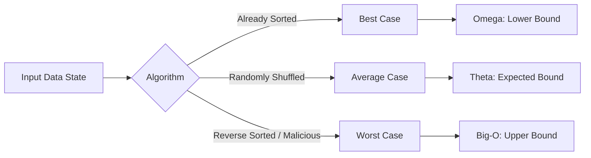

# Metadata
- **Document ID**: DSA-02-02
- **Version**: 1.0
- **Prerequisites**: DSA-02-01 (Big-O Notation)
- **Learning Objectives**: Hiểu sâu sắc và có khả năng tính toán Time Complexity (Độ phức tạp thời gian) cho các vòng lặp lồng nhau, phân biệt rõ ràng Worst-case, Best-case và Average-case trong thực tế.
- **Estimated Reading Time**: 55 phút
- **Difficulty**: Intermediate
- **Dependencies**: Không có (None)
- **Keywords**: Time Complexity, Worst-case, Average-case, Best-case, Benchmarking, SLAs

---

# 1 Purpose
Mục đích của tài liệu này là cung cấp phương pháp luận chi tiết để Kỹ sư phần mềm tính toán (Counting) số lượng thao tác cơ sở (Primitive operations) mà thuật toán cần thực hiện. Nó vượt qua giới hạn của Big-O cơ bản để đi sâu vào các trường hợp dữ liệu cụ thể (Data-dependent complexity).

---

# 2 Motivation
Đôi khi một thuật toán $\mathcal{O}(N^2)$ (như QuickSort trong Worst-case) lại chạy nhanh hơn thuật toán $\mathcal{O}(N \log N)$ (như MergeSort) trong hầu hết các tình huống thực tế. Để hiểu được lý do đằng sau nghịch lý này, kỹ sư cần phải làm chủ khái niệm Average-case Time Complexity và chi phí của các thao tác I/O vs CPU Registers.

---

# 3 Mathematical Foundation
## Mô hình RAM (Random Access Machine)
Trong lý thuyết phân tích thuật toán, chúng ta giả định máy tính hoạt động theo mô hình RAM:
- Mỗi lệnh đơn giản (Cộng, Trừ, Nhân, Chia, Gán, Đọc/Ghi bộ nhớ) tốn chính xác $1$ đơn vị thời gian (Time unit).
- Các vòng lặp hoặc lệnh gọi hàm không phải lệnh đơn giản; chúng được cấu thành từ nhiều lệnh đơn giản.
- Khả năng truy xuất ngẫu nhiên (Random Access) bộ nhớ có thời gian không đổi $\mathcal{O}(1)$.

**Công thức tổng quát:** $T(N) = \sum_{i=1}^{k} c_i \cdot \text{step}_i(N)$
Trong đó $c_i$ là chi phí của lệnh thứ $i$, và $\text{step}_i(N)$ là số lần lệnh đó được thực thi.

---

# 4 Core Theory
## 3 Khía cạnh Phân tích (The 3 Cases)
Cho một thuật toán, Thời gian thực thi phụ thuộc vào Dữ liệu đầu vào (Input data state), không chỉ Kích thước (Size).
1. **Worst-case Time Complexity (Phổ biến nhất)**:
   - Trả lời câu hỏi: "Thuật toán này sẽ mất TỐI ĐA bao nhiêu thời gian trong tình huống tồi tệ nhất?"
   - Ví dụ: Tìm kiếm tuyến tính (Linear Search) một số không tồn tại trong mảng. $T(N) = \mathcal{O}(N)$.
2. **Best-case Time Complexity**:
   - Trả lời câu hỏi: "Tình huống may mắn nhất, thuật toán mất bao lâu?"
   - Ví dụ: Tìm kiếm tuyến tính, số cần tìm nằm ngay ở vị trí đầu tiên. $T(N) = \Omega(1)$.
3. **Average-case Time Complexity**:
   - Khó tính toán nhất. Đòi hỏi phân bố xác suất (Probability Distribution) của dữ liệu đầu vào.
   - Trả lời câu hỏi: "Kỳ vọng (Expected time) là bao nhiêu nếu dữ liệu hoàn toàn ngẫu nhiên?"
   - Ví dụ: QuickSort có Worst-case $\mathcal{O}(N^2)$, nhưng Average-case là $\mathcal{O}(N \log N)$.

---

# 5 Visual Explanation



---

# 6 Java Implementation
Ví dụ về Phân tích 3 trường hợp với Linear Search:

```java
public class LinearSearch {
    /**
     * Tìm vị trí của phần tử target.
     * Best-case: O(1) nếu target ở arr[0].
     * Worst-case: O(N) nếu target không tồn tại hoặc ở arr[N-1].
     * Average-case: O(N/2) = O(N) giả sử xác suất nằm ở mọi vị trí là bằng nhau.
     */
    public int search(int[] arr, int target) {
        for (int i = 0; i < arr.length; i++) { // c1 = 1, lặp N lần
            if (arr[i] == target) {            // c2 = 1, lặp N lần
                return i;                      // c3 = 1, thực thi 1 lần
            }
        }
        return -1;                             // c4 = 1, thực thi 1 lần
    }
}
```

---

# 7 Step-by-Step Execution
Giả sử hàm trên tính $T(N)$ một cách chính xác theo mô hình toán học RAM:
- Lệnh khởi tạo `int i=0`: 1 bước.
- Điều kiện `i < arr.length`: $(N + 1)$ bước.
- Lệnh tăng `i++`: $N$ bước.
- Lệnh if `arr[i] == target`: $N$ bước (trong Worst-case).
**Tổng cộng Worst-case**: $1 + (N+1) + N + N + 1 = 3N + 3$ thao tác.
Trong ký hiệu Asymptotic, $T(N) = \mathcal{O}(N)$.

---

# 8 Complexity Analysis
Tại sao Worst-case lại quan trọng nhất trong Kỹ nghệ phần mềm (Software Engineering)?
- Nó cung cấp sự Đảm bảo (Guarantee) về SLA (Service Level Agreement). 
- Hacker không bao giờ gửi Average-case Input. Họ sẽ craft (tạo ra) Worst-case Input để làm sập hệ thống của bạn (Ví dụ: Hash Collision DDoS attack). Do đó, hệ thống Enterprise phải được thiết kế để chịu tải ở Worst-case.

---

# 9 JVM Analysis
Mô hình toán học RAM cho rằng mỗi lệnh tốn $1$ đơn vị thời gian. Tuy nhiên, JVM hoàn toàn phá vỡ giả định này:
- Lệnh Gán: Tốn CPU Cycle (Cực nhanh, <1ns).
- Lệnh Cấp phát `new Object()`: Có thể kích hoạt Garbage Collector (Chậm khủng khiếp, hàng ms).
- Lệnh Đọc mảng (Array access): Nếu mảng nhỏ gọn nằm trong L1 Cache, đọc tốn 1ns. Nếu Cache Miss, đọc từ RAM tốn 100ns (Gấp 100 lần).
$\implies$ JIT Compiler của Java (C2 Compiler) có khả năng Loop Unrolling (mở cuộn vòng lặp), loại bỏ kiểm tra Bounds check, làm giảm mạnh các hằng số $c_i$ mà toán học thuần túy dự đoán.

---

# 10 OpenJDK Analysis
Trong mã nguồn của JDK (như `java.util.Arrays`), kỹ sư OpenJDK luôn sử dụng các kỹ thuật "Hybrid Algorithms" (Thuật toán lai) để tối ưu cho các Data States khác nhau:
- **TimSort** (được dùng cho `Object[]`): Nếu mảng đã sắp xếp một phần (Best-case state), nó chỉ tốn $\mathcal{O}(N)$.
- **Dual-Pivot Quicksort** (dùng cho `int[]`): Tuyệt vời ở Average-case, nhưng nếu JIT phát hiện mức đệ quy quá sâu (Dấu hiệu của Worst-case sắp xảy ra), nó sẽ tự động Fallback (chuyển đổi) sang HeapSort $\mathcal{O}(N \log N)$ để bảo vệ Server.

---

# 11 Production Usage
**Microservices và Time Complexity**:
Khi Microservice A gọi Microservice B, chúng ta có một Timeout (thời gian chờ tối đa). Nếu thuật toán xử lý dữ liệu trong Microservice B có Worst-case là $\mathcal{O}(N^2)$ và Input bất ngờ tăng đột biến, Service B sẽ Timeout. Service A sẽ retry (thử lại), tạo ra hiện tượng **Cascading Failure** (Sụp đổ dây chuyền) làm sập toàn bộ cụm Server.
Bài học: Phải giới hạn (Limit/Pagination) biến $N$ ở đầu vào API, không bao giờ tin tưởng Input do User gửi lên.

---

# 12 Design Decisions
Khi thiết kế Cấu trúc dữ liệu:
- Quyết định giữa `ArrayList` và `LinkedList`?
`ArrayList.get(i)` là $\mathcal{O}(1)$. `LinkedList.get(i)` là $\mathcal{O}(N)$. 
Nhưng `ArrayList.add(0)` là $\mathcal{O}(N)$, `LinkedList.add(0)` là $\mathcal{O}(1)$.
Lựa chọn hoàn toàn phụ thuộc vào Hành vi của dữ liệu (Read-heavy hay Write-heavy).

---

# 13 Common Bugs
20 lỗi thường gặp về hiệu suất thời gian:
1. Đọc tệp tin I/O nằm bên trong vòng lặp thay vì Batch Reading (I/O Bound).
2. Xóa các phần tử khỏi danh sách bằng `ArrayList.remove()` trong vòng lặp ($\mathcal{O}(N^2)$ ẩn).
3. Sử dụng `String.replace()` nhiều lần trên các tệp lớn.
4. Gọi `Math.pow(N, 2)` thay vì `N * N` làm chậm thuật toán toán học hàng trăm lần.
5. So sánh `String.equals()` với một chuỗi hằng số, nhưng chuỗi hằng số ở phía sau khiến việc Check Null tốn thêm Time.
6. Lặp lại việc tìm kích thước `list.size()` bên trong vòng `for`, dù kích thước không đổi.
7. Gọi API mạng trong vòng lặp (Synchronous HTTP calls).
8. Sử dụng `Regex` thiếu kiểm soát sinh ra Catastrophic Backtracking $\mathcal{O}(2^N)$.
9. Lầm tưởng `HashSet.contains()` luôn $\mathcal{O}(1)$ mà quên mất hàm `hashCode()` của đối tượng có thể tốn $\mathcal{O}(K)$ để tính toán (Ví dụ: String hashCode duyệt qua toàn bộ chuỗi).
10. Sắp xếp danh sách nhiều lần một cách không cần thiết.
11. Bỏ qua chi phí tự động Boxing/Unboxing (Ví dụ `Integer` sang `int`).
12. Gọi `logger.debug()` bên trong thuật toán $\mathcal{O}(N^3)$ (Dù đã tắt Debug mode nhưng chuỗi Parameter vẫn bị đánh giá String Interpolation).
13. `Arrays.asList(...).contains(...)` trên danh sách nguyên thủy tốn thời gian tuyến tính $\mathcal{O}(N)$.
14. Thiết kế các câu truy vấn SQL bị dính `N+1 Problem` thay vì dùng JOIN $\implies \mathcal{O}(N)$ thời gian Network.
15. Quên sử dụng `break;` trong vòng lặp khi đã tìm thấy kết quả (Biến Best-case thành Worst-case).
16. Gọi `new Random()` bên trong vòng lặp làm tranh chấp Seed lock trên đa luồng (Sử dụng ThreadLocalRandom thay thế).
17. Dùng Scanner với vòng lặp `Scanner.hasNextLine()` cho dữ liệu hàng triệu dòng (Scanner sử dụng regex ngầm, rất chậm).
18. Không pre-allocate (Cấp phát trước) kích thước của `ArrayList` khi đã biết số lượng phần tử cố định.
19. Gộp các thao tác nặng vào chung một Stream API thay vì chia nhỏ Parallel.
20. Dùng tính năng Reflection trong lõi của vòng lặp $\mathcal{O}(N^2)$ (Reflection tốn hằng số thời gian cực lớn).

---

# 14 Edge Cases
30 trường hợp ngoại lệ trong tính toán Time Complexity:
1. Thuật toán $\mathcal{O}(\log N)$ với $N = 1$ (Trả về ngay lập tức).
2. Khi mảng đầu vào chứa các phần tử giống hệt nhau toàn bộ (All Identical Elements) làm hỏng QuickSort.
3. Độ dài chuỗi $L = 0$.
4. Hash Map chỉ có duy nhất 1 Bucket (tất cả phần tử bị Hash Collision) $\implies$ Tra cứu biến thành $\mathcal{O}(N)$.
5. Gọi thuật toán trên một Graph (Đồ thị) hoàn chỉnh (Mọi đỉnh đều nối với nhau), $E = V^2$. Khác hoàn toàn Sparse Graph (Đồ thị thưa).
6. Khi Hệ điều hành phân bổ Context Switch ngay giữa lúc thuật toán $\mathcal{O}(1)$ đang chạy.
7. Đệ quy rất sâu trên kiến trúc CPU ARM so với x86.
8. Giá trị biến đổi $N$ không nằm trong kiểu `int` mà vượt quá qua `BigInteger`, làm cho các phép cộng toán học từ $\mathcal{O}(1)$ chuyển thành $\mathcal{O}(L)$.
9. Tìm kiếm chuỗi con khi chuỗi `needle` lớn hơn `haystack`.
10. Số lần lặp được lấy từ biến cục bộ có thể thay đổi trong quá trình HĐH chia sẻ bộ nhớ (Thread-safe problem).
11. Số cực nhỏ hoặc cực lớn gây tràn số Integer Overflow, làm thay đổi luồng thực thi vòng lặp vô tận.
12. Vòng lặp `while(true)` với Break Condition không bao giờ đạt được do sai số Floating-point (vd: `0.1 + 0.2 == 0.3` là False trong Java).
13. `Collections.sort()` trên danh sách rỗng (Empty List).
14. Sử dụng Parallel Stream với khối lượng công việc siêu nhỏ (Overhead của ForkJoinPool vượt quá thời gian xử lý thực tế).
15. Ghi Log ra Console liên tục làm luồng thuật toán chính bị Block bởi I/O.
16. Garbage Collection STW (Stop The World) pause kéo dài nhiều giây làm thời gian thực tế sai lệch hoàn toàn khỏi Lý thuyết Big-O.
17. Khởi tạo mảng tĩnh khổng lồ (vd: `new int[10^9]`) trong Memory bị Swap vào Ổ cứng (Page Fault) gây treo máy.
18. Khi Input đã được sắp xếp nhưng theo chiều ngược lại (Reverse Sorted).
19. Mảng $N$ phần tử nhưng chỉ chứa 2 giá trị phân biệt (Ví dụ chuỗi DNA chỉ có A, C, G, T).
20. Mạng LAN bị chập chờn khi thuật toán Distributed Computing đang chạy.
21. Thuật toán có vòng lặp bị HĐH tối ưu hóa (Loop Unrolling) nhưng nếu vòng lặp quá lớn thì Register spilling xảy ra, làm giảm hiệu năng.
22. CPU Cache False Sharing trên thiết kế mảng dùng chung Đa luồng.
23. Sử dụng API Time phụ thuộc vào Network Time Protocol (NTP) làm bước thời gian bị nhảy ngược lại (Clock Drift).
24. Thuật toán mã hóa RSA phụ thuộc lớn vào việc sinh số Prime ngẫu nhiên, tạo ra thời gian Worst-case không thể đoán trước chính xác.
25. Thuật toán hình học có tọa độ trùng nhau dẫn đến chia cho $0$ trong phương trình tìm hệ số góc.
26. Danh sách liên kết bị tạo vòng (Cyclic LinkedList) gây vòng lặp vĩnh viễn.
27. Đọc dữ liệu từ một cấu trúc cây mất cân bằng nghiêm trọng (Degenerated Tree), Cây nhị phân trở thành Linked List $\implies \mathcal{O}(N)$.
28. Máy tính ở chế độ Power-saving mode ép xung CPU xuống mức tối thiểu.
29. Gọi lệnh `Thread.yield()` trong vòng lặp quay ngắt (Spin-lock).
30. Vòng lặp `for` dựa trên Array Iterator thay vì Index (Chi phí khởi tạo Iterator object có thể tác động đến $N$ nhỏ).

---

# 15 Optimization Techniques
- **Bailing Out Early (Thoát sớm)**: Luôn thêm câu lệnh `if (condition) return;` hoặc `break;` càng sớm càng tốt để đạt Best-case.
- **Loop Hoisting (Đẩy ra ngoài vòng lặp)**: Đưa các phép tính không thay đổi (Invariant calculations) ra ngoài vòng lặp để tránh tính lại hàng triệu lần.
- **Memoization (Ghi nhớ)**: Sử dụng mảng hoặc HashMap để lưu kết quả của hàm đệ quy để biến Time Complexity cấp số nhân $\mathcal{O}(2^N)$ thành tuyến tính $\mathcal{O}(N)$.

---

# 16 Best Practices
- Không tối ưu hóa khi chưa Profile (Đo lường). Hãy viết code Dễ đọc (Readable) trước. Khi hệ thống có dấu hiệu quá tải, dùng công cụ JProfiler hoặc VisualVM để tìm ra Bottleneck.
- Luôn kiểm tra Boundary Conditions (Điều kiện biên: null, rỗng, size 1) ở dòng lệnh đầu tiên của mọi thuật toán.

---

# 17 Benchmark
Một bài Benchmark điển hình với JMH để so sánh vòng lặp thường và vòng lặp bị lỗi tính lại Size:

```java
@BenchmarkMode(Mode.AverageTime)
@OutputTimeUnit(TimeUnit.NANOSECONDS)
public class LoopBenchmark {
    @Benchmark
    public void goodLoop(Blackhole bh, List<Integer> data) {
        int size = data.size();
        for (int i = 0; i < size; i++) { bh.consume(data.get(i)); }
    }

    @Benchmark
    public void badLoop(Blackhole bh, List<Integer> data) {
        // Trình biên dịch JIT rất giỏi, có thể nó sẽ tối ưu việc này cho bạn.
        // Nhưng đối với các cấu trúc dữ liệu custom, tính size() có thể mất O(N).
        for (int i = 0; i < data.size(); i++) { bh.consume(data.get(i)); } 
    }
}
```

---

# 18 Unit Testing
Test Timeout để bảo vệ thuật toán của bạn trước Worst-case Input (Ví dụ mảng toàn số 0 trong bài toán QuickSort):
```java
@Test
void testWorstCaseQuickSort() {
    int[] worstInput = new int[100000]; // Mảng toàn số 0
    assertTimeoutPreemptively(Duration.ofMillis(200), () -> {
        MySorter.quickSort(worstInput); 
    });
}
```

---

# 19 Interview Questions
20 câu hỏi về Time Complexity nâng cao:

**Easy**
1. Thế nào là Time Complexity? Khác biệt giữa nó và Execution Time?
2. Cho ví dụ về 1 thuật toán có $\mathcal{O}(1)$ time.
3. Kể tên 3 thuật toán sắp xếp $\mathcal{O}(N^2)$. (Bubble, Selection, Insertion).
4. Phân biệt Worst-case và Best-case.
5. Linear Search có Average-case là gì?

**Medium**
6. Insertion Sort có Best-case là bao nhiêu? (Là $\mathcal{O}(N)$ khi mảng đã sắp xếp).
7. Nếu bạn duyệt mảng 2 lần (2 vòng `for` rời nhau), độ phức tạp là $\mathcal{O}(2N)$. Tại sao người ta lại viết là $\mathcal{O}(N)$?
8. Nêu sự khác biệt giữa Big-O và Big-Theta trong bối cảnh phân tích vòng lặp `while`.
9. Có vòng lặp `for` lồng nhau nào không phải là $\mathcal{O}(N^2)$ không? (Có, nếu con trỏ chạy liên tục không bị reset, vd: Sliding Window).
10. Tại sao Binary Search lại là $\mathcal{O}(\log N)$?
11. Thuật toán `O(N log N)` luôn nhanh hơn thuật toán `O(N^2)` đúng hay sai? (Sai, với N rất nhỏ, hằng số quyết định).
12. Thời gian để truy cập 1 Index trong LinkedList là bao nhiêu? ($\mathcal{O}(N)$).
13. Đệ quy luôn tiêu tốn không gian bộ nhớ. Độ phức tạp Không gian (Space Complexity) của đệ quy được tính như thế nào?
14. Đảo ngược một chuỗi trong Java mất thời gian bao nhiêu? (Dùng StringBuilder là $\mathcal{O}(N)$).
15. Độ phức tạp của thuật toán DFS trên đồ thị? ($\mathcal{O}(V + E)$).

**Hard & Senior**
16. Phân tích Average-case của QuickSort. Tại sao nó lại là $\mathcal{O}(N \log N)$ dù Pivot được chọn ngẫu nhiên?
17. JIT Compiler có thể loại bỏ hoàn toàn một vòng lặp (Dead code elimination) làm cho thuật toán $\mathcal{O}(N^2)$ trở thành $\mathcal{O}(1)$ trong thực tế không? Làm sao để chống lại điều này khi Benchmarking?
18. Trình bày khái niệm "Amortized Time" qua ví dụ Hash Map Resizing.
19. Giải thích "False Sharing" trong Cache CPU và tại sao nó làm phá vỡ phân tích Time Complexity đa luồng.
20. Nếu HĐH sử dụng Page Fault, Time Complexity $\mathcal{O}(1)$ có thể biến thành bao lâu? (Trả lời: Vài mili-giây do đọc ổ đĩa cứng, tương đương hàng triệu chu kỳ CPU).

---

# 20 Practice Problems Link
Xem toàn bộ 30 bài toán thực hành đo lường thời gian tại: [02-Time-Complexity-Problems.md](02-Time-Complexity-Problems.md).

---

# 21 Pattern Recognition
**Phát hiện thuật toán quá chậm**:
- Nếu hệ thống có Database Query trả về $1000$ dòng. Code gọi một API khác cho TỪNG DÒNG. $\implies$ Đây là Anti-pattern N+1 quen thuộc. Time Complexity về Network: $\mathcal{O}(N) \times 100ms = 100$ giây! 
- Cách giải quyết: Đóng gói toàn bộ $1000$ ID và gọi API Batching 1 lần duy nhất $\implies \mathcal{O}(1)$ Network Call.

---

# 22 Real Case Study
**Sự cố Amazon Prime Video (Microservices Overhead)**:
Amazon Prime Video từng chuyển đổi một kiến trúc từ Microservices Serverless quay ngược lại Monolith (Kiến trúc nguyên khối). Lý do? Việc phân tách các vòng lặp xử lý Video Streaming qua nhiều hàm AWS Lambda (để theo đuổi kiến trúc Decoupled) khiến họ phải trả chi phí khởi tạo (Cold Start) và truyền dữ liệu qua mạng I/O (Network serialization) hàng triệu lần. Time Complexity không đổi, nhưng Hằng số $C$ của quá trình Serialize dữ liệu qua mạng lớn đến mức hệ thống tốn cực kỳ nhiều chi phí Server. Khi gộp lại thành Monolith, các lệnh gọi qua mạng biến thành $\mathcal{O}(1)$ Memory Pointer Dereference, tiết kiệm 90% chi phí.

---

# 23 Summary
Time Complexity không đơn thuần là việc đếm vòng lặp. Nó đòi hỏi tư duy sâu sắc về 3 trường hợp Best, Worst, Average và hiểu cách Mã nguồn (Source Code) thực sự giao tiếp với Phần cứng (Memory, CPU Cache, Network).

---

# 24 Checklist
- [ ] Phân biệt rõ ràng Worst-case, Best-case, Average-case.
- [ ] Tính toán được thời gian thực thi bằng cách đếm Primitive Operations.
- [ ] Hiểu rằng JVM JIT có thể thay đổi số lượng thao tác này trong thực tế.
- [ ] Nắm được cách thiết lập bài test Timeout để bảo vệ mã nguồn.
- [ ] Hiểu tầm quan trọng của việc Tối ưu hóa I/O thay vì chỉ lo tối ưu CPU vòng lặp.
