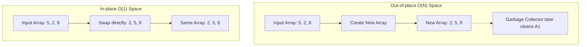

# Metadata
- **Document ID**: DSA-02-03
- **Version**: 1.0
- **Prerequisites**: DSA-02-01 (Big-O Notation)
- **Learning Objectives**: Phân biệt giữa Space Complexity (Tổng không gian) và Auxiliary Space (Không gian phụ trợ). Nắm vững cách JVM quản lý bộ nhớ (Heap vs Stack) để tính toán chính xác chi phí RAM của thuật toán.
- **Estimated Reading Time**: 55 phút
- **Difficulty**: Intermediate
- **Dependencies**: Không có (None)
- **Keywords**: Space Complexity, Auxiliary Space, Call Stack, Heap Memory, In-place, JVM Object Overhead

---

# 1 Purpose
Mục đích của tài liệu này là hướng dẫn Kỹ sư phần mềm cách ước lượng định lượng (Quantitative estimation) lượng RAM mà một thuật toán sẽ tiêu thụ. Trong kỷ nguyên Cloud Computing, nơi bạn phải trả tiền cho từng Gigabyte bộ nhớ (AWS EC2, Lambda), tối ưu Không gian bộ nhớ (Space) quan trọng không kém gì Tốc độ (Time).

---

# 2 Motivation
Nhiều kỹ sư lầm tưởng rằng "RAM ngày nay rất rẻ, chúng ta chỉ cần quan tâm đến tốc độ CPU". Đây là một cái bẫy nguy hiểm:
- Khi thuật toán ngốn quá nhiều RAM, CPU Cache (L1/L2/L3) bị tràn, dẫn đến Cache Misses, làm thuật toán chậm đi hàng chục lần (CPU chờ RAM).
- Nếu JVM vượt giới hạn RAM, hệ điều hành (OS) sẽ dùng Ổ cứng làm RAM ảo (Swap/Paging), khiến tốc độ giảm đi $1000 \times$, hoặc trực tiếp ném ra `OutOfMemoryError` làm sập dịch vụ.
- Garbage Collector phải dọn dẹp hàng nghìn object được tạo ra từ thuật toán, gây ra hiện tượng Stop-The-World (Đứng hình toàn hệ thống).

---

# 3 Mathematical Foundation
Trong Toán học thuật toán, Không gian bộ nhớ được chia thành 2 phần tách biệt:
**Space Complexity (Độ phức tạp không gian)** = **Input Space** (Dữ liệu đầu vào) + **Auxiliary Space** (Không gian phụ trợ).

- **Input Space**: Bộ nhớ dùng để lưu trữ chính các biến và dữ liệu mà người dùng truyền vào (ví dụ: mảng $N$ phần tử). Thuật toán không có quyền kiểm soát phần này.
- **Auxiliary Space**: Bộ nhớ mà thuật toán TỰ TẠO RA (như biến tạm, mảng mới, Call Stack đệ quy) trong quá trình thực thi để giải quyết bài toán.

Trong Phỏng vấn và Đánh giá thuật toán, khi người ta nói "Thuật toán này cần Không gian $\mathcal{O}(1)$", họ đang ngầm ám chỉ **Auxiliary Space**, bất chấp việc Input Space có thể là $\mathcal{O}(N)$.

---

# 4 Core Theory
## Nguồn gốc của Space Complexity
Bộ nhớ bị tiêu thụ bởi 2 thủ phạm chính trong quá trình thuật toán chạy:
1. **Heap Memory (Bộ nhớ Heap)**: 
   - Được tiêu thụ khi thuật toán sử dụng từ khóa `new`. 
   - Tạo ra các Objects, Arrays, HashMaps. 
   - Không bị tự động giải phóng khi hàm kết thúc (phải đợi Garbage Collector).
2. **Call Stack (Ngăn xếp gọi hàm)**:
   - Được tiêu thụ khi một Hàm (Function) gọi một Hàm khác (Đặc biệt là Đệ quy - Recursion).
   - Mỗi lần gọi hàm, JVM tạo ra một `Stack Frame` (Khung ngăn xếp) chứa tham số, biến cục bộ, và địa chỉ trả về. Kích thước trung bình vài trăm Bytes.

---

# 5 Visual Explanation

Sự khác biệt giữa Thuật toán Out-of-place (Tạo mảng mới) và In-place (Thao tác trên mảng cũ):



---

# 6 Java Implementation
Phân tích 3 cấp độ tối ưu Space:

```java
public class SpaceComplexityExamples {

    // 1. Auxiliary Space O(N): Tạo mảng mới
    public int[] doubleValuesBad(int[] arr) {
        int[] result = new int[arr.length]; // Cấp phát O(N) trên Heap
        for (int i = 0; i < arr.length; i++) {
            result[i] = arr[i] * 2;
        }
        return result;
    }

    // 2. Auxiliary Space O(1) (In-place): Tận dụng mảng gốc
    public void doubleValuesGood(int[] arr) {
        // Biến i tốn O(1) trên Stack
        for (int i = 0; i < arr.length; i++) {
            arr[i] = arr[i] * 2; 
        }
    }

    // 3. Auxiliary Space O(N) do Đệ quy (Call Stack)
    public int sumRecursive(int n) {
        if (n == 0) return 0;
        // Mỗi lần gọi n-1 sẽ tạo ra 1 Stack Frame mới
        return n + sumRecursive(n - 1); 
    }
}
```

---

# 7 Step-by-Step Execution
Phân tích thuật toán `sumRecursive(3)`:
- Khởi đầu (Main Thread): Stack Depth = 0.
- Gọi `sumRecursive(3)`: Tạo Frame 1 (chứa `n=3`). Stack Depth = 1.
- Gọi `sumRecursive(2)`: Tạo Frame 2 (chứa `n=2`). Stack Depth = 2.
- Gọi `sumRecursive(1)`: Tạo Frame 3 (chứa `n=1`). Stack Depth = 3.
- Gọi `sumRecursive(0)`: Tạo Frame 4 (chứa `n=0`). Stack Depth = 4. $\implies$ Max Space = $\mathcal{O}(N)$.
- Bắt đầu trả kết quả (Pop out of stack): Trả 0, trả 1, trả 3, trả 6. Dọn dẹp Stack.

---

# 8 Complexity Analysis
**Đánh đổi (Trade-off) giữa Time và Space**:
- **Caching / Memoization**: Dùng mảng hoặc HashMap $\mathcal{O}(N)$ Space để ghi nhớ kết quả tính toán, giúp giảm Time Complexity từ Exponential $\mathcal{O}(2^N)$ xuống Linear $\mathcal{O}(N)$. (Rất đáng giá).
- **Sorting**: QuickSort chạy cực nhanh với $\mathcal{O}(N \log N)$ Time và $\mathcal{O}(\log N)$ Space (In-place partition + Call stack). MergeSort ổn định với $\mathcal{O}(N \log N)$ Time nhưng cần $\mathcal{O}(N)$ Auxiliary Space để trộn mảng.

---

# 9 JVM Analysis
Trong Java, Không gian bộ nhớ bị khuếch đại bởi **Object Overhead** (Chi phí ẩn của Đối tượng). 
Khác với C/C++ nơi `int` tốn đúng 4 bytes. Trong JVM 64-bit:
- Một Object tối thiểu tốn **16 bytes** (12 bytes cho Object Header chứa Class word/Mark word + 4 bytes Padding).
- Kiểu nguyên thủy (Primitive array) `int[N]` tốn $16 + 4 \times N$ bytes.
- Kiểu bao bọc (Wrapper array) `Integer[N]` tốn $16 + (4 \times N \text{ cho references}) + (16 \times N \text{ cho Objects}) \approx 20 \times N$ bytes. $\implies$ Gấp 5 lần bộ nhớ của `int[]`.

---

# 10 OpenJDK Analysis
OpenJDK cung cấp kỹ thuật **Compressed Oops** (Ordinary Object Pointers) kích hoạt tự động (bằng cờ `-XX:+UseCompressedOops`) cho các Heap nhỏ hơn 32GB. Nó nén con trỏ đối tượng từ 64-bit (8 bytes) xuống 32-bit (4 bytes), tiết kiệm tới 40% Space Complexity cho các thuật toán sử dụng nhiều Object như Tree, Graph.

---

# 11 Production Usage
**StackOverflowError trong môi trường Enterprise**:
Kích thước Stack mặc định trên JVM Linux/Windows thường là 1MB. Nếu thuật toán đệ quy của bạn có chiều sâu (Depth) $\mathcal{O}(N)$ với $N = 10,000$, nó sẽ tạo ra 10,000 Stack Frames và vắt kiệt 1MB này ngay lập tức. Lỗi `StackOverflowError` sẽ làm sập (Crash) toàn bộ Thread, không thể cứu vãn bằng try-catch thông thường. Do đó, FAANG Engineers luôn thiết kế thuật toán đệ quy sao cho độ sâu giới hạn ở mức $\mathcal{O}(\log N)$ (ví dụ: chia đôi thay vì trừ 1).

---

# 12 Design Decisions
Khi thiết kế một SDK/Thư viện thuật toán:
- Luôn cung cấp 2 phiên bản của hàm nếu có thể:
  1. `sort(int[] arr)`: Chỉnh sửa trực tiếp mảng (In-place) cho những người muốn tối ưu Space $\mathcal{O}(1)$.
  2. `int[] sortedCopy(int[] arr)`: Trả về bản sao mới $\mathcal{O}(N)$ Space cho những người muốn giữ nguyên vẹn dữ liệu gốc (Immutability pattern).

---

# 13 Common Bugs
20 lỗi phổ biến về Space Complexity:
1. Nhầm lẫn Space Complexity của Output (Không tính vào Auxiliary Space).
2. Viết đệ quy tuyến tính $\mathcal{O}(N)$ dẫn đến StackOverflowError.
3. Sử dụng `Integer[]` thay vì `int[]` gây Overhead bộ nhớ khổng lồ.
4. Nối chuỗi String `+` trong vòng lặp sinh ra vô số rác (Memory Leak ngầm).
5. Load toàn bộ cấu trúc dữ liệu từ Database vào RAM (ví dụ `List.findAll()`) thay vì dùng Pagination hoặc Streaming.
6. Cấp phát mảng 2D thưa thớt (Sparse Matrix) bằng `int[][]` tốn $\mathcal{O}(N \times M)$ thay vì dùng `Map<Point, Integer>` tốn $\mathcal{O}(K)$ với $K$ là số điểm khác 0.
7. Quên dọn dẹp (Nullify) Object References trong các Cấu trúc dữ liệu tự viết (như Pop của Stack), ngăn cản Garbage Collector dọn rác.
8. Báo cáo Space của Binary Search là $\mathcal{O}(1)$ trong khi đang code bằng Đệ quy (Thực ra là $\mathcal{O}(\log N)$).
9. Copy một phần tử array lặp đi lặp lại thay vì dùng 2 con trỏ `startIndex`, `endIndex`.
10. Lưu đối tượng khổng lồ vào `ThreadLocal` dẫn đến rò rỉ bộ nhớ Thread.
11. Dùng `HashMap` để tra cứu trong khi khóa (Key) chỉ nằm trong khoảng 0-100 (Có thể dùng `int[101]` tốn cực ít RAM).
12. Đánh giá sai Space của thuật toán BFS (Queue lưu nhiều nhất ở tầng lá, lên tới $N/2$ phần tử $\implies \mathcal{O}(N)$ Space).
13. Chạy thuật toán $\mathcal{O}(N^2)$ Space trên tập dữ liệu $> 100,000$ (Cấp phát mảng $10^{10}$ phần tử $\implies$ Cần 40GB RAM, văng OutOfMemoryError).
14. Giữ Reference tĩnh (static) của một Collection lớn (Memory Leak vĩnh viễn).
15. Không tính Memory của cấu trúc đệm (Buffer) khi đọc File.
16. Gọi `String.substring` trong Java cũ (trước Java 7u6) làm rò rỉ chuỗi gốc khổng lồ.
17. Dùng Cấu trúc dữ liệu Thread-safe (`ConcurrentHashMap`) cho thuật toán xử lý luồng đơn (Tốn thêm memory cho Locks/Segments).
18. HashSet lưu các chuỗi cực dài nhưng chỉ so sánh mã băm.
19. Quên mất hàm `Arrays.sort` của Object sử dụng TimSort cần $\mathcal{O}(N/2)$ Space phụ trợ ở Worst-case.
20. Cho rằng thuật toán $\mathcal{O}(1)$ Space không bao giờ làm tràn RAM (Vẫn có thể nếu Object Input truyền vào quá lớn).

---

# 14 Edge Cases
30 trường hợp ngoại lệ trong bộ nhớ:
1. Chiều sâu đệ quy $\mathcal{O}(\log N)$ trên cấu trúc dữ liệu bị lệch (Skewed Tree) biến thành $\mathcal{O}(N)$.
2. Khi JVM flag `-Xss` (Stack size) bị set quá nhỏ (vd: 256K).
3. Sử dụng cấu trúc Dữ liệu đệ quy lồng nhau như JSON/XML Tree bị Hacker truyền dữ liệu sâu 1000 tầng.
4. Mảng có kích thước 0.
5. `ArrayList` tự động nhân đôi (Resize) từ 1.5GB lên 3GB dù HĐH chỉ còn 2GB RAM trống.
6. GC tốn tới 98% thời gian CPU để cố gắng lấy lại < 2% RAM $\implies$ văng `GC overhead limit exceeded`.
7. ThreadPool quá lớn chứa hàng nghìn Threads, mỗi Thread chiếm 1MB Stack Space.
8. Các đối tượng con nhỏ bé, nhưng chứa tham chiếu đến Node gốc khổng lồ.
9. Tối ưu Tail-Recursion (Đệ quy đuôi) không được hỗ trợ trong Java, dẫn đến Space không được tối ưu.
10. Đọc mảng byte thô (Byte array) từ Mạng (Network packet) và Deserialize thành Cấu trúc dữ liệu phình to 10 lần.
11. `java.util.BitSet` được cấp phát với Index lên tới 2 Tỷ, ngốn ngay lập tức 250MB RAM trống rỗng.
12. JVM dùng Heap Memory nhưng hệ điều hành sử dụng Swap Space trên Ổ cứng HDD siêu chậm.
13. Mảng chuỗi (String Array) chứa các chuỗi trùng lặp không sử dụng `String.intern()`.
14. Bộ nhớ Off-Heap (Direct Buffer) không bị quản lý bởi GC, thuật toán quên gọi hàm `free` gây rò rỉ ra HĐH (Memory Leak).
15. Serialization nhị phân (ObjectOutputStream) lưu luôn cả thông tin Class metadata.
16. Closure / Lambda Expressions giữ tham chiếu ngầm tới (Implicit Reference) lớp chứa nó (Enclosing class).
17. Thuật toán xử lý hình ảnh 4K giải nén điểm ảnh RGB dưới dạng mảng 2 chiều 32-bit int.
18. Đệ quy thuật toán chia để trị (Divide and Conquer) nhưng không giải phóng (Garbage collect) các Object trung gian.
19. Sinh ngẫu nhiên dữ liệu lớn trong Unit Test vượt quá Heap của Test Runner.
20. Biến môi trường cực lớn được load vào mảng Java Properties.
21. Cấu trúc Trie với bộ ký tự (Alphabet Size) là Unicode 65536 thay vì ASCII 256, gây nổ Memory.
22. Sử dụng Red-Black tree cho dữ liệu rất nhỏ (Overhead của Node pointers lớn hơn bản thân dữ liệu).
23. Gán null (`node = null`) quá chậm trễ khiến đối tượng tồn tại sang thế hệ Old Generation (Tenured space) của GC.
24. Quá trình Clone Deep Copy Đồ thị có vòng lặp (Cycles).
25. HĐH 32-bit chỉ cấp phép tối đa 4GB RAM cho tiến trình Java.
26. Thuật toán mã hóa băm liên tục cấp phát Buffer mới thay vì dùng chung 1 Buffer bằng `.reset()`.
27. Đếm tần suất chữ cái bằng HashMap thay vì `int[26]`.
28. Java 8 Metaspace (Lưu metadata của Class) bị phình to do tạo Class động (Dynamic Proxy) vô hạn.
29. Cấu hình Docker Container có RAM 512MB nhưng không truyền cờ `-XX:+UseContainerSupport` cho JVM cũ.
30. Dùng cấu trúc List của thư viện Apache Commons thay vì Java Standard (Overhead khác nhau).

---

# 15 Optimization Techniques
- **BitSet Optimization**: Thay vì dùng `boolean[]` tốn 1 byte cho mỗi phần tử, dùng `BitSet` tốn 1 bit cho mỗi phần tử, giảm Space đi 8 lần.
- **In-place Algorithms**: Thay vì tạo mảng mới, hãy tìm cách hoán đổi (Swap) hoặc dồn dữ liệu trực tiếp trên mảng gốc bằng kỹ thuật Hai con trỏ (Two Pointers).
- **Object Pooling**: Hạn chế tạo object mới liên tục bằng cách tạo một bể chứa (Pool) tái sử dụng các object trống. Kỹ thuật này thường dùng trong Game Engine để tránh Stop-the-world GC.

---

# 16 Best Practices
- Hiểu rõ chi phí của Collections: Một `HashSet<Integer>` chứa 1 triệu số nguyên sẽ ngốn khoảng 32MB RAM, trong khi một `int[]` 1 triệu phần tử chỉ ngốn khoảng 4MB. Hãy dùng Primitive Arrays (mảng nguyên thủy) khi cần ép tối đa hiệu suất bộ nhớ.
- Khi phỏng vấn, hãy luôn nói ra 2 thuật toán: Một cái chậm nhưng In-place $\mathcal{O}(1)$ Space, một cái nhanh nhưng tốn $\mathcal{O}(N)$ Space, và hỏi người phỏng vấn xem họ muốn trade-off (đánh đổi) cái nào.

---

# 17 Benchmark
Công cụ **JOL (Java Object Layout)** của OpenJDK có thể được sử dụng để phân tích kích thước chính xác của một Cấu trúc dữ liệu trong Java:
```xml
<!-- pom.xml -->
<dependency>
    <groupId>org.openjdk.jol</groupId>
    <artifactId>jol-core</artifactId>
    <version>0.16</version>
</dependency>
```
Đo lường Space Complexity của ArrayList rỗng:
```java
import org.openjdk.jol.info.GraphLayout;
import java.util.ArrayList;

public class MemoryBenchmark {
    public static void main(String[] args) {
        ArrayList<Integer> list = new ArrayList<>();
        System.out.println(GraphLayout.parseInstance(list).toPrintable());
        // Kết quả sẽ cho thấy kích thước mảng đệm + object header
    }
}
```

---

# 18 Unit Testing
Test giới hạn bộ nhớ thuật toán có thể được phỏng đoán thông qua Memory MBean hoặc `Runtime` API:
```java
@Test
void testMemoryEfficiency() {
    Runtime rt = Runtime.getRuntime();
    rt.gc(); // Yêu cầu GC dọn sạch trước
    long startMem = rt.totalMemory() - rt.freeMemory();
    
    algo.executeHugeInput(1000000);
    
    long endMem = rt.totalMemory() - rt.freeMemory();
    long usedMB = (endMem - startMem) / (1024 * 1024);
    assertTrue(usedMB < 50, "Thuật toán ngốn hơn 50MB RAM, vi phạm O(1) Space");
}
```

---

# 19 Interview Questions
20 câu hỏi về Space Complexity:

**Easy**
1. Định nghĩa Auxiliary Space là gì?
2. Trong Big-O, ta có xét Input Space không? (Thường là Không).
3. Space Complexity của một vòng lặp `for` đếm từ 1 đến N là bao nhiêu? ($\mathcal{O}(1)$).
4. Khởi tạo một mảng $N$ phần tử tiêu tốn bao nhiêu Space? ($\mathcal{O}(N)$).
5. Primitive `int` khác `Integer` thế nào về Memory?

**Medium**
6. Bạn có một mảng 2 chiều $M \times N$. Space Complexity của nó là gì?
7. Space Complexity của Đệ quy phụ thuộc vào yếu tố nào? (Độ sâu tối đa của Call Stack).
8. BFS và DFS trên một cây nhị phân đầy đủ (Full Binary Tree), thuật toán nào tốn nhiều Space hơn? (BFS tốn $\mathcal{O}(N/2) = \mathcal{O}(N)$, DFS tốn $\mathcal{O}(\log N)$ chiều sâu cây. BFS tốn nhiều hơn).
9. Mảng kiểu `char` và `String` chứa cùng dữ liệu, cái nào tốn RAM hơn? (String tốn hơn do Object Header, hash field).
10. Tại sao đệ quy đuôi (Tail Recursion) có thể biến Space từ $\mathcal{O}(N)$ về $\mathcal{O}(1)$? Ngôn ngữ Java có hỗ trợ không? (C++ có, Java thì KHÔNG).
11. Thuật toán `MergeSort` tốn bao nhiêu Space? ($\mathcal{O}(N)$ phụ trợ cho thao tác Trộn).
12. Có thể tạo mảng kiểu `boolean` để tiết kiệm bộ nhớ không? `boolean[]` thực sự tốn 1 bit hay 1 byte mỗi phần tử trong Java? (Trong Java, `boolean[]` lưu 1 byte mỗi phần tử. Phải dùng `BitSet` mới là 1 bit).
13. Tại sao GC (Garbage Collector) lại ảnh hưởng đến phán đoán độ phức tạp Không gian?
14. Phân tích Space Complexity của cấu trúc `HashMap`.
15. In-place Algorithm là gì?

**Hard & Senior**
16. "String Pool" trong Java hoạt động như thế nào và nó ảnh hưởng thế nào đến Space Complexity của ứng dụng xử lý hàng triệu Log text?
17. Nêu sự khác biệt về Memory Layout giữa `Struct` trong C# / C++ và `Class` trong Java. Java Project Valhalla sẽ giải quyết điều này như thế nào?
18. Một bài toán đồ thị sử dụng Ma trận Kề (Adjacency Matrix) $\mathcal{O}(V^2)$ vs Danh sách Kề (Adjacency List) $\mathcal{O}(V + E)$. Khi nào Ma trận Kề tốn ÍT RAM hơn Danh sách kề? (Trả lời: Đồ thị cực kỳ dày đặc (Dense Graph), vì List có Overhead Object pointers khổng lồ).
19. Giải thích cơ chế Memory-mapped file I/O (NIO DirectBuffer) và nó vượt qua giới hạn Space của JVM Heap như thế nào.
20. Trình bày hiện tượng "Memory Fragmentation" (Phân mảnh bộ nhớ) và cách JVM (như G1GC) đối phó với nó để bảo vệ cấu trúc mảng liền kề.

---

# 20 Practice Problems Link
Xem toàn bộ 30 bài toán thực hành phân tích Không gian bộ nhớ tại: [03-Space-Complexity-Problems.md](03-Space-Complexity-Problems.md).

---

# 21 Pattern Recognition
**Phát hiện bẫy (Traps) trong Phỏng vấn**:
- Khi bài toán yêu cầu $\mathcal{O}(1)$ Extra Space, bạn tuyệt đối KHÔNG ĐƯỢC dùng: HashMap, HashSet, Tạo mảng mới, Đệ quy.
- Bạn CHỈ ĐƯỢC dùng: Vòng lặp `while/for` nguyên thủy, một vài biến đếm (int, long), và kỹ thuật hoán vị (Swap) trực tiếp trên mảng Input, hoặc kỹ thuật XOR, thao tác bit.

---

# 22 Real Case Study
Trong giai đoạn đầu phát triển ứng dụng di động Android (Vốn dùng Java), bộ nhớ RAM cho mỗi ứng dụng chỉ có $16MB - 32MB$. Kỹ sư Google đã tạo ra lớp `SparseArray<E>` để thay thế cho `HashMap<Integer, E>`. Vì `HashMap` đòi hỏi lưu khóa $K$ và giá trị $V$ bên trong đối tượng `Map.Entry` (tốn thêm $32$ bytes cho mỗi Node), nó ngốn RAM kinh khủng. `SparseArray` sử dụng 2 mảng nguyên thủy (Primitive arrays) song song `int[] keys` và `Object[] values`, tìm kiếm bằng Binary Search $\mathcal{O}(\log N)$ thay vì $\mathcal{O}(1)$. Google đã chủ động đánh đổi (Trade-off) Time (chậm đi đôi chút) để lấy Space (Giảm mạnh Overhead), cứu nền tảng Android khỏi thảm họa OOM (Out of Memory).

---

# 23 Summary
Tốc độ chậm có thể khiến hệ thống lag vài giây, nhưng tràn bộ nhớ sẽ lập tức giết chết (Kill process) ứng dụng. Là một kỹ sư phần mềm chuyên nghiệp, việc tính toán kỹ lưỡng Space Complexity và am hiểu cấu trúc Object của JVM là ranh giới giữa một lập trình viên nghiệp dư và một Kỹ sư Hệ thống phân tán.

---

# 24 Checklist
- [ ] Phân biệt rõ Input Space và Auxiliary Space.
- [ ] Tính toán được sự tiêu thụ bộ nhớ của Call Stack trong đệ quy.
- [ ] Nắm được Object Overhead trong JVM (16 bytes tối thiểu).
- [ ] Biết cách dùng JOL hoặc Runtime MBeans để Test Space.
- [ ] Nhận diện được khi nào phải Trade-off giữa Memory và Time.
