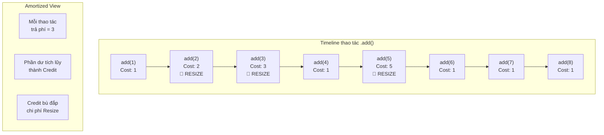

# Metadata
- **Document ID**: DSA-02-04
- **Version**: 1.0
- **Prerequisites**: DSA-02-01 (Big-O Notation), DSA-02-02 (Time Complexity)
- **Learning Objectives**: Hiểu và áp dụng Amortized Analysis (Phân tích chi phí rải đều) để đánh giá chính xác hiệu suất của các cấu trúc dữ liệu có thao tác tốn kém xảy ra không thường xuyên, như Dynamic Array Resize, Hash Table Rehashing, và Splay Tree Operations.
- **Estimated Reading Time**: 60 phút
- **Difficulty**: Advanced
- **Dependencies**: Không có (None)
- **Keywords**: Amortized Analysis, Aggregate Method, Accounting Method, Potential Method, Dynamic Array, Hash Table Rehashing

---

# 1 Purpose
Mục đích của tài liệu này là giải quyết một lỗ hổng quan trọng trong tư duy của nhiều Kỹ sư: Khi Worst-case của một thao tác đơn lẻ là $\mathcal{O}(N)$, KHÔNG có nghĩa là $N$ thao tác liên tiếp sẽ tốn $\mathcal{O}(N^2)$. Amortized Analysis cho phép chúng ta chứng minh rằng tổng chi phí thực tế thấp hơn đáng kể so với phép nhân Worst-case đơn giản.

---

# 2 Motivation
Hãy xem xét tình huống thực tế: Bạn đang dùng `ArrayList` trong Java. Khi mảng đầy và bạn gọi `.add()`, JVM phải tạo mảng mới gấp 1.5 lần và copy toàn bộ dữ liệu cũ sang — một thao tác tốn $\mathcal{O}(N)$. Nếu chỉ nhìn Worst-case thô, bạn sẽ kết luận sai rằng thêm $N$ phần tử tốn $\mathcal{O}(N^2)$.

Nhưng thực tế, việc resize chỉ xảy ra $\log N$ lần (mỗi lần mảng nhân đôi/nhân 1.5). Tổng chi phí copy là $1 + 2 + 4 + 8 + \dots + N \approx 2N$. Chia đều cho $N$ thao tác, mỗi thao tác `.add()` chỉ tốn trung bình $\mathcal{O}(1)$ — đây chính là **Amortized Cost** (Chi phí rải đều).

---

# 3 Mathematical Foundation
Amortized Analysis KHÔNG phải Average-case Analysis. Sự khác biệt cốt lõi:
- **Average-case**: Phụ thuộc vào phân bố xác suất (Probability Distribution) của dữ liệu đầu vào. Nó nói: "Nếu dữ liệu NGẪU NHIÊN, thì trung bình là..."
- **Amortized**: KHÔNG phụ thuộc xác suất. Nó nói: "BẤT KỂ dữ liệu đầu vào là gì, tổng chi phí của $N$ thao tác liên tiếp luôn bị chặn trên (Upper bounded) bởi $f(N)$." Đây là sự đảm bảo (Guarantee) tuyệt đối.

Có 3 phương pháp chính thức để tính Amortized Cost:

## 3.1 Aggregate Method (Phương pháp Gộp)
Tính tổng chi phí thực tế (Actual cost) của $N$ thao tác, rồi chia cho $N$.
$$\hat{c} = \frac{T(N)}{N}$$
Trong đó $\hat{c}$ là Amortized Cost, $T(N)$ là tổng chi phí.

## 3.2 Accounting Method (Phương pháp Kế toán)
Gán cho MỖI thao tác một "phí ước lượng" (Amortized charge) $\hat{c}_i$. Phí này có thể NHIỀU HƠN chi phí thực tế $c_i$ (phần dư gọi là "Tín dụng / Credit" được lưu lại). Khi thao tác tốn kém xảy ra, Credit tích lũy sẽ bù đắp.
Điều kiện: $\sum_{i=1}^{N} \hat{c}_i \ge \sum_{i=1}^{N} c_i$ (Tổng phí ước lượng luôn >= Tổng chi phí thực tế).

## 3.3 Potential Method (Phương pháp Thế năng)
Đây là kỹ thuật toán học mạnh mẽ nhất. Định nghĩa một hàm thế năng (Potential function) $\Phi$ trên cấu trúc dữ liệu $D$:
$$\hat{c}_i = c_i + \Phi(D_i) - \Phi(D_{i-1})$$
Trong đó:
- $c_i$ là chi phí thực tế của thao tác thứ $i$.
- $\Phi(D_i)$ là thế năng sau thao tác thứ $i$.
- $\Phi(D_0) = 0$ (Thế năng ban đầu bằng 0).
- $\Phi(D_i) \ge 0$ cho mọi $i$.

Khi tổng Telescoping (Rút gọn lồng nhau): $\sum \hat{c}_i = \sum c_i + \Phi(D_N) - \Phi(D_0) \ge \sum c_i$.

---

# 4 Core Theory
## Ví dụ minh họa: Dynamic Array (Mảng động)
Giả sử mảng bắt đầu với Capacity (Sức chứa) $= 1$. Mỗi khi mảng đầy, ta nhân đôi sức chứa.

| Thao tác `.add()` thứ | Capacity trước | Chi phí thực ($c_i$) | Có Resize? |
|---|---|---|---|
| 1 | 1 | 1 (ghi 1 phần tử) | Không |
| 2 | 1 → 2 | 1 (copy) + 1 (ghi) = 2 | CÓ |
| 3 | 2 → 4 | 2 (copy) + 1 (ghi) = 3 | CÓ |
| 4 | 4 | 1 | Không |
| 5 | 4 → 8 | 4 (copy) + 1 (ghi) = 5 | CÓ |
| 6 | 8 | 1 | Không |
| 7 | 8 | 1 | Không |
| 8 | 8 | 1 | Không |
| 9 | 8 → 16 | 8 (copy) + 1 (ghi) = 9 | CÓ |

**Tổng chi phí 9 thao tác**: $1 + 2 + 3 + 1 + 5 + 1 + 1 + 1 + 9 = 24$.
**Amortized Cost mỗi thao tác**: $24 / 9 \approx 2.67 = \mathcal{O}(1)$.

### Chứng minh bằng Potential Method
Đặt $\Phi(D) = 2 \times \text{Size} - \text{Capacity}$.
- Khi thêm KHÔNG resize: $c_i = 1$. $\hat{c}_i = 1 + (2(s+1) - cap) - (2s - cap) = 1 + 2 = 3$.
- Khi thêm CÓ resize (capacity nhân đôi): $c_i = s + 1$. $\hat{c}_i = (s+1) + (2(s+1) - 2s) - (2s - s) = (s+1) + 2 - s = 3$.
$\implies$ Mọi thao tác đều có Amortized Cost $= 3 = \mathcal{O}(1)$. QED.

---

# 5 Visual Explanation



---

# 6 Java Implementation
Cài đặt Dynamic Array minh họa cơ chế Resize và cách đếm chi phí Amortized:

```java
public class AmortizedDynamicArray {
    private int[] data;
    private int size;
    private int capacity;
    private long totalCost; // Tổng chi phí tích lũy

    public AmortizedDynamicArray() {
        capacity = 1;
        data = new int[capacity];
        size = 0;
        totalCost = 0;
    }

    /**
     * Thêm phần tử. 
     * Amortized O(1) mỗi thao tác.
     * Worst-case O(N) cho MỖI thao tác đơn lẻ bị Resize.
     */
    public void add(int value) {
        if (size == capacity) {
            resize(); // Chi phí O(size) nhưng rất hiếm xảy ra
        }
        data[size++] = value;
        totalCost++; // Chi phí ghi 1 phần tử
    }

    private void resize() {
        int newCapacity = capacity * 2; // Nhân đôi
        int[] newData = new int[newCapacity];
        // Chi phí copy = size phần tử
        System.arraycopy(data, 0, newData, 0, size);
        totalCost += size; // Cộng chi phí copy
        data = newData;
        capacity = newCapacity;
    }

    /**
     * Trả về Amortized Cost trung bình cho mỗi thao tác add().
     */
    public double getAmortizedCost() {
        return (double) totalCost / size;
    }

    public static void main(String[] args) {
        AmortizedDynamicArray arr = new AmortizedDynamicArray();
        for (int i = 0; i < 1_000_000; i++) {
            arr.add(i);
        }
        System.out.printf("Amortized cost per add(): %.4f%n", arr.getAmortizedCost());
        // Kết quả sẽ hội tụ gần giá trị 3.0
    }
}
```

---

# 7 Step-by-Step Execution
Chạy chương trình trên với $N = 16$:
1. `add(0)`: size=1, cap=1. Không resize. Cost=1. Total=1.
2. `add(1)`: size=1, cap=1. **RESIZE** cap→2, copy 1. Cost=1+1=2. Total=3.
3. `add(2)`: size=2, cap=2. **RESIZE** cap→4, copy 2. Cost=2+1=3. Total=6.
4. `add(3)`: size=3, cap=4. Không resize. Cost=1. Total=7.
5. `add(4)`: size=4, cap=4. **RESIZE** cap→8, copy 4. Cost=4+1=5. Total=12.
6-8. 3 lần add không resize. Cost=3. Total=15.
9. `add(8)`: size=8, cap=8. **RESIZE** cap→16, copy 8. Cost=8+1=9. Total=24.
10-16. 7 lần add không resize. Cost=7. Total=31.

**Amortized Cost** = $31 / 16 = 1.9375 \approx \mathcal{O}(1)$.

---

# 8 Complexity Analysis
| Cấu trúc dữ liệu | Thao tác | Worst-case đơn lẻ | Amortized |
|---|---|---|---|
| Dynamic Array (ArrayList) | `add()` | $\mathcal{O}(N)$ | $\mathcal{O}(1)$ |
| Hash Table (HashMap) | `put()` | $\mathcal{O}(N)$ (Rehash) | $\mathcal{O}(1)$ |
| Splay Tree | `find()` | $\mathcal{O}(N)$ | $\mathcal{O}(\log N)$ |
| Multi-Pop Stack | `multipop(k)` | $\mathcal{O}(N)$ | $\mathcal{O}(1)$ per element |
| Binary Counter | `increment()` | $\mathcal{O}(\log N)$ | $\mathcal{O}(1)$ |

---

# 9 JVM Analysis
**ArrayList Resize Factor trong OpenJDK:**
Trong mã nguồn thực tế của `java.util.ArrayList` (OpenJDK), hệ số nhân KHÔNG phải là $2 \times$ mà là $1.5 \times$:
```java
// Trích từ java.util.ArrayList (OpenJDK 21)
private int newCapacity(int minCapacity) {
    int oldCapacity = elementData.length;
    int newCapacity = oldCapacity + (oldCapacity >> 1); // oldCap * 1.5
    // ...
}
```
Lý do: Nhân đôi ($2\times$) gây lãng phí RAM (Mảng cũ kích thước $N$, mảng mới kích thước $2N$, cần $3N$ RAM tạm thời). Nhân $1.5\times$ giảm Peak Memory (chỉ cần $2.5N$ RAM tạm thời), tuy đổi lại resize THƯỜNG XẢY RA HƠN một chút. Amortized Cost vẫn là $\mathcal{O}(1)$ nhưng hằng số cao hơn. Đây là trade-off cực kỳ tinh tế của kỹ sư OpenJDK.

---

# 10 OpenJDK Analysis
**HashMap Rehashing:**
`HashMap` của Java mặc định có Load Factor $= 0.75$. Khi số phần tử vượt quá $0.75 \times \text{Capacity}$, toàn bộ bảng băm được tạo lại (Rehash) với kích thước gấp đôi. Chi phí Rehash tốn $\mathcal{O}(N)$ cho một lần.

Tuy nhiên, bằng Amortized Analysis:
- Giữa 2 lần Rehash, ta thêm được ít nhất $N/4$ phần tử (vì Load Factor tăng từ $0.375$ lên $0.75$).
- Chi phí Rehash ($N$) được rải đều cho $N/4$ thao tác $\implies$ Mỗi thao tác `put()` gánh thêm $\approx 4$ đơn vị chi phí Rehash.
- $4 = \mathcal{O}(1)$. Vậy `HashMap.put()` là Amortized $\mathcal{O}(1)$.

Từ Java 8, khi một Bucket bị quá nhiều Collision (>8 phần tử), nó chuyển từ LinkedList sang Red-Black Tree, biến Worst-case tra cứu từ $\mathcal{O}(N)$ thành $\mathcal{O}(\log N)$.

---

# 11 Production Usage
**Khi nào Amortized O(1) KHÔNG đủ tốt:**
Trong hệ thống Real-time (Xử lý giao dịch chứng khoán, điều khiển robot, lái xe tự hành), một thao tác Worst-case $\mathcal{O}(N)$ xảy ra đúng lúc then chốt (Ví dụ: Resize ArrayList khi đang xử lý tín hiệu phanh xe) có thể gây ra thảm họa. Trong các hệ thống này, kỹ sư cần:
- Sử dụng Pre-allocated Arrays (Mảng cấp phát sẵn kích thước tối đa) thay vì Dynamic Array.
- Tránh hoàn toàn cấu trúc dữ liệu có Amortized Cost (HashMap, ArrayList).
- Ưu tiên cấu trúc có Worst-case đảm bảo (Balanced BST, Array-based Ring Buffer).

---

# 12 Design Decisions
**Chọn hệ số nhân bao nhiêu cho Dynamic Array?**
| Hệ số | Amortized Cost | Peak Memory | Sử dụng bởi |
|---|---|---|---|
| $2\times$ | Hằng số thấp | Cao ($3N$) | C++ `std::vector`, Python `list` |
| $1.5\times$ | Hằng số cao hơn | Thấp hơn ($2.5N$) | Java `ArrayList` |
| $\phi \approx 1.618$ (Tỷ lệ Vàng) | Tối ưu lý thuyết | Cân bằng | Facebook `folly::fbvector` |
| $1.25\times$ | Hằng số rất cao | Rất thấp | Ứng dụng nhúng (Embedded) |

Facebook chọn $\phi$ (Golden Ratio) vì khi nhân $1.618\times$, mảng mới LUÔN nhỏ hơn tổng tất cả các mảng cũ đã bị giải phóng, cho phép Memory Allocator tái sử dụng vùng nhớ cũ thay vì xin mới từ HĐH.

---

# 13 Common Bugs
20 lỗi phổ biến liên quan đến Amortized Analysis:
1. Nhầm lẫn Amortized $\mathcal{O}(1)$ với Worst-case $\mathcal{O}(1)$ (Chúng khác nhau hoàn toàn).
2. Nhầm lẫn Amortized Analysis với Average-case Analysis (Amortized KHÔNG dùng xác suất).
3. Không pre-allocate `ArrayList` khi đã biết kích thước, gây Resize liên tục.
4. Gọi `HashMap.put()` trong vòng lặp mà không set `initialCapacity`, trigger Rehash nhiều lần.
5. Đánh giá sai Peak Memory khi Resize (Cần $\text{old} + \text{new}$ RAM cùng lúc tại thời điểm copy).
6. Sử dụng `StringBuffer` (Thread-safe, có Lock overhead) thay vì `StringBuilder` (Không Lock).
7. Sử dụng `ArrayList.add(0, element)` liên tục tạo ra $\mathcal{O}(N)$ thực sự mỗi lần (KHÔNG phải Amortized).
8. Tưởng rằng xóa phần tử khỏi `ArrayList` là $\mathcal{O}(1)$ (Thực tế là $\mathcal{O}(N)$ do dồn mảng).
9. Cho rằng Amortized Analysis áp dụng được cho Single Operation riêng lẻ (Chỉ có nghĩa khi xét chuỗi $N$ thao tác liên tiếp).
10. Sử dụng `Vector` trong Java (Synchronized, nhân đôi capacity — lãng phí RAM hơn ArrayList nhân 1.5).
11. Quên rằng `StringBuilder.append()` cũng có cơ chế Resize nội bộ (Doubling buffer).
12. Shrink (Thu nhỏ) mảng quá thường xuyên gây ra "Thrashing" (Resize lên xuống liên tục).
13. Load Factor HashMap quá thấp (vd: 0.1) gây lãng phí RAM khổng lồ.
14. Load Factor HashMap quá cao (vd: 0.95) gây Collision liên tục, tra cứu bị chậm lại.
15. Cho rằng `ConcurrentHashMap` có cùng Amortized Cost với `HashMap` (Có Lock overhead thêm).
16. Quên rằng Deque (`ArrayDeque`) cũng Resize như ArrayList khi đầy.
17. Sử dụng `LinkedList` với ý nghĩ "không bao giờ resize" nhưng quên rằng mỗi Node tốn 48 bytes Overhead (Object Header + 2 con trỏ next/prev + con trỏ tới Element).
18. Serialize toàn bộ ArrayList 10 triệu phần tử trước khi gửi qua mạng (Tốn Peak Memory $2\times$ bản sao).
19. Không hiểu tại sao `ArrayList.trimToSize()` tồn tại (Nó giúp giải phóng Capacity dư thừa sau khi đã biết mảng sẽ không mở rộng thêm).
20. Cho rằng Amortized $\mathcal{O}(1)$ có nghĩa "MỌI thao tác đều nhanh" (Sai. MỘT thao tác bất kỳ vẫn có thể rất chậm).

---

# 14 Edge Cases
30 trường hợp ngoại lệ:
1. Dynamic Array chỉ chứa 1 phần tử nhưng bị Resize ngay lập tức (capacity 1 → 2).
2. HashMap chỉ có 1 Entry nhưng bị Rehash khi Load Factor $> 0.75$ (threshold = $0.75 \times 16 = 12$).
3. Resize mảng từ kích thước $2^{30}$ lên $2^{31}$ vượt quá giới hạn `Integer.MAX_VALUE` trong Java.
4. Khi JVM Heap Memory gần hết, thao tác Resize gây ra `OutOfMemoryError` tại đúng thời điểm tạo mảng mới.
5. Multi-Pop Stack: Pop $K$ phần tử cùng lúc ($K > \text{size}$), phải giới hạn Pop ở $\min(K, \text{size})$.
6. Binary Counter: Tăng từ $2^{32} - 1$ lên $2^{32}$ gây Integer Overflow.
7. Splay Tree truy cập Node sâu nhất liên tục, làm cây mất cân bằng rồi tự chỉnh.
8. HashMap với hashCode trả về hằng số cho MỌI key (Mọi phần tử vào cùng 1 Bucket).
9. ArrayList Resize khi JVM đang chạy Stop-The-World GC (Chồng chất Latency).
10. Thao tác `remove()` liên tục trên ArrayList KHÔNG trigger Shrink (Capacity giữ nguyên, gây lãng phí).
11. Thêm phần tử null vào ArrayList (Hợp lệ trong Java).
12. HashMap Rehash khi đang bị iterate bởi Thread khác (ConcurrentModificationException).
13. StringBuilder append chuỗi rất dài 1 lần (Resize nhảy vọt thay vì nhân đôi dần).
14. Mảng nội bộ của PriorityQueue (Binary Heap) cũng Resize khi đầy.
15. `ArrayDeque` resize khi Head pointer và Tail pointer gặp nhau trong Circular Array.
16. Bulk insert $N$ phần tử vào HashMap đã biết trước: Nên set `initialCapacity = (int)(N / 0.75) + 1`.
17. ArrayList chứa Object Reference; khi Resize, chỉ copy Reference (Shallow copy), không copy Object.
18. Concurrent Resize trên `ConcurrentHashMap` (Chỉ lock 1 Segment, không lock toàn bảng).
19. Dynamic Array trong ngôn ngữ không có GC (C++): Phải tự giải phóng mảng cũ (`delete[]`).
20. Thao tác `ensureCapacity()` của ArrayList cho phép pre-allocate thủ công, tránh Amortized Resize hoàn toàn.
21. Khi Capacity đã lên tới $10^8$, mỗi lần Resize tạm thời tốn $\approx 750MB$ RAM ($10^8 \times 4 \text{ bytes} \times 2$).
22. `HashMap.putAll(otherMap)` có thể trigger NHIỀU lần Rehash nếu `otherMap` lớn hơn capacity hiện tại.
23. Binary Counter đếm xuống (decrement) có Amortized Cost khác với đếm lên (increment).
24. Fibonacci Heap: `decreaseKey` là Amortized $\mathcal{O}(1)$ nhưng `delete` là Amortized $\mathcal{O}(\log N)$.
25. Splay Tree: Truy cập tuần tự tất cả phần tử (In-order traversal) tốn Amortized $\mathcal{O}(N)$ tổng cộng.
26. Union-Find với Path Compression + Union by Rank: Amortized $\mathcal{O}(\alpha(N)) \approx \mathcal{O}(1)$ gần như hằng số.
27. Khi JIT Compiler tối ưu hóa vòng lặp copy (SIMD vectorization), Resize thực tế nhanh hơn lý thuyết.
28. WeakHashMap: GC có thể xóa Entry bất kỳ lúc nào, làm Rehash xảy ra ở thời điểm không kiểm soát được.
29. Dynamic Array thu nhỏ (Shrink) khi Load Factor < 0.25 để tránh lãng phí Space (Chiến lược của `std::deque` C++).
30. Thao tác `clear()` trên ArrayList chỉ set Size = 0, KHÔNG giải phóng mảng nội bộ (Capacity giữ nguyên).

---

# 15 Optimization Techniques
- **Pre-allocation (Cấp phát trước)**: `new ArrayList<>(expectedSize)` và `new HashMap<>(expectedSize, 0.75f)` loại bỏ hoàn toàn Resize overhead.
- **Object Pooling**: Thay vì tạo ArrayList mới liên tục, tái sử dụng bằng `.clear()` rồi fill lại.
- **Batch Operations**: Thay vì `.add()` từng phần tử, dùng `.addAll(Collection)` để JVM tính toán Resize 1 lần duy nhất.

---

# 16 Best Practices
- Khi viết API/SDK, luôn Document (ghi chú) rõ ràng "Amortized O(1)" hay "Worst-case O(1)". Sự khác biệt này quyết định xem API có phù hợp cho hệ thống Real-time hay không.
- Khi phỏng vấn, nếu câu hỏi liên quan đến ArrayList hoặc HashMap, hãy chủ động đề cập Amortized Analysis. Điều này thể hiện chiều sâu kỹ thuật.

---

# 17 Benchmark
Đo lường thực tế sự khác biệt giữa Pre-allocated ArrayList và Default ArrayList:

```java
import java.util.ArrayList;
import java.util.List;

public class AmortizedBenchmark {
    static final int N = 10_000_000;
    
    public static void main(String[] args) {
        // Không pre-allocate: Nhiều lần Resize ẩn
        long start1 = System.nanoTime();
        List<Integer> list1 = new ArrayList<>();
        for (int i = 0; i < N; i++) list1.add(i);
        long time1 = System.nanoTime() - start1;

        // Pre-allocate: Không bao giờ Resize
        long start2 = System.nanoTime();
        List<Integer> list2 = new ArrayList<>(N);
        for (int i = 0; i < N; i++) list2.add(i);
        long time2 = System.nanoTime() - start2;

        System.out.printf("Default:       %d ms%n", time1 / 1_000_000);
        System.out.printf("Pre-allocated: %d ms%n", time2 / 1_000_000);
        System.out.printf("Speedup:       %.2fx%n", (double) time1 / time2);
    }
}
```

---

# 18 Unit Testing
Kiểm tra Amortized Cost hội tụ về $\mathcal{O}(1)$:

```java
@Test
void testAmortizedCostConverges() {
    AmortizedDynamicArray arr = new AmortizedDynamicArray();
    for (int i = 0; i < 1_000_000; i++) {
        arr.add(i);
    }
    double amortized = arr.getAmortizedCost();
    // Amortized cost phải hội tụ về giá trị < 4 (gần 3)
    assertTrue(amortized < 4.0, 
        "Amortized cost vượt quá giới hạn lý thuyết: " + amortized);
    assertTrue(amortized > 1.0,
        "Amortized cost quá thấp, có thể lỗi đếm: " + amortized);
}
```

---

# 19 Interview Questions
20 câu hỏi về Amortized Analysis:

**Easy**
1. Amortized Analysis là gì? Nó khác Average-case như thế nào?
2. Amortized Cost của thao tác `add()` trong ArrayList là gì?
3. Tại sao ArrayList resize bằng cách nhân 1.5 thay vì cộng thêm 10?
4. Nêu tên 3 phương pháp Amortized Analysis (Aggregate, Accounting, Potential).
5. Nếu ArrayList không bao giờ Resize, Amortized Cost là bao nhiêu?

**Medium**
6. Chứng minh bằng Aggregate Method rằng Dynamic Array add() là Amortized O(1).
7. Giải thích tại sao HashMap.put() là Amortized O(1).
8. Multi-Pop Stack hoạt động như thế nào? Tại sao pop K phần tử cùng lúc vẫn là Amortized O(1) trên mỗi phần tử?
9. Binary Counter tăng 1: Tại sao Amortized Cost cho mỗi lần increment là O(1)?
10. Khi nào Amortized O(1) KHÔNG chấp nhận được?
11. Hệ số nhân (Growth Factor) của ArrayList ảnh hưởng đến Amortized Cost như thế nào?
12. Tại sao Facebook dùng Golden Ratio 1.618 cho fbvector?
13. Load Factor của HashMap ảnh hưởng thế nào đến tần suất Rehash?
14. So sánh Amortized Cost của `ArrayList.add(element)` vs `ArrayList.add(0, element)`.
15. Giải thích Accounting Method qua ví dụ thực tế.

**Hard & Senior**
16. Chứng minh Amortized O(1) của Dynamic Array bằng Potential Method.
17. Tại sao Splay Tree có Amortized O(log N) cho tất cả các thao tác?
18. Union-Find với Path Compression có Amortized O(α(N)). Hàm α là gì? Tại sao nó gần như O(1)?
19. Thiết kế một Dynamic Array hỗ trợ cả Shrink (Thu nhỏ) khi xóa phần tử, sao cho Amortized Cost vẫn là O(1). (Gợi ý: Shrink khi Size < Capacity/4).
20. Trong hệ thống Garbage-Collected, Amortized Analysis có còn chính xác không khi GC Pause xảy ra ngay lúc Resize?

---

# 20 Practice Problems Link
Xem toàn bộ 30 bài toán thực hành về Amortized Analysis tại: [04-Amortized-Analysis-Problems.md](04-Amortized-Analysis-Problems.md).

---

# 21 Pattern Recognition
**Dấu hiệu nhận biết bài toán cần Amortized Analysis:**
1. Một thao tác "Thường nhanh nhưng đôi khi chậm".
2. Cấu trúc dữ liệu có cơ chế "Tự chỉnh" (Self-adjusting): ArrayList Resize, HashMap Rehash, Splay Tree Rotation.
3. Bộ đếm nhị phân (Binary Counter) nơi bit cao thay đổi cực hiếm.
4. Stack với thao tác Multi-pop.

---

# 22 Real Case Study
**Redis và Incremental Rehashing:**
Redis (Cơ sở dữ liệu Key-Value nổi tiếng) không sử dụng HashMap truyền thống. Khi cần Rehash, thay vì chặn toàn bộ Server để di chuyển $N$ phần tử sang bảng mới (Tốn $\mathcal{O}(N)$ thời gian chặn), Redis duy trì đồng thời 2 bảng Hash (Cũ và Mới). Mỗi thao tác `get()` hoặc `set()` từ Client, Redis lén di chuyển thêm vài Entry từ bảng cũ sang bảng mới. Sau $N$ thao tác, toàn bộ dữ liệu đã được di chuyển xong mà KHÔNG BAO GIỜ có thao tác nào bị chặn quá lâu. Đây chính là Amortized Analysis ứng dụng trong thực tế ở quy mô Internet (Hàng triệu Request/giây).

---

# 23 Summary
Amortized Analysis là vũ khí toán học quan trọng để kỹ sư đánh giá chính xác hiệu suất thực tế của các cấu trúc dữ liệu cốt lõi (ArrayList, HashMap, Splay Tree, Union-Find). Nó cho phép chúng ta vượt qua sự bi quan (Pessimism) của Worst-case Analysis và đưa ra các quyết định thiết kế hệ thống có cơ sở toán học vững chắc.

---

# 24 Checklist
- [ ] Phân biệt rõ ràng Amortized Analysis và Average-case Analysis.
- [ ] Nắm được 3 phương pháp: Aggregate, Accounting, Potential.
- [ ] Hiểu cơ chế Resize của ArrayList (nhân 1.5) và Rehash của HashMap.
- [ ] Biết khi nào Amortized O(1) KHÔNG phù hợp (Real-time systems).
- [ ] Có khả năng tính Amortized Cost cho Dynamic Array bằng Potential Method.
