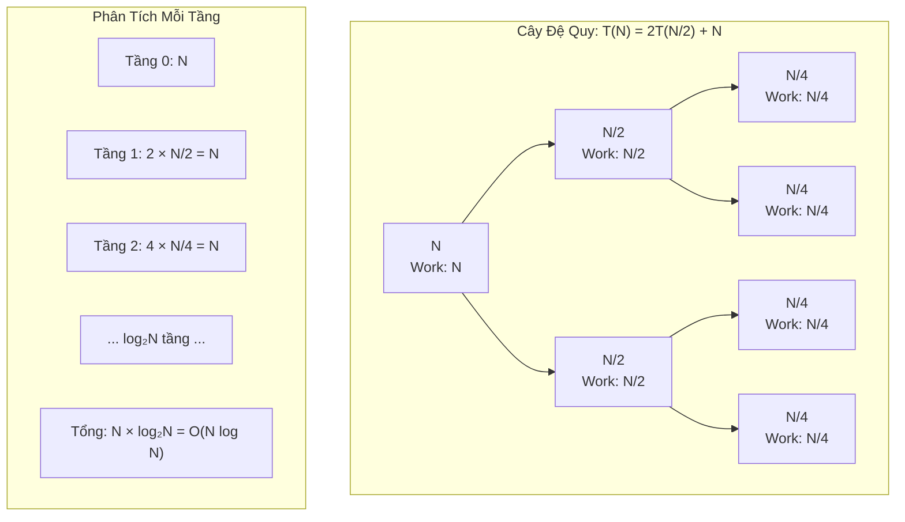

# Metadata
- **Document ID**: DSA-02-05
- **Version**: 1.0
- **Prerequisites**: DSA-02-01 (Big-O Notation), DSA-02-02 (Time Complexity)
- **Learning Objectives**: Nắm vững Định lý Chủ (Master Theorem) và các phương pháp mở rộng để phân tích Phương trình Đệ quy (Recurrence Relations) xuất hiện trong các thuật toán Chia để Trị (Divide and Conquer).
- **Estimated Reading Time**: 60 phút
- **Difficulty**: Advanced
- **Dependencies**: Không có (None)
- **Keywords**: Master Theorem, Recurrence Relations, Divide and Conquer, Recursion Tree, Substitution Method, Akra-Bazzi

---

# 1 Purpose
Mục đích của tài liệu này là trang bị cho Kỹ sư phần mềm khả năng giải phương trình đệ quy (Recurrence Relations) — Công cụ toán học tối quan trọng để xác định Time Complexity của thuật toán Chia để Trị (Divide and Conquer) như Merge Sort, Quick Sort, Binary Search, Strassen's Algorithm, và Karatsuba Multiplication.

---

# 2 Motivation
Khi một thuật toán đệ quy chia bài toán kích thước $N$ thành $a$ bài toán con kích thước $N/b$, rồi mất $f(N)$ thời gian để gộp (Combine) kết quả, Time Complexity tuân theo phương trình:
$$T(N) = a \cdot T\left(\frac{N}{b}\right) + f(N)$$
Giải phương trình này bằng tay cực kỳ khó khăn. Master Theorem (Định lý Chủ) là một "Bảng tra cứu" (Lookup table) toán học cho phép xác định $T(N)$ ngay lập tức trong hầu hết các trường hợp phổ biến mà KHÔNG cần tự giải phương trình.

---

# 3 Mathematical Foundation
## Phát biểu Định lý Chủ (Master Theorem Statement)
Cho phương trình đệ quy:
$$T(N) = a \cdot T\left(\frac{N}{b}\right) + \Theta(N^c \cdot \log^k N)$$
Trong đó $a \ge 1$, $b > 1$, $c \ge 0$, $k \ge 0$.

Đặt $p = \log_b a$ (được gọi là "Critical Exponent" — Số mũ phân giới).

### Case 1: Công việc tập trung ở Lá (Leaf-heavy)
Nếu $c < p$ (tức là $f(N)$ tăng chậm hơn $N^p$):
$$T(N) = \Theta(N^p) = \Theta(N^{\log_b a})$$

### Case 2: Công việc phân bố đều mọi tầng (Balanced)
Nếu $c = p$:
$$T(N) = \Theta(N^p \cdot \log^{k+1} N)$$
Trường hợp đặc biệt khi $k = 0$: $T(N) = \Theta(N^p \cdot \log N)$.

### Case 3: Công việc tập trung ở Gốc (Root-heavy)
Nếu $c > p$ VÀ $a \cdot f(N/b) \le \delta \cdot f(N)$ với hằng số $\delta < 1$ (Regularity condition):
$$T(N) = \Theta(f(N)) = \Theta(N^c \cdot \log^k N)$$

---

# 4 Core Theory
## Giải thích trực giác (Intuition)
Hãy tưởng tượng thuật toán như một CÂY ĐỆ QUY (Recursion Tree):
- **Gốc (Root)**: Bài toán gốc kích thước $N$, làm $f(N)$ công việc.
- **Tầng 1**: $a$ bài toán con kích thước $N/b$, mỗi cái làm $f(N/b)$ công việc.
- **Tầng 2**: $a^2$ bài toán con kích thước $N/b^2$.
- ...
- **Tầng $\log_b N$ (Lá)**: $a^{\log_b N} = N^{\log_b a} = N^p$ bài toán con kích thước 1.

Tổng công việc MỖI tầng thay đổi theo quy luật:
- Tầng 0: $f(N)$
- Tầng 1: $a \cdot f(N/b)$
- Tầng $i$: $a^i \cdot f(N/b^i)$

**Case 1**: Công việc tăng dần theo tầng $\to$ Tầng Lá thống trị $\to T(N) = N^p$.
**Case 2**: Mỗi tầng đóng góp ngang nhau $\to$ Tổng = Số tầng $\times$ Công việc mỗi tầng $\to T(N) = N^p \log N$.
**Case 3**: Công việc giảm dần theo tầng $\to$ Tầng Gốc thống trị $\to T(N) = f(N)$.

---

# 5 Visual Explanation



---

# 6 Java Implementation
Minh họa 3 thuật toán tương ứng 3 Case:

```java
public class MasterTheoremExamples {

    // ===== CASE 1: T(N) = 8T(N/2) + O(N^2) =====
    // a=8, b=2, c=2, p = log₂8 = 3. c < p => T(N) = O(N^3)
    // Ví dụ: Nhân ma trận ngây thơ (Naive Matrix Multiplication)
    public int[][] naiveMultiply(int[][] A, int[][] B, int n) {
        if (n == 1) {
            return new int[][]{{A[0][0] * B[0][0]}};
        }
        // Chia thành 8 bài toán con kích thước N/2
        // Chi phí merge: O(N^2) để cộng các ma trận con
        // ... (pseudo-code cho ngắn gọn)
        return new int[n][n];
    }

    // ===== CASE 2: T(N) = 2T(N/2) + O(N) =====
    // a=2, b=2, c=1, p = log₂2 = 1. c = p => T(N) = O(N log N)
    // Ví dụ: Merge Sort
    public void mergeSort(int[] arr, int lo, int hi) {
        if (lo >= hi) return;
        int mid = lo + (hi - lo) / 2;
        mergeSort(arr, lo, mid);       // T(N/2)
        mergeSort(arr, mid + 1, hi);   // T(N/2)
        merge(arr, lo, mid, hi);       // O(N) merge
    }

    private void merge(int[] arr, int lo, int mid, int hi) {
        int[] temp = new int[hi - lo + 1];
        int i = lo, j = mid + 1, k = 0;
        while (i <= mid && j <= hi) {
            temp[k++] = (arr[i] <= arr[j]) ? arr[i++] : arr[j++];
        }
        while (i <= mid) temp[k++] = arr[i++];
        while (j <= hi) temp[k++] = arr[j++];
        System.arraycopy(temp, 0, arr, lo, temp.length);
    }

    // ===== CASE 3: T(N) = 2T(N/2) + O(N^2) =====
    // a=2, b=2, c=2, p = log₂2 = 1. c > p => T(N) = O(N^2)
    // Gốc cây thống trị: Chi phí merge quá lớn so với đệ quy
    public int rootHeavyAlgo(int[] arr, int lo, int hi) {
        if (lo >= hi) return arr[lo];
        int mid = lo + (hi - lo) / 2;
        int leftResult = rootHeavyAlgo(arr, lo, mid);
        int rightResult = rootHeavyAlgo(arr, mid + 1, hi);
        // O(N^2) merge: So sánh tất cả cặp (expensive)
        int result = 0;
        for (int i = lo; i <= mid; i++)
            for (int j = mid + 1; j <= hi; j++)
                result += arr[i] * arr[j];
        return result;
    }
}
```

---

# 7 Step-by-Step Execution
**Ví dụ: Merge Sort $T(N) = 2T(N/2) + N$ với $N = 8$:**

| Tầng | Số bài toán | Kích thước mỗi bài | Công việc mỗi bài | Tổng công việc tầng |
|---|---|---|---|---|
| 0 | 1 | 8 | 8 | 8 |
| 1 | 2 | 4 | 4 | 8 |
| 2 | 4 | 2 | 2 | 8 |
| 3 (Lá) | 8 | 1 | 1 | 8 |

**Tổng**: $8 \times 4 = 32$. Theo công thức: $N \log_2 N = 8 \times 3 = 24$ (Chênh lệch hằng số do Base case khác nhau).

**Kiểm tra Master Theorem**: $a = 2, b = 2, c = 1$. $p = \log_2 2 = 1$. $c = p$ $\implies$ **Case 2**: $T(N) = \Theta(N \log N)$. ✅

---

# 8 Complexity Analysis
## Bảng tra cứu nhanh (Quick Reference Table)

| Phương trình | $a$ | $b$ | $f(N)$ | $p = \log_b a$ | Case | Kết quả |
|---|---|---|---|---|---|---|
| $T(N) = T(N/2) + 1$ | 1 | 2 | $1$ | 0 | 2 | $\Theta(\log N)$ |
| $T(N) = 2T(N/2) + 1$ | 2 | 2 | $1$ | 1 | 1 | $\Theta(N)$ |
| $T(N) = 2T(N/2) + N$ | 2 | 2 | $N$ | 1 | 2 | $\Theta(N \log N)$ |
| $T(N) = 2T(N/2) + N^2$ | 2 | 2 | $N^2$ | 1 | 3 | $\Theta(N^2)$ |
| $T(N) = 4T(N/2) + N$ | 4 | 2 | $N$ | 2 | 1 | $\Theta(N^2)$ |
| $T(N) = 4T(N/2) + N^2$ | 4 | 2 | $N^2$ | 2 | 2 | $\Theta(N^2 \log N)$ |
| $T(N) = 7T(N/2) + N^2$ | 7 | 2 | $N^2$ | 2.81 | 1 | $\Theta(N^{2.81})$ |
| $T(N) = 3T(N/4) + N \log N$ | 3 | 4 | $N \log N$ | 0.79 | 3 | $\Theta(N \log N)$ |
| $T(N) = 2T(N/4) + \sqrt{N}$ | 2 | 4 | $\sqrt{N}$ | 0.5 | 2 | $\Theta(\sqrt{N} \log N)$ |
| $T(N) = T(N/2) + N$ | 1 | 2 | $N$ | 0 | 3 | $\Theta(N)$ |

---

# 9 JVM Analysis
**Đệ quy và JVM Call Stack:**
Khi thuật toán Merge Sort ($T(N) = 2T(N/2) + N$) được chạy trên JVM:
- Độ sâu Call Stack tối đa: $\log_2 N$.
- Với $N = 10^6$, Stack Depth $\approx 20$. Mỗi Frame tốn vài trăm byte $\implies$ an toàn.
- Nhưng nếu thuật toán là $T(N) = T(N-1) + 1$ (Đệ quy tuyến tính), Stack Depth $= N = 10^6$, chắc chắn `StackOverflowError`.

**JIT Compiler Optimizations cho Đệ quy:**
- JVM KHÔNG hỗ trợ Tail Call Optimization (TCO) như Scala hay Kotlin trên JVM.
- Tuy nhiên, JIT có thể Inline hàm đệ quy nếu hàm đủ nhỏ (Bytecode $\le 35$ bytes, tùy flag `-XX:MaxInlineSize`).
- Hiệu ứng: Chuỗi đệ quy ngắn (Depth $\le 5$) có thể bị JIT "phẳng hóa" (Flatten) thành vòng lặp, loại bỏ Overhead của Stack Frame.

---

# 10 OpenJDK Analysis
**`Arrays.sort()` và Master Theorem:**
- Với `int[]`: Dual-Pivot QuickSort. Recurrence: $T(N) = 2T(N/2) + \mathcal{O}(N)$ (Average-case). $\implies \mathcal{O}(N \log N)$ theo Case 2.
- Với `Object[]`: TimSort (Merge Sort biến thể). Recurrence tối ưu khi mảng "gần sorted": $T(N) = T(N-K) + \mathcal{O}(K)$ cho các Run đã sắp xếp. Không áp dụng Master Theorem (vì $b$ không cố định).
- JDK 21 bổ sung kiểm tra: Nếu QuickSort đệ quy quá sâu ($> 1.5 \cdot \log_2 N$ tầng — dấu hiệu Worst-case), tự động chuyển sang HeapSort $\mathcal{O}(N \log N)$ Worst-case.

---

# 11 Production Usage
**Thuật toán Strassen cho Nhân Ma trận:**
- Thuật toán ngây thơ: $T(N) = 8T(N/2) + \mathcal{O}(N^2)$. $p = \log_2 8 = 3$. Case 1: $\Theta(N^3)$.
- Thuật toán Strassen: $T(N) = 7T(N/2) + \mathcal{O}(N^2)$. $p = \log_2 7 \approx 2.81$. Case 1: $\Theta(N^{2.81})$.
- Tiết kiệm 1 phép nhân con (từ 8 xuống 7) nhưng tăng phép cộng/trừ ma trận.
- Trong thực tế, Strassen chỉ nhanh hơn khi ma trận $> 64 \times 64$ (Hằng số lớn).
- Google TPU và NVIDIA GPU sử dụng biến thể Strassen cho Deep Learning.

---

# 12 Design Decisions
**Khi thiết kế thuật toán Divide and Conquer:**
- Giảm $a$ (Số bài toán con): Hiệu quả nhất. Strassen giảm từ 8 xuống 7. Karatsuba giảm từ 4 xuống 3 (Nhân số nguyên lớn: $\mathcal{O}(N^{\log_2 3}) \approx \mathcal{O}(N^{1.585})$ thay vì $\mathcal{O}(N^2)$).
- Tăng $b$ (Kích thước phân chia): Chia thành nhiều phần hơn nhưng mỗi phần nhỏ hơn.
- Giảm $f(N)$ (Chi phí Merge): Tối ưu Merge step bằng cấu trúc dữ liệu hỗ trợ.

---

# 13 Common Bugs
20 lỗi phổ biến khi áp dụng Master Theorem:
1. Áp dụng Master Theorem cho $T(N) = T(N-1) + 1$ (SAI: Đây KHÔNG phải dạng $T(N/b)$).
2. Quên kiểm tra Regularity Condition trong Case 3.
3. Nhầm lẫn $\log_b a$ với $\log_2 a$ khi $b \neq 2$.
4. Cho rằng $T(N) = T(N/2) + T(N/3) + N$ có thể dùng Master Theorem (SAI: 2 bài toán con kích thước KHÁC NHAU, cần Akra-Bazzi).
5. Không xử lý trường hợp $N$ không chia hết cho $b$ (Thực tế dùng Floor/Ceil, kết quả vẫn đúng tiệm cận).
6. Áp dụng sai Case khi $f(N)$ có thừa số $\log$ (Cần Case 2 mở rộng).
7. Viết Recurrence sai cho thuật toán Quick Sort (Average-case $2T(N/2) + N$, Worst-case $T(N-1) + N$).
8. Cho rằng mọi thuật toán D&C đều có $a \ge 2$ (SAI: Binary Search có $a = 1$).
9. Nhầm lẫn $f(N)$ là tổng công việc vs công việc tại một node.
10. Quên Base case $T(1) = \Theta(1)$ khi viết Recurrence.
11. Cố giải Recurrence $T(N) = T(\sqrt{N}) + 1$ bằng Master Theorem (SAI: $b$ không phải hằng số).
12. Cho rằng $a$ và $b$ phải là số nguyên (SAI: Chúng có thể là số thực).
13. Tưởng rằng Case 2 chỉ cho $T(N) = \Theta(N^p \log N)$ (SAI: Nếu $f(N) = N^p \log^k N$, kết quả là $N^p \log^{k+1} N$).
14. Không nhận ra rằng $\log_b a = c \cdot \log_b a$ khi đổi Base Logarithm chỉ khác nhau hằng số.
15. Quên rằng Recursion Tree Method phải tính tổng chuỗi hình học (Geometric series).
16. Cố giải $T(N) = 2T(N/2) + N/\log N$ bằng Master Theorem (Rơi vào "Gap" giữa Case 2 và Case 3).
17. Lầm tưởng rằng giảm $a$ từ 2 xuống 1 sẽ tăng tốc thuật toán gấp đôi (Sai: Nó thay đổi CLASS complexity).
18. Viết Recurrence cho thuật toán có Early Termination (Break/Return) nhưng giả sử luôn đệ quy đủ.
19. Bỏ qua hằng số ẩn trong $f(N)$ khi so sánh thực tế (Strassen có hằng số lớn nên chậm hơn Naive cho ma trận nhỏ).
20. Sử dụng Master Theorem cho thuật toán Randomized (Kết quả chỉ đúng cho Expected case, không phải Worst-case).

---

# 14 Edge Cases
30 trường hợp ngoại lệ:
1. $a = 0$: Không đệ quy. $T(N) = f(N)$.
2. $a = 1, b = 2$: Binary Search. $T(N) = \mathcal{O}(\log N)$.
3. $b = 1$: Vô nghĩa, bài toán con không giảm kích thước. Master Theorem không áp dụng.
4. $f(N) = 0$: Chỉ có chi phí ở Lá. $T(N) = \Theta(N^p)$.
5. $a$ cực lớn ($a = N$): Recurrence thay đổi bản chất, không còn là dạng chuẩn.
6. Khi $N$ rất nhỏ ($N \le b$): Base case, Recurrence chưa có ý nghĩa tiệm cận.
7. $T(N) = T(N/2) + T(N/3) + N$: Cần Akra-Bazzi Theorem thay vì Master Theorem.
8. $T(N) = T(\alpha N) + T((1-\alpha)N) + N$ với $0 < \alpha < 1$: Quick Sort Average-case. Kết quả vẫn $\Theta(N \log N)$.
9. Recurrence phi tuyến (Non-linear): $T(N) = T(N/2)^2$ — Không thể áp dụng bất kỳ Theorem nào.
10. $T(N) = T(N/2) + \log N$: $p = 0$, $f(N) = \log N > N^0 = 1$. Case 3: $T(N) = \Theta(\log^2 N)$... Sai! Regularity check cần thiết.
11. Recurrence với chi phí không đều: $T(N) = T(N/3) + T(2N/3) + N$. Không đều nhưng kết quả vẫn $\Theta(N \log N)$ (Chứng minh bằng Recursion Tree).
12. Khi Compiler tối ưu (Memoize) các bài toán con trùng lặp: Recurrence bị thay đổi hoàn toàn (Dynamic Programming).
13. Đệ quy hỗ tương (Mutual recursion): $A(N)$ gọi $B(N/2)$, $B(N)$ gọi $A(N/2)$. Cần quy gộp thành 1 Recurrence.
14. $f(N)$ là hàm bậc thang (Step function): Vd $f(N) = \lfloor N/3 \rfloor$. Kết quả tiệm cận không thay đổi.
15. Khi bài toán con chồng chéo (Overlapping subproblems): Recurrence mô tả Time Complexity không có Memoization.
16. Recurrence với chi phí phụ thuộc vào Dữ liệu (Data-dependent): QuickSort Worst-case $T(N) = T(N-1) + N = \Theta(N^2)$.
17. Logarithm Nested: $T(N) = 2T(N/4) + \sqrt{N} \cdot \log N$. $p = 0.5$, $c = 0.5$. Case 2 mở rộng: $\Theta(\sqrt{N} \cdot \log^2 N)$.
18. Polynomial vs Polylogarithmic gap: $T(N) = 2T(N/2) + N/\log N$. Nằm giữa Case 1 và Case 2 — Master Theorem KHÔNG giải được (Gap case).
19. Khi chạy trên hệ thống phân tán: $T_{\text{parallel}}(N) = T(N/P) + \mathcal{O}(N/P + \log P)$ với $P$ processors.
20. Recurrence mô tả Space Complexity: $S(N) = S(N/2) + \mathcal{O}(N)$ (Merge Sort Space). Giải được bằng Master Theorem: $\mathcal{O}(N)$.
21. $T(N) = T(N-1) + T(N-2)$: Fibonacci. Không phải dạng Master Theorem. Giải bằng phương trình đặc trưng: $\Theta(\phi^N)$.
22. $T(N) = T(\sqrt{N}) + 1$: Đặt $M = \log N$. $T(2^M) = T(2^{M/2}) + 1$. Đặt $S(M) = T(2^M)$: $S(M) = S(M/2) + 1 = \Theta(\log M) = \Theta(\log \log N)$.
23. Khi $a$ phụ thuộc vào $N$: $T(N) = \sqrt{N} \cdot T(\sqrt{N}) + N$ — Phải giải bằng phương pháp thay thế (Substitution).
24. Recurrence với chi phí Exponential: $T(N) = 2T(N/2) + 2^N$. Case 3: $T(N) = \Theta(2^N)$ (Merge cost thống trị hoàn toàn).
25. Khi hệ thống Cache ảnh hưởng đến Recurrence: Cache-oblivious algorithm có Recurrence bao gồm Cache Miss.
26. Karatsuba Multiplication: $T(N) = 3T(N/2) + \Theta(N)$. $p = \log_2 3 \approx 1.585$. Case 1: $\Theta(N^{1.585})$.
27. Closest Pair of Points: $T(N) = 2T(N/2) + \mathcal{O}(N \log N)$. $p = 1$, $c = 1$, $k = 1$. Case 2: $\Theta(N \log^2 N)$.
28. Thuật toán Median of Medians: $T(N) = T(N/5) + T(7N/10) + \mathcal{O}(N)$. Cần Akra-Bazzi: $\Theta(N)$.
29. Đệ quy với Tail Branching: $T(N) = T(N/2) + T(N/4) + N$. Akra-Bazzi: Tìm $p$ sao cho $(1/2)^p + (1/4)^p = 1 \implies p \approx 0.69$.
30. Khi JVM stack overflow xảy ra trước khi Recurrence đạt Base case.

---

# 15 Optimization Techniques
- **Phương pháp Thay thế (Substitution Method)**: Đoán kết quả $\to$ Chứng minh bằng Quy nạp toán học. Hữu ích khi Master Theorem không áp dụng được.
- **Phương pháp Cây Đệ quy (Recursion Tree)**: Vẽ cây, tính tổng công việc mỗi tầng, rồi tổng hợp chuỗi hình học. Trực quan nhất.
- **Akra-Bazzi Theorem**: Tổng quát hóa Master Theorem cho trường hợp bài toán con có kích thước KHÁC NHAU: $T(N) = \sum a_i \cdot T(b_i \cdot N) + g(N)$.

---

# 16 Best Practices
- Khi phỏng vấn, hãy nhớ bảng tra nhanh (Section 8) để trả lời ngay lập tức khi được hỏi Complexity của thuật toán Divide and Conquer.
- Khi viết thuật toán đệ quy mới, LUÔN viết Recurrence Relation trước, rồi kiểm tra bằng Master Theorem trước khi code. Điều này giúp bạn phát hiện sớm nếu thuật toán bị $\mathcal{O}(N^2)$ hoặc tệ hơn.

---

# 17 Benchmark
So sánh thực nghiệm giữa các $a$ khác nhau:

```java
public class RecurrenceBenchmark {
    static long ops;

    // T(N) = 2T(N/2) + N => O(N log N)
    static void case2(int n) {
        if (n <= 1) return;
        ops += n; // Simulate O(N) merge work
        case2(n / 2);
        case2(n / 2);
    }

    // T(N) = 4T(N/2) + N => O(N^2)
    static void case1(int n) {
        if (n <= 1) return;
        ops += n;
        case1(n / 2); case1(n / 2);
        case1(n / 2); case1(n / 2);
    }

    public static void main(String[] args) {
        for (int n : new int[]{1024, 4096, 16384}) {
            ops = 0; case2(n);
            long nlogn = ops;
            ops = 0; case1(n);
            long nsq = ops;
            System.out.printf("N=%5d | 2T(N/2)+N: %10d | 4T(N/2)+N: %10d | Ratio: %.1f%n",
                    n, nlogn, nsq, (double) nsq / nlogn);
        }
    }
}
```

---

# 18 Unit Testing
Kiểm tra Recurrence bằng cách đếm thao tác:

```java
@Test
void testMergeSortIsNLogN() {
    int n = 1 << 20; // 1,048,576
    long[] opsCounter = {0};
    
    mergeSortWithCounter(arr, 0, n - 1, opsCounter);
    
    double ratio = (double) opsCounter[0] / (n * Math.log(n) / Math.log(2));
    // Ratio phải nằm trong khoảng (0.5, 3.0) nếu đúng O(N log N)
    assertTrue(ratio > 0.5 && ratio < 3.0,
        "Merge Sort không phải O(N log N). Ratio: " + ratio);
}
```

---

# 19 Interview Questions
20 câu hỏi về Master Theorem:

**Easy**
1. Phát biểu 3 Case của Master Theorem.
2. Binary Search có Recurrence gì? Giải bằng Master Theorem.
3. Merge Sort có Recurrence gì? Thuộc Case mấy?
4. $T(N) = 4T(N/2) + N$ thuộc Case mấy? Kết quả?
5. $\log_b a$ có ý nghĩa gì trong Master Theorem?

**Medium**
6. Tại sao $T(N) = T(N-1) + 1$ KHÔNG áp dụng được Master Theorem?
7. Strassen's Algorithm có Recurrence gì? Tại sao nó nhanh hơn phép nhân ma trận thông thường?
8. Giải $T(N) = 3T(N/4) + N \log N$ bằng Master Theorem.
9. Recursion Tree Method hoạt động như thế nào? Vẽ cây cho $T(N) = 3T(N/2) + N$.
10. $T(N) = T(N/2) + N$ thuộc Case mấy? ($a=1, b=2, p=0, c=1$. Case 3: $\Theta(N)$).
11. Khi nào cần dùng Substitution Method thay vì Master Theorem?
12. Giải thích Regularity Condition trong Case 3.
13. $T(N) = 2T(N/2) + N \log N$ thuộc Case mấy? ($c = p = 1, k = 1$. Case 2: $\Theta(N \log^2 N)$).
14. Karatsuba Multiplication tối ưu hơn bao nhiêu so với phép nhân ngây thơ?
15. Tại sao QuickSort Worst-case KHÔNG áp dụng được Master Theorem?

**Hard & Senior**
16. Giải $T(N) = T(\sqrt{N}) + 1$ (Gợi ý: Đặt $M = \log N$).
17. Phát biểu Akra-Bazzi Theorem. Khi nào cần dùng nó?
18. Chứng minh Master Theorem Case 2 bằng Recursion Tree.
19. Tại sao Facebook folly library dùng Growth Factor $\phi$ cho Dynamic Array? Liên hệ với Fibonacci Recurrence.
20. Thuật toán Closest Pair of Points có Recurrence $T(N) = 2T(N/2) + N \log N$. Có thể tối ưu bước Merge xuống $\mathcal{O}(N)$ không? Nếu có, tổng Complexity thay đổi thế nào?

---

# 20 Practice Problems Link
Xem toàn bộ 30 bài toán thực hành về Master Theorem tại: [05-Master-Theorem-Problems.md](05-Master-Theorem-Problems.md).

---

# 21 Pattern Recognition
**Cheat sheet nhận diện nhanh thuật toán:**
| Mẫu code | Recurrence | Complexity |
|---|---|---|
| Binary Search | $T(N/2) + 1$ | $\mathcal{O}(\log N)$ |
| Merge Sort | $2T(N/2) + N$ | $\mathcal{O}(N \log N)$ |
| Tìm Max đệ quy | $2T(N/2) + 1$ | $\mathcal{O}(N)$ |
| Strassen | $7T(N/2) + N^2$ | $\mathcal{O}(N^{2.81})$ |
| Karatsuba | $3T(N/2) + N$ | $\mathcal{O}(N^{1.585})$ |
| Quick Select (avg) | $T(N/2) + N$ | $\mathcal{O}(N)$ |

---

# 22 Real Case Study
**FFT (Fast Fourier Transform) và Tín hiệu Kỹ thuật số:**
Thuật toán FFT có Recurrence $T(N) = 2T(N/2) + \mathcal{O}(N)$. Theo Master Theorem Case 2: $\Theta(N \log N)$. Trước FFT, phép biến đổi Fourier rời rạc (DFT) tốn $\mathcal{O}(N^2)$. FFT đã cách mạng hóa ngành Xử lý tín hiệu, cho phép nén MP3, JPEG, và xử lý tín hiệu Radar trong thời gian thực. Cooley và Tukey phát minh FFT năm 1965, được IEEE tôn vinh là "Một trong những thuật toán quan trọng nhất thế kỷ 20".

---

# 23 Summary
Master Theorem là công cụ "Giải mã" (Decoder) cho phép Kỹ sư xác định ngay lập tức Time Complexity của bất kỳ thuật toán Divide and Conquer nào có dạng chuẩn $T(N) = aT(N/b) + f(N)$. Kết hợp với Recursion Tree (cho trực giác) và Substitution Method (cho chứng minh nghiêm ngặt), bộ ba công cụ này tạo thành nền tảng vững chắc cho toàn bộ phần còn lại của chương trình học.

---

# 24 Checklist
- [ ] Thuộc lòng 3 Case của Master Theorem.
- [ ] Tính được $p = \log_b a$ cho mọi giá trị $a, b$.
- [ ] Vẽ được Recursion Tree và tính tổng công việc mỗi tầng.
- [ ] Nhận diện khi nào Master Theorem KHÔNG áp dụng được.
- [ ] Biết Akra-Bazzi Theorem cho các bài toán con kích thước không đều.
