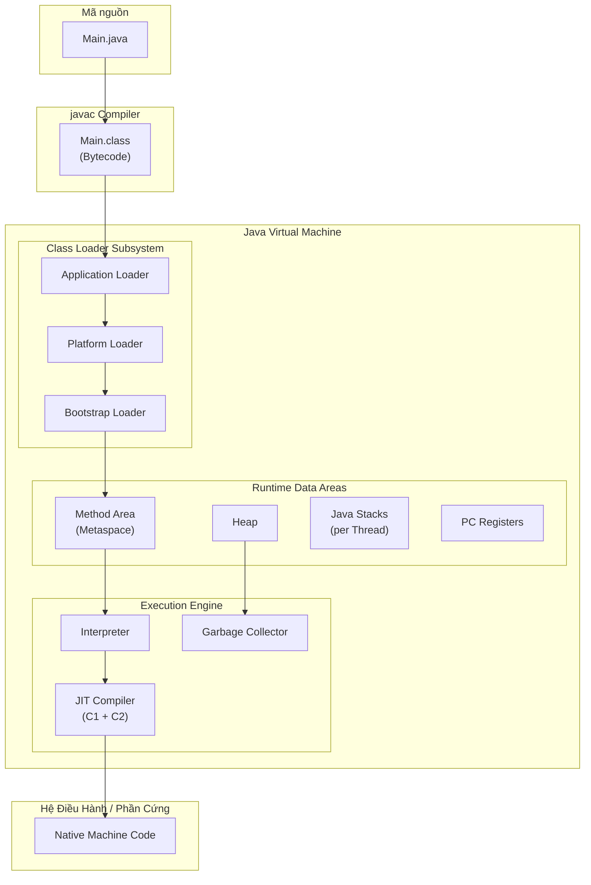

# Metadata
- **Document ID**: DSA-03-01
- **Version**: 1.0
- **Prerequisites**: DSA-01-03 (Environment Setup Java 21)
- **Learning Objectives**: Hiểu kiến trúc tổng thể của Java Virtual Machine (JVM), bao gồm Class Loader Subsystem, Runtime Data Areas, và Execution Engine. Nắm rõ cách bytecode được nạp, xác minh, và thực thi trên các nền tảng phần cứng khác nhau.
- **Estimated Reading Time**: 65 phút
- **Difficulty**: Intermediate-Advanced
- **Dependencies**: Không có (None)
- **Keywords**: JVM Architecture, Class Loader, Bytecode, JIT Compiler, Interpreter, Runtime Data Areas, Method Area, Heap, Stack

---

# 1 Purpose
Mục đích của tài liệu này là cung cấp bản đồ tổng quan (Architectural Map) về JVM — "Hệ điều hành ảo" nơi mọi thuật toán Java thực sự chạy. Một Kỹ sư DSA cần hiểu JVM vì:
- Hiệu năng (Performance) của thuật toán bị ảnh hưởng trực tiếp bởi cách JVM quản lý bộ nhớ, biên dịch JIT, và thu gom rác (GC).
- Nhiều "bất ngờ" về benchmark (ví dụ: thuật toán $\mathcal{O}(N)$ chạy chậm hơn $\mathcal{O}(N \log N)$) chỉ giải thích được khi hiểu JVM internals.

---

# 2 Motivation
Java được quảng cáo là "Write Once, Run Anywhere" (Viết một lần, chạy mọi nơi). Nhưng câu hỏi lớn hơn cho Kỹ sư là: **Run HOW?** (Chạy NHƯ THẾ NÀO?). Khi bạn gõ `javac Main.java` rồi `java Main`, một chuỗi quy trình phức tạp diễn ra bên trong:
1. **Compiler** (`javac`): Chuyển mã nguồn `.java` thành Bytecode `.class`.
2. **Class Loader**: Nạp file `.class` vào bộ nhớ JVM.
3. **Bytecode Verifier**: Kiểm tra tính hợp lệ, an toàn kiểu (Type safety).
4. **Interpreter**: Thực thi bytecode từng dòng.
5. **JIT Compiler**: Phát hiện "Hot code" (Code chạy nhiều lần) và biên dịch trực tiếp thành Machine Code (Mã máy gốc) để tăng tốc.

---

# 3 Mathematical Foundation
Hiệu năng thuật toán trên JVM có thể được mô hình hóa:
$$T_{\text{actual}} = T_{\text{algorithmic}} \times C_{\text{JVM}}$$
Trong đó:
- $T_{\text{algorithmic}}$ là Time Complexity lý thuyết ($\mathcal{O}(N \log N)$, v.v.).
- $C_{\text{JVM}}$ là hệ số nhân của JVM, bao gồm: Overhead Interpretation, JIT Compilation latency, GC pause time, Object Header overhead, Cache locality.

Mục tiêu tối ưu hóa: Giảm $C_{\text{JVM}}$ càng gần $1$ càng tốt (Lý tưởng: JVM chạy nhanh bằng C/C++ native code).

---

# 4 Core Theory
## Kiến trúc JVM gồm 3 hệ thống con chính:

### 4.1 Class Loader Subsystem (Hệ thống Nạp Lớp)
Chịu trách nhiệm tìm kiếm, đọc, và nạp file `.class` vào bộ nhớ JVM.

**3 Giai đoạn (Phases):**
1. **Loading** (Nạp): Đọc bytecode từ đĩa/mạng. Có 3 loại Class Loader phân cấp:
   - **Bootstrap Class Loader**: Nạp các lớp cốt lõi JDK (`java.lang.Object`, `java.util.ArrayList`). Viết bằng C/C++.
   - **Platform Class Loader** (trước đây là Extension): Nạp các Module nền tảng (JDK 9+).
   - **Application Class Loader**: Nạp các lớp của ứng dụng (code bạn viết) từ Classpath.
2. **Linking** (Liên kết):
   - **Verification** (Xác minh): Kiểm tra bytecode hợp lệ (Không truy cập ngoài mảng, không ép kiểu sai).
   - **Preparation** (Chuẩn bị): Cấp phát bộ nhớ cho biến static, gán giá trị mặc định (0, null, false).
   - **Resolution** (Phân giải): Chuyển đổi Symbolic Reference (Tên lớp dạng chuỗi) thành Direct Reference (Địa chỉ bộ nhớ).
3. **Initialization** (Khởi tạo): Chạy Static Initializer Block (`static { ... }`) và gán giá trị thực cho biến static.

**Nguyên tắc Delegation (Ủy quyền):** Khi Application Loader được yêu cầu nạp lớp `X`, nó KHÔNG tự nạp mà hỏi Parent (Platform Loader) trước. Parent hỏi Bootstrap trước. Chỉ khi Bootstrap không tìm thấy, yêu cầu mới trả về cho tầng con xử lý. Đây là **Parent-First Delegation Model**.

### 4.2 Runtime Data Areas (Vùng Dữ liệu Chạy)
JVM chia bộ nhớ thành các vùng riêng biệt:

| Vùng | Chia sẻ Thread? | Nội dung | GC? |
|---|---|---|---|
| **Method Area** (Metaspace từ Java 8) | Có | Class metadata, static variables, constant pool | Có |
| **Heap** | Có | Tất cả Object instances và Arrays | Có |
| **Java Stack** (mỗi Thread 1 cái) | Không | Stack Frames (biến cục bộ, toán hạng, return address) | Không |
| **PC Register** (mỗi Thread 1 cái) | Không | Địa chỉ bytecode đang thực thi | Không |
| **Native Method Stack** | Không | Stack cho các hàm gọi qua JNI (C/C++) | Không |

### 4.3 Execution Engine (Máy Thực thi)
- **Interpreter**: Đọc bytecode, tra bảng lệnh (Opcode table), thực thi từng lệnh. Chậm nhưng khởi động nhanh.
- **JIT Compiler (C1/C2)**: 
  - **C1 (Client Compiler)**: Biên dịch nhanh, tối ưu nhẹ. Dùng cho giai đoạn khởi động.
  - **C2 (Server Compiler)**: Biên dịch chậm hơn, tối ưu cực mạnh (Loop unrolling, Escape analysis, Inlining). Dùng cho Hot code.
  - **Tiered Compilation** (Java 21 mặc định): Kết hợp C1 → C2 tự động.
- **Garbage Collector**: Thu gom rác (Đã trình bày ở DSA-03-03).

---

# 5 Visual Explanation



---

# 6 Java Implementation
Minh họa các vùng bộ nhớ JVM thông qua code:

```java
public class JVMMemoryDemo {
    // ===== METHOD AREA (Metaspace) =====
    // Biến static nằm trong Method Area
    private static final int CONSTANT = 42; // Constant Pool
    private static int counter = 0;         // Static Variable

    // ===== HEAP =====
    // Mọi Object được tạo bằng 'new' đều nằm trên Heap
    private int[] data; // Reference trên Stack, Array trên Heap

    public JVMMemoryDemo(int size) {
        this.data = new int[size]; // Cấp phát Heap: 16 + 4*size bytes
    }

    // ===== JAVA STACK =====
    // Mỗi lời gọi hàm tạo 1 Stack Frame
    public int compute(int n) {
        // Biến 'n' và 'result' nằm trên Stack Frame hiện tại
        int result = 0;
        for (int i = 0; i < n; i++) {
            result += data[i]; // Truy cập Heap thông qua Reference trên Stack
        }
        return result;
    }

    // ===== NATIVE METHOD STACK =====
    // Các hàm native gọi thông qua JNI
    // System.arraycopy() là một ví dụ (Cài đặt bằng C)
    public void nativeExample() {
        int[] src = {1, 2, 3};
        int[] dest = new int[3];
        System.arraycopy(src, 0, dest, 0, 3); // Gọi Native Method
    }

    public static void main(String[] args) {
        // PC Register: Lưu địa chỉ bytecode hiện tại của main thread
        JVMMemoryDemo demo = new JVMMemoryDemo(1000);
        System.out.println(demo.compute(1000));
    }
}
```

---

# 7 Step-by-Step Execution
Khi bạn chạy `java JVMMemoryDemo`:

1. **JVM khởi động**: Tạo Main Thread, cấp phát Heap (mặc định 256MB), Stack (mặc định 1MB/thread).
2. **Class Loading**: Application Loader tìm `JVMMemoryDemo.class` trên Classpath. Nạp bytecode vào Method Area.
3. **Linking**: Verifier kiểm tra bytecode hợp lệ. Preparation cấp bộ nhớ cho `counter` (gán = 0) và `CONSTANT` (gán = 42).
4. **Initialization**: Chạy Static Initializer (nếu có). Gán `counter = 0`.
5. **Execution**: Interpreter bắt đầu từ `main()`:
   - Tạo Stack Frame cho `main()`. PC Register trỏ tới bytecode `new JVMMemoryDemo`.
   - Cấp phát Object `demo` trên Heap. Reference `demo` lưu trên Stack.
   - Gọi `compute(1000)`: Tạo Stack Frame mới đè lên. PC Register chuyển sang method `compute`.
6. **JIT Compilation**: Nếu `compute()` được gọi hơn 10,000 lần (Default threshold), C2 Compiler biên dịch nó thành Machine Code gốc, thay thế Interpreter.

---

# 8 Complexity Analysis
**Tác động của JVM Architecture lên Algorithm Performance:**

| Yếu tố JVM | Tác động | Chi phí ẩn |
|---|---|---|
| Object Header | Mỗi Object tối thiểu 16 bytes | Space tăng $5 \times$ so với Primitive |
| Array Bounds Check | JVM kiểm tra Index hợp lệ MỖI lần truy cập | Tăng hằng số Time |
| Interpreter (Cold start) | 10-100x chậm hơn JIT-compiled code | Startup latency |
| JIT Compilation | Biên dịch Hot code thành Native | Giảm hằng số Time sau warmup |
| GC Pause | Stop-The-World pause từ vài ms đến vài giây | Tail latency spike |
| Class Loading | Nạp lớp lần đầu tốn I/O đĩa | Cold path latency |

---

# 9 JVM Analysis
## Bytecode Analysis
Công cụ `javap` cho phép xem bytecode của file `.class`:

```bash
javap -c -verbose JVMMemoryDemo.class
```

Ví dụ bytecode cho phép cộng `a + b`:
```
iload_1       // Đẩy biến cục bộ 'a' (index 1) lên Operand Stack
iload_2       // Đẩy biến cục bộ 'b' (index 2) lên Operand Stack
iadd          // Pop 2 giá trị, cộng lại, Push kết quả
istore_3      // Pop kết quả, lưu vào biến cục bộ 'c' (index 3)
```

Mỗi lệnh bytecode (Opcode) có kích thước 1 byte (Do đó gọi là "Byte"-code). Tổng cộng có 256 opcodes khả dụng.

## Stack-based vs Register-based
JVM sử dụng kiến trúc **Stack-based** (Dựa trên ngăn xếp toán hạng) thay vì Register-based (Dựa trên thanh ghi CPU) như Dalvik (Android cũ). Ưu điểm: Đơn giản, dễ di chuyển đa nền tảng. Nhược điểm: Nhiều lệnh Push/Pop hơn so với Register → JIT Compiler phải tối ưu hóa mạnh tay.

---

# 10 OpenJDK Analysis
## HotSpot JVM (JVM mặc định trong OpenJDK)
HotSpot JVM sử dụng Tiered Compilation với 5 tầng (Levels):
- **Level 0**: Interpreter (Không tối ưu).
- **Level 1**: C1 Compiled, Simple (Biên dịch cơ bản, không profiling).
- **Level 2**: C1 Compiled, Limited Profiling.
- **Level 3**: C1 Compiled, Full Profiling (Thu thập dữ liệu để C2 dùng).
- **Level 4**: C2 Compiled, Fully Optimized (Tối ưu tối đa: Inlining, Loop unrolling, Escape analysis, Vectorization).

Trong thực tế, hot method thường đi theo đường: Level 0 → Level 3 → Level 4.

## GraalVM và Ahead-of-Time (AOT) Compilation
GraalVM cho phép biên dịch Java thành Native Image (Không cần JVM). Ưu điểm: Startup time < 10ms. Nhược điểm: Mất khả năng JIT Optimization tại Runtime, hạn chế Reflection.

---

# 11 Production Usage
**Microservices và JVM Warm-up:**
Khi một Microservice Java khởi động trong Kubernetes, nó mất khoảng 10-30 giây để JIT Compiler "làm nóng" (Warm up) các Hot methods. Trong thời gian này, thuật toán chạy trên Interpreter, chậm gấp 10-100 lần. Nếu Kubernetes Health Check timeout $< 30$ giây, Pod sẽ bị KILL trước khi kịp warm up → Vòng lặp CrashLoopBackOff vô tận.

**Giải pháp:**
- Tăng `initialDelaySeconds` của Readiness Probe.
- Sử dụng CDS (Class Data Sharing) để giảm Class Loading time.
- Sử dụng CRaC (Coordinated Restore at Checkpoint) để snapshot trạng thái JVM đã warm up.

---

# 12 Design Decisions
**Tại sao Java chọn Bytecode + JVM thay vì biên dịch thẳng ra Machine Code?**
1. **Portability (Tính di động)**: Bytecode chạy trên mọi nền tảng có JVM (Windows, Linux, macOS, ARM, x86).
2. **Security (An toàn)**: Bytecode Verifier ngăn chặn mã độc trước khi thực thi.
3. **Runtime Optimization**: JIT Compiler tối ưu DỰA TRÊN dữ liệu thực tế tại Runtime (Ví dụ: nếu 99% thời gian `instanceof` check trả về `true`, JIT sẽ inline-cache trường hợp phổ biến).
4. **Trade-off**: Đổi một chút Startup time (Chậm hơn C++) lấy rất nhiều Developer Productivity (Không cần quản lý Memory thủ công).

---

# 13 Common Bugs
20 lỗi phổ biến liên quan đến JVM Architecture:
1. `ClassNotFoundException`: Class Loader không tìm thấy `.class` trên Classpath.
2. `NoClassDefFoundError`: Lớp tồn tại lúc Compile nhưng không có lúc Runtime.
3. `StackOverflowError`: Đệ quy quá sâu, vượt Stack size mặc định 1MB.
4. `OutOfMemoryError: Java heap space`: Heap đầy, GC không giải phóng được.
5. `OutOfMemoryError: Metaspace`: Nạp quá nhiều Class (thường do Dynamic Proxy hoặc ClassLoader leak).
6. Lỗi hiệu năng do JIT chưa warm up (First request chậm gấp 100x).
7. Class Loading Deadlock: 2 ClassLoader chờ nhau (A đợi B nạp xong, B đợi A).
8. Lỗi `ClassCastException` do 2 ClassLoader nạp cùng 1 lớp nhưng tạo ra 2 bản khác nhau.
9. Sử dụng `-Xss` quá nhỏ (256K) cho thuật toán đệ quy phức tạp.
10. Sử dụng `-Xmx` quá lớn (vd: 32GB) trên JVM 64-bit làm GC Pause time tăng vọt.
11. Không sử dụng `-XX:+UseCompressedOops` khi Heap < 32GB (Lãng phí Reference size).
12. Quên `-server` flag (Mặc định trên 64-bit, nhưng 32-bit JVM dùng `-client` Compiler kém).
13. Static variable giữ Reference tới Object lớn → Memory Leak vĩnh viễn (GC không dọn Static).
14. Finalizer method (`finalize()`) delay GC và gây Memory leak.
15. Reflection API bypass Bytecode Verification, có thể gọi Private method.
16. Dùng `Runtime.getRuntime().exec()` tạo Process mới khi nên dùng Thread.
17. Khởi tạo quá nhiều Thread (Mỗi Thread tốn 1MB Stack) → `OutOfMemoryError: unable to create new native thread`.
18. Không đặt `-XX:+HeapDumpOnOutOfMemoryError` để debug sự cố Production.
19. Sử dụng `System.gc()` để ép GC chạy (JVM có thể bỏ qua, hoặc gây Stop-The-World pause bất ngờ).
20. Serialize Object chứa Transient field nhưng quên đánh dấu `transient`.

---

# 14 Edge Cases
30 trường hợp ngoại lệ:
1. JVM khởi động nhưng không tìm thấy `java.lang.Object` (Bootstrap Loader lỗi).
2. Bytecode bị chỉnh sửa thủ công (Tampered) → Verifier từ chối.
3. ClassLoader nạp class từ mạng (URL ClassLoader) nhưng kết nối bị đứt giữa chừng.
4. Stack Frame chứa Object Reference tới Heap, nhưng GC di chuyển Object (GC cập nhật Reference tự động).
5. Method Area (Metaspace) bị đầy do ứng dụng dùng Groovy/Scala sinh class động liên tục.
6. JIT Compiler quyết định "De-optimize" (Trả code từ Compiled về Interpreter) khi phát hiện giả thiết Speculative optimization sai.
7. Native Method crash (Segmentation Fault trong C code gọi qua JNI) → Toàn bộ JVM bị kill.
8. 2 Thread cùng gọi `Class.forName("X")` đồng thời → Class chỉ được nạp 1 lần (Thread-safe bởi synchronized trong ClassLoader).
9. Lớp có `static { throw new RuntimeException(); }` → Lỗi `ExceptionInInitializerError` khi nạp.
10. Bytecode version mới hơn JVM hiện tại (ví dụ: class compiled với Java 21 chạy trên JRE 17) → `UnsupportedClassVersionError`.
11. Heap size `-Xms` và `-Xmx` bằng nhau → Tránh GC phải Resize Heap, tốt cho Production.
12. JVM trên Container Docker không nhận biết giới hạn Memory → Dùng `-XX:+UseContainerSupport` (Mặc định từ JDK 10).
13. Method quá lớn (>8000 bytecodes) → JIT từ chối biên dịch.
14. Infinite loop trong Static Initializer → Thread Main bị treo vĩnh viễn.
15. Class path chứa JAR file bị corrupt → `ZipException` khi Class Loader đọc.
16. Hai module exports cùng package → `LayerInstantiationException` (Module System Java 9+).
17. Debug mode (`-agentlib:jdwp`) làm JIT Compiler hoạt động khác biệt, benchmark không chính xác.
18. `-XX:+PrintCompilation` cho thấy method bị compiled rồi deoptimized rồi compiled lại.
19. WeakReference bị GC thu gom giữa lúc code đang sử dụng → NullPointerException.
20. PermGen space (trước Java 8) bị đầy khi Redeploy ứng dụng web nhiều lần trên Tomcat.
21. JVM chạy trên 32-bit OS chỉ có tối đa ~1.5GB Heap.
22. Compressed Oops bị tắt khi Heap > 32GB → Reference size tăng từ 4 lên 8 bytes.
23. TLAB (Thread Local Allocation Buffer) hết → Thread phải cạnh tranh CAS lock trên Heap chung.
24. Code Cache đầy → JIT ngừng biên dịch → Performance giảm đột ngột. Dùng `-XX:ReservedCodeCacheSize`.
25. Xử lý exception (`try-catch`) KHÔNG ảnh hưởng performance nếu exception KHÔNG được ném. Chỉ tốn kém khi thực sự throw.
26. `invokedynamic` bytecode (Dùng cho Lambda) có overhead khác so với `invokevirtual` truyền thống.
27. Class unloading chỉ xảy ra khi ClassLoader bị GC → Static singleton vĩnh viễn tồn tại.
28. ZGC (Java 21) có Max pause < 1ms nhưng throughput thấp hơn G1GC 5-10%.
29. AOT compiled code (GraalVM Native Image) không hỗ trợ dynamic class loading.
30. JVM trên ARM (Apple M1/M2) có JIT khác biệt so với x86, benchmark không so sánh trực tiếp được.

---

# 15 Optimization Techniques
- **JVM Flag Tuning**: `-Xms` = `-Xmx` (Tránh Heap resize), `-XX:+UseG1GC` (Cân bằng Throughput và Latency).
- **Class Data Sharing (CDS)**: Lưu trữ Class metadata đã nạp vào Shared Archive, giảm Startup time 30-50%.
- **Ahead-of-Time Compilation**: GraalVM Native Image cho Serverless Functions (AWS Lambda), giảm Cold Start từ 5 giây xuống 50ms.

---

# 16 Best Practices
- Luôn chạy ứng dụng Production với flag `-server` (Mặc định trên 64-bit JVM).
- Đặt `-XX:+HeapDumpOnOutOfMemoryError -XX:HeapDumpPath=/var/log/` để có Heap Dump khi sập.
- Sử dụng JFR (Java Flight Recorder) tích hợp sẵn trong OpenJDK để giám sát JIT Compilation, GC, và Thread hoạt động.

---

# 17 Benchmark
Đo tốc độ trước và sau khi JIT Compiler tối ưu:

```java
public class JITWarmupBenchmark {
    public static void main(String[] args) {
        int[] arr = new int[1_000_000];
        for (int i = 0; i < arr.length; i++) arr[i] = i;

        // Cold run (Interpreter)
        long t1 = System.nanoTime();
        long sum1 = sumArray(arr);
        long cold = System.nanoTime() - t1;

        // Warm up JIT
        for (int i = 0; i < 10_000; i++) {
            sumArray(arr);
        }

        // Hot run (JIT Compiled)
        long t2 = System.nanoTime();
        long sum2 = sumArray(arr);
        long hot = System.nanoTime() - t2;

        System.out.printf("Cold: %d ns, Hot: %d ns, Speedup: %.1fx%n", cold, hot, (double) cold / hot);
    }

    static long sumArray(int[] arr) {
        long sum = 0;
        for (int v : arr) sum += v;
        return sum;
    }
}
```

---

# 18 Unit Testing
Test để phát hiện Class Loading issues:

```java
@Test
void testClassLoaderHierarchy() {
    ClassLoader appLoader = JVMMemoryDemo.class.getClassLoader();
    ClassLoader platformLoader = appLoader.getParent();
    ClassLoader bootstrapLoader = platformLoader.getParent();

    assertNotNull(appLoader, "Application ClassLoader phải tồn tại");
    assertNotNull(platformLoader, "Platform ClassLoader phải tồn tại");
    assertNull(bootstrapLoader, "Bootstrap ClassLoader trả về null (Vì viết bằng C)");
}
```

---

# 19 Interview Questions
20 câu hỏi về JVM Architecture:

**Easy**
1. JVM là gì? Tại sao Java cần JVM?
2. Bytecode là gì? Nó khác Machine Code như thế nào?
3. Kể tên 3 loại ClassLoader trong Java.
4. Heap và Stack khác nhau ở điểm nào?
5. JIT Compiler làm gì?

**Medium**
6. Giải thích Parent-First Delegation Model của ClassLoader.
7. Method Area (Metaspace) chứa những gì?
8. Tại sao Java không hỗ trợ Tail Call Optimization?
9. Tiered Compilation có mấy Level? Giải thích.
10. Khi nào JIT Compiler quyết định biên dịch một method?
11. `StackOverflowError` và `OutOfMemoryError` khác nhau thế nào?
12. Tại sao `-Xms` nên bằng `-Xmx` trong Production?
13. PC Register lưu trữ gì?
14. Native Method Stack dùng cho mục đích gì?
15. Giải thích hiện tượng JVM Warm-up.

**Hard & Senior**
16. Giải thích cơ chế Deoptimization trong JIT Compiler.
17. Bytecode Verification ngăn chặn những loại tấn công nào?
18. GraalVM Native Image khác biệt gì so với HotSpot JVM?
19. Tại sao Class Loading có thể gây Deadlock? Cho ví dụ.
20. Code Cache là gì? Điều gì xảy ra khi nó đầy?

---

# 20 Practice Problems Link
Xem toàn bộ 30 bài toán thực hành tại: [01-JVM-Architecture-Problems.md](01-JVM-Architecture-Problems.md).

---

# 21 Pattern Recognition
**Nhận diện vấn đề JVM trong Production:**
- Ứng dụng chậm khi mới khởi động → JIT chưa warm up.
- Ứng dụng chậm DẦN DẦN theo thời gian → Memory Leak hoặc GC overhead.
- Ứng dụng đột ngột chậm rồi nhanh trở lại → GC Stop-The-World pause.
- Ứng dụng crash với `OutOfMemoryError: Metaspace` → ClassLoader leak.

---

# 22 Real Case Study
**LinkedIn và JVM Tuning:**
LinkedIn xử lý hàng tỷ Request mỗi ngày trên hệ thống Java. Họ phát hiện rằng 40% latency spike (Đỉnh độ trễ) đến từ GC pause, không phải thuật toán chậm. Bằng cách chuyển từ CMS GC sang G1GC, tinh chỉnh `-XX:MaxGCPauseMillis=50`, và sử dụng TLAB size phù hợp, họ giảm P99 latency từ 200ms xuống 30ms. Bài học: **Tối ưu thuật toán $\mathcal{O}(N \log N)$ chỉ giải quyết 60% vấn đề. 40% còn lại là JVM tuning.**

---

# 23 Summary
JVM Architecture là nền tảng không thể thiếu cho bất kỳ Kỹ sư Java nào muốn vượt qua mức "Biết viết code" để đạt đến mức "Hiểu tại sao code chạy nhanh hay chậm". Class Loader, Runtime Data Areas, và Execution Engine là 3 trụ cột mà mọi tối ưu hóa thuật toán Java đều phải đi qua.

---

# 24 Checklist
- [ ] Vẽ được sơ đồ kiến trúc JVM 3 tầng (Class Loader, Runtime Data Areas, Execution Engine).
- [ ] Phân biệt rõ 5 vùng bộ nhớ Runtime Data Areas.
- [ ] Hiểu Tiered Compilation (Level 0-4) và tại sao JIT quan trọng.
- [ ] Biết cách dùng `javap` để xem Bytecode.
- [ ] Nắm được các JVM Flags thiết yếu cho Production.
