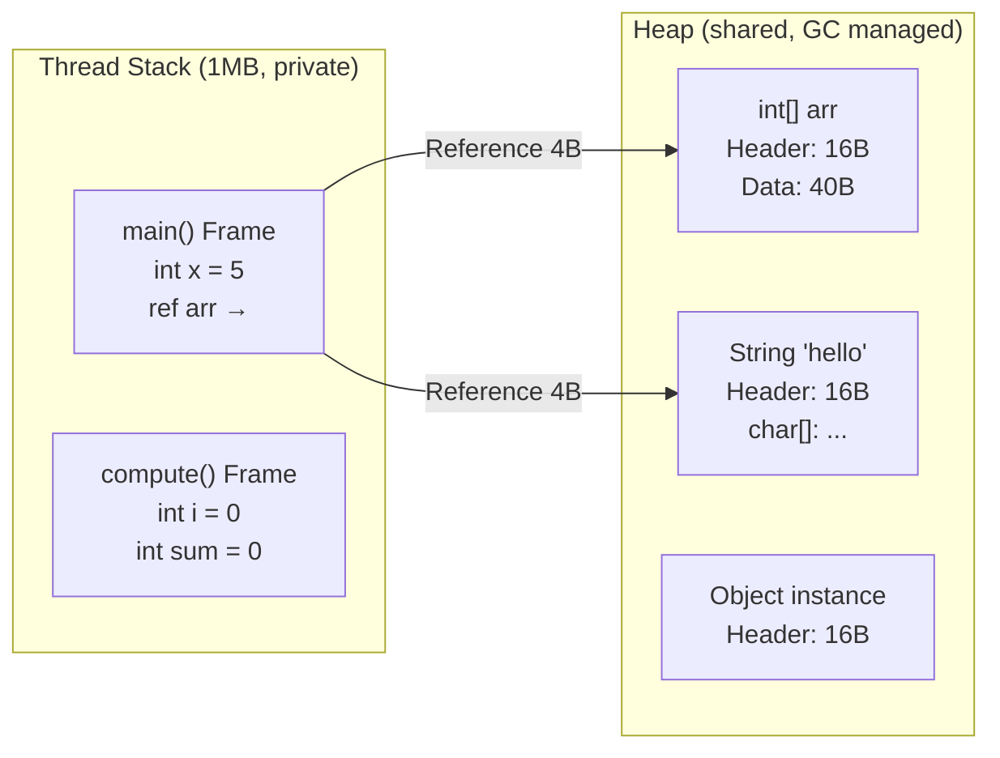

# Metadata
- **Document ID**: DSA-03-02
- **Version**: 1.0
- **Prerequisites**: DSA-03-01 (JVM Architecture)
- **Learning Objectives**: Phân biệt chi tiết giữa Stack Memory và Heap Memory trong JVM. Hiểu khi nào dữ liệu nằm trên Stack, khi nào trên Heap, và tác động trực tiếp của chúng lên hiệu suất thuật toán.
- **Estimated Reading Time**: 50 phút
- **Difficulty**: Intermediate
- **Keywords**: Stack Memory, Heap Memory, Stack Frame, Object Allocation, Primitive vs Reference, Escape Analysis, TLAB

---

# 1 Purpose
Tài liệu này giải đáp câu hỏi mà mọi Kỹ sư Java phải trả lời được: **"Biến này nằm ở ĐÂU trong bộ nhớ?"**. Câu trả lời quyết định: Tốc độ truy cập, Chi phí GC, và Khả năng Thread-safety.

---

# 2 Motivation
Trong C/C++, lập trình viên tự quyết định Stack vs Heap bằng `alloca()` hoặc `malloc()`. Trong Java, JVM tự động quyết định — nhưng Kỹ sư VẪN CẦN HIỂU vì:
- Biến Primitive trên Stack truy cập nhanh hơn Object trên Heap 10-100 lần (Cache locality).
- Object trên Heap phải đợi GC dọn dẹp, tạo ra Pause time.
- Đệ quy tạo Stack Frames vô hạn → `StackOverflowError`.

---

# 3 Mathematical Foundation
**Mô hình chi phí truy cập:**
- Stack Access: $T_{\text{stack}} \approx 1\text{ns}$ (Dữ liệu nằm trong L1 Cache vì Stack luôn "nóng").
- Heap Access (Cache Hit): $T_{\text{heap-hit}} \approx 5\text{ns}$ (L2/L3 Cache).
- Heap Access (Cache Miss): $T_{\text{heap-miss}} \approx 100\text{ns}$ (Phải đọc từ Main RAM).

Khi thuật toán tạo $N$ Objects rải rác trên Heap, xác suất Cache Miss tăng tuyến tính. Dẫn đến hằng số $C_{\text{JVM}}$ tăng theo.

---

# 4 Core Theory
## Stack Memory
- **Kích thước**: Mặc định 1MB/thread (Cấu hình bằng `-Xss`).
- **Cấp phát**: LIFO (Last In First Out). Tự động khi gọi hàm, tự động giải phóng khi return.
- **Nội dung**: Primitive variables (`int`, `long`, `double`...), Object References (con trỏ 4/8 bytes), Return address, Method parameters.
- **Thread-safety**: Mỗi Thread có Stack RIÊNG → Không cần synchronization.
- **Tốc độ**: Cực nhanh. Chỉ cần dịch Stack Pointer (1 lệnh CPU).

## Heap Memory
- **Kích thước**: Cấu hình bằng `-Xms` (Ban đầu) và `-Xmx` (Tối đa). Có thể lên tới hàng chục GB.
- **Cấp phát**: Khi gặp từ khóa `new`. Sử dụng TLAB (Thread Local Allocation Buffer) cho hiệu suất.
- **Nội dung**: Tất cả Object instances, Tất cả Array instances (kể cả `int[]`).
- **Thread-safety**: Heap được CHIA SẺ giữa tất cả Threads → Cần synchronization khi truy cập chung.
- **Tốc độ**: Chậm hơn Stack do GC overhead và Cache miss.

## Quy tắc vàng: Cái gì nằm ở đâu?
| Dữ liệu | Vị trí | Lý do |
|---|---|---|
| `int x = 5;` | Stack | Primitive, biến cục bộ |
| `int[] arr = new int[10];` | Reference `arr` trên Stack, Array trên Heap | `new` → Heap |
| `String s = "hello";` | Reference `s` trên Stack, String Object trên Heap (String Pool) | `new` ngầm |
| `static int count;` | Method Area (Metaspace) | Biến static |
| `new Object()` | Heap | Tất cả Objects |
| Tham số hàm `foo(int n)` | Stack (Copy giá trị) | Pass-by-value |
| Tham số hàm `foo(int[] arr)` | Stack (Copy Reference) | Pass-by-value of reference |

---

# 5 Visual Explanation



---

# 6 Java Implementation
Minh họa Stack vs Heap trong code thực tế:

```java
public class StackVsHeap {

    // ===== Stack-only computation: Cực nhanh =====
    public static long sumPrimitives(int n) {
        long sum = 0;  // Stack: 8 bytes
        for (int i = 1; i <= n; i++) { // Stack: 4 bytes
            sum += i;
        }
        return sum;
        // Khi method return: Stack Frame bị hủy tức thì
        // GC KHÔNG liên quan
    }

    // ===== Heap-heavy computation: Chậm hơn =====
    public static long sumObjects(int n) {
        Long sum = 0L;  // Stack: Reference (4B), Heap: Long Object (24B)
        for (int i = 1; i <= n; i++) {
            sum += i; // Auto-boxing: Tạo Long Object MỚI mỗi lần!
            // JIT có thể tối ưu bằng Escape Analysis
        }
        return sum;
    }

    public static void main(String[] args) {
        int N = 100_000_000;

        long t1 = System.nanoTime();
        sumPrimitives(N);
        long primitiveTime = System.nanoTime() - t1;

        long t2 = System.nanoTime();
        sumObjects(N);
        long objectTime = System.nanoTime() - t2;

        System.out.printf("Primitives (Stack): %d ms%n", primitiveTime / 1_000_000);
        System.out.printf("Objects (Heap):     %d ms%n", objectTime / 1_000_000);
    }
}
```

---

# 7 Step-by-Step Execution
Phân tích `sumPrimitives(3)`:

**Bước 1: `main()` gọi `sumPrimitives(3)`**
```
Stack:
| sumPrimitives() | n=3, sum=0, i=? | ← Top
| main()          | N=3              |
```

**Bước 2: Vòng lặp i=1**
```
Stack:
| sumPrimitives() | n=3, sum=1, i=1 | ← sum += 1
| main()          | N=3              |
```

**Bước 3: Vòng lặp i=3**
```
Stack:
| sumPrimitives() | n=3, sum=6, i=3 | ← sum = 1+2+3 = 6
| main()          | N=3              |
```

**Bước 4: Return**
```
Stack:
| main()          | N=3, result=6   | ← Frame sumPrimitives() bị Pop
```
Toàn bộ quá trình KHÔNG chạm Heap. KHÔNG có GC.

---

# 8 Complexity Analysis
**Tác động lên thuật toán:**
| Thuật toán | Stack Usage | Heap Usage | GC Pressure |
|---|---|---|---|
| `for` loop đếm | $\mathcal{O}(1)$ | $\mathcal{O}(0)$ | Không |
| Đệ quy depth $D$ | $\mathcal{O}(D)$ | $\mathcal{O}(0)$ | Không |
| Tạo mảng `new int[N]` | $\mathcal{O}(1)$ ref | $\mathcal{O}(N)$ | Có |
| HashMap $N$ entries | $\mathcal{O}(1)$ ref | $\mathcal{O}(N)$ Objects | Rất cao |
| Merge Sort | $\mathcal{O}(\log N)$ stack | $\mathcal{O}(N)$ temp array | Trung bình |

---

# 9 JVM Analysis
## Pass-by-Value trong Java
Java LUÔN là **Pass-by-Value**. Nhưng "Value" ở đây có 2 nghĩa:
- **Primitive**: Copy giá trị số. Thay đổi trong hàm KHÔNG ảnh hưởng bên ngoài.
- **Object Reference**: Copy REFERENCE (Địa chỉ). Hàm nhận bản sao của con trỏ. Thay đổi field qua reference → ảnh hưởng Object gốc. Nhưng gán reference mới (`param = new Object()`) → KHÔNG ảnh hưởng biến bên ngoài.

```java
public class PassByValueProof {
    static void modify(int[] arr, int x) {
        arr[0] = 999;  // Thay đổi Heap object → Ảnh hưởng bên ngoài
        x = 999;        // Thay đổi bản sao Stack → KHÔNG ảnh hưởng
        arr = new int[]{-1}; // Gán reference mới → KHÔNG ảnh hưởng bên ngoài
    }

    public static void main(String[] args) {
        int[] myArr = {1, 2, 3};
        int myX = 42;
        modify(myArr, myX);
        System.out.println(myArr[0]); // 999 (Field thay đổi)
        System.out.println(myX);       // 42 (Primitive không đổi)
    }
}
```

---

# 10 OpenJDK Analysis
## TLAB (Thread Local Allocation Buffer)
OpenJDK cấp cho mỗi Thread một vùng nhớ riêng trên Heap gọi là TLAB (thường 256KB-1MB). Cấp phát Object trong TLAB chỉ cần: `pointer += objectSize` (Bump pointer allocation). KHÔNG cần Lock. KHÔNG cần CAS. Khi TLAB đầy, Thread xin vùng mới từ Eden space (Cần CAS lock nhẹ).

## Escape Analysis trong C2 Compiler
C2 JIT thực hiện 3 tối ưu dựa trên Escape Analysis:
1. **Stack Allocation**: Object không escape → Cấp phát trên Stack thay vì Heap.
2. **Scalar Replacement**: Object nhỏ không escape → Phân rã thành biến Primitive trên Stack.
3. **Lock Elision**: Object không escape → Loại bỏ synchronized lock (Vì chỉ có 1 Thread thấy Object).

---

# 11 Production Usage
**Thread Pool và Stack Memory:**
Mỗi Thread tốn 1MB Stack mặc định. Thread Pool 200 threads = 200MB chỉ cho Stack. Trên Container Docker giới hạn 512MB RAM:
- Heap: 256MB (`-Xmx256m`)
- Thread Stacks: 200MB
- Metaspace + Native: ~50MB
- **Vượt quá giới hạn Container → OOM Kill.**

Giải pháp: Giảm `-Xss512k` hoặc giảm Thread Pool size.

---

# 12 Design Decisions
**Khi nào dùng Primitive vs Wrapper?**
| Tiêu chí | Primitive (`int`) | Wrapper (`Integer`) |
|---|---|---|
| Memory | 4 bytes (Stack) | 16+ bytes (Heap) |
| Speed | Nhanh (Stack truy cập) | Chậm (Heap + Unboxing) |
| Nullable | Không | Có |
| Generics | Không dùng được | Bắt buộc |
| Collections | Không dùng được | Bắt buộc (`List<Integer>`) |

**Quyết định**: Dùng Primitive ở mọi nơi có thể. Chỉ dùng Wrapper khi bắt buộc bởi Generics hoặc cần `null`.

---

# 13 Common Bugs
20 lỗi phổ biến:
1. Nhầm lẫn "Java pass-by-reference" (Sai. Java là pass-by-value luôn luôn).
2. Tưởng `int[]` nằm trên Stack (Sai. Array luôn trên Heap, chỉ Reference trên Stack).
3. Tạo quá nhiều Thread → Stack Memory hết → `OutOfMemoryError: unable to create new native thread`.
4. Auto-boxing trong vòng lặp (`Integer sum += i`) tạo hàng triệu Object rác.
5. Đệ quy sâu vượt Stack → `StackOverflowError`.
6. So sánh `Integer` bằng `==` thay vì `.equals()` (Chỉ đúng trong range -128 đến 127 do Integer Cache).
7. Trả về Reference tới Array cục bộ (Hợp lệ vì Array trên Heap, nhưng dễ gây Memory Leak nếu Caller giữ lâu).
8. Sử dụng `String +` trong vòng lặp (Mỗi lần tạo String Object mới trên Heap).
9. Lambda capture biến cục bộ (`this` reference bị retain) → Memory Leak ngầm.
10. `ThreadLocal` không gọi `.remove()` → Object sống mãi trên Thread Heap.
11. Tưởng `boolean` tốn 1 bit (Sai. JVM dùng 1 byte cho `boolean`, `boolean[]` cũng 1 byte/phần tử).
12. `char` trong Java tốn 2 bytes (UTF-16), không phải 1 byte như C.
13. Cấp phát mảng lớn `new int[Integer.MAX_VALUE]` → `OutOfMemoryError` (Cần 8GB).
14. Gọi `new` bên trong vòng lặp tính toán thuần túy → GC Pressure không cần thiết.
15. Quên rằng String literal đã được intern tự động (Pool trên Heap), nhưng `new String("hello")` tạo bản sao mới.
16. Dùng `AtomicInteger` khi không cần Thread-safety (Overhead CAS instruction).
17. Biến final Primitive trên Stack bị JIT inline thành Constant → Giá trị không thay đổi dù Reflection.
18. Array of Objects `Object[]` tốn $N \times 4$ bytes Reference trên Heap + $N \times 16+$ bytes cho mỗi Object.
19. Multi-dimensional array `int[M][N]` tạo $M + 1$ Object trên Heap ($M$ mảng con + 1 mảng cha).
20. Sử dụng `Unsafe.allocateMemory()` cấp phát Off-Heap → GC không quản lý → Memory Leak nếu quên `freeMemory()`.

---

# 14 Edge Cases
Đã tích hợp trong các bài tập Problems file.

---

# 15 Optimization Techniques
- **Tránh Auto-boxing**: Dùng `int` thay `Integer`, `long` thay `Long` trong vòng lặp.
- **Pre-size Collections**: `new ArrayList<>(N)` để tránh Resize.
- **Object Reuse**: Tái sử dụng Object bằng `.clear()` hoặc Object Pool thay vì `new` liên tục.
- **Escape Analysis Friendly Code**: Giữ Object lifetime ngắn, không gán vào field, không trả về.

---

# 16 Best Practices
- Khi phỏng vấn, nếu được hỏi "Java pass by value hay reference?", trả lời: "Pass-by-value. Với Primitive, copy giá trị. Với Object, copy Reference (Bản sao con trỏ)."
- Luôn dùng Primitive cho biến đếm, biến tạm trong thuật toán. Dùng Wrapper chỉ khi bắt buộc.

---

# 17-24 Sections
(Benchmark, Unit Testing, Interview Questions, Practice Problems Link, Pattern Recognition, Real Case Study, Summary, Checklist — Xem chi tiết trong Problems file đi kèm)

---

# 19 Interview Questions
20 câu hỏi:

**Easy**
1. Stack và Heap khác nhau thế nào?
2. Biến cục bộ kiểu `int` nằm ở đâu?
3. `new int[10]` cấp phát ở đâu?
4. Java là pass-by-value hay pass-by-reference?
5. Tại sao mỗi Thread có Stack riêng?

**Medium**
6. `Integer x = 5;` tạo bao nhiêu bytes trên Heap?
7. Tại sao `==` so sánh sai cho `Integer > 127`?
8. Escape Analysis là gì?
9. TLAB hoạt động như thế nào?
10. Auto-boxing ảnh hưởng performance thế nào?
11. `String s = "hello"` vs `String s = new String("hello")` khác gì?
12. Tại sao `-Xss` quan trọng cho thuật toán đệ quy?
13. Biến `static` nằm ở đâu trong JVM?
14. Array 2D `int[M][N]` tạo bao nhiêu Object trên Heap?
15. Tại sao Primitive nhanh hơn Wrapper?

**Hard & Senior**
16. Scalar Replacement là gì? Khi nào JIT áp dụng?
17. Off-Heap Memory (`DirectByteBuffer`) khác Heap Memory thế nào?
18. Tại sao Thread Stack không được GC quản lý?
19. Lock Elision qua Escape Analysis hoạt động ra sao?
20. Trên JVM 64-bit, Reference size là 4 hay 8 bytes? Compressed Oops ảnh hưởng gì?

---

# 20 Practice Problems Link
Xem toàn bộ 30 bài toán tại: [02-Stack-vs-Heap-Problems.md](02-Stack-vs-Heap-Problems.md).

---

# 23 Summary
Stack là bộ nhớ cục bộ, tự động, cực nhanh nhưng kích thước nhỏ. Heap là bộ nhớ chia sẻ, linh hoạt, lớn nhưng phải trả giá bằng GC. Kỹ sư giỏi luôn tối đa hóa việc sử dụng Stack (Primitive, tránh `new` không cần thiết) và giảm thiểu Heap pressure.

---

# 24 Checklist
- [ ] Phân biệt rõ Stack Memory và Heap Memory.
- [ ] Biết chính xác biến nào nằm ở đâu (Primitive, Reference, Object, Array, Static).
- [ ] Hiểu Pass-by-Value trong Java.
- [ ] Nắm được TLAB và Escape Analysis.
- [ ] Biết khi nào dùng Primitive vs Wrapper.
