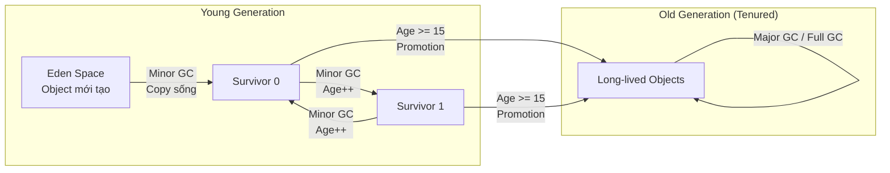

# Metadata
- **Document ID**: DSA-03-03
- **Version**: 1.0
- **Prerequisites**: DSA-03-01 (JVM Architecture), DSA-03-02 (Stack vs Heap)
- **Learning Objectives**: Hiểu nguyên lý hoạt động của Garbage Collector (GC) trong JVM, bao gồm Mark-and-Sweep, Generational Collection, và các thuật toán GC hiện đại (G1GC, ZGC, Shenandoah). Đánh giá được tác động của GC lên hiệu suất thuật toán.
- **Estimated Reading Time**: 65 phút
- **Difficulty**: Advanced
- **Keywords**: Garbage Collection, Mark-and-Sweep, Generational GC, G1GC, ZGC, Stop-The-World, GC Roots, Young Generation, Old Generation, Eden, Survivor

---

# 1 Purpose
Garbage Collection (Thu gom rác) là cơ chế tự động quản lý bộ nhớ Heap trong JVM. Kỹ sư DSA cần hiểu GC vì:
- GC Pause (Thời gian tạm dừng) có thể biến thuật toán $\mathcal{O}(N)$ chạy nhanh thành ứng dụng lag đột ngột hàng trăm mili-giây.
- Thuật toán tạo quá nhiều Object ngắn hạn (Short-lived objects) gây áp lực GC (GC Pressure), làm tăng tần suất Stop-The-World pause.
- Hiểu GC giúp viết thuật toán "GC-friendly" — ít tạo rác hơn, ít gây Pause hơn.

---

# 2 Motivation
Hãy tưởng tượng một hệ thống Giao dịch Chứng khoán (Stock Trading) xử lý hàng triệu lệnh mua/bán mỗi giây. Mỗi lệnh tạo ra nhiều Object tạm (Order, Price, Timestamp). GC phải dọn dẹp hàng triệu Object rác mỗi giây. Nếu GC quyết định chạy "Full GC" tại đúng thời điểm thị trường biến động mạnh, toàn bộ ứng dụng bị đóng băng (Freeze) vài giây → Mất hàng triệu đô la do lệnh bị delay.

Đây là lý do tại sao hệ thống Low-latency (Độ trễ thấp) dùng các kỹ thuật Zero-GC hoặc các GC hiện đại như ZGC có pause $< 1\text{ms}$.

---

# 3 Mathematical Foundation
**Throughput vs Latency Trade-off:**
- **Throughput (Thông lượng)**: Phần trăm thời gian CPU dành cho ứng dụng (không phải GC). Mục tiêu: $> 95\%$.
$$\text{Throughput} = \frac{T_{\text{app}}}{T_{\text{app}} + T_{\text{gc}}} \times 100\%$$
- **Latency (Độ trễ)**: Thời gian Pause tối đa của GC. Mục tiêu: $< 10\text{ms}$ cho Real-time, $< 200\text{ms}$ cho Web.
- **Footprint (Dung lượng)**: Tổng RAM mà JVM sử dụng.

**Quy tắc: Không thể tối ưu cả 3 cùng lúc.** Phải chọn 2 trong 3 (Giống CAP Theorem).

---

# 4 Core Theory
## 4.1 Khi nào Object trở thành Rác (Garbage)?
Object trở thành rác khi KHÔNG CÒN bất kỳ Reference chain nào từ **GC Roots** tới nó.

**GC Roots** (Gốc rác) bao gồm:
1. Biến cục bộ (Local variables) trên tất cả Java Stack Frames đang hoạt động.
2. Biến Static (Static fields) trong tất cả các Class đã nạp.
3. Tham chiếu JNI (Native method references).
4. Monitor Locks (Synchronized objects).
5. Thread objects đang sống.

GC sử dụng thuật toán **Reachability Analysis** (Phân tích Khả năng Truy cập): Bắt đầu từ mọi GC Root, duyệt đồ thị Reference (Graph Traversal — tương tự BFS/DFS). Object nào KHÔNG được visit → Rác.

## 4.2 Thuật toán Mark-and-Sweep (Đánh dấu và Quét)
**Phase 1 — Mark (Đánh dấu)**: Duyệt từ GC Roots, đánh dấu (Mark) tất cả Object "Reachable" (Có thể truy cập).
**Phase 2 — Sweep (Quét)**: Quét toàn bộ Heap, giải phóng bộ nhớ của Object KHÔNG được Mark.
**Vấn đề**: Sau Sweep, Heap bị phân mảnh (Fragmentation) — Các vùng trống nằm rải rác, không liền mạch.
**Phase 3 — Compact (Nén — Tùy chọn)**: Di chuyển (Move) các Object sống lại sát nhau, tạo vùng trống liền mạch lớn. Tốn kém nhưng cải thiện Cache locality và cho phép Bump-pointer allocation.

## 4.3 Generational Hypothesis (Giả thuyết Thế hệ)
**Quan sát thực nghiệm**: Đại đa số Object (> 95%) chết rất trẻ (Die young). Chỉ một số ít sống lâu.

Dựa trên giả thuyết này, JVM chia Heap thành các Thế hệ (Generations):
| Thế hệ | Kích thước | Chứa | GC |
|---|---|---|---|
| **Young Generation** | ~1/3 Heap | Object mới tạo | Minor GC (Nhanh, thường xuyên) |
| → **Eden** | ~80% Young | Object vừa `new` | |
| → **Survivor 0 (S0)** | ~10% Young | Object sống sót Minor GC lần 1+ | |
| → **Survivor 1 (S1)** | ~10% Young | Object sống sót Minor GC (đổi chỗ S0↔S1) | |
| **Old Generation (Tenured)** | ~2/3 Heap | Object sống đủ lâu (vượt Threshold) | Major GC / Full GC (Chậm, hiếm) |

**Quá trình Minor GC:**
1. Object mới được cấp phát vào **Eden**.
2. Khi Eden đầy → Minor GC: Mark-and-Copy tất cả Object sống từ Eden sang **Survivor** (S0 hoặc S1).
3. Object đã ở Survivor bị tăng "Age" (Tuổi). Nếu Age vượt Threshold (mặc định 15) → Promoted (Thăng cấp) vào **Old Generation**.
4. Minor GC cực nhanh vì chỉ scan Young Gen (Nhỏ) và hầu hết Object đã chết.

---

# 5 Visual Explanation



---

# 6 Java Implementation
Minh họa GC Pressure và cách giảm thiểu:

```java
public class GCPressureDemo {

    // ===== BAD: Tạo hàng triệu Object rác =====
    public static long sumBad(int n) {
        Long sum = 0L; // Auto-boxing → Object mới mỗi phép cộng
        for (int i = 0; i < n; i++) {
            sum += i; // Unbox + Add + Box = new Long() mỗi lần!
        }
        return sum;
    }

    // ===== GOOD: Zero GC Pressure =====
    public static long sumGood(int n) {
        long sum = 0L; // Primitive trên Stack → Không tạo Object
        for (int i = 0; i < n; i++) {
            sum += i;
        }
        return sum;
    }

    public static void main(String[] args) {
        int N = 50_000_000;

        // Chạy với: java -verbose:gc GCPressureDemo
        System.out.println("=== BAD (Auto-boxing) ===");
        long t1 = System.nanoTime();
        sumBad(N);
        System.out.printf("Time: %d ms%n%n", (System.nanoTime() - t1) / 1_000_000);

        System.out.println("=== GOOD (Primitive) ===");
        long t2 = System.nanoTime();
        sumGood(N);
        System.out.printf("Time: %d ms%n", (System.nanoTime() - t2) / 1_000_000);
    }
}
```

---

# 7 Step-by-Step Execution
**Quá trình Minor GC khi `sumBad(10)` chạy:**

1. `new Long(0)` → Cấp phát vào Eden. Eden used: 24B.
2. `new Long(0+0=0)` → Eden: 48B. Object cũ (Long(0) ban đầu) trở thành rác.
3. `new Long(1)` → Eden: 72B. Object cũ thành rác.
4. ... Tiếp tục tạo Object rác.
5. Khi Eden đầy (~80% Young Gen): **Minor GC kích hoạt**.
6. GC scan Eden: Chỉ có 1 Object sống (Long hiện tại). Copy vào S0.
7. Toàn bộ Eden bị xóa sạch (Cực nhanh vì hầu hết đã chết).
8. Tiếp tục cấp phát Object mới vào Eden sạch.

**Với `sumGood(10)`**: KHÔNG có bước nào ở trên. Zero Object. Zero GC.

---

# 8 Complexity Analysis
**Chi phí GC phụ thuộc vào gì?**
| Yếu tố | Minor GC | Major/Full GC |
|---|---|---|
| Scan scope | Young Gen only | Entire Heap |
| Time | $\mathcal{O}(\text{Live Objects in Young})$ | $\mathcal{O}(\text{Live Objects in Heap})$ |
| Typical pause | 1-50 ms | 100-5000 ms |
| Frequency | Rất thường xuyên | Hiếm |
| Algorithm | Mark-and-Copy | Mark-Sweep-Compact |

**Bài học**: Giữ Object short-lived (Chết trẻ trong Young Gen) để Minor GC dọn nhanh. Tránh Promotion vào Old Gen.

---

# 9 JVM Analysis
## Các thuật toán GC trong JVM

### Serial GC (`-XX:+UseSerialGC`)
- Single-threaded. Đơn giản nhất.
- Stop-The-World cho cả Minor và Major GC.
- Dùng cho: Ứng dụng nhỏ, Single-core, Client apps.

### Parallel GC (`-XX:+UseParallelGC`)
- Multi-threaded GC. Mặc định trong JDK 8.
- Stop-The-World nhưng dùng nhiều Thread GC để giảm Pause time.
- Tối ưu cho: Throughput (Batch processing, ETL).

### G1GC (`-XX:+UseG1GC`)
- **Mặc định từ JDK 9+**. Chia Heap thành nhiều Region (~2048 regions).
- Mixed GC: Vừa thu gom Young, vừa thu gom một phần Old (Incremental).
- Mục tiêu: Pause time $< 200\text{ms}$ (`-XX:MaxGCPauseMillis=200`).
- Tối ưu cho: Web servers, Microservices, General-purpose.

### ZGC (`-XX:+UseZGC`)
- **Ultra-low latency**. Pause $< 1\text{ms}$ bất chấp Heap size (Kể cả 16TB).
- Concurrent: Hầu hết công việc GC diễn ra SONG SONG với ứng dụng.
- Sử dụng Colored Pointers (Con trỏ có màu) và Load Barriers.
- Tối ưu cho: Low-latency trading, Real-time systems.
- **Production-ready từ JDK 15+**. Recommended cho JDK 21.

### Shenandoah GC
- Tương tự ZGC nhưng phát triển bởi Red Hat (Không có trong Oracle JDK).
- Concurrent Compaction. Pause $< 10\text{ms}$.
- Dùng Brooks Forwarding Pointers.

---

# 10 OpenJDK Analysis
## G1GC Region-based Design
G1GC chia Heap thành $\sim2048$ Regions có kích thước bằng nhau (1MB - 32MB mỗi Region tùy Heap size). Mỗi Region được gán nhãn: Eden, Survivor, Old, hoặc Humongous (Object $\ge 50\%$ Region size).

**Ưu điểm so với Generational truyền thống:**
- Không cần chia cứng Young/Old thành 2 vùng liền mạch.
- GC chọn lọc (Selective Collection): Ưu tiên thu gom Region có nhiều rác nhất (Garbage-First → G1).
- Predictable Pause: G1 ước lượng thời gian thu gom mỗi Region và chọn bộ Region sao cho tổng Pause $\le$ target.

## ZGC Colored Pointers
ZGC sử dụng 4 bit trong con trỏ 64-bit để lưu Metadata:
- **Marked0/Marked1**: Object đã được Mark trong Phase nào.
- **Remapped**: Object đã được di chuyển (Relocated).
- **Finalizable**: Object đang chờ Finalization.

Nhờ Colored Pointers, ZGC thực hiện Concurrent Relocation: Di chuyển Object TRONG KHI ứng dụng đang chạy, KHÔNG cần Stop-The-World.

---

# 11 Production Usage
**Chọn GC nào cho Production?**
| Ứng dụng | GC Recommended | Lý do |
|---|---|---|
| Batch Processing (ETL, Hadoop) | Parallel GC | Throughput tối đa |
| Web Server (Spring Boot) | G1GC | Cân bằng Throughput/Latency |
| Microservice (Kubernetes) | G1GC hoặc ZGC | Pause $< 200\text{ms}$ |
| Low-latency Trading | ZGC | Pause $< 1\text{ms}$ |
| Serverless (AWS Lambda) | Serial GC | Ít overhead nhất cho Cold Start |
| Android | ART GC | Concurrent Copying |

**JVM Flags cho G1GC Production:**
```bash
java -Xms4g -Xmx4g \
     -XX:+UseG1GC \
     -XX:MaxGCPauseMillis=100 \
     -XX:+ParallelRefProcEnabled \
     -XX:+HeapDumpOnOutOfMemoryError \
     -XX:HeapDumpPath=/var/log/heapdump.hprof \
     -Xlog:gc*:file=/var/log/gc.log:time,level,tags \
     -jar myapp.jar
```

---

# 12 Design Decisions
**Thiết kế thuật toán GC-Friendly:**
1. **Dùng Primitive thay Object**: `int` thay `Integer`, `long` thay `Long`.
2. **Pre-allocate Collections**: `new ArrayList<>(expectedSize)` tránh Resize tạo Array rác.
3. **Object Reuse**: Tái sử dụng Object bằng `.clear()` hoặc Object Pool.
4. **Avoid Finalizers**: `finalize()` kéo dài vòng đời Object thêm 1 GC cycle.
5. **Keep Object Young**: Đừng giữ Reference lâu hơn cần thiết.

---

# 13 Common Bugs
20 lỗi phổ biến liên quan đến GC:
1. `OutOfMemoryError: Java heap space` — Heap đầy, GC không giải phóng được.
2. `OutOfMemoryError: GC overhead limit exceeded` — GC chiếm $> 98\%$ CPU nhưng chỉ giải phóng $< 2\%$ Heap.
3. Memory Leak qua Static Collection (`static List<>` không bao giờ `.clear()`).
4. Memory Leak qua `ThreadLocal` không gọi `.remove()`.
5. Auto-boxing trong vòng lặp tạo hàng triệu Object rác.
6. String concatenation `+` trong vòng lặp tạo $\mathcal{O}(N)$ chuỗi rác.
7. `HashMap` với Custom key mà `hashCode()` implement sai → Bucket chồng chất → Memory tăng.
8. Sử dụng `finalize()` (Deprecated) delay GC thêm 1 cycle.
9. Giữ Reference tới Object không còn cần → Ngăn GC dọn dẹp.
10. Event Listener đăng ký nhưng không hủy đăng ký (Unregister) → Retain Object.
11. `InputStream` / `Connection` không đóng → Resource leak (Không trực tiếp GC nhưng tốn Native Memory).
12. `WeakHashMap` bị hiểu sai: Chỉ Key là Weak Reference, Value vẫn là Strong.
13. Cache không giới hạn kích thước → Heap phình to → Full GC chậm.
14. Full GC chạy liên tục do Promotion failure (Young objects bị đẩy lên Old nhưng Old đầy).
15. Humongous allocation (Object $\ge 50\%$ G1 Region) bypass Young Gen → Trực tiếp vào Old → GC khó dọn.
16. `System.gc()` gây Full GC bất ngờ (Hoặc bị bỏ qua nếu `-XX:+DisableExplicitGC`).
17. JVM trên Docker không nhận biết Memory limit → Cấp phát Heap quá lớn → OOM Kill.
18. GC log không bật → Không debug được Production issues.
19. Dùng CMS GC (Deprecated từ JDK 14) trên JDK mới → Fallback về Serial GC.
20. Concurrent Mode Failure (CMS/G1): GC không kịp dọn rác trước khi Heap đầy → Fall back to Full GC.

---

# 14 Edge Cases
30 trường hợp ngoại lệ:
1. Object A tham chiếu B, B tham chiếu A (Circular Reference). Mark-and-Sweep VẪN dọn được (Vì dùng Reachability từ Roots, không phải Reference Counting).
2. Weak Reference bị GC thu gom GIỮA LÚC code đang kiểm tra `weakRef.get() != null` (Race condition).
3. Object trong `finalize()` tự "hồi sinh" bằng cách gán `this` vào Static field → GC gọi `finalize()` CHỈ 1 LẦN, lần sau sẽ không gọi nữa.
4. Minor GC promote quá nhiều Object vào Old Gen (Premature Promotion) do Survivor space quá nhỏ.
5. GC Pause xảy ra đúng lúc Database Connection timeout → Connection bị đóng → Application error.
6. ZGC trên JDK 15: Generational ZGC chưa có → Phải scan toàn Heap → Throughput kém hơn G1.
7. ZGC trên JDK 21: Generational ZGC (Production-ready) → Phân biệt Young/Old → Throughput cải thiện.
8. G1GC Region size $= 1\text{MB}$, Object $= 600\text{KB}$ (Humongous) → Bypass Young Gen → Khó GC.
9. Heap size $= 100\text{GB}$ + Full GC → Pause $> 30$ giây (Thảm họa). Dùng ZGC.
10. JVM `-Xms1g -Xmx8g`: Heap tự động Resize → GC phải dừng lại để Resize → Latency spike. Fix: `-Xms = -Xmx`.
11. Native Memory Leak (JNI) không bị GC phát hiện → Tiến trình bị OS kill.
12. `SoftReference` Cache: Khi Heap áp lực, GC xóa TẤT CẢ Soft references cùng lúc → Cache stampede (Đồng loạt miss).
13. `PhantomReference` + `ReferenceQueue`: Object đã bị GC nhưng memory CHƯA được giải phóng cho đến khi Phantom Reference bị dequeue.
14. Class Unloading: Class bị GC CHỈ KHI ClassLoader bị GC → Static singleton sống mãi mãi.
15. G1 Mixed GC chọn sai Region → Pause vượt target → Adaptive IHOP tự điều chỉnh.
16. GC concurrent threads cạnh tranh CPU với Application threads → Throughput giảm.
17. NUMA-aware allocation (G1GC): Object được cấp phát trên NUMA node gần CPU đang chạy Thread.
18. String Deduplication (`-XX:+UseStringDeduplication`): G1 tự động phát hiện String trùng lặp và chia sẻ `char[]`.
19. Allocation Rate $> 1\text{GB/s}$ → Minor GC mỗi vài trăm ms → Giảm Allocation Rate bằng Object Pooling.
20. Epsilon GC (`-XX:+UseEpsilonGC`): Không bao giờ GC. Khi Heap đầy → Crash. Dùng cho Benchmark hoặc Short-lived tools.
21. Shenandoah GC không có trong Oracle JDK → Chỉ dùng trên Red Hat OpenJDK hoặc Adoptium.
22. GC log format thay đổi từ JDK 9 (`-Xlog:gc*` thay vì `-XX:+PrintGCDetails`).
23. Container Memory: JDK 10+ tự nhận biết cgroup limits. JDK 8 cần `-XX:+UseCGroupMemoryLimitForHeap`.
24. Ergonomics: JVM tự chọn GC dựa trên CPU/RAM. Server $\ge 2$ CPU + $\ge 2$GB → G1GC.
25. CMS GC bị xóa hoàn toàn từ JDK 14. Code cũ dùng `-XX:+UseConcMarkSweepGC` → Warning.
26. Metaspace GC: Class metadata bị GC khi ClassLoader bị GC → `FullGC` cần thiết.
27. Direct ByteBuffer (`-XX:MaxDirectMemorySize`): GC không quản lý trực tiếp → `System.gc()` trigger để dọn.
28. Allocation stalls: Khi Eden đầy + GC chưa xong → Application Thread bị block chờ.
29. Thread-local GC (ZGC): Mỗi Thread tự dọn rác cục bộ → Ít contention.
30. GC Safepoint: GC chỉ bắt đầu khi TẤT CẢ Threads đạt Safepoint → Counted loop dài có thể delay GC.

---

# 15 Optimization Techniques
- **Giảm Allocation Rate**: Ít Object mới = Ít GC. Tái sử dụng Object, dùng Primitive.
- **Tune Survivor Ratio**: `-XX:SurvivorRatio=8` (Eden:Survivor = 8:1:1). Nếu quá nhiều Premature Promotion → Tăng Survivor.
- **Set Heap Fixed**: `-Xms = -Xmx` tránh GC phải Resize Heap.
- **G1 Pause Target**: `-XX:MaxGCPauseMillis=100` cho G1GC tự điều chỉnh Region selection.

---

# 16 Best Practices
- LUÔN bật GC Log trên Production: `-Xlog:gc*:file=gc.log:time,level,tags`.
- Đặt `-XX:+HeapDumpOnOutOfMemoryError` để lấy Heap Dump khi crash.
- Dùng công cụ phân tích: GCViewer, GCEasy.io, JDK Mission Control.

---

# 17 Benchmark
Đo GC Pause bằng `-verbose:gc`:
```java
public class GCBenchmark {
    public static void main(String[] args) {
        // Chạy: java -verbose:gc -Xms256m -Xmx256m GCBenchmark
        java.util.List<byte[]> list = new java.util.ArrayList<>();
        for (int i = 0; i < 10_000; i++) {
            list.add(new byte[10_000]); // ~100MB tổng
            if (i % 1000 == 0) {
                list.subList(0, list.size() / 2).clear(); // Xóa nửa → Tạo rác
            }
        }
    }
}
```

---

# 18 Unit Testing
Test Memory Leak detector:
```java
@Test
void testNoMemoryLeak() {
    Runtime rt = Runtime.getRuntime();
    rt.gc();
    long baseline = rt.totalMemory() - rt.freeMemory();

    for (int round = 0; round < 100; round++) {
        processRound(); // Hàm cần test
    }

    rt.gc();
    long after = rt.totalMemory() - rt.freeMemory();
    long leaked = after - baseline;
    assertTrue(leaked < 10_000_000, // < 10MB
        "Possible memory leak: " + leaked + " bytes retained");
}
```

---

# 19 Interview Questions
20 câu hỏi:

**Easy**
1. Garbage Collection là gì? Tại sao Java cần nó?
2. GC Roots bao gồm những gì?
3. Mark-and-Sweep hoạt động như thế nào?
4. Young Generation và Old Generation khác nhau ở đâu?
5. Minor GC và Full GC khác nhau thế nào?

**Medium**
6. Generational Hypothesis là gì?
7. Giải thích quá trình Object đi từ Eden → Survivor → Old Gen.
8. G1GC khác Serial/Parallel GC ở điểm nào?
9. Stop-The-World là gì? Tại sao cần?
10. `-XX:MaxGCPauseMillis` ảnh hưởng G1 như thế nào?
11. Circular Reference có bị GC dọn không? (Có, vì dùng Reachability).
12. `System.gc()` có đảm bảo GC chạy không? (Không).
13. Tại sao `finalize()` bị Deprecated?
14. Humongous Object trong G1 là gì?
15. Allocation Rate cao ảnh hưởng GC thế nào?

**Hard & Senior**
16. ZGC đạt Pause $< 1\text{ms}$ bằng cách nào? (Colored Pointers + Concurrent Relocation).
17. So sánh G1GC vs ZGC cho hệ thống 64GB Heap.
18. Giải thích GC overhead limit exceeded.
19. String Deduplication trong G1 hoạt động ra sao?
20. Concurrent Mode Failure là gì? Cách khắc phục?

---

# 20 Practice Problems Link
Xem toàn bộ 30 bài toán tại: [03-Garbage-Collection-Basics-Problems.md](03-Garbage-Collection-Basics-Problems.md).

---

# 21 Pattern Recognition
**Nhận diện GC issues trong Production:**
- Ứng dụng lag ĐỒNG ĐỀU → Throughput thấp → Dùng Parallel GC hoặc tăng Heap.
- Ứng dụng lag ĐỘT NGỘT rồi nhanh lại → GC Pause → Chuyển sang ZGC hoặc tune G1.
- Ứng dụng chậm DẦN DẦN → Memory Leak → Heap Dump + MAT analysis.
- `OutOfMemoryError` → Tăng `-Xmx` hoặc fix Memory Leak.

---

# 22 Real Case Study
**Twitter và GC Tuning:**
Twitter (nay là X) từng xử lý hàng tỷ Tweet mỗi ngày trên JVM. Khi chuyển từ CMS GC sang G1GC, P99 latency giảm từ 500ms xuống 50ms. Họ tinh chỉnh:
- `-XX:MaxGCPauseMillis=50`
- Tăng `-XX:InitiatingHeapOccupancyPercent` từ 45% lên 70% (Delay Mixed GC).
- Bật `-XX:+UseStringDeduplication` tiết kiệm 10% Heap (Tweet chứa nhiều chuỗi trùng lặp).

---

# 23 Summary
GC là "Thuế" (Tax) mà Java phải trả cho việc quản lý bộ nhớ tự động. Kỹ sư giỏi không chỉ hiểu cách viết thuật toán $\mathcal{O}(N \log N)$ mà còn phải biết cách viết code "GC-Friendly" để $C_{\text{JVM}}$ (Hệ số nhân JVM) không phá hủy hiệu suất lý thuyết.

---

# 24 Checklist
- [ ] Hiểu Mark-and-Sweep, Generational GC, và GC Roots.
- [ ] Phân biệt được Minor GC, Major GC, Full GC.
- [ ] Nắm được G1GC và ZGC, khi nào dùng cái nào.
- [ ] Biết cách viết code GC-Friendly (Primitive, Pre-allocate, Reuse).
- [ ] Có khả năng đọc GC Log và xác định Pause time.
