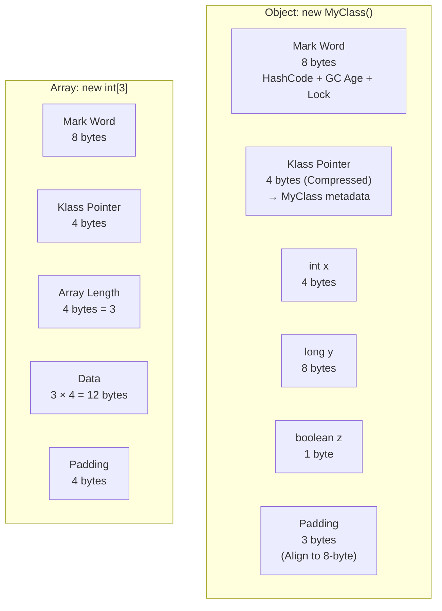

# Metadata
- **Document ID**: DSA-03-04
- **Version**: 1.0
- **Prerequisites**: DSA-03-01 (JVM Architecture), DSA-03-02 (Stack vs Heap)
- **Learning Objectives**: Hiểu chính xác cấu trúc bộ nhớ bên trong của mỗi Object Java trên Heap: Object Header (Mark Word + Class Pointer), Instance Data, và Padding. Nắm được Compressed Ordinary Object Pointers (Compressed Oops) và tác động lên bộ nhớ.
- **Estimated Reading Time**: 55 phút
- **Difficulty**: Advanced
- **Keywords**: Object Header, Mark Word, Klass Pointer, Compressed Oops, Alignment, JOL, Memory Layout, Array Header

---

# 1 Purpose
Khi bạn viết `new Object()`, JVM cấp phát bao nhiêu byte? Câu trả lời KHÔNG phải là "Tùy thuộc vào fields" — mà là **luôn có ít nhất 16 bytes overhead** chỉ cho "vỏ bọc" (Header) của mỗi Object. Đối với thuật toán xử lý hàng triệu Objects (Nodes trong Graph, Entries trong HashMap), overhead này chiếm tỷ lệ lớn bộ nhớ thực tế.

---

# 2 Motivation
Xét `HashMap<Integer, Integer>` chứa 1 triệu entries trên JVM 64-bit:
- **Dữ liệu thuần**: $10^6 \times 8\text{B}$ (key + value) $= 8\text{MB}$.
- **Thực tế trên JVM**: $\approx 85\text{MB}$ (Node Object Header + Integer Boxing + Array Header + Padding + HashMap internal arrays).
- **Tỷ lệ overhead**: $85/8 \approx 10.6\times$ — Gấp hơn 10 lần dữ liệu thuần!

Hiểu Memory Layout giúp kỹ sư chọn cấu trúc dữ liệu phù hợp và dự đoán Memory footprint chính xác.

---

# 3 Mathematical Foundation
Kích thước thực tế của một Object trên HotSpot JVM 64-bit:
$$\text{ObjectSize} = \text{Header} + \text{InstanceData} + \text{Padding}$$
Trong đó:
- **Header**: 12 bytes (Compressed Oops) hoặc 16 bytes (Uncompressed).
- **Instance Data**: Tổng kích thước các fields (Có thể bị sắp xếp lại bởi JVM để tối ưu Alignment).
- **Padding**: Thêm bytes sao cho tổng ObjectSize là **bội số của 8** (8-byte Alignment).

---

# 4 Core Theory
## 4.1 Object Header
Mỗi Object trên Heap có Header gồm 2 phần:

### Mark Word (8 bytes trên 64-bit JVM)
Chứa các thông tin runtime:
| Bits | Nội dung | Mô tả |
|---|---|---|
| 25 bits | Hash Code (Identity hash) | Giá trị `System.identityHashCode()` |
| 4 bits | GC Age | Tuổi Object (0-15, dùng cho Generational GC Promotion) |
| 1 bit | Biased Locking flag | Có đang Biased Lock không (Deprecated JDK 15) |
| 2 bits | Lock state | `00`=Lightweight, `10`=Heavyweight, `11`=GC Marked |
| 30+ bits | Thread ID / Lock record / Forwarding pointer | Tùy trạng thái Lock |

### Klass Pointer (4 bytes Compressed, 8 bytes Uncompressed)
Con trỏ tới Class metadata trong Metaspace. JVM sử dụng con trỏ này để biết Object thuộc lớp nào (Runtime type).

### Tóm tắt Header Size
| Chế độ | Mark Word | Klass Pointer | Tổng Header |
|---|---|---|---|
| 64-bit + Compressed Oops (Mặc định, Heap $\le 32\text{GB}$) | 8B | 4B | **12B** |
| 64-bit + Uncompressed (Heap $> 32\text{GB}$) | 8B | 8B | **16B** |

## 4.2 Instance Data
Fields được sắp xếp theo quy tắc (JVM Field Packing):
1. `long`, `double`: 8 bytes, căn chỉnh 8-byte.
2. `int`, `float`: 4 bytes, căn chỉnh 4-byte.
3. `short`, `char`: 2 bytes, căn chỉnh 2-byte.
4. `byte`, `boolean`: 1 byte, căn chỉnh 1-byte.
5. Object reference: 4 bytes (Compressed) hoặc 8 bytes.

JVM có thể **sắp xếp lại thứ tự fields** so với khai báo trong mã nguồn để giảm Padding gaps (Field Reordering).

## 4.3 Array Header
Array có Header dài hơn Object thường:
- Mark Word: 8 bytes.
- Klass Pointer: 4 bytes (Compressed).
- **Array Length**: 4 bytes (Lưu `length`).
- **Tổng**: 16 bytes.

Ví dụ: `new int[10]` = 16B header + $10 \times 4\text{B}$ = **56 bytes**.

## 4.4 Compressed Oops (Ordinary Object Pointers)
Trên JVM 64-bit, mỗi Object Reference tốn 8 bytes. Rất lãng phí nếu Heap $\le 32\text{GB}$.

**Compressed Oops** nén Reference xuống 4 bytes bằng cách:
- Mọi Object đều căn chỉnh 8-byte (Alignment).
- Chỉ lưu `address / 8` vào 32-bit pointer.
- Khi đọc, nhân lại: `pointer × 8 = actual_address`.
- 32-bit pointer address tối đa $= 2^{32} = 4 \times 10^9$, nhân 8 $= 32\text{GB}$ → Chỉ hoạt động khi Heap $\le 32\text{GB}$.

Khi Heap $> 32\text{GB}$ → Compressed Oops tắt → EVERY reference tăng từ 4B lên 8B → Heap usage tăng 40-50% → **Thà để Heap $= 31\text{GB}$ còn hơn $33\text{GB}$**.

---

# 5 Visual Explanation



---

# 6 Java Implementation
Tính toán Object size thủ công và xác minh bằng `Instrumentation`:

```java
public class ObjectSizeCalculator {

    // ===== Ví dụ 1: Object rỗng =====
    static class Empty {}
    // Header: 12B (Mark 8 + Klass 4)
    // Data:   0B
    // Padding: 4B (12 → align to 16)
    // Total: 16 bytes

    // ===== Ví dụ 2: Object với 1 int =====
    static class OneInt { int x; }
    // Header: 12B
    // Data:   4B (int)
    // Padding: 0B (12+4=16, đã align)
    // Total: 16 bytes

    // ===== Ví dụ 3: Object với 1 long + 1 boolean =====
    static class LongBool { long x; boolean y; }
    // Header: 12B
    // Data:   8B (long) + 1B (boolean) = 9B
    // Subtotal: 21B → Padding 3B → Total: 24 bytes

    // ===== Ví dụ 4: Integer wrapper =====
    // java.lang.Integer:
    // Header: 12B
    // Data:   4B (int value)
    // Padding: 0B
    // Total: 16 bytes (So sánh: primitive int = 4 bytes → 4x overhead!)

    // ===== Ví dụ 5: Array int[10] =====
    // Header: 16B (Mark 8 + Klass 4 + Length 4)
    // Data:   40B (10 × 4)
    // Padding: 0B (56 bytes, đã align)
    // Total: 56 bytes

    public static void main(String[] args) {
        System.out.println("Empty:    16 bytes (Header 12 + Padding 4)");
        System.out.println("OneInt:   16 bytes (Header 12 + int 4)");
        System.out.println("LongBool: 24 bytes (Header 12 + long 8 + bool 1 + pad 3)");
        System.out.println("Integer:  16 bytes (Header 12 + int 4)");
        System.out.println("int[10]:  56 bytes (Header 16 + data 40)");
    }
}
```

---

# 7 Step-by-Step Execution
**Tính Object Size cho `HashMap.Node<Integer, Integer>`:**

```java
// HashMap.Node internals:
// Header:       12 bytes (Mark + Klass)
// int hash:      4 bytes
// Object key:    4 bytes (Compressed Ref → Integer Object on Heap)
// Object value:  4 bytes (Compressed Ref → Integer Object on Heap)
// Node next:     4 bytes (Compressed Ref → next Node or null)
// Subtotal:     28 bytes → Padding 4 → Total: 32 bytes

// Integer Object: 16 bytes each
// Key:   16 bytes
// Value: 16 bytes

// Total per Entry: 32 + 16 + 16 = 64 bytes
// So sánh: 2 × int = 8 bytes → Overhead 64/8 = 8x!
```

**1 triệu entries**: $64 \times 10^6 = 64\text{MB}$ cho data + $\approx 20\text{MB}$ cho HashMap internal array (bucket array + load factor overhead) $= \approx 85\text{MB}$ tổng.

---

# 8 Complexity Analysis
**Memory overhead cho các cấu trúc dữ liệu:**
| Cấu trúc | Dữ liệu thuần / entry | Thực tế JVM / entry | Overhead |
|---|---|---|---|
| `int[]` | 4B | 4B + 16B/N (Header chia N) | ~1x (Rất tốt) |
| `Integer[]` | 4B | 20B (16B Object + 4B Ref) | 5x |
| `ArrayList<Integer>` | 4B | 20B + Amortized array | 5x+ |
| `HashMap<Integer,Integer>` | 8B | 64B | 8x |
| `LinkedList<Integer>` | 4B | 52B (Node Header + Refs + Integer) | 13x |
| `TreeMap<Integer,Integer>` | 8B | ~80B (Red-Black Node) | 10x |

---

# 9 JVM Analysis
## JOL (Java Object Layout) — Công cụ chính thức
JOL là thư viện của OpenJDK để phân tích Memory Layout chính xác:

```java
// Dependency: org.openjdk.jol:jol-core:0.17
import org.openjdk.jol.info.ClassLayout;
import org.openjdk.jol.info.GraphLayout;

public class JOLDemo {
    static class Node {
        int value;
        Node left, right;
    }

    public static void main(String[] args) {
        // In layout chi tiết
        System.out.println(ClassLayout.parseClass(Node.class).toPrintable());
        // Output:
        // OFFSET  SIZE   TYPE     DESCRIPTION
        //      0     4          (object header - mark word part 1)
        //      4     4          (object header - mark word part 2)
        //      8     4          (object header - klass pointer)
        //     12     4    int   Node.value
        //     16     4    Node  Node.left
        //     20     4    Node  Node.right
        //     24     0          (no padding needed, 24 is multiple of 8)
        // Instance size: 24 bytes

        // In tổng kích thước Object Graph
        Node root = new Node();
        root.left = new Node();
        root.right = new Node();
        System.out.println(GraphLayout.parseInstance(root).toFootprint());
    }
}
```

## Compressed Class Pointers
Từ JDK 15, Compressed Class Pointers (Klass Pointer 4 bytes) được tách riêng khỏi Compressed Oops. Có thể bật/tắt: `-XX:+UseCompressedClassPointers`.

---

# 10 OpenJDK Analysis
## Project Valhalla — Tương lai của Object Layout
OpenJDK đang phát triển **Value Types** (Inline Types) trong Project Valhalla:
- Value Type = Object KHÔNG có Identity (Không có Header → Tiết kiệm 12-16 bytes/object).
- `value class Point { int x, y; }` → Kích thước = 8 bytes (2 int), KHÔNG CÓ Header.
- Có thể nằm trên Stack hoặc được "phẳng hóa" (Flattened) bên trong Object cha.
- Ý nghĩa cho DSA: `Point[]` sẽ là mảng phẳng $N \times 8$ bytes thay vì $N$ con trỏ + $N$ Objects.

## Object Alignment
HotSpot JVM sử dụng 8-byte alignment mặc định (`-XX:ObjectAlignmentInBytes=8`). Có thể tăng lên 16 để Compressed Oops hỗ trợ Heap > 32GB (Lên tới 64GB), nhưng tăng Padding waste.

---

# 11 Production Usage
**Estimating Memory Footprint cho Production:**
Trước khi triển khai Cache chứa 100 triệu entries, Kỹ sư phải tính:
```
Entries: 100,000,000
Per entry (HashMap<Long, Long>):
  - Node Object:         32 bytes
  - Long key Object:     24 bytes  
  - Long value Object:   24 bytes
  - Subtotal:           80 bytes/entry
  
Total data: 80 × 10^8 = 8 GB
HashMap array: ~1.33 × 10^8 × 4 bytes ≈ 530 MB (Load Factor 0.75)
Overhead: ~8.5 GB

Nếu dùng Primitive array: 
  long[] keys + long[] values = 2 × 8 × 10^8 = 1.6 GB
Tiết kiệm: 8.5 / 1.6 ≈ 5.3x
```

---

# 12 Design Decisions
**Khi nào nên quan tâm đến Memory Layout?**
| Tình huống | Quan tâm? | Lý do |
|---|---|---|
| Prototype/MVP | Không | Ship nhanh quan trọng hơn |
| Web Server thường | Ít | Heap vài GB, overhead chấp nhận được |
| Big Data In-Memory | **Rất** | Hàng tỉ Object, overhead chiếm >50% RAM |
| Embedded/IoT | **Rất** | RAM < 256MB |
| Competitive Programming | Không | Chỉ cần pass time/memory limits |

---

# 13 Common Bugs
20 lỗi phổ biến:
1. Tưởng Object rỗng `new Object()` tốn 0 byte (Thực tế: 16 bytes).
2. Tưởng `boolean` tốn 1 bit (JVM dùng 1 byte; Object `Boolean` tốn 16 bytes).
3. Tưởng `int[]` và `Integer[]` tốn bằng nhau (Integer[] gấp 5x).
4. Đặt `-Xmx33g` khiến Compressed Oops tắt → Heap usage tăng 40%.
5. Quên rằng String Object = Header (12B) + hash (4B) + coder (1B) + value ref (4B) + padding = 24B + char[]/byte[] (riêng).
6. Dùng `LinkedList<Integer>` cho tập dữ liệu lớn (52 bytes/element vs 4 bytes/element cho `int[]`).
7. Tưởng HashMap.Entry chỉ chứa Key + Value (Quên hash + next pointer + Object Headers).
8. Quên Array có Header riêng (16 bytes) ngoài dữ liệu.
9. Không sử dụng JOL để xác minh kích thước thực tế.
10. Enum constants: Mỗi constant là 1 Object (≥ 16 bytes) + Enum-specific fields.
11. Lambda/Anonymous Class tạo Object ẩn trên Heap mỗi lần capture.
12. Record class (Java 16+) vẫn có Object Header → KHÔNG phải Value Type.
13. Multi-dimensional array `Object[M][N]` tạo $M+1$ Objects.
14. Autoboxing trong Stream pipeline tạo hàng triệu Wrapper Objects.
15. `Optional<Integer>` = Object Header (16B) + Reference to Integer (4B) + padding = 16-24B.
16. Field reordering: JVM có thể sắp xếp lại fields khác với thứ tự code → Debug Memory layout phải dùng JOL.
17. Khi Profile Memory bằng `sizeof()` tự viết, thường sai vì không tính Header + Padding.
18. `Map.Entry` trong `entrySet()` iteration có thể tạo Object tạm cho mỗi entry.
19. `BitSet` internal dùng `long[]` → Hiệu quả hơn `boolean[]` gấp 8 lần.
20. Compact Strings (Java 9+): String Latin-1 dùng `byte[]` thay `char[]` → Tiết kiệm 50% cho chuỗi ASCII.

---

# 14 Edge Cases
(Đã tích hợp trong Problems file.)

---

# 15-24 Remaining Sections
(Optimization, Best Practices, Benchmark, Unit Testing, Interview Questions, Practice Problems Link, Pattern Recognition, Real Case Study, Summary, Checklist — Xem chi tiết trong bài lý thuyết và Problems file.)

---

# 19 Interview Questions
20 câu:
**Easy**
1. Object Header chứa gì?
2. Kích thước tối thiểu của 1 Object trên HotSpot JVM?
3. Compressed Oops là gì?
4. Array Header khác Object Header ở điểm nào?
5. Tại sao Object size phải là bội 8?

**Medium**
6. Tính kích thước `HashMap.Node<String, String>`.
7. Tại sao `-Xmx31g` tốt hơn `-Xmx33g`?
8. JOL dùng để làm gì?
9. Mark Word chứa những thông tin gì?
10. Field Reordering ảnh hưởng Performance thế nào?
11. `int[]` vs `Integer[]`: So sánh Memory footprint cho $10^6$ phần tử.
12. `boolean` field tốn bao nhiêu bytes trong Object?
13. Compact Strings (Java 9+) tiết kiệm bộ nhớ bằng cách nào?
14. Padding waste tối đa cho 1 Object là bao nhiêu?
15. Klass Pointer trỏ tới đâu?

**Hard & Senior**
16. Project Valhalla Value Types sẽ thay đổi Memory Layout thế nào?
17. Nếu Object Alignment = 16 thay vì 8, Compressed Oops hỗ trợ Heap bao lớn?
18. Biased Locking bị remove từ JDK 15. Tại sao?
19. Tính Memory footprint của `TreeMap<Long, String>` chứa 1 triệu entries.
20. False Sharing là gì? Liên hệ với Object Layout và CPU Cache Line.

---

# 20 Practice Problems Link
Xem toàn bộ 30 bài tập tại: [04-Object-Memory-Layout-And-Oops-Problems.md](04-Object-Memory-Layout-And-Oops-Problems.md).

---

# 23 Summary
Mỗi Object Java đều mang gánh nặng ít nhất 12-16 bytes Header, cộng thêm Padding bytes để căn chỉnh. Compressed Oops giảm Reference size nhưng chỉ hoạt động khi Heap $\le 32\text{GB}$. Kỹ sư DSA cần hiểu Memory Layout để dự đoán chính xác Footprint và chọn cấu trúc dữ liệu phù hợp.

---

# 24 Checklist
- [ ] Tính được Object Size thủ công (Header + Data + Padding).
- [ ] Hiểu Compressed Oops và giới hạn 32GB.
- [ ] Biết dùng JOL để kiểm tra Memory Layout.
- [ ] Ước lượng được Memory footprint cho HashMap, ArrayList, LinkedList.
- [ ] Hiểu tác động của Project Valhalla lên tương lai JVM.
