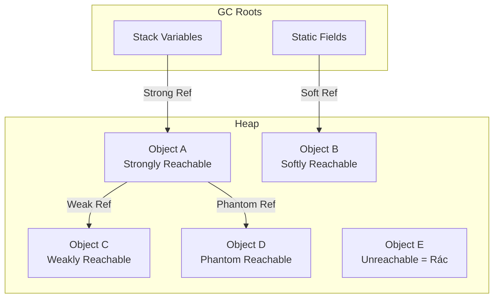

# Metadata
- **Document ID**: DSA-03-05
- **Version**: 1.0
- **Prerequisites**: DSA-03-02 (Stack vs Heap), DSA-03-04 (Object Memory Layout)
- **Learning Objectives**: Hiểu hệ thống Reference trong Java (Strong, Soft, Weak, Phantom), cơ chế hoạt động của chúng với Garbage Collector, và cách ứng dụng trong thiết kế Cache, Resource Cleanup, và Memory-sensitive Algorithms.
- **Estimated Reading Time**: 50 phút
- **Difficulty**: Advanced
- **Keywords**: Strong Reference, Soft Reference, Weak Reference, Phantom Reference, ReferenceQueue, Reachability, Finalizer, Cleaner

---

# 1 Purpose
Java không có con trỏ (Pointer) theo nghĩa của C/C++, nhưng có hệ thống **References** phong phú hơn nhiều. Ngoài Strong Reference mặc định, Java cung cấp 3 loại Reference đặc biệt cho phép Kỹ sư kiểm soát mối quan hệ giữa Object và GC. Đây là nền tảng của Caching systems, Resource management, và Memory-efficient data structures.

---

# 2 Motivation
Xét bài toán thiết kế Image Cache trên Server:
- **Strong Reference**: Giữ tất cả ảnh trong RAM → Heap tràn → `OutOfMemoryError`.
- **Soft Reference**: Giữ ảnh trong RAM nhưng cho phép GC xóa khi Heap áp lực → Cache tự co lại.
- **Weak Reference**: Giữ ảnh chỉ khi Client vẫn đang dùng → GC xóa ngay khi Client xong.
- **Phantom Reference**: Theo dõi khi ảnh bị GC để giải phóng Native Memory (GPU buffer).

Mỗi loại Reference giải quyết một bài toán khác nhau. Chọn sai loại → Memory Leak hoặc Cache vô dụng.

---

# 3 Mathematical Foundation
**Thứ tự mạnh yếu của Reference (Reachability Levels):**
$$\text{Strong} > \text{Soft} > \text{Weak} > \text{Phantom} > \text{Unreachable (Rác)}$$

GC chỉ thu gom Object khi KHÔNG còn Reference mạnh hơn hoặc bằng mức quy định:
- **Strongly Reachable**: Có Strong Reference chain từ GC Root → KHÔNG BAO GIỜ bị GC.
- **Softly Reachable**: Chỉ có Soft Reference → GC xóa KHI Heap sắp đầy.
- **Weakly Reachable**: Chỉ có Weak Reference → GC xóa ở Minor GC TIẾP THEO.
- **Phantom Reachable**: Chỉ có Phantom Reference → Object ĐÃ BỊ finalized, chờ cleanup.
- **Unreachable**: Không có Reference nào → GC xóa ngay.

---

# 4 Core Theory
## 4.1 Strong Reference (Tham chiếu Mạnh)
Mặc định trong Java. Mọi biến, field, parameter đều tạo Strong Reference.

```java
Object obj = new Object(); // Strong Reference
// GC KHÔNG BAO GIỜ dọn obj cho đến khi obj = null hoặc ra khỏi scope
```

**Quy tắc**: Object có ít nhất 1 Strong Reference chain từ GC Root → Sống.

## 4.2 Soft Reference (Tham chiếu Mềm)
GC chỉ dọn Soft-referenced Object khi **Heap sắp đầy** (Low Memory). Lý tưởng cho **Cache**.

```java
import java.lang.ref.SoftReference;
SoftReference<byte[]> cache = new SoftReference<>(new byte[10_000_000]);
byte[] data = cache.get(); // Có thể null nếu GC đã dọn
```

**JVM Policy**: Đảm bảo Soft References TỒN TẠI ÍT NHẤT `X` ms kể từ lần truy cập cuối (X phụ thuộc `-XX:SoftRefLRUPolicyMSPerMB`, mặc định 1000ms per MB Free Heap).

## 4.3 Weak Reference (Tham chiếu Yếu)
GC dọn Weak-referenced Object ở **Minor GC tiếp theo** bất chấp Heap có dư không. Dùng cho **Canonical Mapping** (WeakHashMap).

```java
import java.lang.ref.WeakReference;
WeakReference<Object> weak = new WeakReference<>(new Object());
Object obj = weak.get(); // Có thể null sau bất kỳ GC nào
```

**Use Case chính**: `WeakHashMap<K,V>` — Key bị GC khi không còn Strong Reference từ bên ngoài → Entry tự động biến mất → Không Memory Leak.

## 4.4 Phantom Reference (Tham chiếu Ma)
`get()` LUÔN trả về `null`. Chỉ dùng kết hợp với `ReferenceQueue` để nhận thông báo khi Object bị GC. Thay thế cho `finalize()` (Deprecated).

```java
import java.lang.ref.PhantomReference;
import java.lang.ref.ReferenceQueue;

ReferenceQueue<Object> queue = new ReferenceQueue<>();
PhantomReference<Object> phantom = new PhantomReference<>(new Object(), queue);
// phantom.get() luôn trả về null
// Khi Object bị GC → phantom được enqueue vào queue
// Thread cleanup poll queue để dọn dẹp Native resource
```

## 4.5 ReferenceQueue
Khi GC quyết định dọn Object được wrap bởi Soft/Weak/Phantom Reference, Reference Object đó được đưa vào `ReferenceQueue`. Application Thread có thể `poll()` hoặc `remove()` từ Queue để thực hiện cleanup logic.

## 4.6 Cleaner API (Java 9+)
`java.lang.ref.Cleaner` là API hiện đại thay thế `finalize()`, sử dụng Phantom Reference nội bộ:

```java
import java.lang.ref.Cleaner;
public class NativeResource implements AutoCloseable {
    private static final Cleaner cleaner = Cleaner.create();
    private final Cleaner.Cleanable cleanable;
    private final long nativePtr; // Con trỏ Native

    public NativeResource(long ptr) {
        this.nativePtr = ptr;
        this.cleanable = cleaner.register(this, () -> {
            freeNativeMemory(ptr); // Cleanup khi GC dọn
        });
    }

    @Override
    public void close() {
        cleanable.clean(); // Cleanup sớm khi user gọi close()
    }

    private static void freeNativeMemory(long ptr) {
        System.out.println("Freeing native memory at " + ptr);
    }
}
```

---

# 5 Visual Explanation



---

# 6 Java Implementation
So sánh 4 loại Reference:

```java
import java.lang.ref.*;

public class ReferenceTypesDemo {
    public static void main(String[] args) throws InterruptedException {
        // 1. Strong Reference
        Object strong = new Object();
        System.out.println("Strong: " + strong); // Luôn tồn tại

        // 2. Soft Reference
        SoftReference<byte[]> soft = new SoftReference<>(new byte[10_000_000]);
        System.out.println("Soft before GC: " + (soft.get() != null)); // true
        System.gc();
        System.out.println("Soft after GC:  " + (soft.get() != null)); // Thường vẫn true (Heap chưa áp lực)

        // 3. Weak Reference
        WeakReference<Object> weak = new WeakReference<>(new Object());
        System.out.println("Weak before GC: " + (weak.get() != null)); // true
        System.gc();
        Thread.sleep(100);
        System.out.println("Weak after GC:  " + (weak.get() != null)); // false (Bị dọn ngay)

        // 4. Phantom Reference
        ReferenceQueue<Object> queue = new ReferenceQueue<>();
        PhantomReference<Object> phantom = new PhantomReference<>(new Object(), queue);
        System.out.println("Phantom.get(): " + phantom.get()); // LUÔN null
        System.gc();
        Thread.sleep(100);
        Reference<?> polled = queue.poll();
        System.out.println("Phantom in queue: " + (polled != null)); // true (Đã bị enqueue)
    }
}
```

---

# 7 Step-by-Step Execution
**Soft Reference Cache Behavior khi Heap áp lực:**

1. Cache chứa 100 images (Soft Refs) → Heap 70% đầy.
2. Request mới → Tạo 50 Objects tạm → Heap 85%.
3. Minor GC: Dọn Young Gen rác → Heap 75%. Soft Refs KHÔNG bị đụng.
4. Request tiếp → Heap 95%.
5. GC không giải phóng đủ với Minor GC → **Major GC**: GC bắt đầu dọn Soft References.
6. Soft Refs cũ nhất (LRU) bị clear trước.
7. Heap giảm xuống 50%.
8. Cache tự co lại từ 100 xuống 30 images. Application tiếp tục hoạt động bình thường.

---

# 8 Complexity Analysis
| Reference Type | GC xóa khi nào | `get()` sau GC | Dùng cho | Memory Safety |
|---|---|---|---|---|
| Strong | Không bao giờ (Nếu reachable) | Luôn trả về Object | Default | Không tự giải phóng |
| Soft | Heap sắp đầy | Có thể null | Cache | Tự co lại khi cần |
| Weak | Minor GC tiếp theo | Có thể null | WeakHashMap, Listeners | Tự dọn ngay |
| Phantom | Sau finalization | LUÔN null | Resource cleanup | Chỉ notification |

---

# 9 JVM Analysis
## WeakHashMap Internals
`WeakHashMap<K,V>` sử dụng `WeakReference` cho Key:
- Khi Key không còn Strong Reference từ bên ngoài → Key bị GC.
- Mỗi lần gọi `get()`/`put()`/`size()`, WeakHashMap kiểm tra internal `ReferenceQueue` và xóa các Entry có Key đã chết.
- **Cẩn thận**: Value VẪN là Strong Reference! Nếu Value reference ngược lại Key → Key không bao giờ bị GC → Memory Leak.

## SoftReference LRU Policy
HotSpot JVM sử dụng `clock - timestamp` (Đồng hồ trừ thời điểm truy cập cuối) để quyết định Soft Ref nào bị dọn trước:
$$\text{Keep if:} \quad \text{clock} - \text{timestamp} \le \text{FreeMB} \times \text{SoftRefLRUPolicyMSPerMB}$$
Với mặc định `SoftRefLRUPolicyMSPerMB = 1000`: Nếu Free Heap = 100MB, Soft Ref được giữ nếu truy cập trong 100 giây gần nhất.

---

# 10 OpenJDK Analysis
## Cleaner vs Finalizer Performance
| Tiêu chí | `finalize()` | `Cleaner` |
|---|---|---|
| Thread | Dedicated Finalizer Thread | Dedicated Cleaner Thread |
| Delay GC | 1+ GC cycle | 0 (Object bị GC ngay) |
| Object resurrection | Có thể | Không thể |
| Reliable | Không (Có thể không bao giờ chạy) | Đáng tin cậy hơn |
| API | Deprecated (Java 9) | Recommended (Java 9+) |

Cleaner tốt hơn vì Object KHÔNG cần sống thêm GC cycle. GC dọn Object ngay, Phantom Reference vào Queue, Cleaner Thread xử lý cleanup.

---

# 11 Production Usage
**Thiết kế Soft Reference Cache cho Production:**
```java
import java.lang.ref.SoftReference;
import java.util.concurrent.ConcurrentHashMap;

public class SoftCache<K, V> {
    private final ConcurrentHashMap<K, SoftReference<V>> map = new ConcurrentHashMap<>();

    public V get(K key) {
        SoftReference<V> ref = map.get(key);
        if (ref == null) return null;
        V value = ref.get();
        if (value == null) {
            map.remove(key); // Dọn dẹp entry đã chết
        }
        return value;
    }

    public void put(K key, V value) {
        map.put(key, new SoftReference<>(value));
    }

    public int size() { return map.size(); } // Có thể chứa dead entries
}
```

**Cảnh báo**: Soft Cache KHÔNG thay thế được Cache chuyên dụng (Caffeine, Guava Cache) vì:
- Không có TTL/TTI (Time-to-Live/Time-to-Idle).
- Không có Eviction policy tùy chỉnh.
- GC quyết định xóa gì, không phải application.

---

# 12 Design Decisions
**Chọn Reference Type nào?**
| Yêu cầu | Reference | Lý do |
|---|---|---|
| "Giữ Object sống bằng mọi giá" | Strong | Default |
| "Cache, xóa khi cần RAM" | Soft | GC dọn khi Heap low |
| "Mapping phụ, xóa khi key hết dùng" | Weak | WeakHashMap |
| "Cleanup native resource sau GC" | Phantom + Queue | Cleaner pattern |
| "Observer pattern, tránh Listener leak" | Weak | WeakReference to Listener |

---

# 13 Common Bugs
20 lỗi phổ biến:
1. Soft Reference Cache mà quên kiểm tra `get() == null` → `NullPointerException`.
2. WeakHashMap Value giữ Strong Reference tới Key → Key không bao giờ bị GC.
3. Phantom Reference `get()` luôn null nhưng developer cố cast kết quả.
4. Quên đăng ký `ReferenceQueue` khi dùng Phantom Reference → Không nhận notification.
5. Sử dụng Strong Reference khi nên dùng Weak → Listener leak.
6. Sử dụng Weak Reference cho Cache → Cache bị xóa quá nhanh (Nên dùng Soft).
7. `WeakHashMap` không thread-safe → `ConcurrentModificationException` khi multi-thread.
8. Cleaner action tham chiếu `this` (Object gốc) → Object không bao giờ bị GC (Circular strong ref).
9. `finalize()` tự hồi sinh Object → GC chỉ gọi `finalize()` 1 lần → Lần sau không cleanup.
10. Soft Reference bị GC dọn ĐỒNG LOẠT khi Heap áp lực → Cache stampede (Hàng nghìn Cache miss cùng lúc).
11. WeakHashMap với String literal Key → String literal KHÔNG BAO GIỜ bị GC (Vì String Pool giữ Strong Ref).
12. Tạo quá nhiều SoftReference wrappers → Overhead: mỗi SoftReference Object ~ 32 bytes.
13. ReferenceQueue `remove()` blocking → Thread bị treo nếu không có Reference.
14. PhantomReference không gọi `clear()` sau khi xử lý → Reference Object leak.
15. Dùng `System.gc()` để ép test Weak Reference → Không đảm bảo GC chạy.
16. Soft Reference Cache không giới hạn kích thước Map (Entry tồn tại dù Value null).
17. WeakReference trong Lambda → Object bị GC trong khi Lambda đang chạy.
18. Finalize queue quá dài → Finalizer Thread không kịp xử lý → Heap overflow.
19. Reference subclass override `clear()` → Behavior không tương thích với ReferenceQueue.
20. Mixing Reference types trong cùng collection → Confusion, khó debug.

---

# 14 Edge Cases
(Tích hợp trong Problems file.)

---

# 15 Optimization Techniques
- **Evict early**: Kết hợp Soft Reference với LRU policy riêng, không phụ thuộc hoàn toàn vào GC.
- **Avoid Wrapper overhead**: Mỗi `SoftReference` Object tốn ~32B. Nếu Value nhỏ (4B int), overhead gấp 8x.
- **Cleaner over Finalizer**: Luôn dùng `Cleaner` thay vì `finalize()` cho Resource cleanup.

---

# 16 Best Practices
- **Cache**: Dùng thư viện chuyên dụng (Caffeine, Guava) thay vì tự viết SoftReference Cache.
- **Listener**: Dùng WeakReference cho Event Listeners để tránh Memory Leak khi Listener owner bị GC.
- **Native Resources**: Implement `AutoCloseable` + `Cleaner` backup. Primary: `try-with-resources`. Backup: Cleaner.

---

# 19 Interview Questions
20 câu:

**Easy**
1. Kể tên 4 loại Reference trong Java.
2. Strong Reference khác Weak Reference ở điểm nào?
3. `WeakHashMap` dùng Reference loại nào cho Key?
4. Tại sao `finalize()` bị Deprecated?
5. `SoftReference.get()` có thể trả về null không?

**Medium**
6. Khi nào GC dọn Soft Reference?
7. WeakHashMap Value giữ Strong Reference tới Key → Hậu quả gì?
8. `ReferenceQueue` dùng để làm gì?
9. Phantom Reference `get()` trả về gì?
10. So sánh Soft Reference Cache vs Caffeine Cache.
11. `Cleaner` hoạt động thế nào bên trong?
12. String literal làm Key trong WeakHashMap có bị GC không?
13. Soft Reference LRU Policy trong HotSpot là gì?
14. Tại sao Weak Reference phù hợp cho Observer/Listener?
15. Cache stampede xảy ra khi nào với Soft References?

**Hard & Senior**
16. Thiết kế thread-safe Soft Cache cho Production.
17. Giải thích `-XX:SoftRefLRUPolicyMSPerMB` ảnh hưởng đến Soft Ref lifetime.
18. Tại sao Cleaner action KHÔNG được reference `this`?
19. WeakHashMap internals: Khi nào expunge stale entries?
20. So sánh Reference counting (Python CPython) vs Reachability (Java GC).

---

# 20 Practice Problems Link
Xem toàn bộ 30 bài tập tại: [05-References-and-Pointers-in-Java-Problems.md](05-References-and-Pointers-in-Java-Problems.md).

---

# 23 Summary
Hệ thống Reference trong Java (Strong, Soft, Weak, Phantom) cho phép Kỹ sư tinh chỉnh mối quan hệ giữa Object và GC. Soft Reference cho Cache tự co lại, Weak Reference cho Listener không leak, Phantom Reference cho Native resource cleanup. Kết hợp với Cleaner API (Java 9+), đây là bộ công cụ thiết yếu để xây dựng ứng dụng Java Memory-efficient.

---

# 24 Checklist
- [ ] Phân biệt 4 loại Reference và khi nào dùng.
- [ ] Hiểu `ReferenceQueue` và cơ chế notification.
- [ ] Biết dùng `Cleaner` thay `finalize()`.
- [ ] Thiết kế được Soft Cache cơ bản.
- [ ] Tránh được WeakHashMap Memory Leak (Value → Key Strong Ref).
