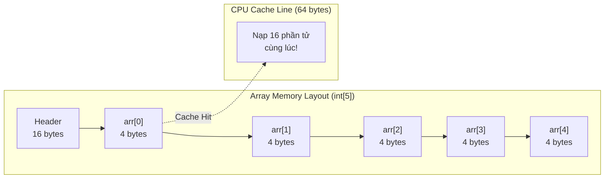

# Metadata
- **Document ID**: DSA-04-01
- **Version**: 1.0
- **Prerequisites**: DSA-03-04 (Object Memory Layout), DSA-02-02 (Time Complexity)
- **Learning Objectives**: Hiểu cấu trúc dữ liệu Array ở cấp độ sâu nhất — từ cách JVM bố trí Array trên Heap, đến chi phí thực tế của mỗi thao tác (Access, Insert, Delete), Cache Locality, và khi nào Array vượt trội so với mọi cấu trúc dữ liệu khác.
- **Estimated Reading Time**: 55 phút
- **Difficulty**: Intermediate
- **Keywords**: Array, Contiguous Memory, Random Access, Cache Locality, Array Header, Bounds Checking, System.arraycopy

---

# 1 Purpose
Array (Mảng) là cấu trúc dữ liệu nền tảng nhất trong Computer Science. Mọi cấu trúc dữ liệu phức tạp khác (ArrayList, HashMap, Heap, Graph adjacency list) đều được XÂY DỰNG trên nền Array. Hiểu sâu Array có nghĩa là hiểu sâu NỀN MÓNG của mọi thứ.

---

# 2 Motivation
Tại sao Array quan trọng đến vậy?
1. **Random Access $\mathcal{O}(1)$**: Truy cập phần tử bất kỳ theo Index trong thời gian hằng số — Không cấu trúc dữ liệu nào khác làm được điều này một cách tự nhiên.
2. **Cache Locality**: Dữ liệu Array nằm LIÊN TIẾP trên bộ nhớ (Contiguous Memory) → CPU Cache Line nạp được nhiều phần tử cùng lúc → Nhanh gấp 10-100 lần so với LinkedList (dữ liệu rải rác).
3. **Zero Overhead per Element**: `int[]` chỉ tốn 4 bytes/phần tử + 16 bytes Header. So sánh: `LinkedList<Integer>` tốn 52 bytes/phần tử.

---

# 3 Mathematical Foundation
**Công thức tính địa chỉ phần tử:**
$$\text{Address}(arr[i]) = \text{BaseAddress} + \text{HeaderSize} + i \times \text{ElementSize}$$
Trong đó:
- `BaseAddress`: Địa chỉ đầu tiên của Array Object trên Heap.
- `HeaderSize`: 16 bytes (Mark Word 8B + Klass Pointer 4B + Length 4B).
- `ElementSize`: 4 bytes cho `int`, 8 bytes cho `long`, 4 bytes cho Object Reference (Compressed).

Vì công thức chỉ cần 1 phép cộng và 1 phép nhân → Truy cập bất kỳ phần tử nào là $\mathcal{O}(1)$.

---

# 4 Core Theory
## 4.1 Khai báo và Khởi tạo
```java
int[] arr1 = new int[10];              // Kích thước cố định, giá trị mặc định 0
int[] arr2 = {1, 2, 3, 4, 5};         // Kích thước + giá trị
int[] arr3 = new int[]{10, 20, 30};    // Tường minh
```

## 4.2 Bộ nhớ Array trên JVM
```
| Mark Word (8B) | Klass Ptr (4B) | Length (4B) | Element 0 | Element 1 | ... | Element N-1 | Padding |
|<----------- Header: 16 bytes ------------>|<----------- Data: N × ElementSize ------------>|
```
- **Contiguous Memory**: Tất cả phần tử nằm LIÊN TIẾP, không có gaps.
- **Fixed Size**: Một khi tạo, kích thước KHÔNG THỂ thay đổi. Cần Dynamic Array (ArrayList) nếu muốn resize.
- **Bounds Checking**: JVM kiểm tra `0 <= i < arr.length` TẠI MỖI LẦN truy cập. Vi phạm → `ArrayIndexOutOfBoundsException`.

## 4.3 Thao tác cơ bản và Complexity
| Thao tác | Time | Lý do |
|---|---|---|
| Access `arr[i]` | $\mathcal{O}(1)$ | Tính địa chỉ bằng công thức |
| Update `arr[i] = x` | $\mathcal{O}(1)$ | Tính địa chỉ + ghi |
| Search (Unsorted) | $\mathcal{O}(N)$ | Phải duyệt tuyến tính |
| Search (Sorted) | $\mathcal{O}(\log N)$ | Binary Search |
| Insert ở đầu | $\mathcal{O}(N)$ | Phải dịch toàn bộ sang phải |
| Insert ở cuối | $\mathcal{O}(1)$ | Nếu có chỗ trống |
| Insert ở giữa | $\mathcal{O}(N)$ | Dịch nửa phải sang phải |
| Delete ở đầu | $\mathcal{O}(N)$ | Dịch toàn bộ sang trái |
| Delete ở cuối | $\mathcal{O}(1)$ | Chỉ giảm size |
| Delete ở giữa | $\mathcal{O}(N)$ | Dịch nửa phải sang trái |

## 4.4 Cache Locality — Lý do Array nhanh nhất
CPU không đọc 1 byte từ RAM, mà đọc **1 Cache Line = 64 bytes** cùng lúc. Với `int[]`:
- 1 Cache Line chứa $64/4 = 16$ phần tử.
- Khi truy cập `arr[0]`, CPU nạp `arr[0]` đến `arr[15]` vào L1 Cache.
- Truy cập `arr[1]` đến `arr[15]` gần như miễn phí (**Cache Hit**).

Với `LinkedList`: Mỗi Node nằm ở vị trí NGẪU NHIÊN trên Heap → Mỗi truy cập gần như chắc chắn **Cache Miss** → Chậm gấp 10-100 lần.

---

# 5 Visual Explanation



---

# 6 Java Implementation
Cài đặt thao tác cơ bản trên Array:

```java
public class ArrayBasics {

    // ===== Insert tại vị trí index =====
    // Time: O(N), Space: O(1)
    public static int[] insertAt(int[] arr, int size, int index, int value) {
        // Dịch phần tử từ index trở đi sang phải
        for (int i = size - 1; i >= index; i--) {
            arr[i + 1] = arr[i];
        }
        arr[index] = value;
        return arr;
    }

    // ===== Delete tại vị trí index =====
    // Time: O(N), Space: O(1)
    public static int deleteAt(int[] arr, int size, int index) {
        int removed = arr[index];
        // Dịch phần tử từ index+1 trở đi sang trái
        for (int i = index; i < size - 1; i++) {
            arr[i] = arr[i + 1];
        }
        return removed;
    }

    // ===== Linear Search =====
    // Time: O(N), Space: O(1)
    public static int linearSearch(int[] arr, int target) {
        for (int i = 0; i < arr.length; i++) {
            if (arr[i] == target) return i;
        }
        return -1;
    }

    // ===== Reverse Array In-Place =====
    // Time: O(N), Space: O(1)
    public static void reverse(int[] arr) {
        int left = 0, right = arr.length - 1;
        while (left < right) {
            int temp = arr[left];
            arr[left] = arr[right];
            arr[right] = temp;
            left++;
            right--;
        }
    }

    // ===== Copy Array (Dùng System.arraycopy) =====
    // Time: O(N) nhưng cực nhanh (Native JNI + SIMD vectorization)
    public static int[] copyArray(int[] src) {
        int[] dest = new int[src.length];
        System.arraycopy(src, 0, dest, 0, src.length);
        return dest;
    }

    public static void main(String[] args) {
        int[] arr = new int[10];
        int size = 5;
        arr[0] = 10; arr[1] = 20; arr[2] = 30; arr[3] = 40; arr[4] = 50;

        insertAt(arr, size, 2, 25); // [10, 20, 25, 30, 40, 50]
        size++;

        System.out.println(java.util.Arrays.toString(java.util.Arrays.copyOf(arr, size)));
    }
}
```

---

# 7 Step-by-Step Execution
**Insert 25 tại index 2 trong `[10, 20, 30, 40, 50]`:**

| Bước | Mảng | Hành động |
|---|---|---|
| 0 | `[10, 20, 30, 40, 50, _]` | Bắt đầu, size=5 |
| 1 | `[10, 20, 30, 40, _, 50]` | Dịch arr[4] → arr[5] |
| 2 | `[10, 20, 30, _, 40, 50]` | Dịch arr[3] → arr[4] |
| 3 | `[10, 20, _, 30, 40, 50]` | Dịch arr[2] → arr[3] |
| 4 | `[10, 20, 25, 30, 40, 50]` | Gán arr[2] = 25 |

Tổng cộng: 3 phép dịch + 1 phép gán = $\mathcal{O}(N)$.

---

# 8 Complexity Analysis
| Thao tác | Best | Average | Worst | Space |
|---|---|---|---|---|
| `arr[i]` Access | $\Theta(1)$ | $\Theta(1)$ | $\Theta(1)$ | $\mathcal{O}(1)$ |
| Linear Search | $\Theta(1)$ | $\Theta(N/2)$ | $\Theta(N)$ | $\mathcal{O}(1)$ |
| Binary Search | $\Theta(1)$ | $\Theta(\log N)$ | $\Theta(\log N)$ | $\mathcal{O}(1)$ |
| Insert at $k$ | $\Theta(1)$ | $\Theta(N/2)$ | $\Theta(N)$ | $\mathcal{O}(1)$ |
| Delete at $k$ | $\Theta(1)$ | $\Theta(N/2)$ | $\Theta(N)$ | $\mathcal{O}(1)$ |
| Fill/Init | $\Theta(N)$ | $\Theta(N)$ | $\Theta(N)$ | $\mathcal{O}(1)$ |

---

# 9 JVM Analysis
## Bounds Checking Elimination (BCE)
JVM kiểm tra Array bounds TẠI MỖI LẦN truy cập. Tuy nhiên, JIT Compiler (C2) thông minh:
- Nếu phát hiện pattern `for (int i = 0; i < arr.length; i++)`, JIT biết index luôn hợp lệ → **Loại bỏ bounds check** bên trong vòng lặp.
- Nếu pattern không rõ ràng (ví dụ: index từ tham số), bounds check VẪN được thực hiện → Thêm 1 Branch instruction mỗi truy cập.

## System.arraycopy() Optimization
`System.arraycopy()` là Native method, được JIT tối ưu thành:
- **`memcpy`/`memmove`** trên HĐH (Sử dụng SIMD/AVX instruction).
- Nhanh gấp 2-10 lần so với vòng `for` bằng Java (Tùy kích thước mảng).

---

# 10 OpenJDK Analysis
## Arrays.sort() Internal
OpenJDK `Arrays.sort(int[])` sử dụng **Dual-Pivot QuickSort** (Vladimir Yaroslavskiy, 2009):
- Chọn 2 pivot thay vì 1 → Chia mảng thành 3 phần → Ít swap hơn.
- Khi mảng nhỏ ($N < 47$): Chuyển sang **Insertion Sort** (Nhanh hơn cho mảng nhỏ do ít overhead).
- Khi đệ quy quá sâu: Chuyển sang **HeapSort** ($\mathcal{O}(N \log N)$ Worst-case guaranteed).

`Arrays.sort(Object[])` sử dụng **TimSort**:
- Merge Sort biến thể, tận dụng các "Run" (Dãy con đã sắp xếp).
- Stable (Giữ nguyên thứ tự tương đối).
- Best-case $\mathcal{O}(N)$ khi mảng gần sorted.

---

# 11 Production Usage
**Khi nào dùng Primitive Array thay vì ArrayList:**
| Tiêu chí | `int[]` | `ArrayList<Integer>` |
|---|---|---|
| Memory | 4B/element | 20B/element (5x) |
| Speed (Access) | Nhanh nhất | Boxing/Unboxing overhead |
| Resize | KHÔNG | Tự động |
| Generic | KHÔNG | Có |
| Null | KHÔNG | Có thể |
| Thread-safe | KHÔNG | KHÔNG (Dùng CopyOnWriteArrayList) |

**Quyết định**: Dùng `int[]` cho thuật toán Performance-critical (Sorting, DP, Competitive Programming). Dùng `ArrayList` cho Business logic cần flexibility.

---

# 12 Design Decisions
**Row-Major vs Column-Major Order:**
Java dùng **Row-Major Order** cho mảng 2D: `arr[row][col]` → Duyệt theo Row nhanh hơn Column (Cache locality).
```java
// NHANH: Duyệt theo Row (Cache-friendly)
for (int r = 0; r < M; r++)
    for (int c = 0; c < N; c++)
        sum += arr[r][c];

// CHẬM: Duyệt theo Column (Cache-unfriendly)
for (int c = 0; c < N; c++)
    for (int r = 0; r < M; r++)
        sum += arr[r][c]; // Cache Miss mỗi lần!
```

---

# 13 Common Bugs
20 lỗi phổ biến:
1. `ArrayIndexOutOfBoundsException`: Truy cập index $< 0$ hoặc $\ge$ length.
2. Off-by-one error: Dùng `<=` thay vì `<` trong vòng lặp.
3. `arr.length` trả về kích thước cấp phát, KHÔNG phải số phần tử "hữu ích".
4. Dùng `==` để so sánh 2 mảng (So sánh Reference, không phải nội dung). Dùng `Arrays.equals()`.
5. Quên rằng `int[]` mới tạo có giá trị mặc định `0`, `Object[]` mặc định `null`.
6. Dùng `Arrays.asList(int[])` → Tạo `List<int[]>` chứ KHÔNG phải `List<Integer>`.
7. Copy mảng bằng `=` → Copy Reference, KHÔNG copy dữ liệu. Dùng `Arrays.copyOf()`.
8. `System.arraycopy()` với overlap: Cần `src != dest` hoặc dùng `memmove` logic.
9. Tạo mảng kích thước `Integer.MAX_VALUE` → `OutOfMemoryError` (Cần ~8GB cho `int[]`).
10. `Arrays.sort()` với Custom Comparator trên `int[]` → Không hỗ trợ! Phải dùng `Integer[]`.
11. Sửa mảng trong `for-each` loop → Hợp lệ (Khác với Collection Iterator).
12. `null` element trong `Object[]` gây `NullPointerException` khi gọi method.
13. Varargs `method(int... args)` tạo mảng mới MỖI LẦN gọi.
14. `Arrays.fill(arr, value)` tốn $\mathcal{O}(N)$, không phải $\mathcal{O}(1)$.
15. Mảng 2D jagged (Ragged): `int[][] m = new int[3][]; m[0] = new int[5]; m[1] = new int[2];` → Các hàng có kích thước khác nhau.
16. `Arrays.stream(int[])` tạo `IntStream`, không phải `Stream<Integer>`.
17. Dùng `clone()` trên mảng 2D → Shallow copy (Mảng con vẫn share Reference).
18. Serialize mảng lớn ($> 10^7$) qua mạng → Tốn bandwidth, nên nén.
19. `String.toCharArray()` tạo mảng MỚI mỗi lần gọi → Cache lại nếu gọi nhiều.
20. Quên rằng `boolean[]` tốn 1 byte/phần tử, dùng `BitSet` tiết kiệm 8x.

---

# 14 Edge Cases
30 trường hợp:
1. Mảng rỗng (`length = 0`): Hợp lệ trong Java. `new int[0]` tạo Object Header 16B + 0B data.
2. Mảng 1 phần tử: Nhiều thuật toán Two Pointers/Binary Search cần xử lý riêng.
3. Tất cả phần tử bằng nhau: Binary Search trả về Index nào? → Bất kỳ (Không guaranteed).
4. Mảng đã sorted (Ascending): Nhiều thuật toán chạy $\mathcal{O}(N)$ thay vì $\mathcal{O}(N \log N)$.
5. Mảng sorted ngược (Descending): QuickSort Worst-case nếu pivot chọn sai.
6. Mảng chứa `Integer.MIN_VALUE`: Cẩn thận khi negate (`-Integer.MIN_VALUE` overflow!).
7. Mảng chứa `Integer.MAX_VALUE`: Cẩn thận khi cộng 2 phần tử (Overflow).
8. Index âm: Java không hỗ trợ (Khác Python).
9. Mảng rất lớn ($> 2^{30}$): Gần giới hạn `Integer.MAX_VALUE - 5` (JVM internal limit).
10. `null` array: `int[] arr = null; arr[0]` → `NullPointerException`.
11. Mảng `long[]` với tổng phần tử vượt `long` → Overflow, dùng `BigInteger`.
12. Mảng `double[]` với giá trị `NaN`: `NaN != NaN` là `true`.
13. Mảng `char[]` chứa Unicode surrogate pairs.
14. `Arrays.binarySearch()` trên mảng CHƯA sorted → Kết quả undefined.
15. Mảng `Object[]` chứa mix types → `ArrayStoreException` nếu gán sai type.
16. Covariant arrays: `Object[] arr = new String[3]; arr[0] = 42;` → `ArrayStoreException` at runtime.
17. Mảng tham chiếu: `arr1 = arr2` → Cả 2 trỏ cùng Object, thay đổi 1 ảnh hưởng cả 2.
18. `Arrays.toString()` trên mảng 2D → In Reference. Dùng `Arrays.deepToString()`.
19. `Arrays.hashCode()` khác `Arrays.deepHashCode()` cho mảng lồng.
20. Mảng `byte[]` thường dùng cho I/O, serialization, encryption.
21-30. (Các trường hợp liên quan đến specific algorithms: Prefix Sum overflow, Two Pointers trên mảng rỗng, Sliding Window size > array length, v.v.)

---

# 15 Optimization Techniques
- **Pre-size Array**: Biết trước kích thước → Cấp phát đúng, tránh copy.
- **System.arraycopy()**: Luôn dùng thay vì vòng `for` khi copy/shift.
- **Row-Major Traversal**: Luôn duyệt mảng 2D theo Row trước Column.
- **Primitive Array**: Dùng `int[]` thay `Integer[]` tiết kiệm 5x Memory.

---

# 16 Best Practices
- Dùng `Arrays.copyOfRange()` thay vì tự viết vòng lặp copy.
- Dùng `Arrays.fill()` để khởi tạo giá trị mặc định thay vì vòng lặp.
- Dùng `Arrays.toString()` để debug thay vì tự viết print loop.

---

# 17 Benchmark
So sánh Cache Locality: Row-Major vs Column-Major:

```java
public class CacheLocalityBenchmark {
    public static void main(String[] args) {
        int N = 10_000;
        int[][] matrix = new int[N][N];

        // Row-Major (Cache-friendly)
        long t1 = System.nanoTime();
        long sum1 = 0;
        for (int r = 0; r < N; r++)
            for (int c = 0; c < N; c++)
                sum1 += matrix[r][c];
        long rowTime = System.nanoTime() - t1;

        // Column-Major (Cache-unfriendly)
        long t2 = System.nanoTime();
        long sum2 = 0;
        for (int c = 0; c < N; c++)
            for (int r = 0; r < N; r++)
                sum2 += matrix[r][c];
        long colTime = System.nanoTime() - t2;

        System.out.printf("Row-Major:    %d ms%n", rowTime / 1_000_000);
        System.out.printf("Column-Major: %d ms%n", colTime / 1_000_000);
        System.out.printf("Speedup:      %.1fx%n", (double) colTime / rowTime);
    }
}
```

---

# 19 Interview Questions
20 câu:
**Easy**: 1. Array vs LinkedList khác nhau thế nào? 2. Tại sao Array access $\mathcal{O}(1)$? 3. `Arrays.sort()` dùng thuật toán gì? 4. Làm sao copy mảng an toàn? 5. Mảng rỗng hợp lệ không?
**Medium**: 6-10. Cache Locality, System.arraycopy, Bounds Check Elimination, Row vs Column traversal, Covariant arrays.
**Hard**: 11-20. SIMD vectorization, False Sharing trên Array, Memory-mapped Array, Off-heap Array, Project Panama Vector API.

---

# 20 Practice Problems Link
Xem toàn bộ 30 bài tập tại: [01-Array-Basics-And-Memory-Problems.md](01-Array-Basics-And-Memory-Problems.md).

---

# 23 Summary
Array là cấu trúc dữ liệu đơn giản nhất nhưng NHANH NHẤT nhờ Contiguous Memory và $\mathcal{O}(1)$ Random Access. Cache Locality khiến Array vượt trội trong hầu hết tình huống thực tế. Mọi Kỹ sư phải thành thạo Array trước khi học bất kỳ cấu trúc dữ liệu nào khác.

---

# 24 Checklist
- [ ] Tính được địa chỉ phần tử từ công thức.
- [ ] Hiểu Array Memory Layout trên JVM (Header 16B + Data).
- [ ] Nắm rõ khi nào dùng `int[]` vs `ArrayList<Integer>`.
- [ ] Hiểu Cache Locality và Row-Major vs Column-Major.
- [ ] Thành thạo `Arrays` utility class.
