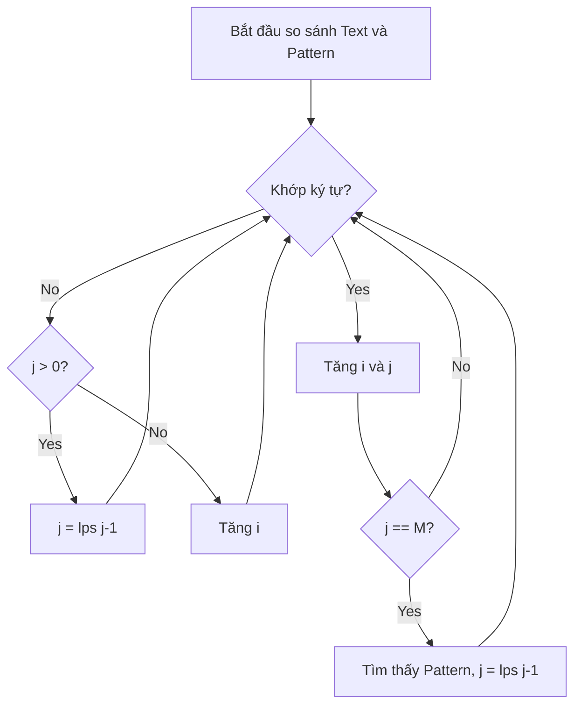

# 04 - KMP Algorithm (Thuật toán Knuth-Morris-Pratt)

## 1. Metadata
- **Tiêu đề:** KMP Algorithm (Thuật toán Knuth-Morris-Pratt)
- **Tác giả:** Curriculum Content Writer
- **Phiên bản:** 1.0
- **Chủ đề:** String Matching
- **Ngôn ngữ:** Java 21

## 2. Purpose (Mục đích)
Tài liệu này cung cấp kiến thức toàn diện về thuật toán **Knuth-Morris-Pratt (KMP)**.
Mục tiêu là hiểu rõ về mảng **LPS (Longest Prefix Suffix)** / **Pi array**, quá trình khớp chuỗi (matching phase), cũng như góc nhìn từ **DFA (Deterministic Finite Automaton)**.

## 3. Motivation (Động lực)
Trong thuật toán Naive String Matching, khi gặp ký tự không khớp (mismatch), ta lùi con trỏ của chuỗi văn bản (text) lại và thử lại từ đầu, dẫn đến độ phức tạp `O(N * M)`.
Thuật toán KMP tận dụng thông tin từ những ký tự đã khớp để không bao giờ lùi con trỏ trên chuỗi văn bản, đạt được độ phức tạp tuyến tính `O(N + M)`.

## 4. Mathematical Foundation (Nền tảng toán học)
- **LPS (Longest Prefix Suffix):** Chiều dài của tiền tố dài nhất đồng thời là hậu tố (không bao gồm toàn bộ chuỗi).
- **Pi array / Failure function:** Mảng `pi[i]` lưu độ dài LPS của chuỗi con từ `0` đến `i`.
- **DFA (Deterministic Finite Automaton):** KMP có thể được mô hình hóa như một cỗ máy trạng thái hữu hạn, trong đó mỗi ký tự của pattern đại diện cho một trạng thái, và việc không khớp sẽ điều hướng về trạng thái dự phòng tốt nhất (failure transition).

## 5. Core Theory (Lý thuyết cốt lõi)
Thuật toán KMP bao gồm 2 giai đoạn:
1. **Tiền xử lý (Preprocessing):** Xây dựng mảng LPS (hoặc Pi array) từ chuỗi mẫu (pattern) trong thời gian `O(M)`.
2. **Khớp chuỗi (Matching):** Duyệt qua chuỗi văn bản (text), sử dụng mảng LPS để bỏ qua các ký tự không cần kiểm tra lại trong thời gian `O(N)`.

## 6. Visual Explanation (Giải thích trực quan)


## 7. Java Implementation (Cài đặt Java)
```java
public class KMP {
    public static int[] computeLPSArray(String pattern) {
        int m = pattern.length();
        int[] lps = new int[m];
        int len = 0; // Length of the previous longest prefix suffix
        int i = 1;
        
        while (i < m) {
            if (pattern.charAt(i) == pattern.charAt(len)) {
                len++;
                lps[i] = len;
                i++;
            } else {
                if (len != 0) {
                    len = lps[len - 1]; // Fallback
                } else {
                    lps[i] = 0;
                    i++;
                }
            }
        }
        return lps;
    }

    public static void KMPSearch(String text, String pattern) {
        int n = text.length();
        int m = pattern.length();
        if (m == 0) return;
        
        int[] lps = computeLPSArray(pattern);
        int i = 0; // index for text
        int j = 0; // index for pattern
        
        while (i < n) {
            if (pattern.charAt(j) == text.charAt(i)) {
                j++;
                i++;
            }
            if (j == m) {
                System.out.println("Found pattern at index " + (i - j));
                j = lps[j - 1];
            } else if (i < n && pattern.charAt(j) != text.charAt(i)) {
                if (j != 0) {
                    j = lps[j - 1];
                } else {
                    i++;
                }
            }
        }
    }
}
```

## 8. Step-by-Step (Hướng dẫn từng bước)
Ví dụ với Pattern: `ABABCABAB`
1. `i = 1, len = 0`: `B != A`, `lps[1] = 0`.
2. `i = 2, len = 0`: `A == A`, `len = 1, lps[2] = 1`.
3. `i = 3, len = 1`: `B == B`, `len = 2, lps[3] = 2`.
4. Cứ tiếp tục như vậy để hoàn thành mảng LPS.
Quá trình duyệt sẽ sử dụng lại số lượng ký tự đã khớp thông qua biến `len`.

## 9. Complexity Analysis (Phân tích độ phức tạp)
- **Time Complexity:** `O(N + M)`
  - **Chứng minh tuyến tính (Amortized analysis):** Trong quá trình tính LPS và tìm kiếm, biến `i` luôn tăng (tối đa `N` hoặc `M` lần). Biến `j` tăng khi có ký tự khớp, và giảm qua phép gán `j = lps[j - 1]`. Số lần giảm không bao giờ vượt quá số lần tăng. Do đó, tổng số vòng lặp `while` bị chặn trên bởi hằng số nhân với `N` hoặc `M`.
- **Space Complexity:** `O(M)` (để lưu mảng LPS).

## 10. JVM Analysis (Phân tích JVM)
- **Branch Prediction:** Nhờ ít vòng lặp lồng nhau (nested loops) hơn so với thuật toán Naive, bộ dự đoán rẽ nhánh (branch predictor) của CPU hoạt động hiệu quả hơn.
- **Array Access:** Việc truy cập `lps[j-1]` đôi khi gây cache miss nếu chuỗi Pattern rất dài.
- **Garbage Collection:** Tạo ra một mảng `int[] lps` kích thước `M`, có thể nằm trong Eden Space và được dọn dẹp nhanh chóng.

## 11. OpenJDK Analysis (Phân tích OpenJDK)
Trong Java OpenJDK, `String.indexOf(String str)` hiện tại không dùng KMP. Nó sử dụng SIMD (vectorization) và các phép toán intrinsic của CPU (ví dụ: lệnh `pcmpestri` của Intel) để tối ưu, hoặc dùng Boyer-Moore-Horspool cho các chuỗi dài hơn.

## 12. Production Usage (Sử dụng trong thực tế)
- **Intrusion Detection Systems (Snort):** Lọc các payload mạng để tìm chuỗi nguy hiểm (signature matching).
- **Log Search:** Tìm kiếm từ khóa lỗi (error codes) trong tệp log khổng lồ.
- **DNA Sequencing:** Đối chiếu chuỗi gen nhanh chóng.

## 13. Design Decisions (Quyết định thiết kế)
- **KMP so với Rabin-Karp:** KMP ổn định `O(N+M)` worst-case, trong khi Rabin-Karp có thể bị hash collision gây `O(N*M)`.
- **KMP so với Boyer-Moore:** Boyer-Moore nhanh hơn nhiều trong thực tế (trung bình `O(N/M)`) do nhảy cóc (skip), nhưng KMP tốt hơn đối với không gian bảng nhỏ (chỉ `O(M)` so với `O(AlphabetSize)` của Boyer-Moore) và xử lý stream/dữ liệu dạng luồng không lùi lại.

## 14. Common Bugs (Các lỗi phổ biến)
1. Lỗi Index Out of Bounds khi cập nhật `lps`.
2. Gán `lps[i] = len++` sai logic.
3. Không kiểm tra trường hợp `pattern` rỗng.
4. Nhầm lẫn giữa chỉ số của Text và Pattern.
5. Cập nhật `i` khi `j != 0` và có mismatch.
6. Quên reset `j` khi tìm thấy pattern (`j = lps[j - 1]`).
7. Bỏ sót trường hợp `len = 0` và `pattern[i] != pattern[len]`.
8. Sử dụng `length()` trong mỗi vòng lặp `while` thay vì gán vào biến local.
9. So sánh chuỗi bằng `==` thay vì `equals` hoặc `charAt()`.
10. Nhầm lẫn định nghĩa Longest Prefix Suffix (tính cả toàn bộ chuỗi).
11. Bỏ qua logic `len != 0` trong vòng `else` lúc tạo mảng LPS.
12. Lặp vô hạn do quên tăng `i` ở trường hợp `len == 0`.
13. Truy cập mảng văn bản ở `i` khi `i >= N`.
14. Hiểu sai giá trị LPS: gán giá trị chỉ mục thay vì độ dài.
15. Không hỗ trợ chuỗi Unicode (cần dùng `codePointAt` thay vì `charAt` nếu có surrogate pairs).
16. Lỗi cấp phát mảng LPS kích thước 0.
17. Khởi tạo `lps[0]` bằng 1.
18. Không xem xét Character Encoding của text (ví dụ UTF-8 byte array).
19. So sánh phân biệt chữ hoa, chữ thường khi đề bài yêu cầu case-insensitive.
20. Tính mảng LPS quá nhiều lần cho cùng một pattern.

## 15. Edge Cases (Các trường hợp đặc biệt)
1. Pattern rỗng (`""`).
2. Text rỗng (`""`).
3. Pattern dài hơn Text.
4. Text và Pattern giống hệt nhau.
5. Text và Pattern chỉ chứa một ký tự lặp lại (e.g., Text = "AAAA", Pattern = "AA").
6. Pattern không xuất hiện trong Text.
7. Pattern xuất hiện nhiều lần liền kề (e.g., "AABAABAAB").
8. Pattern xuất hiện chồng lấp (overlapping) (e.g., "AAAA" trong "AAAAA").
9. Ký tự cuối cùng của Text hoàn thành Pattern.
10. Ký tự đầu tiên của Text là bắt đầu của Pattern.
11. Pattern có độ dài 1.
12. Text chứa toàn ký tự đặc biệt.
13. Text rất lớn (vài GB), Pattern nhỏ.
14. LPS có giá trị tăng đều.
15. LPS có giá trị toàn 0 (Pattern không có tiền tố và hậu tố lặp lại).
16. Pattern đối xứng (Palindrome).
17. Không có bất kỳ ký tự nào của Pattern khớp với Text.
18. Ký tự cần khớp nằm rải rác nhưng không liền mạch.
19. Chuỗi Text chứa khoảng trắng, ký tự null.
20. Kích thước chuỗi vượt giới hạn 2GB của bộ nhớ heap Java (nếu lưu bằng String).
21. Text chứa surrogate pairs trong Java (Emoji).
22. Sự khác biệt về Normalization Form của chuỗi (NFC vs NFD).
23. Sử dụng KMP trên mảng số nguyên (Integer Array) thay vì mảng char.
24. Pattern chứa các ký tự lặp chu kỳ phức tạp (e.g., "ABABAC").
25. Pattern chứa hậu tố dài nhưng bị lỗi ở ký tự cuối.
26. Text và Pattern được khởi tạo bằng `StringBuilder` nhưng chuyển sang `String` chậm.
27. LPS của pattern dài bằng đúng pattern trừ 1.
28. Text là luồng dữ liệu (Stream) thay vì mảng tĩnh.
29. Quản lý trạng thái LPS khi thay đổi chuỗi động (Dynamic string).
30. KMP trên mảng byte (ví dụ đọc từ Network Socket).

## 16. Optimization (Tối ưu hóa)
- **Biến cục bộ (Local Variables):** Lưu các chuỗi dưới dạng mảng `char[]` ngay từ đầu để tránh phương thức `charAt()` gây overhead về bounds checking.
- **KMP dựa trên Byte:** Làm việc trực tiếp với `byte[]` khi xử lý ASCII (thường thấy trong OpenJDK 9+ Compact Strings).
- **Trạng thái lưu trữ của DFA:** Chuyển từ việc sử dụng mảng LPS sang một bảng tra cứu đầy đủ 2D (DFA Table) để bỏ qua bước nhảy lùi của `j`, đổi không gian nhớ lấy thời gian truy cập hằng số tĩnh.

## 17. Best Practices (Thực hành tốt nhất)
- Đóng gói mảng LPS: Mảng LPS chỉ nên được tính toán 1 lần (lazy initialization) nếu Pattern được sử dụng để tìm kiếm trên nhiều Text khác nhau.
- Tên biến: Sử dụng các biến `textIndex`, `patternIndex` thay vì `i`, `j` để tăng readability.
- Validate: Luôn kiểm tra `text == null` và `pattern == null` ở đầu hàm.

## 18. Benchmark (Đo lường hiệu suất)
So sánh với String.indexOf() và Boyer-Moore:
- **KMP:** Ổn định ở `O(N)`. Tốt nhất khi Text chứa nhiều tiền tố khớp một phần (partial matches).
- **Boyer-Moore:** Nhanh hơn trên văn bản tiếng Anh thông thường.
- **String.indexOf (Intrinsic):** Nhanh nhất trên Java 9+ nhờ lệnh mã hóa phần cứng (SIMD vectorization) của CPU.

## 19. Unit Testing (Kiểm thử đơn vị)
```java
@Test
void testKMPSearch() {
    assertEquals(List.of(0, 4), kmpSearch("AABAACAADAABAABA", "AABA"));
    assertEquals(List.of(), kmpSearch("HELLO", "WORLD"));
    assertEquals(List.of(0), kmpSearch("SAME", "SAME"));
    assertEquals(List.of(0, 1, 2), kmpSearch("AAAA", "AA")); // Overlapping
}
```

## 20. Interview Questions (Câu hỏi phỏng vấn)
1. Explain the difference between KMP and Naive string matching.
2. How does the LPS array help in avoiding redundant comparisons?
3. Can you explain the amortized O(N+M) time complexity of KMP?
4. How to find all occurrences of a pattern including overlapping ones?
5. How does KMP handle a text input given as a continuous Stream?
6. Is KMP always faster than Naive matching in practice? Why or why not?
7. Explain how the DFA concept relates to the Pi array in KMP.
8. How would you modify KMP to search in a 2D grid?
9. Given an LPS array, can you reconstruct the original pattern? (Yes/No and why)
10. How can you use the KMP LPS array to find the shortest palindrome by adding characters in front?
11. How to find the repeated substring pattern of a string using LPS?
12. Why is Space Complexity O(M) and can we optimize it?
13. How does KMP behave with a pattern consisting of a single repeated character?
14. What are the edge cases for KMP array index bounds?
15. Compare the Failure Function of Aho-Corasick with KMP LPS.
16. How does branch prediction affect KMP versus Boyer-Moore?
17. Write the code to compute the LPS array perfectly on a whiteboard.
18. How to use KMP to check if one string is a rotation of another?
19. What is the longest proper prefix which is also a suffix of "AABAACAABAA"?
20. Why do we assign `len = lps[len-1]` instead of `len--` in the mismatch fallback?

## 21. Practice Problems Link (Liên kết bài tập thực hành)
- [LeetCode 28 - Find the Index of the First Occurrence in a String](https://leetcode.com/problems/find-the-index-of-the-first-occurrence-in-a-string/)
- [LeetCode 459 - Repeated Substring Pattern](https://leetcode.com/problems/repeated-substring-pattern/)
- [LeetCode 214 - Shortest Palindrome](https://leetcode.com/problems/shortest-palindrome/)

## 22. Pattern Recognition (Nhận diện khuôn mẫu)
- **Pattern:** `n % (n - lps[n - 1]) == 0`. Dùng để kiểm tra xem một chuỗi có được tạo ra bằng cách lặp lại một chuỗi con hay không.
- **Prefix-Suffix Problems:** Mọi bài toán yêu cầu tìm "tiền tố dài nhất trùng với hậu tố" đều là ứng dụng trực tiếp của hàm xây dựng LPS.

## 23. Real Case Study (Nghiên cứu tình huống thực tế)
Một hệ thống lọc nội dung diễn đàn chặn các từ vựng tục tĩu (profanity filter). Thay vì sử dụng Regex, nhóm phát triển sử dụng Aho-Corasick (phiên bản mở rộng của KMP cho nhiều chuỗi pattern). Trọng tâm của Aho-Corasick chính là "Failure Link", mô phỏng chính xác logic của mảng LPS, giúp kiểm tra văn bản đầu vào trên toàn bộ từ điển tục tĩu với độ phức tạp `O(N + Số từ tìm thấy)`.

## 24. Summary & Checklist (Tóm tắt & Danh sách kiểm tra)
- [x] Hiểu sự khác biệt giữa thuật toán Naive và KMP.
- [x] Nắm rõ cách xây dựng mảng LPS (Longest Prefix Suffix).
- [x] Áp dụng mảng LPS trong quá trình duyệt chuỗi.
- [x] Phân tích được độ phức tạp không gian và thời gian.
- [x] Nhận diện được dạng bài tập liên quan đến tiền tố/hậu tố.

---
