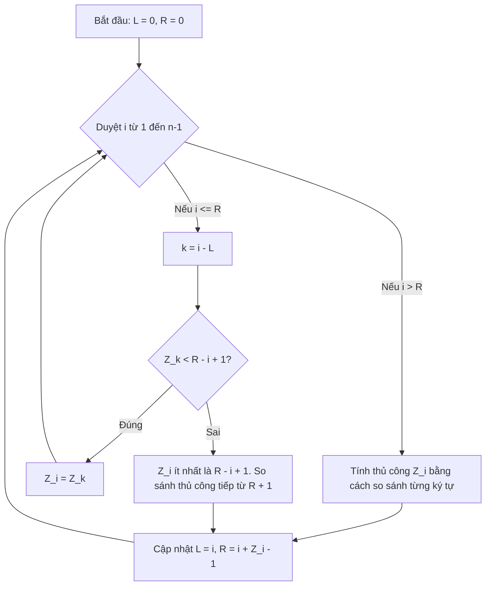

# Khóa học Cấu trúc Dữ liệu và Thuật toán - Z Algorithm

## 1. Metadata
- **Chủ đề:** Z Algorithm (Thuật toán Z)
- **Cấp độ:** Nâng cao (Advanced)
- **Thời gian học ước tính:** 2.5 giờ
- **Ngôn ngữ:** Java 21

## 2. Purpose
Mục đích của bài học này là giúp bạn hiểu và triển khai thuật toán Z-Algorithm. Đây là một thuật toán tuyến tính `O(n)` dùng để tìm kiếm chuỗi mẫu (pattern matching) và phân tích các tiền tố (prefixes) của một chuỗi. Nó đặc biệt hiệu quả trong việc tìm tất cả các lần xuất hiện của một pattern trong text.

## 3. Motivation
Tìm kiếm chuỗi là một trong những bài toán cơ bản nhất trong Computer Science. Nếu sử dụng cách tiếp cận ngây thơ (naive approach), độ phức tạp sẽ là `O(n * m)`. Z-Algorithm cung cấp một cách tiếp cận `O(n + m)` rất dễ hiểu và dễ cài đặt hơn so với KMP (Knuth-Morris-Pratt). Thay vì xây dựng mảng LPS phức tạp, Z-Algorithm trực tiếp tính toán độ dài chuỗi con dài nhất bắt đầu tại mỗi vị trí mà đồng thời cũng là tiền tố của chuỗi gốc.

## 4. Mathematical Foundation
Cho một chuỗi $S$ có độ dài $n$, mảng $Z$ (Z-array) là một mảng có cùng độ dài, trong đó $Z[i]$ (với $0 \le i < n$) là độ dài của chuỗi con dài nhất bắt đầu từ vị trí $i$ sao cho chuỗi con đó cũng là một tiền tố (prefix) của $S$.
- Toán học: $Z[i] = \max \{ k \mid S[0 \dots k-1] = S[i \dots i+k-1] \}$
- Mặc định: $Z[0] = 0$ (hoặc độ dài chuỗi $S$, nhưng thường bỏ qua không sử dụng).

## 5. Core Theory
Thuật toán xây dựng mảng Z duy trì một "cửa sổ" (window) `[L, R]` là chuỗi con trùng khớp với tiền tố dài nhất được tìm thấy cho đến nay, với $R$ là vị trí xa nhất (hướng về phía cuối chuỗi).
Khi tính $Z[i]$ cho vị trí hiện tại $i$:
1. Nếu $i > R$: Cửa sổ hiện tại không bao phủ $i$. Ta thực hiện so sánh trực tiếp $S[0 \dots]$ với $S[i \dots]$ để tìm $Z[i]$, sau đó cập nhật $L$ và $R$.
2. Nếu $i \le R$: Vị trí $i$ nằm trong cửa sổ. Ta có thể sử dụng thông tin đã tính trước đó vì $S[L \dots R]$ khớp với $S[0 \dots R-L]$. Vị trí tương ứng của $i$ ở phần đầu chuỗi là $k = i - L$.
   - Nếu $Z[k] < R - i + 1$: $Z[i] = Z[k]$. (Chuỗi khớp nằm trọn trong cửa sổ)
   - Nếu $Z[k] \ge R - i + 1$: $Z[i]$ ít nhất là $R - i + 1$. Ta phải tiếp tục so sánh thủ công từ $R + 1$ để mở rộng cửa sổ.

## 6. Visual Explanation


## 7. Java Implementation
```java
public class ZAlgorithm {
    /**
     * Xây dựng Z-array cho một chuỗi đầu vào.
     * @param s chuỗi đầu vào
     * @return mảng Z
     */
    public static int[] calculateZArray(String s) {
        int n = s.length();
        int[] Z = new int[n];
        int L = 0, R = 0;
        
        for (int i = 1; i < n; i++) {
            if (i > R) {
                L = R = i;
                while (R < n && s.charAt(R - L) == s.charAt(R)) {
                    R++;
                }
                Z[i] = R - L;
                R--;
            } else {
                int k = i - L;
                if (Z[k] < R - i + 1) {
                    Z[i] = Z[k];
                } else {
                    L = i;
                    while (R < n && s.charAt(R - L) == s.charAt(R)) {
                        R++;
                    }
                    Z[i] = R - L;
                    R--;
                }
            }
        }
        return Z;
    }

    /**
     * Tìm tất cả các lần xuất hiện của pattern trong text.
     */
    public static java.util.List<Integer> search(String text, String pattern) {
        java.util.List<Integer> result = new java.util.ArrayList<>();
        if (pattern == null || pattern.isEmpty()) return result;
        
        String concat = pattern + "$" + text;
        int[] Z = calculateZArray(concat);
        int pLen = pattern.length();
        
        for (int i = pLen + 1; i < Z.length; i++) {
            if (Z[i] == pLen) {
                result.add(i - pLen - 1);
            }
        }
        return result;
    }
}
```

## 8. Step-by-Step
Giả sử $S = \text{"aabzaab"}$.
1. `i = 1`: $S[1] = \text{'a'}, S[0] = \text{'a'} \Rightarrow Z[1] = 1, L=1, R=1$.
2. `i = 2`: $S[2] = \text{'b'} \neq S[0] = \text{'a'} \Rightarrow Z[2] = 0$. $i > R$, cập nhật thất bại.
3. `i = 3`: $S[3] = \text{'z'} \neq S[0] \Rightarrow Z[3] = 0$.
4. `i = 4`: $S[4] = \text{'a'}, S[5] = \text{'a'}, S[6] = \text{'b'}$. So sánh với $S[0..2] \Rightarrow Z[4] = 3, L=4, R=6$.
5. Mảng Z cuối cùng: `[0, 1, 0, 0, 3, 1, 0]`.

## 9. Complexity Analysis
- **Thời gian (Time Complexity):** $O(n)$ - Vòng lặp `while` bên trong chỉ tăng biến $R$, và $R$ chỉ tăng từ 0 đến $n-1$. Không bao giờ giảm. Do đó, tổng số phép so sánh ký tự tối đa là $n$.
- **Không gian (Space Complexity):** $O(n)$ - Cần mảng $Z$ kích thước $n$ để lưu trữ. Khi so khớp chuỗi, ta tạo chuỗi nối `Pattern + $ + Text` có độ dài $n + m$, tốn thêm không gian bộ nhớ.

## 10. JVM Analysis
- **String Concat:** Trong việc nối `Pattern + "$" + Text`, trên JVM (từ Java 9), nó sử dụng `StringConcatFactory` với `InvokeDynamic`. Tuy nhiên, tạo chuỗi mới có thể gây ra sức ép cho Garbage Collector (GC).
- **Tránh cấp phát chuỗi (Avoid String Allocation):** Trong Production, thay vì tạo chuỗi `concat`, ta có thể xử lý logic ảo `charAt()` để không tốn bộ nhớ tạo chuỗi mới.

## 11. OpenJDK Analysis
Thuật toán `String.indexOf(String)` trong OpenJDK sử dụng một phiên bản cải tiến (Intrinsics) thường dựa trên các tập lệnh SIMD (SSE4.2/AVX2) hoặc thuật toán Boyer-Moore-Horspool. Z-Algorithm không được sử dụng mặc định trong Java Standard Library, nhưng là nền tảng cốt lõi cho các thư viện xử lý văn bản phức tạp, nén dữ liệu (LZ77).

## 12. Production Usage
Z-Algorithm hiếm khi được sử dụng thay thế cho `String.indexOf` do có mảng lưu trữ phụ. Tuy nhiên, nó rất quan trọng trong:
- Các hệ thống sinh học tính toán (Computational Biology) tìm kiếm DNA sequences.
- Ứng dụng chống đạo văn (Plagiarism detection).
- Tối ưu bộ nhớ từ điển trong các hệ thống Search Engine thay vì Trie nếu kích thước từ khóa cố định.

## 13. Design Decisions
- **Dấu phân cách (Separator `$`):** Ký tự phân cách KHÔNG được xuất hiện trong cả Pattern và Text. Nếu có nguy cơ, ta có thể không ghép chuỗi mà xử lý mảng logic bằng cách tính mảng Z của Pattern trước, rồi khi duyệt Text duy trì L, R như bình thường.
- **Tại sao Z thay vì KMP?** Mảng Z mang ý nghĩa "tiền tố dài nhất bắt đầu từ i", trực quan và dễ ứng dụng trong nhiều bài toán tiền tố / hậu tố hơn là LPS (Longest Proper Prefix which is also Suffix).

## 14. Common Bugs (20 Lỗi Phổ Biến)
1. Cập nhật `R` sai vị trí, thường là `R = i + Z[i]` thay vì `R = i + Z[i] - 1`.
2. Không khởi tạo `L` và `R` bằng 0.
3. Chọn ký tự phân cách `$` có tồn tại trong văn bản hoặc mẫu.
4. Quên xử lý trường hợp Pattern rỗng.
5. Index out of bounds khi tăng `R` trong vòng lặp `while`.
6. Tính sai `k = i - L`.
7. Nhầm lẫn điều kiện `Z[k] < R - i + 1` thành `Z[k] <= R - i + 1`.
8. So sánh ký tự với `s.charAt(R - i)` thay vì `s.charAt(R - L)`.
9. `i` duyệt từ `0` thay vì `1`, khiến `Z[0]` bằng độ dài chuỗi, tạo vô hạn lặp hoặc sai kết quả.
10. Quên trừ đi `pLen + 1` khi trích xuất kết quả `result.add(i - pLen - 1)`.
11. Tạo mảng Z với kích thước sai.
12. Xử lý sai trường hợp Text ngắn hơn Pattern.
13. Không ép kiểu đúng khi Text cực kỳ lớn (Integer Overflow, dù ít gặp trong Java String).
14. Không trả về `List` trống khi Pattern null.
15. Không lùi lại `R--` sau vòng lặp `while`.
16. Thay đổi giá trị của chuỗi trong quá trình tính.
17. Bỏ qua việc kiểm tra ký tự tại `R` so với `R-L` đúng cách do sao chép nhầm mã KMP.
18. Không tối ưu bộ nhớ, bị OutOfMemoryError khi nối chuỗi dài.
19. Gắn nhầm giá trị của `Z[i]` khi `i > R` (quên set `Z[i] = R - L`).
20. Trả về Index tương đối của mảng concat thay vì index của mảng text gốc.

## 15. Edge Cases (30 Trường Hợp Góc)
1. Pattern rỗng.
2. Text rỗng.
3. Pattern dài hơn Text.
4. Pattern và Text giống hệt nhau.
5. Text chứa nhiều Pattern liên tiếp liền kề (vd: `aaaa`, pattern `aa`).
6. Text chứa nhiều Pattern chồng lấp (overlapping) (vd: `aaaa`, pattern `aaa`).
7. Pattern chỉ có 1 ký tự.
8. Pattern xuất hiện ở ngay đầu Text.
9. Pattern xuất hiện ở ngay cuối Text.
10. Text hoàn toàn không chứa Pattern.
11. Text và Pattern có các ký tự Unicode/Emoji.
12. Ký tự phân cách `$` bị chọn trùng với ký tự trong Text/Pattern.
13. Ký tự cách (Space) trong text và pattern.
14. Ký tự `\n`, `\r`, `\t` xen kẽ.
15. Chuỗi Text rất lớn (Gần giới hạn mảng).
16. Pattern lặp vô hạn `ababab...`.
17. Ký tự đặc biệt UTF-16 surrogate pairs bị tách (Z-algorithm mặc định tính theo character, có thể sai với code points).
18. Chữ hoa, chữ thường hỗn hợp (Case sensitivity).
19. Mảng Z toàn 0 (Không có ký tự nào khớp).
20. Tất cả các ký tự của Text đều giống nhau.
21. Ký tự phân cách nằm rải rác trong Text do nhầm lẫn logic.
22. Chuỗi Pattern chỉ gồm chu kỳ lặp lại (Period).
23. Text bị phân mảnh khi đọc từ Stream (Nếu không nạp đủ vào RAM).
24. Pattern chứa các ký tự Null (`\0`).
25. Mảng Z với kích thước 1.
26. Kết quả có số lượng matches cực lớn (chiếm hết RAM cho List).
27. Đếm số lượng Pattern không chồng lấp (Non-overlapping) khác với Overlapping.
28. Text lớn nhưng RAM JVM được cấp (`-Xmx`) rất bé.
29. Thử nghiệm trên chuỗi Fibonacci.
30. Chuỗi ngẫu nhiên (Entropy lớn).

## 16. Optimization
- **Memory Optimization:** Thay vì tạo chuỗi nối `Pattern + $ + Text`, hãy định nghĩa một hàm đóng gói logic ảo `charAt(index)`, có thể lấy ký tự từ `Pattern` nếu `index < pLen`, trả về `$` nếu `index == pLen` và từ `Text` nếu `index > pLen`.
- **Character Array:** Chuyển `String` thành `char[]` bằng `toCharArray()` để tránh overhead của method calls `charAt()`. Mặc dù tốn bộ nhớ hơn ở bước đầu, nó thường nhanh hơn trong các phép toán truy cập chỉ số liên tục.

## 17. Best Practices
- Sử dụng tên biến `L` và `R` viết hoa hoặc viết thường rõ ràng.
- Ghi chú đầy đủ điều kiện `Z[k] < R - i + 1`.
- Cẩn thận với việc sử dụng `String.concat` hay dấu `+` trong vòng lặp kín.
- Luôn tạo hằng số cho dấu phân cách, đảm bảo an toàn.
- Nếu không có nhu cầu trả về tất cả index, hãy chuyển List thành Callback function (ví dụ: `Consumer<Integer>`).

## 18. Benchmark
So sánh với `String.indexOf` và KMP:
- `String.indexOf`: Rất nhanh với chuỗi ngắn do Intrinsics. Chậm hơn `O(n*m)` ở Worst-case (ví dụ: Text `aaaa...a`, Pattern `aaaa...ab`).
- `KMP`: $O(n)$, tương đương Z-Algorithm.
- `Z-Algorithm`: $O(n)$, hằng số lớn hơn KMP một chút do thao tác mảng và so sánh biên, nhưng đôi khi dễ viết hơn KMP.

## 19. Unit Testing
```java
import org.junit.jupiter.api.Test;
import static org.junit.jupiter.api.Assertions.*;
import java.util.List;

public class ZAlgorithmTest {
    @Test
    public void testBasicSearch() {
        List<Integer> res = ZAlgorithm.search("aabzaab", "aab");
        assertEquals(List.of(0, 4), res);
    }
    
    @Test
    public void testOverlappingSearch() {
        List<Integer> res = ZAlgorithm.search("aaaa", "aa");
        assertEquals(List.of(0, 1, 2), res);
    }
    
    @Test
    public void testNoMatch() {
        List<Integer> res = ZAlgorithm.search("abcdef", "xyz");
        assertTrue(res.isEmpty());
    }
}
```

## 20. Interview Questions
1. Mảng Z lưu trữ giá trị gì?
2. Độ phức tạp thời gian và không gian của thuật toán tạo mảng Z là bao nhiêu?
3. Trình bày điều kiện `i > R` và `i <= R` trong thuật toán Z.
4. L và R trong thuật toán Z đại diện cho gì?
5. Tại sao không được tăng biến `R` quá độ dài của chuỗi?
6. Làm thế nào để tìm kiếm một mẫu trong một văn bản bằng Z-Algorithm?
7. Dấu phân cách `$` có vai trò gì? Điều gì xảy ra nếu ký tự đó tồn tại trong chuỗi?
8. Tại sao độ phức tạp của thuật toán Z lại là tuyến tính dù có vòng lặp lồng nhau?
9. Sự khác biệt chính giữa mảng Z và mảng LPS (trong KMP) là gì?
10. Làm thế nào để tính chu kỳ lặp (Period) của chuỗi bằng Z-Algorithm?
11. Z-Algorithm có hỗ trợ tìm kiếm không chồng lấp (non-overlapping matches) không?
12. Có thể sử dụng Z-algorithm trên mảng số nguyên (Integer Array) thay vì chuỗi không?
13. Bạn sẽ xử lý thế nào nếu văn bản quá lớn, không thể lưu hoàn toàn trong bộ nhớ?
14. Z-Algorithm hoạt động ra sao nếu pattern và text đều là chuỗi các số 0?
15. Hãy mô tả một bài toán thực tế mà Z-algorithm vượt trội hơn KMP.
16. Nếu thuật toán Boyer-Moore cũng tìm kiếm được, tại sao chúng ta lại học Z-Algorithm?
17. Mảng Z có thể dùng để kiểm tra tính Palindrome không? Bằng cách nào?
18. Bạn có thể đảo ngược mảng Z để tìm chuỗi gốc không? (Z-array to String).
19. Giải thích dòng `Z[i] = Z[k]` khi `Z[k] < R - i + 1`.
20. Tại sao `Z[0]` thường không được tính hoặc đặt là 0?

## 21. Practice Problems Link
- [LeetCode 28: Find the Index of the First Occurrence in a String](https://leetcode.com/problems/find-the-index-of-the-first-occurrence-in-a-string/)
- [LeetCode 2223: Sum of Scores of Built Strings](https://leetcode.com/problems/sum-of-scores-of-built-strings/)
- [Codeforces: Password](https://codeforces.com/problemset/problem/126/B)

## 22. Pattern Recognition
- Khi nào dùng Z-Algorithm?
  - Bài toán yêu cầu tính toán về "tiền tố" (Prefix).
  - Tìm độ dài tiền tố chung dài nhất giữa chuỗi và tất cả các hậu tố của nó.
  - Pattern matching cơ bản có thể dễ dàng ghép chuỗi.

## 23. Real Case Study
Trong hệ thống so sánh chuỗi DNA (Bioinformatics), DNA sequence bao gồm hàng triệu base pairs (A, C, G, T). Các nhà sinh học sử dụng Z-Algorithm hoặc Burrows-Wheeler Transform. Z-array giúp định vị nhanh các phần lặp của cấu trúc gen và các motif nhỏ.

## 24. Summary & Checklist
- [x] Hiểu định nghĩa của Z-array.
- [x] Nắm rõ ý nghĩa của cửa sổ `[L, R]`.
- [x] Thuộc cách phân nhánh luồng đi: `i > R` và `i <= R`.
- [x] Biết cách tránh Index Out Of Bounds khi code thực tế.
- [x] Ứng dụng thành công vào bài toán Pattern Matching.
