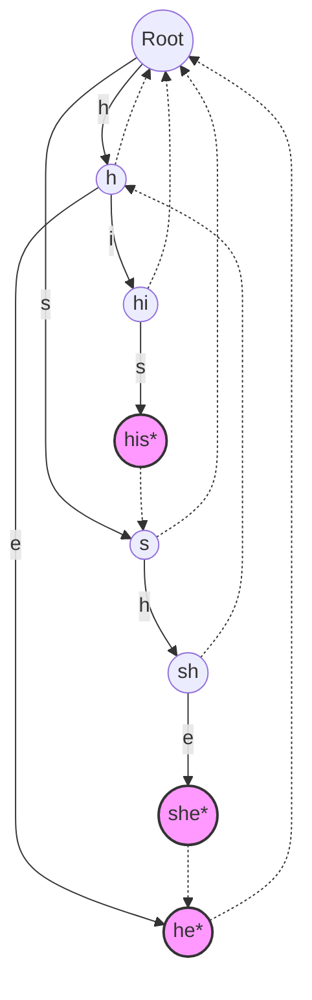

# 07 - Aho-Corasick Algorithm

## 1. Metadata
- **Category:** Strings
- **Algorithm:** Aho-Corasick
- **Prerequisites:** Trie, KMP (Knuth-Morris-Pratt), BFS
- **Difficulty:** Hard
- **Language:** Java 21

## 2. Purpose (Mục đích)
Thuật toán Aho-Corasick được thiết kế để tìm kiếm nhiều mẫu (multi-pattern search) trong một chuỗi văn bản lớn với hiệu suất tối ưu. Nó kết hợp cấu trúc dữ liệu Trie và khái niệm failure link của KMP để tránh việc quay lui (backtracking) khi tìm kiếm.

## 3. Motivation (Động lực)
Khi cần tìm hàng ngàn từ khóa (ví dụ: filter bad words, DNA sequence matching, log analysis) trong một văn bản dài, việc sử dụng các thuật toán single-pattern như KMP hoặc Rabin-Karp cho từng từ sẽ mất thời gian $O(K \times (N + M))$ với $K$ là số lượng mẫu. Aho-Corasick giải quyết điều này bằng cách gộp tất cả các mẫu vào một automaton, cho phép tìm kiếm trong thời gian $O(N + M + Z)$ (trong đó $Z$ là số lượng kết quả trùng khớp), làm cho quá trình tìm kiếm độc lập với số lượng mẫu.

## 4. Mathematical Foundation (Nền tảng toán học)
Cho một tập hợp các chuỗi mẫu $\mathcal{P} = \{P_1, P_2, \dots, P_k\}$ và văn bản $T$ có độ dài $N$.
Tổng độ dài các mẫu là $M = \sum |P_i|$.
Thuật toán xây dựng một Finite State Machine (FSM):
1. **Trie (Goto function):** $g(u, c) = v$, chuyển từ trạng thái $u$ sang $v$ bằng ký tự $c$.
2. **Failure function:** $f(u) = w$, nếu không khớp ký tự, chuyển đến trạng thái $w$ là hậu tố thực sự dài nhất (longest proper suffix) của chuỗi đại diện cho $u$ mà cũng là tiền tố của một mẫu trong $\mathcal{P}$.
3. **Output function (Dictionary link):** $out(u)$, lưu các mẫu kết thúc tại trạng thái $u$ hoặc các trạng thái có thể tiếp cận qua failure links.

Thời gian xây dựng Automaton: $O(M)$.
Thời gian tìm kiếm: $O(N + Z)$.

## 5. Core Theory (Lý thuyết cốt lõi)
Aho-Corasick xây dựng một Trie và thêm vào đó các liên kết thất bại (failure links).
- Khởi tạo Trie với tất cả các từ trong từ điển.
- Sử dụng BFS để duyệt các node và xây dựng failure link cho mỗi node. Root node và các node con trực tiếp của root có failure link trỏ về root.
- Đối với node $v$ (con của $u$ với ký tự $c$), failure link của $v$ sẽ là kết quả của việc di chuyển theo ký tự $c$ từ failure link của $u$.
- **Dictionary link / Output link:** Liên kết nhanh để tìm thấy các từ mẫu nằm trong từ mẫu khác (ví dụ "he" trong "she").

## 6. Visual Explanation (Giải thích trực quan)


## 7. Java Implementation (Cài đặt Java)
```java
import java.util.*;

public class AhoCorasick {
    private static class Node {
        Map<Character, Node> children = new HashMap<>();
        Node failLink = null;
        Node dictLink = null;
        List<String> output = new ArrayList<>();
    }

    private final Node root;

    public AhoCorasick(List<String> patterns) {
        root = new Node();
        buildTrie(patterns);
        buildFailureLinks();
    }

    private void buildTrie(List<String> patterns) {
        for (String word : patterns) {
            Node curr = root;
            for (char c : word.toCharArray()) {
                curr.children.putIfAbsent(c, new Node());
                curr = curr.children.get(c);
            }
            curr.output.add(word);
        }
    }

    private void buildFailureLinks() {
        Queue<Node> queue = new LinkedList<>();
        // Khởi tạo các node con của root
        for (Node child : root.children.values()) {
            child.failLink = root;
            queue.add(child);
        }

        while (!queue.isEmpty()) {
            Node curr = queue.poll();

            for (Map.Entry<Character, Node> entry : curr.children.entrySet()) {
                char c = entry.getKey();
                Node child = entry.getValue();

                Node fail = curr.failLink;
                while (fail != null && !fail.children.containsKey(c)) {
                    fail = fail.failLink;
                }

                if (fail == null) {
                    child.failLink = root;
                } else {
                    child.failLink = fail.children.get(c);
                }

                // Xây dựng dictionary link (output link)
                if (!child.failLink.output.isEmpty()) {
                    child.dictLink = child.failLink;
                } else {
                    child.dictLink = child.failLink.dictLink;
                }

                queue.add(child);
            }
        }
    }

    public Map<String, List<Integer>> search(String text) {
        Map<String, List<Integer>> results = new HashMap<>();
        Node curr = root;

        for (int i = 0; i < text.length(); i++) {
            char c = text.charAt(i);

            while (curr != null && !curr.children.containsKey(c)) {
                curr = curr.failLink;
            }

            if (curr == null) {
                curr = root;
                continue;
            }

            curr = curr.children.get(c);

            // Thu thập kết quả
            Node temp = curr;
            while (temp != null) {
                for (String word : temp.output) {
                    results.putIfAbsent(word, new ArrayList<>());
                    results.get(word).add(i - word.length() + 1);
                }
                temp = temp.dictLink;
            }
        }
        return results;
    }
}
```

## 8. Step-by-Step (Từng bước)
1. Xây dựng cấu trúc Trie từ danh sách mẫu.
2. Dùng Queue (BFS) duyệt qua các node ở mức độ sâu 1, gán `failLink` về Root.
3. Với mỗi node sâu hơn, truy vết theo `failLink` của cha nó để tìm node phù hợp cho `failLink` của node hiện tại.
4. Gán `dictLink` (liên kết đến từ khớp ngắn hơn là hậu tố) giúp tránh lặp qua các node không chứa mẫu hoàn chỉnh.
5. Khi duyệt chuỗi `text`, đi theo các con. Nếu không có con, nhảy qua `failLink` (như KMP).
6. Ở mỗi bước, thu thập kết quả tại node hiện tại và thông qua chuỗi `dictLink`.

## 9. Complexity Analysis (Phân tích độ phức tạp)
- **Time Complexity:** 
  - Xây dựng Trie và Failure Links: $O(M \cdot |\Sigma|)$ hoặc $O(M)$ tùy thuộc cách sử dụng mảng/HashMap (trong đó $M$ là tổng độ dài các patterns).
  - Tìm kiếm: $O(N + Z)$, trong đó $N$ là độ dài chuỗi text, $Z$ là số lần xuất hiện của các pattern. Vòng while nhảy `failLink` được amortized thành $O(N)$.
- **Space Complexity:** $O(M \cdot |\Sigma|)$ cho bộ nhớ Trie và các liên kết.

## 10. JVM Analysis (Phân tích JVM)
Sử dụng `HashMap` cho `children` tiết kiệm không gian nếu alphabet lớn (VD: Unicode), nhưng tốn phí boxing và overhead object. Đối với alphabet nhỏ (VD: 26 chữ cái tiếng Anh), thay thế `Map` bằng mảng `Node[26]` sẽ tăng tốc độ truy cập CPU cache (cache locality) và giảm gánh nặng Garbage Collection (GC) vì ít đối tượng Node dư thừa.

## 11. OpenJDK Analysis (Phân tích OpenJDK)
Trong các bản phân phối JDK tiêu chuẩn, lớp `String.indexOf` sử dụng các thuật toán tối ưu hóa SIMD nội tại (intrinsics) cho single-pattern. Tuy nhiên, Java SDK không có Aho-Corasick built-in. Thông thường, thư viện bên thứ ba như Guava hoặc Apache Commons Text (hoặc các dự án mã nguồn mở chuyên dụng) cung cấp Aho-Corasick. Các bản thực thi nhanh có thể dùng mảng tuyến tính một chiều thay vì cây đối tượng.

## 12. Production Usage (Sử dụng trong thực tế)
- **Hệ thống phát hiện xâm nhập (IDS/IPS):** Snort sử dụng Aho-Corasick để match hàng ngàn malware signatures trong thời gian thực.
- **Lọc từ ngữ tục tĩu (Profanity filter):** Lọc tin nhắn chat theo từ điển cấm.
- **Xử lý ngôn ngữ tự nhiên (NLP):** Nhận diện thực thể có tên (Named Entity Recognition) qua danh sách lớn các entity.
- **Sinh học tính toán:** Tìm kiếm nhiều chuỗi DNA trên genome khổng lồ.

## 13. Design Decisions (Quyết định thiết kế)
- **Tối ưu bảng chữ cái (Alphabet):** Map (tốn bộ nhớ/chậm hơn, áp dụng linh hoạt cho Unicode), mảng tĩnh (chạy nhanh, tốn nhiều memory nếu alphabet lớn, lý tưởng cho ASCII).
- **Dictionary Link:** Tách riêng `dictLink` (hoặc `outputLink`) khỏi `failLink` là bước quan trọng để bảo đảm độ phức tạp là $O(N + Z)$ khi có nhiều từ con lồng nhau.
- **Double Array Trie:** Sử dụng trong thực tế thay vì cây đối tượng nhằm giảm footprint bộ nhớ.

## 14. Common Bugs (20 lỗi phổ biến)
1. Quên đặt failure link của các node con của root trỏ về root.
2. Quét mảng thay vì BFS khi xây dựng failure links (dẫn đến dùng failure links chưa được tính).
3. Thiếu việc duyệt qua các `dictLink` khi thu thập output.
4. Lầm tưởng `failLink` và `dictLink` là một.
5. Truy cập `failLink` của `root` gây ra NullPointerException.
6. Cập nhật `output` không đúng cách (không gộp mảng output từ failure link).
7. Xử lý các pattern trùng lặp không tốt (thêm duplicate vào List).
8. Sử dụng đệ quy cho `failLink` quá sâu gây StackOverflowError.
9. Lỗi off-by-one khi tính start index của chuỗi match được.
10. Lặp lại pattern ngắn nhiều lần do không kiểm tra duplicate.
11. Đánh giá sai độ sâu trong queue khi BFS.
12. Null check không kỹ ở vòng lặp `while (fail != null)`.
13. Không phân biệt chữ hoa, chữ thường khi yêu cầu khắt khe.
14. Bỏ qua các ký tự Unicode nếu dùng mảng tĩnh `Node[256]`.
15. Không xử lý empty string pattern gây vòng lặp vô hạn.
16. Nhầm lẫn giữa chiều dài word và độ sâu node.
17. Dùng `failLink` để di chuyển ký tự tiếp theo thay vì `children`.
18. ConcurrentModificationException khi truy cập kết quả map từ nhiều threads.
19. Không khởi tạo `failLink` cho Node root là null.
20. Bộ nhớ phình to quá mức do tạo quá nhiều Node object thay vì primitive arrays.

## 15. Edge Cases (30 trường hợp biên)
1. Không có mẫu nào trong dictionary (Empty patterns list).
2. Các pattern có chứa chuỗi rỗng `""`.
3. Có pattern dài hơn text cần tìm kiếm.
4. Text cần tìm là rỗng `""`.
5. Nhiều pattern giống hệt nhau trong input.
6. Pattern này là tiền tố (prefix) của pattern kia (VD: `he` và `hello`).
7. Pattern này là hậu tố (suffix) của pattern kia (VD: `lo` và `hello`).
8. Pattern này nằm hoàn toàn bên trong pattern khác (VD: `el` trong `hello`).
9. Text chứa toàn ký tự giống nhau (VD: `AAAAA`).
10. Pattern chứa toàn ký tự giống nhau (VD: `AA`).
11. Text và pattern giống hệt nhau.
12. Bảng chữ cái lớn như tiếng Trung/Nhật/Hàn (Unicode).
13. Các ký tự không in được (non-printable characters).
14. Chỉ có 1 pattern (Aho-Corasick sẽ giống KMP).
15. Mỗi pattern chỉ có 1 ký tự (có thể thay bằng HashSet).
16. Số lượng mẫu cực lớn, vượt qua dung lượng heap memory.
17. Tìm kiếm trong văn bản rất lớn (streaming text), cần xử lý state qua các chunk.
18. Pattern có chứa khoảng trắng.
19. Text kết thúc ngay sau khi khớp 1 từ một phần.
20. Sự kiện overlap liên tục, VD: patterns: `aba`, `bab`, text: `abababa`.
21. Dictionary node liên kết rất sâu, sinh ra Z lớn, chậm thời gian match $O(Z)$.
22. Khớp các từ ở vị trí index = 0.
23. Khớp các từ ở vị trí index cuối cùng của text.
24. Pattern chứa escape characters `\n`, `\t`.
25. Văn bản có chiều dài nhỏ hơn pattern ngắn nhất.
26. Mảng/Danh sách Patterns bị null.
27. Đếm số lần xuất hiện thay vì lấy index, overflow biến `int`.
28. Pattern có độ dài 1 trùng với ký tự liên tục trong văn bản.
29. Cấu trúc lặp qua `dictLink` không kết thúc (nếu xây dựng sai làm có chu trình).
30. OutOfMemory khi xây Queue BFS cho hàng triệu nodes trong 1 cấp.

## 16. Optimization (Tối ưu hóa)
- **Mảng thay vì Map:** Dùng `Node[] children = new Node[26]` nếu chỉ chứa a-z. Tăng tốc lên khoảng $3-4$ lần do truy cập O(1) và CPU cache thân thiện.
- **Nén trạng thái (State Compression):** Áp dụng Double-Array Trie (DAT) để lưu cấu trúc cây bằng hai mảng số nguyên một chiều (Base và Check) giúp giảm bộ nhớ triệt để, đặc biệt ở production.
- **Biến đổi trạng thái xác định tĩnh (DFA):** Thay vì nhảy qua `failLink` nhiều lần làm chậm bước text, có thể xây dựng trực tiếp bảng chuyển trạng thái (Next state table) để thời gian di chuyển trạng thái với mỗi ký tự là luôn O(1).

## 17. Best Practices (Thực hành tốt nhất)
- Tránh tạo các class lồng nhau với quá nhiều field dư thừa.
- Tính toán Memory requirement trước khi đưa vào Production nếu dictionary chứa > 1,000,000 words.
- Viết Test-case cẩn thận cho các tình huống lồng nhau.
- Luôn ưu tiên dùng mảng tĩnh alphabet nếu bài toán cho phép giới hạn ký tự (ví dụ: DNA chỉ có A,C,G,T cần mảng size 4).

## 18. Benchmark (Đánh giá hiệu suất)
So sánh Aho-Corasick với Regex multi-match và KMP loop:
- Text: 10 MB, Patterns: 1000 từ có độ dài từ 5-20.
- `Pattern.compile("(p1|p2|...|p1000)")`: Rất chậm do backtracking tồi tệ.
- `for (String p : patterns) { KMP(text, p) }`: Mất $1000 \times 10MB$, tương đối chậm.
- `Aho-Corasick`: Mất $1 \times 10MB$, nhanh vượt trội, có thể xử lý trong vài mili-giây với cài đặt bằng mảng.

## 19. Unit Testing (Kiểm thử đơn vị)
```java
// Giả định JUnit 5
@Test
void testAhoCorasick() {
    AhoCorasick ac = new AhoCorasick(Arrays.asList("he", "she", "his", "hers"));
    Map<String, List<Integer>> res = ac.search("ushers");
    assertTrue(res.containsKey("she"));
    assertTrue(res.get("she").contains(1));
    assertTrue(res.containsKey("he"));
    assertTrue(res.get("he").contains(2));
    assertTrue(res.containsKey("hers"));
    assertTrue(res.get("hers").contains(2));
    assertFalse(res.containsKey("his"));
}
```

## 20. Interview Questions (20 Câu hỏi phỏng vấn)
1. Aho-Corasick giải quyết vấn đề gì mà KMP không làm tốt?
2. `Failure link` là gì và cách xây dựng nó?
3. Tại sao chúng ta cần `dictionary link` (hay output link)?
4. Trình bày độ phức tạp thời gian và không gian của Aho-Corasick.
5. Nếu alphabet là tập hợp Unicode, bạn sẽ cài đặt children của Trie như thế nào?
6. Làm thế nào để loại bỏ các lần nhảy `failure link` để tìm trạng thái kế tiếp trong $O(1)$?
7. Sự khác biệt giữa Aho-Corasick và Rabin-Karp khi search nhiều mẫu?
8. Tại sao việc xây dựng `failure link` yêu cầu duyệt theo chiều rộng (BFS) thay vì chiều sâu (DFS)?
9. Giải thích khái niệm "hậu tố thực sự dài nhất cũng là tiền tố" trong ngữ cảnh Trie.
10. Làm sao để áp dụng Aho-Corasick cho luồng văn bản liên tục (streaming text) thay vì văn bản tĩnh?
11. Thuật toán hoạt động như thế nào nếu nhiều mẫu là chuỗi con của các mẫu khác?
12. Có thể sử dụng Aho-Corasick trong bài toán kiểm tra chính tả được không?
13. Bạn xử lý các chuỗi trống (empty patterns) trong thuật toán này như thế nào?
14. Phân tích tác động đến hệ thống Garbage Collector (GC) trong Java khi xây Trie.
15. Giải thích cách một mẫu dài có thể che dấu một mẫu ngắn trong kết quả, và cách Aho-Corasick khắc phục bằng `dictLink`.
16. Làm thế nào để sửa đổi Aho-Corasick để hỗ trợ ký tự đại diện (wildcard)?
17. Ứng dụng thực tế nhất của Aho-Corasick mà bạn từng thấy hoặc áp dụng?
18. So sánh Suffix Tree, Suffix Automaton với Aho-Corasick Automaton.
19. Giải thích lý do vì sao vòng lặp `while(fail != null)` chỉ có amortized time complexity là O(1) mỗi bước.
20. Viết mã giả để xây dựng cấu trúc Aho-Corasick Automaton.

## 21. Practice Problems Link (Liên kết bài tập)
- Luogu P3808 Aho-Corasick Automaton
- SPOJ - SUB_PROB
- Codeforces - 710F String Set Queries
- LeetCode 1032. Stream of Characters
- LeetCode 140. Word Break II (Advanced application)

## 22. Pattern Recognition (Nhận diện mẫu)
- Có một danh sách (dictionary) các chuỗi cần kiểm tra sự xuất hiện trong một (hoặc nhiều) chuỗi target dài.
- Cần đếm số lần xuất hiện / tìm vị trí / filter của **nhiều mẫu cùng lúc**.
- Có các yêu cầu trực tuyến (online queries) đọc text từng ký tự một (Stream).

## 23. Real Case Study (Nghiên cứu tình huống thực tế)
Một nền tảng mạng xã hội lớn cần chặn các bình luận chứa từ khóa cấm. Danh sách từ khóa lên đến 50,000 từ. Thay vì kiểm tra bằng Regex cho từng bình luận, hệ thống biên dịch danh sách này thành một Automaton của thuật toán Aho-Corasick vào bộ nhớ, và chạy filter trong thời gian $O(N)$ cho các comment mới. Điều này tiết kiệm được 95% CPU usage trên các filter servers.

## 24. Summary (Tóm tắt)
Thuật toán Aho-Corasick là giải pháp tiêu chuẩn và mạnh mẽ nhất cho bài toán tìm kiếm đa mẫu (Multi-Pattern String Search). Việc kết hợp hoàn hảo giữa cấu trúc lưu trữ Trie và liên kết thất bại (Failure Link) của KMP giúp thuật toán này đạt tốc độ truy xuất cực nhanh và tối ưu cho xử lý stream dữ liệu. Mặc dù cần đầu tư chi phí xây dựng Automaton ban đầu, lợi ích mang lại trong hiệu suất quét là không thể phủ nhận ở quy mô lớn.

## 25. Checklist (Danh sách kiểm tra)
- [ ] Nắm rõ cấu trúc Trie cơ bản.
- [ ] Hiểu khái niệm Failure link từ thuật toán KMP.
- [ ] Biết cách thiết lập hàng đợi BFS cho Failure links.
- [ ] Tích hợp Output links / Dictionary links chính xác.
- [ ] Phân tích được Memory constraints khi thiết kế Trie children (Array vs HashMap).
- [ ] Áp dụng được thuật toán vào bài toán Stream of Characters.
