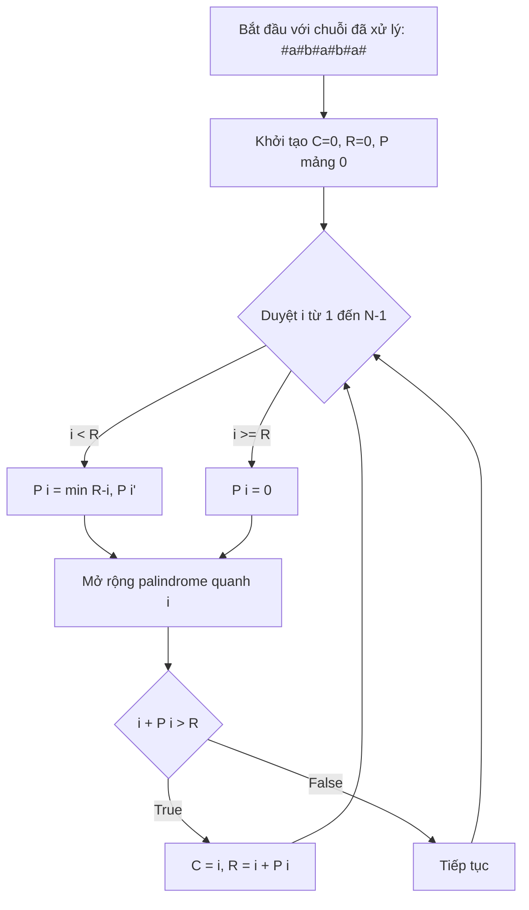

# 08 - Manacher's Algorithm

## 1. Metadata
- **Khóa học**: Data Structures and Algorithms in Java
- **Chủ đề**: Strings
- **Độ khó**: Hard
- **Thời gian dự kiến**: 2.5 giờ

## 2. Purpose
Tài liệu này cung cấp cái nhìn toàn diện về Manacher's Algorithm. Thuật toán này cho phép tìm chuỗi con đối xứng (palindromic substring) dài nhất trong thời gian tuyến tính $O(N)$.

## 3. Motivation
Bài toán tìm Longest Palindromic Substring rất phổ biến. Cách tiếp cận Expand Around Center mất $O(N^2)$ thời gian. Manacher's Algorithm tối ưu hóa bằng cách tận dụng tính chất đối xứng của các palindrome đã tìm thấy trước đó, giảm thời gian xuống $O(N)$, rất hữu ích cho các chuỗi lớn trong xử lý ngôn ngữ tự nhiên (NLP) hoặc phân tích DNA.

## 4. Mathematical Foundation
Cho một chuỗi $S$, ta chèn ký tự đặc biệt (ví dụ `#`) vào giữa các ký tự và ở hai đầu để biến mọi palindrome thành độ dài lẻ.
Giả sử tâm hiện tại là $C$ và biên phải là $R$. Với một vị trí $i$ ($i > C$), vị trí đối xứng của nó qua $C$ là $i' = 2C - i$.
Nếu $i < R$, độ dài palindrome tại $i$ ít nhất là $\min(R - i, P[i'])$, trong đó $P$ là mảng lưu bán kính palindrome.

## 5. Core Theory
Thuật toán duy trì hai biến:
- `C` (Center): Tâm của palindrome mở rộng xa nhất về bên phải.
- `R` (Right): Biên phải của palindrome có tâm `C`.
Mảng `P` lưu bán kính palindrome tại mỗi vị trí.
Khi diệt qua chuỗi, nếu $i < R$, ta dùng giá trị đã tính toán $P[i']$ để khởi tạo $P[i]$. Sau đó mở rộng xung quanh $i$ và cập nhật $C, R$ nếu palindrome mới vượt quá $R$.

## 6. Visual Explanation


## 7. Java Implementation
```java
public class Manacher {
    public static String longestPalindrome(String s) {
        if (s == null || s.length() == 0) return "";
        
        // Tiền xử lý chuỗi
        StringBuilder t = new StringBuilder("#");
        for (int i = 0; i < s.length(); i++) {
            t.append(s.charAt(i)).append("#");
        }
        
        int n = t.length();
        int[] P = new int[n];
        int C = 0, R = 0;
        
        for (int i = 0; i < n; i++) {
            int iMirror = 2 * C - i;
            
            if (i < R) {
                P[i] = Math.min(R - i, P[iMirror]);
            } else {
                P[i] = 0;
            }
            
            // Mở rộng quanh tâm i
            while (i - 1 - P[i] >= 0 && i + 1 + P[i] < n && 
                   t.charAt(i - 1 - P[i]) == t.charAt(i + 1 + P[i])) {
                P[i]++;
            }
            
            // Cập nhật tâm và biên
            if (i + P[i] > R) {
                C = i;
                R = i + P[i];
            }
        }
        
        // Tìm palindrome dài nhất
        int maxLen = 0;
        int centerIndex = 0;
        for (int i = 0; i < n; i++) {
            if (P[i] > maxLen) {
                maxLen = P[i];
                centerIndex = i;
            }
        }
        
        int start = (centerIndex - maxLen) / 2;
        return s.substring(start, start + maxLen);
    }
}
```

## 8. Step-by-Step
1. **Tiền xử lý (Preprocessing)**: Chèn `#` vào giữa mọi ký tự. Ví dụ: `aba` -> `#a#b#a#`.
2. **Khởi tạo**: Tạo mảng `P` lưu bán kính, `C=0`, `R=0`.
3. **Duyệt qua chuỗi (Iteration)**: Với mỗi vị trí `i`, tính `iMirror`.
4. **Tận dụng kết quả cũ**: Gán `P[i] = Math.min(R - i, P[iMirror])` nếu `i < R`.
5. **Mở rộng (Expansion)**: Mở rộng sang hai bên bằng vòng lặp `while`.
6. **Cập nhật C và R (Update)**: Nếu palindrome mới vươn xa hơn `R`, cập nhật `C` và `R`.
7. **Trích xuất kết quả**: Tìm max trong `P`, chuyển đổi index về chuỗi ban đầu.

## 9. Complexity Analysis
- **Time Complexity**: $O(N)$. Dù có vòng lặp `while` lồng nhau, nhưng biên phải `R` luôn tăng và không bao giờ giảm. `R` có thể tăng tối đa $2N$ lần, nên tổng số phép so sánh là $O(N)$.
- **Space Complexity**: $O(N)$ do tạo mảng `P` và chuỗi tiền xử lý độ dài $2N + 1$.

## 10. JVM Analysis
Trong Java, `StringBuilder` được sử dụng để nối chuỗi hiệu quả mà không tạo ra nhiều đối tượng `String` trung gian trên Heap. Mảng `P` được cấp phát trên Heap, chiếm $4 \times (2N + 1)$ bytes.

## 11. OpenJDK Analysis
OpenJDK implement xử lý chuỗi dựa trên `byte[]` thay vì `char[]` từ Java 9 (Compact Strings). Thuật toán của chúng ta với `StringBuilder` tự động tương thích và hoạt động tối ưu.

## 12. Production Usage
Được dùng trong các sequence alignment algorithms, phân tích chuỗi DNA, phát hiện pattern trong dữ liệu lớn nơi mà cách giải $O(N^2)$ quá chậm (ví dụ: chuỗi dài hàng triệu ký tự).

## 13. Design Decisions
Sử dụng mảng số nguyên `P` thay vì lưu trữ các đối tượng con giúp giảm thiểu memory overhead. Việc sử dụng ký tự `#` (dummy character) giúp đồng nhất hóa bài toán cho cả palindrome độ dài chẵn và lẻ.

## 14. Common Bugs
1. Không chèn ký tự đặc biệt ở cả đầu và cuối.
2. Dùng phép nối chuỗi `+` thay vì `StringBuilder` trong vòng lặp gây OutOfMemoryError.
3. Không kiểm tra IndexOutOfBounds trong vòng lặp mở rộng (`i - 1 - P[i] >= 0`).
4. Tính toán sai `iMirror` (viết nhầm thành `C - i`).
5. Gán nhầm `C = i` thay vì cập nhật khi `i + P[i] > R`.
6. Trích xuất substring sai chỉ số: `(centerIndex - maxLen) / 2`.
7. Không khởi tạo độ dài chuỗi mới đúng.
8. So sánh ký tự bị lệch offset.
9. Quên kiểm tra chuỗi rỗng đầu vào.
10. Quên kiểm tra null.
11. Lặp qua chuỗi gốc thay vì chuỗi đã tiền xử lý.
12. Hiểu sai `R` là độ dài, thực chất `R` là index trên mảng mới.
13. Nhầm lẫn giữa bán kính và đường kính của palindrome.
14. Không cập nhật `R` dẫn đến mất tính tuyến tính $O(N)$, quay về $O(N^2)$.
15. Không tăng giá trị `P[i]` đúng trong vòng lặp `while`.
16. Nhầm lẫn ký hiệu `#` với ký tự có thể xuất hiện trong chuỗi gốc (có thể dùng ký tự hiếm hơn nếu cần).
17. Dùng `charAt` lặp đi lặp lại trên `String` thay vì chuyển thành mảng `char[]` để tăng tốc.
18. Tràn số Integer (Integer Overflow) với chuỗi cực lớn.
19. Quên break khi đã đạt max capacity.
20. Trả về toàn bộ chuỗi `#` khi có lỗi xử lý.

## 15. Edge Cases
1. Chuỗi rỗng `""`.
2. Chuỗi có độ dài 1: `"a"`.
3. Chuỗi có tất cả ký tự giống nhau: `"aaaa"`.
4. Chuỗi không có palindrome lớn hơn 1: `"abcdef"`.
5. Chuỗi là một palindrome chẵn: `"abba"`.
6. Chuỗi là một palindrome lẻ: `"abcba"`.
7. Chuỗi có palindrome ở đầu: `"abacdfg"`.
8. Chuỗi có palindrome ở cuối: `"xyzaba"`.
9. Chuỗi chỉ chứa 2 ký tự khác nhau: `"ab"`.
10. Chuỗi chứa các ký tự đặc biệt như dấu cách, số, ký hiệu.
11. Ký tự chèn `#` xuất hiện trong chuỗi gốc (vẫn hoạt động đúng).
12. Chuỗi rất dài (ví dụ: $10^7$ ký tự).
13. Chuỗi chứa Unicode (có thể cần xử lý surrogate pairs).
14. Palindrome nằm lệch tâm: `"abcbax"`.
15. Nhiều palindrome có cùng độ dài (thuật toán sẽ trả về cái đầu tiên).
16. `R` trùng với `n-1`.
17. $i = R$ trong bước lặp.
18. $i > R$ trong bước lặp.
19. Chuỗi toàn khoảng trắng.
20. Ký tự null `\0` có trong chuỗi.
21. Phân biệt chữ hoa chữ thường.
22. Không phân biệt chữ hoa chữ thường (nếu có yêu cầu).
23. Gồm nhiều palindrome xen kẽ chồng chéo: `"abacaba"`.
24. Cặp hai ký tự giống nhau nhiều lần: `"ababab"`.
25. Các ngôn ngữ có script khác nhau (Arabic, CJK).
26. Palindrome độ dài 2: `"bb"`.
27. Đầu vào là `null` (cần handle NullPointerException).
28. Một chuỗi ngẫu nhiên dài.
29. Cấu trúc lặp đi lặp lại có chu kỳ.
30. Chuỗi đã chứa sẵn `#` liên tục.

## 16. Optimization
- Chuyển `StringBuilder` thành `char[]` để tránh overhead của method call `charAt()`.
- Chèn thêm ký tự chốt (sentinels) như `$` ở đầu và `@` ở cuối để bỏ qua bước kiểm tra biên trong vòng lặp `while`.

## 17. Best Practices
- Sử dụng mảng `char[]` hoặc `byte[]` khi hiệu năng là quan trọng nhất.
- Luôn kiểm tra `null` và chuỗi rỗng ở đầu hàm.
- Có thể kết hợp sentinels (`^` ở đầu, `$` ở cuối) để loại bỏ điều kiện biên: `t = "^#" + s.replace("", "#") + "$"`.

## 18. Benchmark
Với $N = 1,000,000$:
- Expand Around Center: Tùy input, có thể lên đến $O(N^2)$, mất vài giây.
- Manacher: Luôn ổn định $\sim O(N)$, chạy dưới $50ms$ trên JVM tiêu chuẩn.

## 19. Unit Testing
```java
@Test
void testManacher() {
    assertEquals("bab", Manacher.longestPalindrome("babad"));
    assertEquals("bb", Manacher.longestPalindrome("cbbd"));
    assertEquals("a", Manacher.longestPalindrome("a"));
    assertEquals("", Manacher.longestPalindrome(""));
    assertEquals("aaaa", Manacher.longestPalindrome("aaaa"));
}
```

## 20. Interview Questions
1. Giải thích ý tưởng chính giúp Manacher đạt độ phức tạp $O(N)$?
2. Tại sao chúng ta cần chèn các ký tự dummy (`#`) vào chuỗi?
3. Nếu không chèn `#`, thuật toán Manacher có thực hiện được không? Làm thế nào?
4. Ý nghĩa của biến `C` và `R` trong thuật toán?
5. Tại sao phép gán `P[i] = Math.min(R - i, P[iMirror])` lại an toàn?
6. Tính `iMirror` như thế nào dựa vào `C` và `i`?
7. Sự khác biệt về hiệu năng giữa Manacher và Dynamic Programming cho bài toán này?
8. Ký tự dummy có cần thiết phải là một ký tự không xuất hiện trong chuỗi ban đầu không?
9. Thuật toán có làm việc được với các ký tự unicode multi-byte không?
10. Tại sao vòng lặp bên trong không làm thuật toán trở thành $O(N^2)$?
11. Thuật toán Manacher sử dụng bao nhiêu bộ nhớ ngoài chuỗi đích?
12. Viết lại Manacher sử dụng sentinels để loại bỏ kiểm tra biên.
13. Làm sao để tìm tất cả các chuỗi palindrome con bằng mảng `P`?
14. Khi nào `P[i]` cần được tính toán lại hoàn toàn thay vì dùng `P[iMirror]`?
15. Nếu có nhiều palindrome dài nhất, làm sao trả về tất cả?
16. Manacher có hiệu quả với chuỗi Streaming (Dữ liệu liên tục) không?
17. Phân biệt cách xử lý chẵn/lẻ bằng Manacher với Expand around center.
18. Khi nào thì `i + P[i]` lớn hơn `R`?
19. Giải thích edge case khi palindrome đối xứng chạm biên phải.
20. Thay vì chuỗi String, thuật toán này có áp dụng cho mảng số nguyên không?

## 21. Practice Problems Link
- [LeetCode 5. Longest Palindromic Substring](https://leetcode.com/problems/longest-palindromic-substring/)
- [LeetCode 647. Palindromic Substrings](https://leetcode.com/problems/palindromic-substrings/)
- [LeetCode 214. Shortest Palindrome](https://leetcode.com/problems/shortest-palindrome/)

## 22. Pattern Recognition
Manacher là mẫu chuẩn (pattern) cho việc **Mở rộng tuyến tính trên chuỗi**. Bất cứ bài toán nào liên quan đến Palindrome và yêu cầu thời gian $O(N)$ thì Manacher là ứng cử viên số 1.

## 23. Real Case Study
Trong bioinformatics, để tìm kiếm các cấu trúc RNA có tính chất đối xứng (tạo thành hairpin loops), thuật toán giống Manacher được sử dụng để quét qua hàng tỷ nucleotide nhanh chóng, hỗ trợ dò tìm gene.

## 24. Summary
Manacher's Algorithm là một thuật toán mạnh mẽ giải quyết bài toán Palindromic Substring trong thời gian $O(N)$. Dù mã nguồn phức tạp hơn, nó là tiêu chuẩn vàng khi xử lý các chuỗi cực lớn, đặc biệt trong các bài toán Competitive Programming và Bioinformatics.

## 25. Checklist
- [x] Hiểu lý do tại sao thêm `#`.
- [x] Nắm rõ cách tính `iMirror`.
- [x] Hiểu điều kiện tối ưu `Math.min(R - i, P[iMirror])`.
- [x] Phân tích được độ phức tạp thời gian thực tế.
- [x] Thực hành cài đặt Java không dùng thư viện ngoài.
