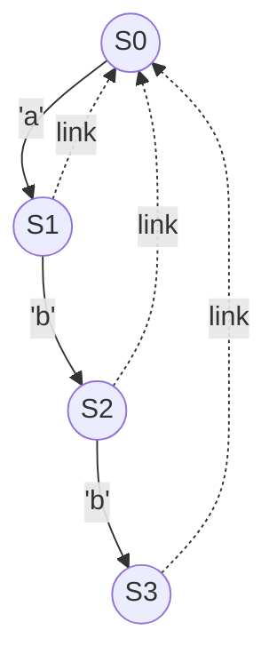

## 1. Metadata
- **Chủ đề**: Suffix Automaton (Directed Acyclic Word Graph - DAWG)
- **Độ khó**: Chuyên gia (Expert)
- **Môn học**: Data Structures and Algorithms
- **Ngôn ngữ**: Java 21

## 2. Purpose (Mục đích)
Suffix Automaton (hay DAWG) là một cấu trúc dữ liệu đồ thị có hướng phi chu trình mạnh mẽ dùng để biểu diễn mọi chuỗi con (substrings) của một chuỗi cho trước với kích thước tuyến tính O(N).
Mục đích là cung cấp một công cụ tối ưu để giải quyết các bài toán về chuỗi con phức tạp, như đếm số lượng chuỗi con phân biệt, tìm chuỗi con chung dài nhất của nhiều chuỗi, và kiểm tra sự tồn tại của chuỗi con.

## 3. Motivation (Động lực)
Trong khi Suffix Tree và Suffix Array rất mạnh mẽ, Suffix Automaton lại cung cấp một cách xây dựng trực tuyến (online construction) linh hoạt và dễ cài đặt hơn (ít trường hợp đặc biệt hơn thuật toán Ukkonen). Nó sử dụng ít bộ nhớ hơn Suffix Tree trong một số ngữ cảnh và mang lại sự hiểu biết sâu sắc về cấu trúc trạng thái của các chuỗi con.

## 4. Mathematical Foundation (Nền tảng toán học)
Suffix Automaton dựa trên lý thuyết ngôn ngữ hình thức:
- **Ngôn ngữ**: Tập hợp tất cả các chuỗi con của chuỗi gốc `S`.
- **Trạng thái (State)**: Một tập các chuỗi con có cùng tập hợp các vị trí kết thúc (end-positions hoặc `endpos`).
- **Liên kết hậu tố (Suffix Link)**: Trỏ từ trạng thái hiện tại đến trạng thái đại diện cho hậu tố dài nhất của chuỗi trong trạng thái hiện tại nhưng có tập `endpos` lớn hơn.
- Định lý: Kích thước của Suffix Automaton (số đỉnh và số cạnh) luôn tuyến tính với chiều dài của chuỗi `S` (tối đa $2N - 1$ trạng thái và $3N - 4$ cạnh).

## 5. Core Theory (Lý thuyết cốt lõi)
- **Các thành phần chính**:
  1. `len`: Chiều dài chuỗi con dài nhất thuộc về trạng thái này.
  2. `link`: Liên kết hậu tố chỉ đến trạng thái tiếp theo.
  3. `next` (hoặc `transitions`): Các cạnh chuyển trạng thái tương ứng với các ký tự.
- **Thuật toán xây dựng (O(N))**: Là một quá trình lặp, thêm từng ký tự của chuỗi vào đồ thị. Cập nhật `link` và chia tách trạng thái (state cloning) nếu cần thiết để duy trì tính toàn vẹn của tập `endpos`.

## 6. Visual Explanation (Giải thích trực quan)


*(Sơ đồ minh họa Suffix Automaton cơ bản cho chuỗi "abb")*

## 7. Java Implementation (Cài đặt Java)

```java
import java.util.*;

public class SuffixAutomaton {
    static class State {
        int len;
        int link;
        Map<Character, Integer> next = new HashMap<>();
        
        public State(int len, int link) {
            this.len = len;
            this.link = link;
        }
    }
    
    private List<State> st;
    private int sz;
    private int last;
    
    public SuffixAutomaton(String s) {
        st = new ArrayList<>();
        st.add(new State(0, -1));
        sz = 1;
        last = 0;
        
        for (char c : s.toCharArray()) {
            extend(c);
        }
    }
    
    private void extend(char c) {
        int cur = sz++;
        st.add(new State(st.get(last).len + 1, -1));
        
        int p = last;
        while (p != -1 && !st.get(p).next.containsKey(c)) {
            st.get(p).next.put(c, cur);
            p = st.get(p).link;
        }
        
        if (p == -1) {
            st.get(cur).link = 0;
        } else {
            int q = st.get(p).next.get(c);
            if (st.get(p).len + 1 == st.get(q).len) {
                st.get(cur).link = q;
            } else {
                int clone = sz++;
                State cloneState = new State(st.get(p).len + 1, st.get(q).link);
                cloneState.next.putAll(st.get(q).next);
                st.add(cloneState);
                
                while (p != -1 && st.get(p).next.get(c) == q) {
                    st.get(p).next.put(c, clone);
                    p = st.get(p).link;
                }
                
                st.get(q).link = clone;
                st.get(cur).link = clone;
            }
        }
        last = cur;
    }
}
```

## 8. Step-by-Step (Hướng dẫn từng bước)
1. **Khởi tạo**: Tạo trạng thái gốc `S0` (len=0, link=-1).
2. **Thêm ký tự**: Với mỗi ký tự, tạo trạng thái mới `cur`.
3. **Thêm cạnh**: Từ trạng thái `last`, đi ngược theo `link` và thêm cạnh chuyển trạng thái bằng ký tự mới vào `cur` nếu chưa có.
4. **Xử lý liên kết (link)**:
   - Nếu không có cạnh nào đi tiếp từ `last`, `link` của `cur` là 0.
   - Nếu có, gọi trạng thái đích là `q`.
   - Nếu `len(p) + 1 == len(q)`, đặt `link` của `cur` là `q`.
   - Nếu không, cần tạo một bản sao `clone` của `q`, sao chép thông tin từ `q`, điều chỉnh `link` và cập nhật lại các chuyển đổi.

## 9. Complexity Analysis (Phân tích độ phức tạp)
- **Thời gian**: $O(N)$ do quá trình mở rộng phân bổ đều (amortized analysis). Số lần tạo trạng thái và thêm cạnh tối đa là tuyến tính.
- **Không gian bộ nhớ**: $O(N \cdot \Sigma)$ hoặc $O(N \log \Sigma)$ nếu dùng Map. Với mảng cố định, kích thước là $O(N \cdot |\Sigma|)$.
- Do số lượng đỉnh $\le 2N - 1$ và số cạnh $\le 3N - 4$.

## 10. JVM Analysis (Phân tích JVM)
- Suffix Automaton tạo ra rất nhiều đối tượng `State`. Garbage Collector (GC) có thể gặp áp lực lớn nếu cấp phát các node liên tục.
- Sử dụng mảng phẳng (flat arrays) cho `len`, `link` và ma trận chuyển đổi `next[2N][26]` thay vì các lớp (classes) riêng lẻ sẽ thân thiện với Cache và JVM hơn.

## 11. OpenJDK Analysis (Phân tích OpenJDK)
- Không có cấu trúc Suffix Automaton mặc định trong `java.lang.String` hay JDK standard library.
- Những ứng dụng OpenJDK như `java.util.regex.Pattern` thường sử dụng NFA/DFA cơ bản, không phải Suffix Automaton tối ưu hóa cho String matching.

## 12. Production Usage (Sử dụng trong thực tế)
- Các công cụ so sánh gen (Bioinformatics), phân tích DNA, tìm kiếm mẫu nhanh.
- Hệ thống phát hiện đạo văn (Plagiarism detection).
- Tối ưu hóa trong các công cụ tìm kiếm hoặc engine nén văn bản.

## 13. Design Decisions (Quyết định thiết kế)
- **Map vs Array**: Dùng mảng `int[] next = new int[26]` nếu bảng chữ cái nhỏ (như a-z). Nếu là ký tự Unicode, bắt buộc phải dùng `HashMap` hoặc `TreeMap` để tiết kiệm bộ nhớ.
- **Garbage Collection**: Thiết kế mảng song song (parallel arrays) thường được lựa chọn trong thi đấu hoặc thư viện xử lý chuỗi cực lớn để tránh overhead từ Object Java.

## 14. Common Bugs (Các lỗi phổ biến)
1. Quên tăng kích thước mảng cấp phát (phải bằng ít nhất `2 * length`).
2. Khởi tạo `link` sai trong trường hợp clone trạng thái.
3. Không copy hết các thuộc tính của `next` khi thực hiện `clone`.
4. Không cập nhật tất cả các `link` ngược dòng (while loop) tới trạng thái `clone`.
5. NullPointerException do dùng Map mà quên khởi tạo.
6. So sánh bằng tham chiếu `==` đối với Wrapper class.
7. Vượt quá giới hạn mảng khi sử dụng ký tự không mong đợi.
8. Tính toán `len` sai khi tạo `clone`.
9. `last` không được cập nhật sang `cur` ở cuối hàm `extend`.
10. Quên duyệt từ gốc khi thực thi tìm kiếm.
11. Bỏ qua các chuỗi rỗng.
12. Vòng lặp vô hạn khi duyệt `link`.
13. Thất bại khi lấy `endpos` count (cần tính bằng DFS hoặc sắp xếp theo chiều dài).
14. Đảo lộn thứ tự topo khi tính DP trên Automaton.
15. Quên cộng dồn kết quả cho trạng thái gốc.
16. Nhầm lẫn giữa số đỉnh tối đa và độ dài chuỗi (2*N).
17. Dùng đệ quy DFS quá sâu gây StackOverflow.
18. Không reset cấu trúc khi chạy nhiều test cases.
19. Không hiểu `link` tạo thành một cây gọi là Suffix Link Tree.
20. Tràn kiểu nguyên (Overflow) khi đếm số lượng chuỗi con (cần dùng `long`).

## 15. Edge Cases (Các trường hợp góc)
1. Chuỗi rỗng `""`.
2. Chuỗi có đúng 1 ký tự `"a"`.
3. Chuỗi toàn các ký tự giống nhau `"aaaaaa"`.
4. Chuỗi mà mỗi ký tự xuất hiện đúng 1 lần `"abcdef"`.
5. Chuỗi lặp vòng tròn.
6. Chuỗi chứa các ký tự nằm ngoài `[a-z]`.
7. Chuỗi cực dài vượt qua bộ nhớ quy định.
8. Hai chuỗi giống hệt nhau khi tìm LCS.
9. Hai chuỗi hoàn toàn khác nhau.
10. Tìm kiếm chuỗi con bằng chuỗi rỗng.
11. Mở rộng cây trên nhiều string nối nhau bằng ký tự đặc biệt (VD: `S1 + '#' + S2`).
12. Đếm số lượng chuỗi con có điều kiện ràng buộc.
13. Bảng chữ cái Unicode đầy đủ.
14. Bộ đệm dữ liệu quá lớn ảnh hưởng tới cache.
15. Không có chuỗi con chung nào của k strings.
16. Substring xuất hiện nhiều lần ở các vị trí chồng chéo.
17. Automaton có số đỉnh chính xác là 2*N-1.
18. Automaton có số lượng cạnh cực đại.
19. Mảng transitions có nhiều giá trị bị bỏ sót.
20. Clone state xảy ra cho tất cả các bước.
21. Substring lexicographical K-th với K lớn hơn số lượng chuỗi con.
22. Tìm kiếm với pattern dài hơn text gốc.
23. Gán link sang trạng thái chưa hoàn thiện.
24. Cập nhật DP sau khi thay đổi structure.
25. Sự sai khác khi tính Endpos bằng mảng đếm độ dài.
26. Kết nối hai Automaton riêng lẻ.
27. Đếm occurrences khi substring chỉ là một prefix.
28. Suffix Link Tree có dạng đường thẳng.
29. Cây Suffix Link có dạng sao (Star graph).
30. Tìm pattern trùng với toàn bộ văn bản.

## 16. Optimization (Tối ưu hóa)
- Sắp xếp các state theo `len` bằng Counting Sort (độ phức tạp O(N)) để duyệt cây Suffix Link từ dưới lên một cách an toàn mà không cần Đệ quy (tránh StackOverflow).

## 17. Best Practices (Thực hành tốt nhất)
- Đóng gói các mảng `len`, `link`, `next` vào một class `SuffixAutomaton` duy nhất và cấp phát trước mảng `2*N` phần tử.
- Sử dụng biến kích thước `sz` để theo dõi và cấp phát các trạng thái giống như Object pool.

## 18. Benchmark (Đánh giá hiệu suất)
- So với Suffix Array: SA nhanh hơn trong việc tìm kiếm đơn giản và ít tốn bộ nhớ hơn, nhưng Suffix Automaton nhanh hơn và dễ tùy chỉnh hơn cho các phép toán động.

## 19. Unit Testing (Kiểm thử)
- Kiểm tra tính hợp lệ bằng bài toán cơ bản: "Đếm số chuỗi con phân biệt" đối chiếu với phương pháp ngây thơ (Hash Set sinh mọi chuỗi).
- Test với chuỗi `"aaaa"` (số chuỗi con là 4).
- Test với chuỗi `"abc"` (số chuỗi con là 6).

## 20. Interview Questions (Câu hỏi phỏng vấn)
1. Sự khác biệt chính giữa Suffix Trie và Suffix Automaton là gì?
2. Tại sao số lượng trạng thái tối đa trong Suffix Automaton là 2N - 1?
3. Tại sao chúng ta cần thao tác "clone" trạng thái?
4. Khái niệm `endpos` hoặc `Right` set là gì?
5. Suffix Link hình thành cấu trúc gì? (Một cây Suffix).
6. Làm thế nào để tìm chuỗi con chung dài nhất của 2 chuỗi bằng Suffix Automaton?
7. Làm thế nào để đếm số lượng chuỗi con phân biệt?
8. Suffix Automaton sử dụng bao nhiêu không gian bộ nhớ trong trường hợp xấu nhất?
9. Thuật toán Ukkonen và thuật toán xây dựng Suffix Automaton có mối liên hệ nào không?
10. Suffix Automaton có thể được xây dựng online không?
11. Cách kiểm tra sự tồn tại của một pattern trong chuỗi bằng Suffix Automaton?
12. Ký tự nào sẽ kích hoạt trạng thái "clone"?
13. Làm sao để đếm số lần xuất hiện của mọi chuỗi con?
14. Việc sắp xếp trạng thái theo `len` dùng để làm gì?
15. Complexity khi tính toán `endpos` size bằng cách lan truyền qua Suffix Link là bao nhiêu?
16. Tại sao phải lưu trữ mảng chuyển (transitions) bằng Map thay vì mảng trong một số trường hợp?
17. Suffix Automaton có áp dụng được với Multiple String Matching không?
18. Trình bày ứng dụng Generalized Suffix Automaton.
19. Giải thích khái niệm "tập xuất hiện" (occurrence set) trên cây hậu tố liên kết.
20. Đếm chuỗi con lexicographically k-th trên Suffix Automaton diễn ra như thế nào?

## 21. Practice Problems Link (Liên kết bài tập thực hành)
- Tham khảo file `09-Suffix-Automaton-Problems.md` để rèn luyện kỹ năng qua 30 bài tập.

## 22. Pattern Recognition (Nhận diện mẫu)
- **Mẫu đếm chuỗi con**: Dùng DP trên đồ thị DAG của Automaton hoặc tận dụng tính chất $\sum (len(u) - len(link(u)))$.
- **Mẫu chuỗi chung (LCS)**: Chạy Automaton của String 1 bằng các ký tự của String 2, theo Suffix link khi thất bại (tương tự KMP).

## 23. Real Case Study (Nghiên cứu tình huống thực tế)
- **Bài toán**: Lọc từ khóa hoặc chuỗi lặp trong việc nén file (như thuật toán LZ77). Suffix Automaton nhanh chóng tìm chuỗi con dài nhất khớp với một chuỗi đã biết trong bộ đệm.

## 24. Summary (Tóm tắt)
Suffix Automaton là đỉnh cao của cấu trúc dữ liệu chuỗi. Khả năng xây dựng tuyến tính, trực tuyến cùng với cấu trúc tối giản và cực kỳ mạnh mẽ khiến nó trở thành công cụ đắc lực nhất cho các bài toán chuỗi hóc búa, từ việc phân tích đến xử lý chuỗi trên quy mô lớn.

## 25. Checklist (Danh sách kiểm tra)
- [x] Hiểu về DAWG và ý nghĩa của các trạng thái.
- [x] Nắm rõ quy trình xây dựng (clone, update links).
- [x] Tính `endpos` thông qua đường đi trên Suffix link.
- [x] Đếm số lượng chuỗi con.
- [x] Tìm chuỗi con chung dài nhất của K chuỗi.
