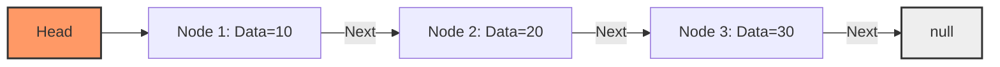

# 01 - Singly Linked List (Danh Sách Liên Kết Đơn)

## 1. Metadata
- **Tiêu đề:** Singly Linked List (Danh sách liên kết đơn)
- **Tác giả:** System
- **Ngôn ngữ:** Java 21
- **Chủ đề:** Data Structures
- **Mức độ:** Cơ bản đến Trung bình

## 2. Purpose (Mục đích)
Singly Linked List (Danh sách liên kết đơn) là một cấu trúc dữ liệu tuyến tính bao gồm các Node. Mỗi Node chứa dữ liệu (Data) và một tham chiếu (Reference/Pointer) trỏ đến Node tiếp theo trong danh sách. Mục đích chính là cung cấp khả năng chèn và xóa động (dynamic) hiệu quả mà không cần cấp phát lại toàn bộ mảng.

## 3. Motivation (Động lực)
Trong khi Array và ArrayList (mảng động) cung cấp khả năng truy cập ngẫu nhiên (O(1)), việc chèn hoặc xóa ở đầu hoặc giữa mảng đòi hỏi phải dịch chuyển các phần tử (O(N)). Singly Linked List giải quyết vấn đề này bằng cách cho phép chèn và xóa với độ phức tạp O(1) nếu ta đã biết vị trí của Node cần thao tác, lý tưởng cho việc triển khai Stacks, Queues và xử lý các Hash Collisions.

## 4. Mathematical Foundation (Nền tảng toán học)
Về mặt lý thuyết đồ thị, Singly Linked List có thể được coi là một đồ thị có hướng (directed graph) với bậc ra lớn nhất là 1, và tạo thành một đường đi đơn (simple path).
Công thức đệ quy của một danh sách:
`L = Empty | (Head, L')` với `L'` là phần còn lại của danh sách.

## 5. Core Theory (Lý thuyết cốt lõi)
- **Node:** Đơn vị cơ bản, bao gồm `value` (giá trị) và `next` (tham chiếu).
- **Head:** Node đầu tiên của danh sách. Nắm giữ tham chiếu để truy cập toàn bộ danh sách.
- **Tail (Tùy chọn):** Node cuối cùng, có `next` là `null`.
- **Traversal:** Phải duyệt tuần tự từ Head. Không có Random Access (truy cập ngẫu nhiên).

## 6. Visual Explanation (Giải thích trực quan)


## 7. Java Implementation (Cài đặt Java)
```java
public class SinglyLinkedList<T> {
    private static class Node<T> {
        T data;
        Node<T> next;
        
        Node(T data) {
            this.data = data;
            this.next = null;
        }
    }

    private Node<T> head;
    private Node<T> tail; // Tùy chọn để chèn O(1) ở đuôi
    private int size;

    public SinglyLinkedList() {
        // Dummy Head pattern: Giúp loại bỏ các trường hợp góc
        head = new Node<>(null);
        tail = head;
        size = 0;
    }

    public void insertFirst(T data) {
        Node<T> newNode = new Node<>(data);
        newNode.next = head.next;
        head.next = newNode;
        if (size == 0) {
            tail = newNode;
        }
        size++;
    }

    public void insertLast(T data) {
        Node<T> newNode = new Node<>(data);
        tail.next = newNode;
        tail = newNode;
        size++;
    }
}
```

## 8. Step-by-Step (Hướng dẫn từng bước)
**Chèn ở đầu (Insert at Head):**
1. Tạo một Node mới.
2. Trỏ `next` của Node mới tới `head.next`.
3. Cập nhật `head.next` thành Node mới.

**Xóa ở đầu (Delete at Head):**
1. Kiểm tra danh sách rỗng.
2. Lưu `head.next` vào một biến tạm.
3. Cập nhật `head.next` thành `head.next.next`.
4. JVM Garbage Collector sẽ tự động dọn dẹp Node bị cắt đứt.

## 9. Complexity Analysis (Phân tích độ phức tạp)
- **Truy cập (Access):** O(N)
- **Tìm kiếm (Search):** O(N)
- **Chèn (Insertion):** O(1) ở đầu hoặc có tham chiếu, O(N) ở đuôi (nếu không có biến tail).
- **Xóa (Deletion):** O(1) ở đầu, O(N) ở giữa hoặc đuôi.
- **Không gian lưu trữ (Space Complexity):** O(N) cho dữ liệu và con trỏ.

## 10. JVM Analysis (Phân tích JVM)
**Object References trong Java vs Pointers trong C/C++:**
- Trong C/C++, con trỏ (Pointer) chứa địa chỉ bộ nhớ thô và hỗ trợ tính toán số học (pointer arithmetic). Lập trình viên phải tự cấp phát (malloc) và giải phóng (free).
- Trong Java, `Node.next` là một Object Reference (tham chiếu đối tượng). Tham chiếu này được quản lý an toàn bởi JVM, không cho phép toán học con trỏ. Garbage Collector (GC) tự động quét và giải phóng các Node không thể chạm tới (Unreachable objects).
- **Memory Layout:** Mỗi đối tượng `Node` được cấp phát trên Heap. Nếu JVM sử dụng Compressed Oops (mặc định), Object Header tốn khoảng 12 bytes, cộng với không gian cho `data` reference (4 bytes) và `next` reference (4 bytes), tổng cộng tốn ít nhất khoảng 24 bytes mỗi Node. Sự phân mảnh Heap là một nhược điểm so với mảng liền kề.

## 11. OpenJDK Analysis (Phân tích OpenJDK)
Trong Java Standard Library, `java.util.LinkedList` là danh sách liên kết **đôi** (Doubly Linked List).
Tuy nhiên, cấu trúc Singly Linked List xuất hiện rất nhiều trong lõi của JDK, ví dụ tiêu biểu nhất là bên trong `java.util.HashMap` (xử lý xung đột Hash bằng chaining trước khi chuyển sang TreeNode).

## 12. Production Usage (Sử dụng trong thực tế)
- **Undo functionality:** Triển khai các stack đơn giản, nơi chỉ cần đẩy và lấy từ đầu.
- **Hash Table Collisions:** Xử lý các va chạm (collisions) với Separate Chaining.
- **Lock-free Data Structures:** `ConcurrentLinkedQueue` sử dụng các thuật toán không khóa phức tạp, dựa trên cấu trúc liên kết đơn với `AtomicReference`.

## 13. Design Decisions (Quyết định thiết kế)
**Dummy Head (Sentinel) Pattern:**
Sử dụng một Node giả ở đầu danh sách giúp loại bỏ hoàn toàn các trường hợp góc (edge cases) liên quan đến danh sách rỗng hoặc thao tác trực tiếp lên Head ban đầu. Thay vì phải viết `if (head == null)`, mọi thao tác chèn/xóa luôn được đảm bảo có một node liền trước (`prev`), làm cho logic thanh lịch và ít lỗi hơn.

## 14. Common Bugs (20 Lỗi phổ biến)
1. **NullPointerException (NPE) on Head:** Cố gắng truy cập `head.next` khi `head` là null.
2. **NPE on Tail:** Thao tác gọi `tail.next.next` dẫn đến lỗi.
3. **Losing Head Reference:** Di chuyển con trỏ `head` để duyệt danh sách, làm mất dấu phần đầu của danh sách.
4. **Memory Leaks:** Giữ tham chiếu tĩnh (static) đến các Node cũ ngăn chặn GC hoạt động.
5. **Infinite Loop (Cycle):** Vô tình tạo chu trình (cycle) trong danh sách khiến quá trình duyệt bị treo.
6. **Off-by-one errors:** Dừng duyệt sớm một bước hoặc quá một bước so với node đích.
7. **Forgetting to update Tail:** Thêm/Xóa node cuối nhưng không cập nhật biến `tail`.
8. **Improper Dummy Head usage:** Trả về biến tham chiếu đến Dummy Head thay vì `dummy.next`.
9. **Null Data manipulation:** Quên kiểm tra `Node.data == null` khi so sánh (sử dụng `.equals()`).
10. **Swapping Values instead of Nodes:** Một thiết kế tồi và tiềm ẩn lỗi khi đổi chỗ (swap) giá trị của Node thay vì tham chiếu.
11. **Updating `next` prematurely:** Gán `curr.next = new` trước khi lưu lại tham chiếu `curr.next` ban đầu, làm đứt gãy danh sách.
12. **ConcurrentModificationException:** Duyệt bằng iterator nhưng sửa đổi cấu trúc không thông qua iterator đó.
13. **Stale Node reuse:** Tái sử dụng một node đã xóa nhưng quên reset `next = null`.
14. **Incorrect Size tracking:** Tăng hoặc giảm biến `size` sai vị trí, làm sai lệch trạng thái list.
15. **Dangling Pointers in multi-threading:** Các luồng khác nhau cùng xóa node gây mất tính nhất quán.
16. **StackOverflowError:** Duyệt danh sách quá lớn bằng đệ quy (Recursive traversal).
17. **GC Pressure:** Tạo mới Node liên tục trong vòng lặp hiệu năng cao mà không tối ưu (ví dụ: pooling).
18. **Using `==` instead of `equals`:** So sánh đối tượng data bên trong Node bằng toán tử reference.
19. **Ignoring Return Values:** Viết các phương thức cập nhật (như Reverse) nhưng quên trả về Head mới.
20. **Self-referencing:** Node `a.next = a`, gây vòng lặp 1 node nếu không có kiểm tra cẩn thận.

## 15. Edge Cases (30 Trường hợp góc)
1. Danh sách hoàn toàn rỗng.
2. Danh sách chỉ có đúng 1 Node.
3. Danh sách có số lượng Node chẵn.
4. Danh sách có số lượng Node lẻ.
5. Chèn tại chỉ số 0.
6. Chèn tại chỉ số bằng đúng `size`.
7. Chèn tại chỉ số `size + 1` (Lỗi IndexOutOfBounds).
8. Xóa node duy nhất trong danh sách.
9. Xóa node đầu tiên (Head) trong danh sách có N node.
10. Xóa node cuối cùng (Tail).
11. Xóa vượt quá kích thước danh sách.
12. Tìm kiếm phần tử không tồn tại trong danh sách.
13. Tìm kiếm phần tử ngay tại Head.
14. Tìm kiếm phần tử ngay tại Tail.
15. Đảo ngược một danh sách rỗng.
16. Đảo ngược danh sách có 1 Node.
17. Tìm phần tử giữa (Middle Node) của danh sách rỗng.
18. Tìm Middle của danh sách 1 Node.
19. Tìm Middle của danh sách 2 Node (Phải xác định Node thứ 1 hay thứ 2 là kết quả).
20. Danh sách chứa chu trình tại Head.
21. Danh sách chứa chu trình trỏ lại chính nó tại Tail.
22. Có nhiều tham chiếu (pointers) cùng trỏ về một danh sách nhưng duyệt với tốc độ khác nhau.
23. Nhóm các Node bị trùng lặp ở ngay phần đầu danh sách.
24. Nhóm các Node bị trùng lặp ở cuối danh sách.
25. Mọi node trong danh sách đều có cùng giá trị (All elements are duplicates).
26. Kích thước (N) lớn đến mức vượt quá Integer.MAX_VALUE (trên lý thuyết).
27. Đảo ngược theo nhóm k (k-Group) khi k = 1.
28. Đảo ngược theo nhóm k khi k > size.
29. Hợp nhất hai danh sách, trong đó một list rỗng.
30. Hợp nhất hai list có số lượng node bằng nhau chính xác.

## 16. Optimization (Tối ưu hóa)
- **Sử dụng biến Tail:** Giảm độ phức tạp chèn đuôi từ O(N) xuống O(1).
- **Tránh đệ quy:** LinkedList với đệ quy tốn O(N) bộ nhớ Call Stack, có rủi ro `StackOverflowError`. Nên ưu tiên vòng lặp Iterative (O(1) không gian).

## 17. Best Practices (Thực hành tốt nhất)
- Gói gọn Class `Node` dưới dạng biến `private static` bên trong lớp danh sách.
- Luôn sử dụng Dummy Head khi thực hiện các thao tác gỡ bỏ/chèn phức tạp.
- Dùng từ khóa `final` cho các Node khi có thể để nhấn mạnh tính Immutability nếu phù hợp.
- Cập nhật cả biến `size` nếu danh sách cần biết kích thước nhanh (O(1)).

## 18. Benchmark (Đo lường hiệu suất)
So sánh với `ArrayList`:
- **Chèn ngẫu nhiên ở đầu:** LinkedList siêu tốc O(1), ArrayList O(N) do phải dịch chuyển toàn bộ mảng.
- **Truy cập index thứ i:** ArrayList O(1), LinkedList chậm dần đều O(N).
- **Yếu tố bộ nhớ đệm (Cache Locality):** ArrayList nằm liền kề trong bộ nhớ, CPU Cache tối ưu. LinkedList trỏ đến các đối tượng phân tán trên Heap, dẫn đến Cache Miss rất cao trong môi trường Production.

## 19. Unit Testing (Kiểm thử đơn vị)
```java
@Test
public void testInsertAndSize() {
    SinglyLinkedList<Integer> list = new SinglyLinkedList<>();
    list.insertFirst(10);
    list.insertLast(20);
    assertEquals(2, list.getSize());
}
```
Các trường hợp kiểm thử quan trọng: List rỗng, List 1 phần tử, Thêm/Xóa liên tục tại 2 đầu.

## 20. Interview Questions (20 Câu hỏi phỏng vấn)
1. Sự khác biệt giữa Array và Linked List là gì?
2. Cách đảo ngược (Reverse) một Singly Linked List?
3. Cách tìm Node giữa (Middle Node) trong một lần duyệt? (Gợi ý: Fast/Slow pointers)
4. Làm sao để phát hiện danh sách có chu trình (Cycle Detection)?
5. Làm sao để tìm Node bắt đầu của chu trình?
6. Làm sao để xóa Node thứ N tính từ cuối lên (Nth node from the end)?
7. Làm sao để hợp nhất hai danh sách đã sắp xếp?
8. Tại sao Singly Linked List không phù hợp cho Binary Search?
9. "Dummy Head" / "Sentinel Node" là gì?
10. Làm sao để kiểm tra Singly Linked List có phải là Palindrome?
11. Nêu cách chia một danh sách thành các phần chẵn - lẻ (Odd-Even Linked List).
12. Làm sao để tìm giao điểm (Intersection) của 2 Linked List?
13. Clone một Linked List có một con trỏ `random` như thế nào?
14. Phân tích chi phí bộ nhớ của Linked List trên JVM?
15. Có thể chèn 1 node trong O(1) nếu chỉ có tham chiếu tới node đó (không có head) không?
16. Hủy toàn bộ List trong Java diễn ra như thế nào đối với Garbage Collector?
17. Viết thuật toán đảo ngược Linked List đệ quy.
18. Xóa các Node trùng lặp trong List chưa sắp xếp.
19. Giải thích kỹ thuật Floyd’s Tortoise and Hare.
20. Mảng tốt hơn Linked List ở khía cạnh CPU Caching như thế nào?

## 21. Practice Problems Link (Liên kết bài tập)
Xem file: `01-Singly-Linked-List-Problems.md`

## 22. Pattern Recognition (Nhận diện mẫu)
- **Fast and Slow Pointers:** Sử dụng hai con trỏ di chuyển với tốc độ khác nhau để tìm chu trình, node giữa.
- **Multiple Passes / Two Pointers:** Tìm chiều dài, sau đó duyệt lại (Ví dụ: Remove Nth Node từ cuối).
- **Dummy Node / Sentinel:** Mẫu chuẩn để loại trừ code check null đầu danh sách.

## 23. Real Case Study (Nghiên cứu tình huống thực tế)
**java.util.HashMap in Java 8+:**
Mỗi "bucket" trong HashMap khởi đầu là một Singly Linked List. Khi xảy ra xung đột (Collision), các cặp Key-Value mới được thêm vào cuối danh sách liên kết đơn này. Điều này tận dụng ưu điểm cấp phát linh hoạt. Khi danh sách vượt quá ngưỡng (mặc định 8 nodes), nó sẽ được chuyển đổi thành Red-Black Tree để duy trì hiệu suất tìm kiếm O(log N).

## 24. Summary & Checklist (Tổng kết & Danh sách kiểm tra)
**Tổng kết:** Singly Linked List cung cấp một bài học tuyệt vời về việc quản lý con trỏ (Object References) và thao tác cấu trúc dữ liệu không liền kề. Hiểu rõ nó là bước đệm để tiếp cận các cấu trúc phức tạp hơn như Trees và Graphs.
**Checklist:**
- [x] Hiểu cấu trúc Node và JVM Heap layout.
- [x] Có khả năng phân biệt Tham chiếu Java vs Con trỏ C/C++.
- [x] Triển khai thành công Chèn/Xóa/Duyệt.
- [x] Áp dụng thành thạo Mẫu Dummy Head.
- [x] Nắm rõ ít nhất 5 dạng bài Interview Patterns tiêu biểu (Reverse, Fast/Slow, Merge).
