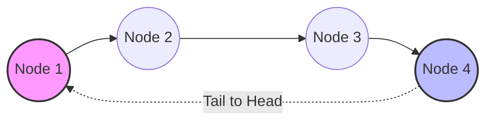
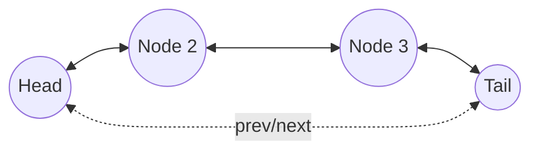

# Circular Linked List

## 1. Metadata
- **Khái niệm**: Circular Linked List (Danh sách liên kết vòng).
- **Môn học**: Data Structures and Algorithms (Cấu trúc dữ liệu và giải thuật).
- **Ngôn ngữ**: Java 21.
- **Mục tiêu**: Hiểu và cài đặt danh sách liên kết vòng, phân biệt Singly vs Doubly Circular, xử lý bài toán Josephus Problem.

## 2. Purpose
Circular Linked List là một biến thể của Linked List trong đó Node cuối cùng (Tail) trỏ ngược lại Node đầu tiên (Head), tạo thành một vòng khép kín. Mục đích là để duyệt qua các phần tử liên tục mà không có điểm kết thúc là `null`.

## 3. Motivation
Trong các hệ thống yêu cầu xử lý xoay vòng (như lập lịch CPU (Round Robin), bộ đệm vòng (Ring Buffer), trò chơi nhiều người chơi chơi theo lượt), một cấu trúc dữ liệu tuyến tính với `null` ở cuối gây khó khăn khi quay lại đầu. Circular Linked List giải quyết triệt để vấn đề này, loại bỏ cần thiết phải duy trì các chỉ số hoặc con trỏ phức tạp.

## 4. Mathematical Foundation
Trong Circular Linked List có $N$ Node, gọi các Node là $N_0, N_1, ..., N_{N-1}$.
Con trỏ `next` của Node $N_i$ sẽ là:
- $N_{i+1}$ nếu $0 \le i < N-1$
- $N_0$ nếu $i = N-1$

Bài toán Josephus Problem có thể được mô tả bằng đệ quy:
$J(n, k) = (J(n-1, k) + k - 1) \bmod n + 1$, với $J(1, k) = 1$.

## 5. Core Theory
- **Singly Circular Linked List**: Mỗi Node có 1 con trỏ `next`, Node cuối trỏ về Node đầu.
- **Doubly Circular Linked List**: Mỗi Node có con trỏ `prev` và `next`. `prev` của Head trỏ tới Tail, `next` của Tail trỏ tới Head.
- **Traversing**: Duyệt danh sách vòng cần lưu ý điều kiện dừng (dùng `do-while` thay vì `while (node != null)`) để tránh Infinite Loop.
- **Josephus Problem**: Một bài toán kinh điển mô phỏng việc loại bỏ Node thứ $k$ liên tục cho đến khi chỉ còn một Node duy nhất.

## 6. Visual Explanation





## 7. Java Implementation

```java
public class CircularLinkedList<T> {
    private static class Node<T> {
        T data;
        Node<T> next;
        Node(T data) {
            this.data = data;
        }
    }

    // Tracking the 'tail' instead of 'head' makes insertions at both ends O(1)
    private Node<T> tail;
    private int size;

    public CircularLinkedList() {
        this.tail = null;
        this.size = 0;
    }

    public void addFirst(T data) {
        Node<T> newNode = new Node<>(data);
        if (tail == null) {
            tail = newNode;
            tail.next = tail;
        } else {
            newNode.next = tail.next;
            tail.next = newNode;
        }
        size++;
    }

    public void addLast(T data) {
        addFirst(data);
        tail = tail.next; // Update tail to the newly added node
    }

    public void traverse() {
        if (tail == null) return;
        Node<T> current = tail.next; // head
        do {
            System.out.print(current.data + " -> ");
            current = current.next;
        } while (current != tail.next);
        System.out.println("(head)");
    }
}
```

## 8. Step-by-Step
- Khởi tạo: `tail` = null.
- `addFirst(data)`: Tạo `newNode`. Nếu rỗng, `tail = newNode`, `newNode.next = tail`. Ngược lại, `newNode.next = tail.next` (head hiện tại), `tail.next = newNode`.
- `addLast(data)`: Gọi `addFirst(data)` sau đó dời `tail = tail.next` để `newNode` trở thành tail mới.
- Xóa: Tìm Node cần xóa, cập nhật tham chiếu `next` của Node trước nó. Đặc biệt cẩn thận khi xóa `tail` hoặc Node duy nhất.

## 9. Complexity Analysis
- Thêm ở đầu (Insert Head): $O(1)$ nếu quản lý bằng con trỏ `tail`.
- Thêm ở cuối (Insert Tail): $O(1)$ nếu quản lý bằng con trỏ `tail`.
- Xóa ở đầu (Delete Head): $O(1)$.
- Xóa ở cuối (Delete Tail): $O(N)$ đối với Singly Circular (vì cần tìm Node kề trước `tail`), hoặc $O(1)$ với Doubly Circular.
- Tìm kiếm (Search): $O(N)$.
- Duyệt (Traversal): $O(N)$.

## 10. JVM Analysis
Các đối tượng `Node` liên tục trỏ vòng tròn có thể tạo ra Circular References (tham chiếu vòng). Tuy nhiên, Garbage Collector (GC) của JVM, vốn dựa trên thuật toán Mark-and-Sweep, dễ dàng dọn dẹp các Island of Isolation này nếu chúng không còn được Root (GC Roots) tham chiếu.

## 11. OpenJDK Analysis
OpenJDK không có cấu trúc Circular Linked List chuẩn trong `java.util`. Thay vào đó, người ta thường mô phỏng chức năng vòng bằng cách dùng `LinkedList` (danh sách liên kết đôi) hoặc `ArrayDeque` kết hợp với toán tử modulo (%). Tuy nhiên, các ThreadPool Executor có thể dùng Ring Buffer nội bộ (một dạng cấu trúc vòng trên mảng).

## 12. Production Usage
- **Round-Robin Scheduling**: Lập lịch cho các process hoặc threads.
- **Multiplayer Board Games**: Lưu danh sách người chơi, khi kết thúc lượt người chơi hiện tại, hệ thống chuyển sang `current.next`.
- **Ring Buffers**: Ứng dụng trong việc ghi log, xử lý luồng âm thanh hoặc video trong đó dữ liệu cũ nhất bị ghi đè khi hết bộ nhớ.

## 13. Design Decisions
Sử dụng con trỏ `tail` thay vì `head` là Design Decision quan trọng nhất cho Singly Circular Linked List. Do `tail.next` chính là `head`, việc giữ con trỏ `tail` cung cấp quyền truy cập $O(1)$ cho cả hai thao tác thêm vào đầu và thêm vào cuối, thay vì tốn $O(N)$ để duyệt từ `head` tới `tail` trong mỗi lần cần truy cập cuối danh sách.

## 14. Common Bugs
1. **Infinite Loop**: Dùng `while (node != null)` thay vì `do-while` để duyệt.
2. **Losing Head/Tail**: Quên cập nhật `tail.next` hoặc `tail` khi thay đổi kích thước danh sách.
3. **NullPointerException**: Truy cập `tail.next` khi danh sách đang trống (`tail == null`).
4. **Single Node Deletion**: Không xử lý đúng khi xóa Node duy nhất (quên set `tail = null`).
5. **Memory Leaks**: Trong C/C++, quên giải phóng bộ nhớ. Trong Java, giữ tham chiếu rác vòng tròn mà không cắt đi (GC xử lý được nhưng cắt tham chiếu là thói quen tốt).
6. Xóa `head` nhưng quên cập nhật `tail.next` trỏ về `head` mới.
7. Xóa `tail` nhưng quên cập nhật Node kề cuối thành `tail` mới và trỏ về `head`.
8. Duyệt không đến phần tử cuối cùng do điều kiện `current.next != head` bỏ qua phần tử `tail`.
9. Khởi tạo `Node` đầu tiên trỏ `next` vào `null` thay vì trỏ vào chính nó.
10. `size` không được cập nhật, gây lỗi logic vòng lặp nếu phụ thuộc vào kích thước.
11. Bỏ qua logic so sánh giá trị bằng `.equals()` mà dùng `==`.
12. Josephus Problem: Đếm $k$ bước sai (không phân biệt $k-1$ bước dịch chuyển).
13. Hàm insert sort trong vòng bị lỗi ở biên (khi thêm vào trước `head` hoặc sau `tail`).
14. Triển khai Doubly Circular quên cập nhật `prev` của `head` hoặc `next` của `tail`.
15. Không xử lý concurrency trong Multithreaded environments (cần synchronized hoặc locks).
16. Nhầm lẫn giữa Singly và Doubly Circular trong việc duyệt lùi.
17. Dùng `if` thay vì vòng lặp khi duyệt để xóa nhiều phần tử có giá trị trùng lặp.
18. Không ném ngoại lệ khi thực hiện poll/pop trên mảng vòng rỗng.
19. Iterator không kết thúc khi hoàn thành một vòng (không tuân thủ giao thức `hasNext()`).
20. Clone/Copy danh sách vòng nhưng lại chỉ tạo tham chiếu (Shallow Copy).

## 15. Edge Cases
1. Danh sách hoàn toàn trống (Empty).
2. Danh sách chỉ có đúng 1 Node (Tail = Head = Node).
3. Danh sách có đúng 2 Node.
4. Thêm phần tử vào danh sách đang trống.
5. Thêm phần tử trùng lặp vào đầu, cuối, giữa.
6. Xóa phần tử khi danh sách chỉ có 1 Node.
7. Xóa `head`.
8. Xóa `tail`.
9. Xóa phần tử không tồn tại trong danh sách.
10. Tìm kiếm phần tử ở vị trí đầu tiên.
11. Tìm kiếm phần tử ở vị trí cuối cùng.
12. Josephus Problem với $N=1$.
13. Josephus Problem với $k=1$ (Loại bỏ liên tục).
14. Josephus Problem với $k > N$.
15. Chèn có thứ tự (Sorted Insert) với giá trị nhỏ hơn `head`.
16. Chèn có thứ tự với giá trị lớn hơn `tail`.
17. Chèn có thứ tự vào danh sách có tất cả phần tử giống nhau.
18. Thay đổi tất cả các Node trong vòng lặp vô hạn.
19. Nối (Concatenate) 2 Circular Linked List trống.
20. Nối 1 Circular List trống và 1 có phần tử.
21. Nối 2 Circular Linked Lists bình thường.
22. Chia nửa (Split) danh sách vòng có độ dài chẵn.
23. Chia nửa danh sách vòng có độ dài lẻ.
24. Đảo ngược (Reverse) danh sách có 1 Node.
25. Đảo ngược danh sách có nhiều Node, kiểm tra liên kết `head-tail` sau đảo.
26. Danh sách có chu kỳ chẵn, lặp kiểm tra đối xứng.
27. Gọi Iterator liên tục qua nhiều vòng lặp.
28. Duyệt đệ quy (Recursive Traversal) và StackOverflow.
29. Thao tác đồng thời Thêm và Xóa trên các Thread khác nhau.
30. Clear() danh sách (hủy toàn bộ Node).

## 16. Optimization
- Lưu trữ độ dài `size` để thực hiện thao tác nhanh đối với index hoặc thao tác Josephus Problem.
- Sử dụng Doubly Circular Linked List nếu thao tác xóa `tail` hoặc tìm kề trước thường xuyên xảy ra.
- Tái sử dụng đối tượng (Object Pooling) để giảm tải GC nếu thêm/xóa rất nhiều.

## 17. Best Practices
- Sử dụng cấu trúc `do-while` để duyệt qua Circular Linked List.
- Luôn kiểm tra `null` ở những bước đầu tiên của bất kỳ phương thức nào.
- Nên bao bọc Circular List thành `Iterable` với Iterator tùy chỉnh giới hạn duyệt 1 vòng.
- Giữ code DRY (Don't Repeat Yourself): `addLast` có thể tận dụng `addFirst` bằng cách dời `tail`.

## 18. Benchmark
So sánh với Singly Linked List:
- Thao tác thêm cuối (Insert Last) nếu chỉ có `head`: Singly List mất $O(N)$, Circular List (có `tail`) mất $O(1)$.
- Duyệt một vòng từ phần tử bất kỳ: Singly List không thể làm được (sẽ gặp `null`), Circular List dễ dàng $O(N)$.
- Bộ nhớ: Hai loại cấu trúc dữ liệu dùng bộ nhớ ngang nhau.

## 19. Unit Testing
Các test case tiêu biểu (sử dụng JUnit 5):
- `testAddFirstAndLast`: Kiểm tra `tail.next` luôn trỏ về `head` mới.
- `testSingleNodeDeletion`: `list.delete(...)` khi có 1 Node làm cho `tail == null` và `size == 0`.
- `testJosephusExecution`: So sánh đầu ra của list với công thức đệ quy $O(N)$.
- `testDoWhileTraversal`: Đếm số lượng Node được duyệt bằng vòng lặp `do-while` phải bằng `size`.

## 20. Interview Questions
1. How do you traverse a Circular Linked List without an infinite loop?
2. What are the advantages of a Circular Linked List over a standard Singly Linked List?
3. How to check if a regular Linked List has a cycle/loop (Floyd’s Cycle-Finding)?
4. Can you convert a Singly Linked List into a Circular Linked List? How?
5. Write the logic for the Josephus Problem using a Circular Linked List.
6. How do you split a Circular Linked List into two halves?
7. Explain why keeping a `tail` pointer is more beneficial than a `head` pointer in a Circular List.
8. Implement insertion into a Sorted Circular Linked List.
9. How to delete a node from a Singly Circular Linked List with $O(1)$ time given only the reference to that node? (Copy data from next node, delete next node).
10. Reverse a Circular Linked List.
11. How to concatenate two Circular Linked Lists?
12. What happens to the JVM GC if we drop the reference to `tail`?
13. How would you implement a Circular Queue using a Circular Linked List?
14. Explain the difference between Ring Buffer (Array-based) and Circular Linked List.
15. Exchange the first and last nodes in a Circular Linked List.
16. Find the middle of a Circular Linked List.
17. Count the number of nodes in a Circular Linked List without `size` variable.
18. Check if a Doubly Linked List is circular.
19. Delete all occurrences of a given key in a Circular Linked List.
20. How do you serialize and deserialize a Circular Linked List?

## 21. Practice Problems Link
- [LeetCode 707: Design Linked List (Circular variant)](#)
- [LeetCode 141: Linked List Cycle](#)
- [LeetCode 1823: Find the Winner of the Circular Game](#)

## 22. Pattern Recognition
- **Cycle Detection**: Floyd’s Tortoise and Hare thuật toán 2 con trỏ ứng dụng phổ biến cho nhận diện vòng.
- **Modulo Arithmetic**: Nếu dùng Array mô phỏng vòng, thường có pattern `(index + 1) % capacity`.
- **Simulation**: Các bài toán lập lịch, chia bài thường áp dụng Circular List.

## 23. Real Case Study
- **Hệ điều hành Windows / Linux**: Quản lý các task đang chạy trên CPU (Round Robin). Scheduler giữ một Circular Linked List các Process Control Blocks (PCB). Khi CPU time slice của quá trình hiện tại kết thúc, OS lấy task tiếp theo bằng `current.next`.
- **Trình duyệt Web**: Nút Forward / Backward đôi khi được cấu hình theo vòng kín trong một số giao diện Kiosk giới hạn.

## 24. Summary & Checklist
- [x] Hiểu sự khác biệt giữa Singly List và Circular List.
- [x] Dùng `tail` pointer để tối ưu thao tác $O(1)$ ở hai đầu.
- [x] Áp dụng `do-while` để duyệt.
- [x] Hiểu và cài đặt được giải thuật mô phỏng cho Josephus Problem.
- [x] Nắm vững các edge cases khi danh sách có 1, 2 Node hoặc trống.
