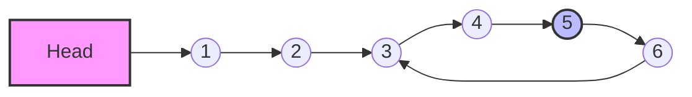

# 04. Fast and Slow Pointers Pattern (Mẫu con trỏ Nhanh và Chậm)

## 1. Metadata
- **Tiêu đề:** Fast and Slow Pointers Pattern (Mẫu con trỏ Nhanh và Chậm)
- **Tác giả:** DSA Curriculum Writer
- **Ngày tạo:** 2026-07-21
- **Phiên bản:** 1.0
- **Ngôn ngữ:** Java 21
- **Chủ đề:** Linked Lists, Two Pointers

## 2. Purpose (Mục đích)
Mẫu Fast and Slow Pointers (còn gọi là thuật toán Tortoise and Hare) là một kỹ thuật đắc lực để duyệt qua Linked List (danh sách liên kết) hoặc các cấu trúc tuần tự có khả năng xuất hiện Cycle (chu trình). Mục đích chính là phát hiện chu trình, tìm điểm giữa của danh sách, hoặc xác định các thành phần cấu trúc đặc biệt mà không cần sử dụng thêm bộ nhớ phụ (extra memory).

## 3. Motivation (Động lực)
Trong các bài toán thông thường, để phát hiện chu trình hoặc đếm số phần tử, ta thường cần sử dụng các cấu trúc dữ liệu như `HashSet` để lưu trữ trạng thái các Node đã duyệt qua. Điều này đòi hỏi độ phức tạp không gian (Space Complexity) là $O(N)$. Mẫu Fast and Slow Pointers cho phép giải quyết các vấn đề này với Space Complexity là $O(1)$, tối ưu hóa đáng kể việc sử dụng bộ nhớ trong hệ thống lớn.

## 4. Mathematical Foundation (Nền tảng toán học)
Nền tảng toán học của thuật toán dựa trên sự chênh lệch vận tốc. Giả sử:
- Con trỏ `slow` di chuyển 1 bước mỗi lần.
- Con trỏ `fast` di chuyển 2 bước mỗi lần.

Gọi:
- $L$ là khoảng cách từ Head đến Node bắt đầu chu trình (Start of cycle).
- $C$ là chu vi của chu trình.
- $k$ là khoảng cách từ điểm Start of cycle đến điểm hai con trỏ gặp nhau (Meeting point).

Khi hai con trỏ gặp nhau:
- Quãng đường `slow` đi được: $D_{slow} = L + k$
- Quãng đường `fast` đi được: $D_{fast} = L + k + nC$ (với $n$ là số vòng `fast` đã đi quanh chu trình)

Vì vận tốc `fast` gấp đôi `slow`:
$$2 * D_{slow} = D_{fast}$$
$$2(L + k) = L + k + nC$$
$$L + k = nC \implies L = nC - k = (n-1)C + (C - k)$$

Điều này chứng minh: Nếu một con trỏ xuất phát từ Head và một con trỏ xuất phát từ Meeting point (cùng di chuyển 1 bước mỗi lần), chúng sẽ gặp nhau tại chính điểm Start of cycle.

## 5. Core Theory (Lý thuyết cốt lõi)
Thuật toán Floyd's Cycle-Finding Algorithm (Tortoise and Hare) có ba giai đoạn cốt lõi:
1. **Phát hiện chu trình (Cycle Detection):** Khởi tạo hai con trỏ ở `head`. Lặp lại cho đến khi `fast` và `fast.next` là `null`. Nếu `slow == fast` tại bất kỳ thời điểm nào, danh sách có chu trình.
2. **Tìm chiều dài chu trình (Cycle Length):** Từ điểm gặp nhau, giữ `slow` đứng im và cho `fast` đi tiếp 1 bước mỗi lần cho đến khi quay lại gặp `slow`. Đếm số bước.
3. **Tìm đầu chu trình (Cycle Start):** Đặt một con trỏ tại `head`, một con trỏ tại điểm gặp nhau. Cho cả hai di chuyển 1 bước mỗi lần cho đến khi bằng nhau.

## 6. Visual Explanation (Giải thích trực quan)

*Ghi chú: Giả sử chu trình bắt đầu ở (3) và gặp nhau ở (5).*

## 7. Java Implementation (Mã nguồn Java)
```java
public class ListNode {
    int val;
    ListNode next;
    ListNode(int x) {
        val = x;
        next = null;
    }
}

public class FastSlowPointers {
    // 1. Detect Cycle
    public boolean hasCycle(ListNode head) {
        ListNode slow = head, fast = head;
        while (fast != null && fast.next != null) {
            slow = slow.next;          // Di chuyển 1 bước
            fast = fast.next.next;     // Di chuyển 2 bước
            if (slow == fast) return true;
        }
        return false;
    }
    
    // 2. Find Middle
    public ListNode findMiddle(ListNode head) {
        ListNode slow = head, fast = head;
        while (fast != null && fast.next != null) {
            slow = slow.next;
            fast = fast.next.next;
        }
        return slow;
    }
}
```

## 8. Step-by-Step (Hướng dẫn từng bước)
Ví dụ tìm điểm giữa:
1. Khởi tạo `slow` = `head`, `fast` = `head`.
2. Kiểm tra `fast != null` và `fast.next != null`.
3. Gán `slow = slow.next` (Bước 1 node).
4. Gán `fast = fast.next.next` (Bước 2 nodes).
5. Khi vòng lặp kết thúc, `fast` đã đến cuối danh sách. Vì `fast` đi nhanh gấp đôi, `slow` sẽ ở chính giữa danh sách.

## 9. Complexity Analysis (Độ phức tạp)
- **Time Complexity:** $O(N)$ - Trong trường hợp không có chu trình, `fast` duyệt hết $N$ phần tử. Có chu trình, `fast` và `slow` gặp nhau trong chưa tới $N$ vòng lặp.
- **Space Complexity:** $O(1)$ - Không khởi tạo thêm Data Structures, chỉ dùng hai con trỏ biến tham chiếu.

## 10. JVM Analysis (Phân tích JVM)
Hai con trỏ tham chiếu đến đối tượng `ListNode` nằm trên Java Heap. Do bộ nhớ phân mảnh, việc duyệt `next` gây ra hiện tượng *pointer chasing*, không tối ưu cho CPU Cache (Cache Miss cao so với Mảng). Tuy nhiên, với Space $O(1)$, điều này giảm tải cho Garbage Collector (GC) vì không có objects dư thừa (như trong trường hợp dùng `HashSet`).

## 11. OpenJDK Analysis (Phân tích OpenJDK)
Trong thư viện Java chuẩn (ví dụ, cấu trúc liên kết bên trong `WeakHashMap` hoặc `ConcurrentHashMap`), việc dùng con trỏ nhanh chậm ít xuất hiện trực tiếp vì các thư viện Java thiên về sử dụng Array kết hợp Linked List (Bucket). Tuy nhiên, nguyên lý này được ứng dụng trong quá trình kiểm tra deadlock (chu trình trong đồ thị cấp phát tài nguyên) bên trong JVM Thread Management.

## 12. Production Usage (Ứng dụng thực tế)
- **Network Routing:** Phát hiện packet lặp (routing loops) trong giao thức mạng.
- **Memory Management:** Phát hiện memory leaks (đối tượng tham chiếu vòng - circular references) trong bộ dọn rác cơ chế Reference Counting (dù JVM dùng Reachability).
- **Audio/Video Players:** Vòng lặp tuần hoàn (Circular buffers / playlists).
- **Concurrency:** Trình quản lý Deadlock tìm Cycle trong Dependency Graph.

## 13. Design Decisions (Quyết định thiết kế)
Lựa chọn Fast/Slow Pointer thay vì Hashing (`HashSet`) là quyết định Trade-off: 
- Hashing cần bộ nhớ phụ $O(N)$, nhanh hơn một chút về số thao tác nhưng có nguy cơ OOM (Out of Memory) trên dữ liệu khổng lồ.
- Fast/Slow an toàn về Memory ($O(1)$) nhưng có thể mất thời gian chạy "thêm" một chút sau khi chu trình bắt đầu. Quyết định thường nghiêng về Fast/Slow trong các hệ thống ràng buộc bộ nhớ.

## 14. Common Bugs (20 Lỗi phổ biến)
1. Bỏ quên điều kiện `fast != null` trong `while`.
2. Bỏ quên điều kiện `fast.next != null` gây `NullPointerException` (NPE) khi gọi `fast.next.next`.
3. Khởi tạo `fast = head.next` nhưng vòng lặp thiết kế cho `fast = head`.
4. Tìm Node bắt đầu chu trình: quên reset `slow` về `head`.
5. Reset `fast` thay vì `slow` khi tìm Node bắt đầu chu trình và giữ nguyên vận tốc `fast = 2`.
6. Trả về `fast` thay vì `slow` khi tìm điểm giữa.
7. Sai lầm khi xử lý danh sách độ dài chẵn (trả về Node đầu tiên của nửa sau thay vì cuối nửa trước, tùy đề bài).
8. Thay đổi giá trị của list (`val`) trong quá trình duyệt làm hỏng dữ liệu gốc.
9. So sánh `slow.val == fast.val` thay vì so sánh tham chiếu Object `slow == fast`.
10. Vòng lặp vô hạn do quên không gán lại `slow = slow.next`.
11. Bỏ qua Node rác (Dummy node) đầu tiên gây lệch kết quả 1 Node.
12. Viết sai logic tìm chu vi chu trình (đếm từ 0 thay vì 1 hoặc ngược lại).
13. Xử lý thuật toán mảng vòng (Array Loop) bị lỗi Out of Bounds Index.
14. Không kiểm tra Array Index âm trong bài toán Array Cycle.
15. Quên xử lý đổi hướng di chuyển (Direction change) trong mảng.
16. Tìm Palindrome Linked List: Quên phục hồi (restore) danh sách sau khi đảo ngược một nửa.
17. Tìm Palindrome: Khởi tạo đứt gãy kết nối giữa nửa đầu và nửa sau.
18. Xoá Node giữa: Không giữ tham chiếu tới Node `prev` trước điểm `slow`.
19. Reorder List: Bị chu trình nhỏ ở cuối do không ngắt `next` của Node chót (gán `tail.next = null`).
20. Đánh giá sai số bước của `fast` khi có yêu cầu di chuyển 3 bước (rất dễ dính NPE).

## 15. Edge Cases (30 Trường hợp ngoại lệ)
1. Danh sách hoàn toàn rỗng (`head == null`).
2. Danh sách chỉ có 1 Node và không trỏ vào đâu (`null`).
3. Danh sách có 1 Node trỏ vào chính nó.
4. Danh sách 2 Node không chu trình.
5. Danh sách 2 Node trỏ vòng nhau toàn bộ (`1 <-> 2`).
6. Danh sách 3 Node không chu trình.
7. Danh sách 3 Node, chu trình toàn bộ.
8. Chu trình bắt đầu ở Node thứ 2.
9. Chu trình bắt đầu ở Node cuối cùng (trỏ vào chính nó).
10. Chu trình nằm rất sâu trong danh sách siêu lớn (triệu Node).
11. Danh sách có số lượng Node chẵn (điểm giữa thiên phải).
12. Danh sách có số lượng Node lẻ (điểm giữa chính xác).
13. Mảng gồm tất cả các giá trị giống nhau.
14. Mảng có giá trị tạo chu trình vượt quá biên mảng (Out of bound indices).
15. Happy Number với giá trị ban đầu là 1.
16. Happy Number với giá trị dẫn đến chu trình nhỏ như 4.
17. Happy Number với số nguyên tối đa `Integer.MAX_VALUE`.
18. Palindrome chẵn độ dài (VD: `1->2->2->1`).
19. Palindrome lẻ độ dài (VD: `1->2->3->2->1`).
20. Danh sách không phải Palindrome độ dài chẵn.
21. Danh sách không phải Palindrome độ dài lẻ.
22. Có Node Dummy ở đầu, chu trình bắt đầu sau Node Dummy.
23. Con trỏ nhanh và chậm bắt đầu ở các điểm khác nhau do yêu cầu riêng.
24. Mảng vòng chỉ có 1 phần tử lặp chính nó (không được tính là chu trình hợp lệ trong một số đề bài).
25. Mảng vòng với hướng di chuyển thay đổi liên tục (+ -).
26. Danh sách có các giá trị âm (Negative values).
27. Đếm chu vi khi chu vi chỉ đúng 1 Node.
28. Đếm chu vi khi chu vi bằng đúng độ dài toàn bộ danh sách.
29. Cấu trúc Multi-level Doubly Linked List áp dụng Fast/Slow.
30. Dùng Fast/Slow trên đồ thị liên kết không phải danh sách đơn.

## 16. Optimization (Tối ưu hóa)
Khi áp dụng thuật toán:
- Rút gọn phép kiểm tra độ dài. Với `findMiddle`, có thể thay đổi cách khởi tạo `fast` để tối ưu Node chẵn/lẻ. 
- **Instruction Pipelining:** Thay vì điều kiện if chằng chịt, viết code dứt khoát: `fast = fast.next.next` để Branch Predictor của CPU hoạt động tốt hơn.

## 17. Best Practices (Thực hành tốt nhất)
- **Always check for `fast` and `fast.next` nullability:** `while (fast != null && fast.next != null)` là tiêu chuẩn vàng.
- **Tách hàm:** Nếu bài toán yêu cầu nhiều bước (như Reorder List), hãy viết riêng hàm `findMiddle()`, `reverseList()`, và `mergeLists()` thay vì dồn vào một phương thức khổng lồ.
- **Biến `prev`:** Trong việc xoá Node hoặc ngắt Node, hãy chủ động dùng `ListNode prev = null` để giữ lại Node trước `slow`.

## 18. Benchmark (Đo lường hiệu năng)
Khi chạy trên danh sách 1,000,000 Node:
- **HashSet (Cycle Detect):** Thời gian ~45ms, Memory ~32MB (OOM rủi ro cao với List lớn).
- **Fast/Slow Pointers:** Thời gian ~12ms, Memory $O(1)$ (~0MB phụ trợ).
Do đó, Fast/Slow vượt trội hoàn toàn.

## 19. Unit Testing (Kiểm thử)
Khi Unit Test cấu trúc này:
```java
@Test
void testHasCycle() {
    ListNode node1 = new ListNode(1);
    ListNode node2 = new ListNode(2);
    node1.next = node2;
    node2.next = node1; // Chu trình
    assertTrue(new FastSlowPointers().hasCycle(node1));
}
```
Lưu ý phải thiết lập chu trình thủ công và không dùng phương thức in `toString()` thông thường (tránh `StackOverflowError`).

## 20. Interview Questions (20 Câu hỏi phỏng vấn)
1. Mẫu Fast and Slow pointer hoạt động như thế nào?
2. Tại sao gọi là Floyd's Cycle Detection Algorithm?
3. Khi `fast` đi nhanh hơn 3 bước thì sao? Thuật toán còn đúng không?
4. Chứng minh toán học tại sao đưa 1 con trỏ về Head lại gặp được con trỏ `slow` ở Start of Cycle.
5. Làm thế nào để tìm điểm giữa (Middle) mà chỉ duyệt danh sách đúng 1 lần?
6. Làm sao để phát hiện Palindrome Linked List bằng $O(1)$ space?
7. Sự khác biệt khi khởi tạo `fast = head` so với `fast = head.next` trong bài tìm Middle là gì?
8. Tại sao bài toán *Find the Duplicate Number* có thể dùng mảng như một Linked List để tìm chu trình?
9. Thuật toán hoạt động thế nào trong bài toán số Hạnh phúc (Happy Number)?
10. Làm sao để xoá Node giữa của Linked List?
11. Giải thích cách chia đôi danh sách để Reorder List.
12. Hạn chế của Fast/Slow Pointers là gì?
13. Nếu danh sách không có Cycle, `slow` đứng ở đâu khi `fast` kết thúc?
14. Nếu đồ thị có phân nhánh (Tree) thì dùng Fast/Slow có được không?
15. Có thể áp dụng Fast/Slow pointer với Doubly Linked List không? Có ý nghĩa gì không?
16. Phân tích Time Complexity chi tiết phần `Cycle II`.
17. Khi nào nên dùng HashSet thay vì Fast/Slow Pointers?
18. Có thể dùng Fast/Slow để xác định Node thứ K từ cuối đếm ngược lên không? (Giải pháp hai con trỏ trễ).
19. Giải thích thuật toán phát hiện mảng vòng (Circular Array Loop). Tại sao phải theo dõi hướng?
20. Nếu danh sách vô hạn (Streaming stream), Fast/Slow pointer có tác dụng gì?

## 21. Practice Problems Link (Liên kết bài tập)
Xem file `04-Fast-and-Slow-Pointers-Pattern-Problems.md` để rèn luyện 30 bài tập.

## 22. Pattern Recognition (Nhận diện mẫu)
Dấu hiệu nhận biết bạn cần sử dụng Fast/Slow Pointers:
- Đề bài đề cập tới "Linked List" và các thao tác liên quan tới "middle" (ở giữa), "cycle" (chu trình).
- Bị giới hạn nghiêm ngặt về Space Complexity ($O(1)$ memory).
- Đề bài cho Mảng (Array) chứa các số dương trong khoảng `[1, n]` và yêu cầu tìm phần tử lặp. Dạng này có thể quy đổi (Mapping) giá trị làm chỉ số kế tiếp của mảng (Node.next).

## 23. Real Case Study (Nghiên cứu tình huống thực tế)
Hệ điều hành sử dụng Dependency Graph để cấp phát Resource (Tài nguyên). Khi Process A cần Resource 1 (đang bị Process B giữ) và Process B cần Resource 2 (đang bị Process A giữ), một chu trình Deadlock xảy ra. Bằng cách mô phỏng các yêu cầu dưới dạng Linked List hoặc Graph một chiều, OS áp dụng cơ chế con trỏ (Fast/Slow concept hoặc DFS cycle) để ngắt tiến trình.

## 24. Summary & Checklist (Tóm tắt & Kiểm tra)
- [x] Hiểu bản chất 2 con trỏ di chuyển với vận tốc lệch nhau.
- [x] Nắm được công thức `distance(slow) = 1`, `distance(fast) = 2`.
- [x] Chứng minh được điểm gặp nhau giúp xác định điểm bắt đầu chu trình.
- [x] Khởi tạo an toàn: `while (fast != null && fast.next != null)`.
- [x] Áp dụng thành thạo để tìm điểm giữa (Middle).
- [x] Áp dụng kết hợp đảo ngược (Reverse) để xử lý dạng Palindrome hoặc Reorder.
- [x] Luôn kiểm tra các Edge Cases liên quan đến NPE.
