## 1. Metadata
- **Mức độ:** Khó (Hard)
- **Kiểu dữ liệu:** Cấu trúc dữ liệu dạng lưới (danh sách liên kết với nhiều mức)
- **Ứng dụng:** Cơ sở dữ liệu (Redis), Hệ thống phân tán, Indexing.

## 2. Purpose
Skip List là một cấu trúc dữ liệu xác suất (probabilistic data structure) cho phép tìm kiếm, thêm mới và xóa các phần tử trong thời gian mong đợi (expected time) là `O(log N)`. Nó cung cấp một giải pháp thay thế đơn giản và hiệu quả cho các cây nhị phân tìm kiếm cân bằng (Balanced BSTs) như AVL Tree hay Red-Black Tree.

## 3. Motivation
Tìm kiếm trong một danh sách liên kết đơn (Singly Linked List) mất thời gian `O(N)` do không thể truy cập ngẫu nhiên (random access) hay thực hiện tìm kiếm nhị phân (binary search). Để giải quyết điều này, Skip List được tạo ra bằng cách thêm các "đường cao tốc" (express lanes) bỏ qua một số phần tử, cho phép nhảy nhanh qua các vùng dữ liệu không liên quan, từ đó giảm độ phức tạp xuống `O(log N)` mà không cần các thuật toán tái cân bằng phức tạp như trên BST.

## 4. Mathematical Foundation
Skip List dựa trên lý thuyết xác suất với phép tung đồng xu (coin flip) để quyết định số lượng tầng (levels) mà một nút (node) sẽ xuất hiện.
- Xác suất để một node có mức `i` là `p^i`.
- Thông thường `p = 0.5` (50% cơ hội tăng lên tầng tiếp theo).
- Số node mong đợi ở tầng `i` là `N * p^i`.
- Chiều cao cực đại (Max Level) thường được giới hạn ở `log_{1/p}(N)`. Với `p = 0.5`, chiều cao trung bình là `O(log N)`.

## 5. Core Theory
- **Cấu trúc nút (Node Structure):** Mỗi nút chứa một mảng các con trỏ `forward[]`, với `forward[i]` trỏ đến nút tiếp theo ở tầng `i`.
- **Search:** Bắt đầu từ tầng cao nhất ở nút Head, di chuyển sang phải (forward) miễn là giá trị của nút tiếp theo nhỏ hơn giá trị cần tìm. Khi giá trị tiếp theo lớn hơn hoặc bằng (hoặc null), giảm xuống tầng thấp hơn (move down). Lặp lại cho đến tầng 0 (base list).
- **Insert:** Tìm vị trí thích hợp như khi Search, ghi nhớ lại đường đi (update array). Tung đồng xu để quyết định số tầng `level` của nút mới. Cập nhật các con trỏ `forward` cho các tầng từ 0 đến `level`.
- **Delete:** Tìm nút cần xóa như Search, ghi nhớ đường đi. Nếu tìm thấy, cập nhật con trỏ `forward` để bỏ qua nút này và giảm `Max Level` nếu tầng cao nhất không còn nút nào khác ngoài Head.

## 6. Visual Explanation

```mermaid
graph LR
    subgraph Level 3
        H3(Head) ---> |10| N3_10(10) ---> |null| T3(Tail)
    end
    subgraph Level 2
        H2(Head) ---> |5| N2_5(5) ---> |10| N2_10(10) ---> |null| T2(Tail)
    end
    subgraph Level 1
        H1(Head) ---> |5| N1_5(5) ---> |7| N1_7(7) ---> |10| N1_10(10) ---> |15| N1_15(15) ---> |null| T1(Tail)
    end
    subgraph Level 0
        H0(Head) --> |3| N0_3(3) --> |5| N0_5(5) --> |7| N0_7(7) --> |10| N0_10(10) --> |12| N0_12(12) --> |15| N0_15(15) --> |null| T0(Tail)
    end
```


## 7. Java Implementation
```java
import java.util.Random;

public class SkipList {
    private static final double P = 0.5;
    private static final int MAX_LEVEL = 16;
    
    private class Node {
        int val;
        Node[] forward;
        public Node(int val, int level) {
            this.val = val;
            this.forward = new Node[level + 1];
        }
    }
    
    private Node head;
    private int level;
    private Random random;
    
    public SkipList() {
        head = new Node(-1, MAX_LEVEL);
        level = 0;
        random = new Random();
    }
    
    private int randomLevel() {
        int lvl = 0;
        while (lvl < MAX_LEVEL && random.nextDouble() < P) {
            lvl++;
        }
        return lvl;
    }
    
    public boolean search(int target) {
        Node curr = head;
        for (int i = level; i >= 0; i--) {
            while (curr.forward[i] != null && curr.forward[i].val < target) {
                curr = curr.forward[i];
            }
        }
        curr = curr.forward[0];
        return curr != null && curr.val == target;
    }
    
    public void add(int num) {
        Node[] update = new Node[MAX_LEVEL + 1];
        Node curr = head;
        
        for (int i = level; i >= 0; i--) {
            while (curr.forward[i] != null && curr.forward[i].val < num) {
                curr = curr.forward[i];
            }
            update[i] = curr;
        }
        
        int newLevel = randomLevel();
        if (newLevel > level) {
            for (int i = level + 1; i <= newLevel; i++) {
                update[i] = head;
            }
            level = newLevel;
        }
        
        Node newNode = new Node(num, newLevel);
        for (int i = 0; i <= newLevel; i++) {
            newNode.forward[i] = update[i].forward[i];
            update[i].forward[i] = newNode;
        }
    }
    
    public boolean erase(int num) {
        Node[] update = new Node[MAX_LEVEL + 1];
        Node curr = head;
        
        for (int i = level; i >= 0; i--) {
            while (curr.forward[i] != null && curr.forward[i].val < num) {
                curr = curr.forward[i];
            }
            update[i] = curr;
        }
        
        curr = curr.forward[0];
        if (curr != null && curr.val == num) {
            for (int i = 0; i <= level; i++) {
                if (update[i].forward[i] != curr) break;
                update[i].forward[i] = curr.forward[i];
            }
            while (level > 0 && head.forward[level] == null) {
                level--;
            }
            return true;
        }
        return false;
    }
}
```

## 8. Step-by-Step
**Ví dụ `Search(10)`:**
1. Bắt đầu từ `head` tại tầng cao nhất (`level = 3`).
2. `forward[3].val == 10`, dừng tại tầng 3 và đi xuống các tầng dưới. Thực ra có thể tìm thấy ngay, nhưng nếu tìm một giá trị khác, thuật toán sẽ đi xuống từ từ.
3. Nếu tìm 12: ở tầng 3, `10 < 12`, duyệt đến node 10. Tiếp tục ở tầng 3, `forward[3]` là null. Đi xuống tầng 2.
4. Ở node 10 tầng 2, `forward` là null. Đi xuống tầng 1.
5. Ở node 10 tầng 1, `forward` có val = 15 > 12. Đi xuống tầng 0.
6. Ở node 10 tầng 0, `forward` có val = 12 == 12. Tìm thấy.

## 9. Complexity Analysis
- **Time Complexity:**
  - Search: Expected `O(log N)`, Worst `O(N)`.
  - Insert: Expected `O(log N)`, Worst `O(N)`.
  - Delete: Expected `O(log N)`, Worst `O(N)`.
- **Space Complexity:** Expected `O(N)` tổng số con trỏ là `N / (1-p)`. Worst `O(N * MAX_LEVEL)`.

## 10. JVM Analysis
Các node trong SkipList bao gồm mảng object references (`forward[]`). Allocation diễn ra rải rác trong Heap (scattered allocation), có thể gây Cache Misses so với cấu trúc mảng liền kề, nhưng có khả năng concurrency tốt hơn. Việc sử dụng mảng tĩnh trong Node giúp giảm overhead đối tượng (object overhead) của Java.

## 11. OpenJDK Analysis
Trong gói `java.util.concurrent`, Java cung cấp `ConcurrentSkipListMap` và `ConcurrentSkipListSet`. Chúng sử dụng kiến trúc không khoá (lock-free) dựa trên thuật toán CAS (Compare-And-Swap). Khác với cấu trúc mảng tầng đơn giản, `ConcurrentSkipListMap` tách `Node` (chứa dữ liệu) và `Index` (chứa con trỏ sang phải và xuống dưới) thành các đối tượng riêng biệt để linh hoạt khi chèn/xóa đồng thời.

## 12. Production Usage
- **Redis:** Dùng Skip List kết hợp với Hash Table cho `Sorted Set` (`ZSET`) để thực thi ZRANGE, ZRANK nhanh.
- **LevelDB / RocksDB:** MemTable được triển khai mặc định bằng Skip List để lưu trữ dữ liệu write stream tạm thời trước khi xả (flush) xuống đĩa (SSTables).

## 13. Design Decisions
- Tại sao dùng Skip List thay vì AVL/Red-Black Tree trong MemTable và Concurrent Data Structures?
  - Skip List dễ triển khai lock-free/fine-grained locking do không cần tái cấu trúc toàn bộ (như rebalancing trong BST).
  - Xác suất hoạt động hiệu quả khiến nó gần như tương đương với BST về chi phí bảo trì.

## 14. Common Bugs
1. Không có Dummy Head node.
2. Tung đồng xu (Coin flip) tạo level quá cao vượt mức cần thiết.
3. Thiếu `MAX_LEVEL` threshold gây `IndexOutOfBoundsException`.
4. Không khởi tạo mảng `update` đầy đủ trong hàm Insert/Delete.
5. Thừa một level mới nhưng lại ghi đè nhầm con trỏ.
6. Lỗi Logic khi update level giảm (không dọn dẹp các head pointers khi level rỗng).
7. `random.nextDouble()` logic sai, dẫn đến tất cả levels đều là 0.
8. So sánh chuỗi/đối tượng mà không dùng `.equals()` hoặc `compareTo()`.
9. Update con trỏ không theo thứ tự từ dưới lên trên.
10. Quên thoát khỏi vòng lặp khi `curr.forward[i]` là null.
11. Bỏ qua logic `null` check.
12. Thread-safety: không dùng biến `volatile` hoặc CAS khi tự viết concurrent skip list.
13. Chèn phần tử trùng lặp (duplicates) không đúng cách theo yêu cầu.
14. Không xử lý đúng trường hợp cấu trúc chỉ có head node.
15. Quên `break` trong điều kiện update pointers xóa.
16. Thay đổi giá trị max_level động nhưng không mở rộng head.
17. Dùng `random.nextInt()` thay vì `random.nextDouble()` sai xác suất `p`.
18. Rò rỉ bộ nhớ (memory leak) nếu tự triển khai trong ngôn ngữ cấp thấp hơn, hoặc GC pressure cao trong Java do quá nhiều đối tượng mảng `forward`.
19. Iterator trên Skip List không trả về theo thứ tự tăng dần.
20. Mất phần tử do xử lý đồng thời không dùng nguyên thủy đúng.

## 15. Edge Cases
1. Tìm kiếm trên danh sách rỗng (chỉ có head).
2. Tìm kiếm phần tử bé nhất (nhỏ hơn tất cả).
3. Tìm kiếm phần tử lớn nhất (lớn hơn tất cả).
4. Thêm phần tử khi danh sách rỗng.
5. Thêm phần tử nhỏ nhất.
6. Thêm phần tử lớn nhất.
7. Xóa phần tử khi danh sách rỗng.
8. Xóa phần tử đầu tiên (ngay sau head).
9. Xóa phần tử cuối cùng.
10. Xóa phần tử không tồn tại.
11. Xóa phần tử duy nhất trong danh sách.
12. Xóa và danh sách trở thành rỗng (cần clear pointers ở head).
13. Thêm nhiều phần tử trùng lặp.
14. Thêm phần tử và ngẫu nhiên đạt `MAX_LEVEL`.
15. Tìm kiếm phần tử trùng lặp.
16. Delete một trong nhiều phần tử trùng lặp.
17. Khởi tạo với số lượng Node lớn gây full level.
18. Level được tạo ra là 0 (chỉ ở mức base).
19. Insert và mức ngẫu nhiên tạo ra nhảy bậc 2 level so với level hiện tại.
20. Truy cập level vượt quá giới hạn.
21. Thêm số âm.
22. Integer.MAX_VALUE / MIN_VALUE node keys.
23. Concurrency: Đọc trong lúc đang ghi (nếu không lock).
24. Concurrency: Ghi cùng một khóa.
25. Xóa phần tử ngay khi đang duyệt trên iterator.
26. Cập nhật giá trị thay vì thay thế toàn bộ nút.
27. Đảo ngược con trỏ khi chèn (tạo chu kỳ, lỗi bug).
28. Kiểm tra sự tồn tại trong danh sách có 10^6 phần tử.
29. Range query với start/end không tồn tại.
30. Tìm vị trí (rank) của phần tử.

## 16. Optimization
- Lưu trữ độ rộng của mỗi khoảng nhảy (span) ở con trỏ `forward` để có thể tính vị trí (index/rank) của một phần tử trong thời gian `O(log N)`.
- Điều chỉnh xác suất `p` dựa trên số lượng dữ liệu (ví dụ `p = 1/4` sẽ làm list phẳng hơn, tiết kiệm RAM nhưng tìm kiếm hơi chậm hơn `p = 1/2`).
- Phân bổ lại cấu trúc mảng lưu cấp độ trực tiếp bên trong node để giảm số lượng object header.

## 17. Best Practices
- Dùng `java.util.concurrent.ConcurrentSkipListMap` trong các bài toán cần map sắp xếp thứ tự liên tục thay vì sử dụng khóa toàn cục trên `TreeMap`.
- Xác định rõ `MAX_LEVEL` thường khoảng `16` (hỗ trợ `2^16 = 65536` phần tử tối ưu) hoặc `32` (`2^32` phần tử).

## 18. Benchmark
So sánh với `TreeMap` (Red-Black Tree):
- Single thread: `TreeMap` thường nhanh hơn và tốn ít bộ nhớ hơn Skip List.
- Multi thread: `ConcurrentSkipListMap` đánh bại `Collections.synchronizedMap(new TreeMap<>())` vì nó là lock-free, cho phép truy cập song song thực sự.

## 19. Unit Testing
- Test Insert và Assert danh sách tăng dần.
- Test Search trên mọi nút hiện có và không hiện có.
- Test Delete nút đầu, nút cuối, nút giữa, kiểm tra độ cao (level) có giảm khi cần.
- Bắt buộc Test tạo Random `MAX_LEVEL` qua mock.

## 20. Interview Questions
1. So sánh Skip List với AVL Tree. Khi nào chọn cái nào?
2. Tại sao Redis lại sử dụng Skip List cho Sorted Set?
3. Xác suất và chiều cao kỳ vọng của một phần tử trong Skip List được tính như thế nào?
4. Làm thế nào để implement Skip List lock-free trong môi trường đa luồng?
5. Mật độ `p` (probability) ảnh hưởng thế nào đến Time và Space Complexity?
6. Làm sao để tìm Rank (thứ hạng) của một phần tử bằng Skip List?
7. Sự khác biệt giữa `ConcurrentSkipListMap` và `ConcurrentHashMap` trong Java?
8. Tại sao chúng ta lại cần mảng `update` khi thực hiện Insert và Delete?
9. Điều gì xảy ra nếu tất cả các phần tử insert vào đều được random level = `MAX_LEVEL`?
10. Skip List có ổn định về mặt thời gian thực thi (Worst Case) không? Tại sao?
11. Giải thích hoạt động tìm kiếm Range Query trong Skip List.
12. Phân tích không gian lưu trữ thực tế của một Node trong Java.
13. Nếu dùng `p = 1/4`, công thức tính `MAX_LEVEL` tối ưu là gì?
14. Làm sao để Serialize và Deserialize một Skip List?
15. Skip List có cache-friendly bằng B-Tree không? Tại sao?
16. MemTable trong RocksDB dùng Skip List kết hợp với tính năng gì để chịu tải write tốt?
17. Viết đoạn code tạo random level trong Java.
18. Có thể làm cho Skip List duyệt ngược (Backward Iterator) được không?
19. Giải thích cơ chế Compare-And-Swap (CAS) được áp dụng trên nút Skip List.
20. Trình bày cách xóa (Delete) đảm bảo không phá vỡ cấu trúc của các layer trên.

## 21. Practice Problems Link
[Skip List Problems](./05-Skip-List-Problems.md)

## 22. Pattern Recognition
- **Mẫu áp dụng:** Cần cấu trúc dữ liệu luôn giữ trạng thái sắp xếp nhưng phải hỗ trợ Multi-threading (chèn/xóa đồng thời).
- **Mẫu thay thế BST:** Khi việc xoay (rotation) của cây nhị phân quá tốn kém hoặc phức tạp để triển khai.

## 23. Real Case Study
Trong hệ thống Game Leaderboard, rank của player được cập nhật liên tục. Redis ZSET dùng Hashmap để map `PlayerID -> Score`, và SkipList để map `Score -> PlayerID` cùng với độ rộng bước nhảy (span) giúp query lệnh `ZRANK player` trong `O(log N)` rất hiệu quả.

## 24. Summary
Skip List là một Data Structure rất "thực dụng". Bằng cách đánh đổi một ít bộ nhớ bằng xác suất, chúng ta có một giải pháp đơn giản thay thế cân bằng cây nhưng vẫn giữ hiệu năng `O(log N)` kỳ vọng. Sự dễ dàng trong thiết kế không khoá giúp nó thống trị ở các bài toán yêu cầu đồng thời và hiệu suất cao.

## 25. Checklist
- [x] Hiểu logic phân tầng và nhảy (forward array).
- [x] Nắm rõ cách tung đồng xu cho việc Insert.
- [x] Hiểu mảng `update` dùng để lưu lại các vết cắt khi Insert/Delete.
- [x] Nắm được lý do nó được dùng cho `ConcurrentSkipListMap`.
- [x] Biết cách tính xác suất Time / Space complexity mong đợi.
