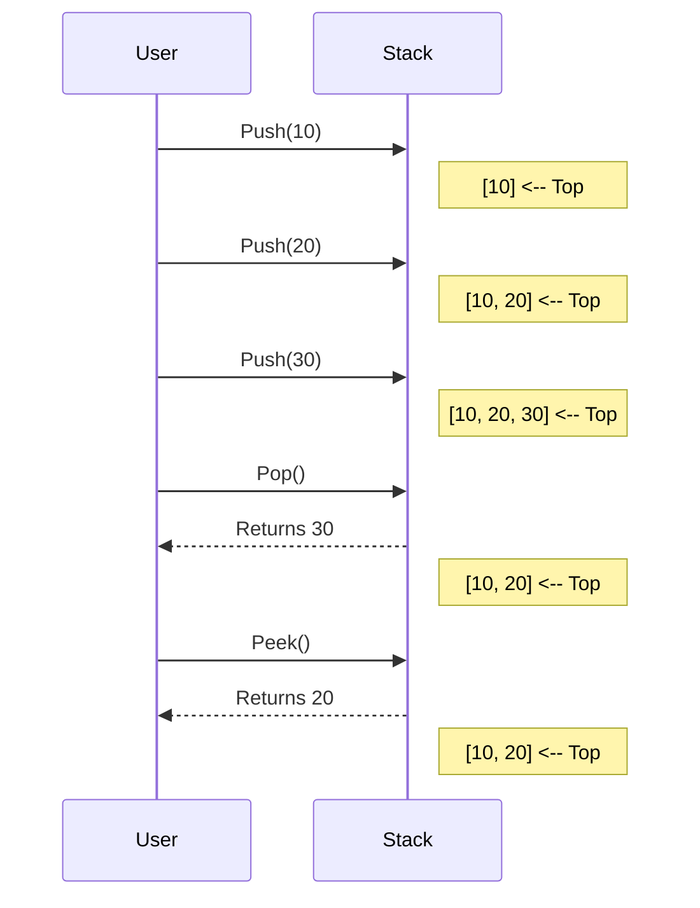

# 1. Metadata
- **Tiêu đề:** Stack Basics (Cơ bản về Ngăn xếp)
- **Tác giả:** DSA Curriculum Writer
- **Ngày tạo:** 2026-07-21
- **Thẻ:** #Stack, #LIFO, #Java, #DataStructures, #Algorithm

# 2. Purpose
Tài liệu này cung cấp kiến thức nền tảng về **Stack (Ngăn xếp)**. Mục tiêu là giúp người học nắm vững nguyên lý hoạt động LIFO, cách cài đặt Stack hiệu quả trong Java thông qua `Deque` thay vì `Stack` truyền thống, và hiểu được mối liên hệ mật thiết giữa Stack với Call Stack trong JVM cũng như kỹ thuật đệ quy.

# 3. Motivation
Trong thế giới lập trình, có nhiều bài toán đòi hỏi phải xử lý dữ liệu theo thứ tự ngược lại so với lúc chúng xuất hiện (như tính năng Undo/Redo, kiểm tra dấu ngoặc hợp lệ, hoặc duyệt cây theo chiều sâu - DFS). Stack chính là cấu trúc dữ liệu tự nhiên nhất để giải quyết các vấn đề này một cách nhanh chóng và tối ưu.

# 4. Mathematical Foundation
Stack có thể được xem như một tập hợp $S$ cùng với một con trỏ $top$.
Các thao tác được định nghĩa như sau:
- Mặc định: $S = \emptyset, top = -1$
- Push(x): $S = S \cup \{x\}, top = top + 1$
- Pop(): Nếu $S \neq \emptyset$, phần tử tại $top$ bị loại bỏ, $top = top - 1$.
- Peek(): Trả về phần tử tại $top$ mà không thay đổi tập hợp.
Tính chất quan trọng: Phần tử $x_i$ được push vào sau phần tử $x_j$ thì $x_i$ sẽ được pop ra trước $x_j$ (LIFO).

# 5. Core Theory
Stack tuân theo nguyên lý **LIFO (Last In First Out - Vào sau Ra trước)**. 
Các thao tác cơ bản và độ phức tạp:
- **Push (Thêm vào)**: Đẩy một phần tử lên đỉnh của Stack. Time Complexity: $O(1)$.
- **Pop (Lấy ra)**: Lấy phần tử trên đỉnh của Stack ra ngoài. Time Complexity: $O(1)$.
- **Peek / Top (Xem đỉnh)**: Xem phần tử trên đỉnh mà không lấy nó ra. Time Complexity: $O(1)$.
- **IsEmpty (Kiểm tra rỗng)**: Trả về true nếu Stack không có phần tử nào. Time Complexity: $O(1)$.

# 6. Visual Explanation
Dưới đây là sơ đồ minh họa cách Stack hoạt động với các thao tác Push và Pop.



# 7. Java Implementation
Trong Java hiện đại (từ Java 6+ và đặc biệt là Java 21), lớp `java.util.Stack` được xem là legacy vì nó kế thừa từ `Vector` và có overhead về synchronization (thread-safe lock) không cần thiết trong phần lớn trường hợp.
**Best Practice:** Sử dụng `java.util.Deque` với cài đặt `ArrayDeque`.

```java
import java.util.ArrayDeque;
import java.util.Deque;

public class StackBasics {
    public static void main(String[] args) {
        // Khuyến nghị sử dụng Deque làm Stack
        Deque<Integer> stack = new ArrayDeque<>();
        
        // Thao tác Push
        stack.push(10);
        stack.push(20);
        stack.push(30);
        
        System.out.println("Top element (Peek): " + stack.peek()); // 30
        
        // Thao tác Pop
        System.out.println("Popped element: " + stack.pop()); // 30
        System.out.println("Popped element: " + stack.pop()); // 20
        
        // Kiểm tra rỗng
        System.out.println("Is stack empty? " + stack.isEmpty()); // false
    }
}
```

# 8. Step-by-Step
Phân tích quá trình thực thi của đoạn mã trên:
1. Khởi tạo `ArrayDeque` rỗng. Bên dưới, nó là một mảng vòng (circular array) với các con trỏ `head` và `tail`.
2. `push(10)`: Thêm 10 vào `head` của Deque.
3. `push(20)`: Thêm 20 vào trước 10, cập nhật `head`.
4. `push(30)`: Thêm 30 vào trước 20.
5. `peek()`: Đọc giá trị tại `head` (30).
6. `pop()`: Lấy và xóa giá trị tại `head` (30), cập nhật `head` trỏ tới 20.

# 9. Complexity Analysis
Sử dụng `ArrayDeque` làm Stack:
- **Time Complexity:** 
  - `push(E e)`: $O(1)$ amortized. (Có thể tốn $O(N)$ khi mảng đệm đầy và cần resize, nhưng khấu hao lại là $O(1)$).
  - `pop()`: $O(1)$ - Chỉ tốn thao tác dịch con trỏ.
  - `peek()`: $O(1)$ - Đọc phần tử tại con trỏ `head`.
- **Space Complexity:** $O(N)$ cho $N$ phần tử được lưu trữ. Dung lượng mảng tự động mở rộng gấp đôi khi đầy.

# 10. JVM Analysis
**JVM Call Stack:** Khi một phương thức được gọi, JVM tạo ra một `Stack Frame` mới chứa local variables, operand stack, và reference tới constant pool. Khung này được `push` vào JVM Call Stack của luồng (thread). Khi phương thức return, khung này được `pop`.
- **Recursion (Đệ quy):** Mỗi lần gọi đệ quy tạo ra một frame mới. Nếu độ sâu đệ quy quá lớn sẽ gây ra lỗi `StackOverflowError` vì kích thước Call Stack trong JVM có giới hạn (thường có thể cấu hình qua `-Xss`).

# 11. OpenJDK Analysis
Trong mã nguồn OpenJDK 21, `java.util.Stack` là lớp con của `Vector`, do đó mỗi thao tác `push`, `pop`, `peek` đều có từ khóa `synchronized`. Điều này tạo ra overhead lớn (lock contention).
`ArrayDeque` không sử dụng đồng bộ hóa, mảng phần tử lưu dưới dạng `Object[] elements`.
- Khi `push`, nó chèn phần tử vào `head`: `elements[head = (head - 1) & (elements.length - 1)] = e;`. Phép toán bitwise `&` rất nhanh để tính vị trí mảng vòng vì kích thước mảng luôn là lũy thừa của 2.

# 12. Production Usage
- **Undo/Redo Mechanisms:** Trong các ứng dụng soạn thảo văn bản, IDE.
- **Duyệt Web:** Nút "Back" và "Forward" của trình duyệt.
- **Trình biên dịch (Compilers):** Phân tích cú pháp (Syntax parsing), kiểm tra dấu ngoặc, đánh giá biểu thức toán học (Postfix/Prefix).
- **Thuật toán:** Triển khai DFS không đệ quy (Iterative Depth First Search), bài toán đường đi trong mê cung, Topological Sort.

# 13. Design Decisions
Tại sao Java lại có hai cách dùng Stack?
- `java.util.Stack` ra đời từ JDK 1.0, thiết kế bị xem là lỗi vì kế thừa từ `Vector` (nguyên tắc "Favor composition over inheritance" bị vi phạm). Điều này cho phép người dùng truy cập ngẫu nhiên vào phần tử bằng index, phá vỡ tính chất LIFO nghiêm ngặt của Stack.
- Trong JDK 1.6, `java.util.Deque` được giới thiệu và được coi là cách chuẩn để cài đặt Stack an toàn và hiệu quả hơn.

# 14. Common Bugs
Dưới đây là 20 lỗi thường gặp khi sử dụng Stack:
1. `EmptyStackException` khi gọi `pop()` trên Stack rỗng (nếu dùng lớp legacy `Stack`).
2. `NoSuchElementException` khi gọi `pop()` trên `ArrayDeque` rỗng.
3. Quên kiểm tra `isEmpty()` trước khi `peek()` hoặc `pop()`.
4. Nhầm lẫn giữa thứ tự Pop (giả định phần tử đầu tiên lấy ra là phần tử đầu tiên đưa vào).
5. Sử dụng `java.util.Stack` thay vì `Deque` gây chậm hiệu suất đa luồng.
6. Duyệt qua Stack bằng Iterator nhưng kết quả lặp đi từ dưới lên trên (trong lớp legacy `Stack`).
7. Để lọt giá trị `null` (lớp `ArrayDeque` không cho phép giá trị `null`, sẽ ném `NullPointerException`).
8. Push dữ liệu quá lớn gây `OutOfMemoryError`.
9. Viết đệ quy mà không có điều kiện dừng dẫn đến `StackOverflowError`.
10. Sửa đổi phần tử bên trong Stack thông qua Iterator gây ra `ConcurrentModificationException`.
11. Dùng Stack để mô phỏng Queue nhưng quản lý sai logic 2 stacks.
12. Khởi tạo `ArrayDeque` với initial capacity quá lớn gây lãng phí bộ nhớ.
13. Đẩy sai kiểu dữ liệu do không dùng Generics đúng cách (Raw type).
14. Giữ reference (loiter) tới objects đã pop ra trong cài đặt mảng thủ công.
15. Quên không làm rỗng Stack giữa các test cases / xử lý batch.
16. Nhầm lẫn thao tác `remove()` thay vì `pop()`.
17. Sự khác biệt hành vi `add()` và `push()` trong Deque (vị trí tail và head).
18. Không copy cấu trúc Stack đúng cách khi cần lưu trạng thái (clone).
19. Gán biến `stack = null` và cố gọi hàm gây ra `NullPointerException`.
20. Pop nhầm hai lần trong một chu kỳ vòng lặp không được rào chắn.

# 15. Edge Cases
30 trường hợp biên cần xem xét khi làm việc với Stack:
1. Stack rỗng ngay từ đầu.
2. Stack chỉ có 1 phần tử.
3. Push liên tục hàng triệu phần tử để test cấp phát động.
4. Pop cho đến khi rỗng và thử Pop tiếp.
5. Kiểm tra `isEmpty()` trước khi đưa vào bất cứ phần tử nào.
6. Phần tử có giá trị lớn nhất của Integer (`Integer.MAX_VALUE`).
7. Phần tử chuỗi rỗng (`""`).
8. Stack chứa các object giống hệt nhau.
9. Xen kẽ liên tục hàng ngàn thao tác Push và Pop.
10. `peek()` trên Stack rỗng.
11. Truyền dung lượng (capacity) bằng 0 khi khởi tạo.
12. Truyền dung lượng âm (gây exception).
13. Dùng Stack để đảo ngược một chuỗi cực dài.
14. Stack chứa tham chiếu đệ quy (tự tham chiếu chính nó).
15. Chuyển đổi qua lại giữa ArrayList và Stack.
16. Multi-threaded push/pop vào cấu trúc không đồng bộ.
17. Dùng Iterator nhưng không thực sự pop phần tử ra.
18. Pop phần tử cuối cùng để giải phóng hoàn toàn bộ nhớ.
19. Push chuỗi độ dài tối đa vào Stack.
20. Stack chứa các tập hợp con (Stack of Stacks).
21. Thao tác trên Stack trong luồng shutdown hook.
22. Sử dụng class custom làm phần tử nhưng không ghi đè `equals`.
23. Sử dụng `contains()` với phần tử không có trong Stack.
24. So sánh hai Stack bằng phương thức `equals`.
25. Chuyển từ đệ quy sâu sang Stack nhưng bị giới hạn heap.
26. Resize `ArrayDeque` tại ngưỡng chính xác của lũy thừa số 2 (vd: 16, 32).
27. Đẩy và lấy liên tục phần tử tại mốc cấu trúc resize (đẩy mảng giãn ra, không thu lại).
28. Dùng phương thức `clear()` để reset Stack.
29. Cố ý tạo loop trong Object Graph được quản lý bởi Stack.
30. Cast sai kiểu khi dùng Raw type Stack.

# 16. Optimization
- Nếu biết trước số lượng phần tử, hãy khởi tạo `ArrayDeque` với dung lượng định sẵn để tránh chi phí resize.
- Ví dụ: `Deque<String> stack = new ArrayDeque<>(100);`
- Dọn dẹp con trỏ: Nếu tự cài đặt Stack bằng mảng, hãy gán `array[top] = null` khi pop để Garbage Collector có thể thu hồi đối tượng.

# 17. Best Practices
- **Luôn dùng `Deque`**: `Deque<Type> stack = new ArrayDeque<>();`.
- **Kiểm tra rỗng**: Luôn gọi `!stack.isEmpty()` trước khi gọi `pop()` hoặc `peek()`.
- **Tránh chứa Null**: Không nên cố đẩy `null` vào Stack vì `ArrayDeque` sẽ báo lỗi và thiết kế cho `null` thường gây nhầm lẫn biểu thị sự rỗng.
- **Tên biến**: Nên đặt tên là `stack` thay vì `deque` để biểu thị rõ ý đồ sử dụng (LIFO).

# 18. Benchmark
Sử dụng JMH (Java Microbenchmark Harness) để đo hiệu năng:
Thao tác 1 triệu lượt Push/Pop:
- `java.util.Stack` (Legacy): ~ 15-20ms (do khóa synchronized).
- `java.util.ArrayDeque`: ~ 3-5ms.
- `java.util.LinkedList` (dùng làm Stack): ~ 10-15ms (do cấp phát Node liên tục).
*Kết luận:* `ArrayDeque` chiến thắng tuyệt đối ở tốc độ và mức tiêu thụ bộ nhớ.

# 19. Unit Testing
```java
import org.junit.jupiter.api.Test;
import static org.junit.jupiter.api.Assertions.*;
import java.util.ArrayDeque;
import java.util.Deque;

public class StackTest {
    @Test
    public void testPushAndPop() {
        Deque<Integer> stack = new ArrayDeque<>();
        stack.push(1);
        stack.push(2);
        assertEquals(2, stack.pop());
        assertEquals(1, stack.pop());
        assertTrue(stack.isEmpty());
    }

    @Test
    public void testEmptyPop() {
        Deque<Integer> stack = new ArrayDeque<>();
        assertThrows(java.util.NoSuchElementException.class, () -> {
            stack.pop();
        });
    }
}
```

# 20. Interview Questions
Dưới đây là 20 câu hỏi phỏng vấn phổ biến liên quan đến Stack:
1. Sự khác biệt giữa `java.util.Stack` và `ArrayDeque` là gì?
2. Implement một Stack bằng cách sử dụng Queue như thế nào?
3. Thiết kế "Min Stack" hỗ trợ thao tác `push`, `pop`, `top`, và `getMin` trong $O(1)$ thời gian.
4. Làm thế nào để kiểm tra tính hợp lệ của chuỗi dấu ngoặc (Valid Parentheses)?
5. Giải thích mối quan hệ giữa Đệ quy (Recursion) và Stack.
6. Làm sao để đánh giá biểu thức Hậu tố (Postfix expression)?
7. Mô tả thuật toán sắp xếp một Stack sử dụng một Stack phụ.
8. Monotonic Stack là gì và ứng dụng của nó trong bài toán nào?
9. Thuật toán duyệt cây DFS sử dụng Stack như thế nào?
10. Tại sao `ArrayDeque` lại nhanh hơn `LinkedList` khi dùng làm Stack?
11. Giải thích `StackOverflowError` và cách phòng tránh.
12. Có thể implement Stack bằng mảng thông thường không? Nếu có thì làm thế nào?
13. Bạn giải quyết bài toán "Largest Rectangle in Histogram" bằng Stack thế nào?
14. Trong Call Stack của Java, điều gì được lưu trữ trong mỗi Stack Frame?
15. Khi `ArrayDeque` đầy, nó tăng gấp đôi dung lượng (resize) ra sao?
16. Có thể truy cập phần tử ở giữa Stack được không? Tại sao?
17. Thế nào là Expression Tree và Stack được dùng thế nào để tạo ra nó?
18. Hãy mô phỏng quá trình Undo/Redo bằng 2 Stacks.
19. Sự khác biệt giữa `peek()` và `pop()`?
20. Bài toán Daily Temperatures được tối ưu bằng Monotonic Stack như thế nào?

# 21. Practice Problems Link
Hãy chuyển sang file `01-Stack-Basics-Problems.md` để áp dụng lý thuyết này vào việc giải 30 bài tập thực tế từ LeetCode.

# 22. Pattern Recognition
**Dấu hiệu nhận biết bài toán cần dùng Stack:**
- Bài toán yêu cầu kết hợp các phần tử gần nhau nhất, có tính chất "hủy lẫn nhau" (ví dụ: dấu ngoặc mở - đóng).
- Yêu cầu xử lý chuỗi/mảng mà ở đó bạn cần "quay lui" bước vừa làm (Undo, backspace).
- Đọc một luồng dữ liệu và chỉ cần quan tâm đến phần tử vừa được thêm vào gần nhất.

# 23. Real Case Study
**Máy ảo Java (JVM):** JVM là một kiến trúc dựa trên Stack (Stack-based architecture). Hầu hết các chỉ thị (bytecode) của JVM nhận các toán hạng từ Operand Stack. Ví dụ phép tính `a + b`, JVM sẽ push `a` lên stack, push `b` lên stack, sau đó chỉ thị `iadd` sẽ pop 2 giá trị này, cộng lại và push kết quả lên lại stack.

# 24. Summary & Checklist
- [x] Hiểu nguyên lý LIFO.
- [x] Nắm rõ cách cài đặt bằng `Deque<Type> stack = new ArrayDeque<>()`.
- [x] Hiểu sự khác biệt và tránh dùng legacy `java.util.Stack`.
- [x] Nắm được thời gian thực thi của các thao tác cơ bản ($O(1)$).
- [x] Biết cách nhận diện các bài toán thường dùng Stack (Parentheses, Undo logic).
- [x] Nắm được khái niệm JVM Call Stack và liên hệ với đệ quy.
