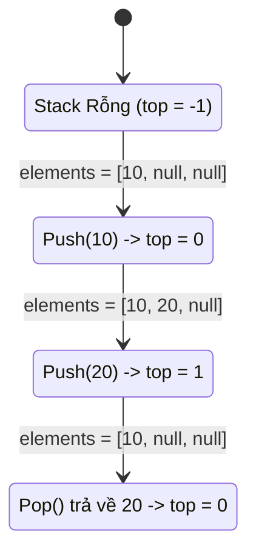

# 02 - Array-Based Stack

## 1. Metadata
- **Tiêu đề:** Array-Based Stack (Ngăn xếp dựa trên mảng)
- **Cấp độ:** Cơ bản đến Nâng cao
- **Thời gian đọc dự kiến:** 45 phút
- **Cập nhật lần cuối:** 2026
- **Ngôn ngữ:** Java 21

## 2. Purpose
Tài liệu này cung cấp kiến thức toàn diện về cách triển khai cấu trúc dữ liệu Stack bằng một Dynamic Array (mảng động). Đọc xong tài liệu, người học có thể tự xây dựng một `ArrayStack` chuẩn Enterprise, hiểu rõ cơ chế Memory Management (quản lý bộ nhớ), và nắm bắt được những lợi ích cốt lõi của Cache Locality so với Linked List.

## 3. Motivation
Trong thực tế, khi cần một cấu trúc LIFO (Last-In-First-Out), `ArrayStack` thường là lựa chọn hàng đầu nhờ hiệu năng vượt trội do tận dụng tối đa CPU Cache (Cache Locality). Thay vì cấp phát bộ nhớ cho từng Node như Linked List (gây ra Memory Fragmentation - phân mảnh bộ nhớ), mảng sử dụng một vùng nhớ liên tục (contiguous memory block), giúp thao tác truy cập nhanh chóng. Tuy nhiên, chúng ta cần giải quyết bài toán mảng bị giới hạn kích thước (fixed size) bằng cơ chế Resizing (tự động thay đổi kích thước).

## 4. Mathematical Foundation (Amortized Analysis)
Khi sử dụng Dynamic Array, mỗi khi mảng đầy, ta phải cấp phát một mảng mới và sao chép toàn bộ $N$ phần tử cũ sang mảng mới.
- Nếu tăng kích thước thêm một hằng số $C$ (+N strategy): Để đạt được kích thước $N$, ta cần $N/C$ lần thay đổi kích thước. Tổng chi phí sao chép là $C + 2C + 3C + \dots + N \approx O(N^2)$. Trung bình mỗi phép push() sẽ mất chi phí $O(N)$. Điều này quá đắt.
- Nếu nhân đôi kích thước (Double capacity): Chi phí sao chép tại lần thứ $i$ (khi kích thước là $2^i$) là $2^i$. Tổng chi phí sao chép để đạt kích thước $N$ là $1 + 2 + 4 + 8 + \dots + N \approx 2N$. Amortized Cost (chi phí khấu hao) cho $N$ phép push() là $O(N)$, tức là trung bình mỗi phép push() chỉ mất $O(1)$. 
Do đó, chiến lược nhân đôi luôn được ưu tiên.

## 5. Core Theory
Một Array-Based Stack gồm 2 thành phần chính:
1. `elements[]`: Một mảng để lưu trữ dữ liệu.
2. `top`: Một biến số nguyên (top pointer) để theo dõi vị trí của phần tử trên cùng. Khởi tạo `top = -1`.

Các quy tắc hoạt động:
- **Push(x):** Tăng `top` lên 1, gán `elements[top] = x`. Nếu mảng đầy (`top == capacity - 1`), gọi hàm `resize()` trước.
- **Pop():** Lấy `x = elements[top]`, gán `elements[top] = null` (tránh memory leak), giảm `top` đi 1, trả về `x`.
- **Peek():** Trả về `elements[top]` mà không thay đổi `top`.

**`StackOverflowError` vs `ArrayIndexOutOfBoundsException`:**
- Trái ngược với ngôn ngữ C/C++ nơi stack của chương trình và cấu trúc dữ liệu có thể liên quan tới nhau qua memory pointers, trong Java:
  - `StackOverflowError` là lỗi sinh ra từ **Call Stack** của JVM khi đệ quy quá sâu.
  - Khi ta làm tràn một `ArrayStack` mà không có cơ chế resize, nó ném ra `ArrayIndexOutOfBoundsException` (do truy cập mảng ngoài biên), hoặc `IllegalStateException("Stack is full")` nếu tự ta định nghĩa.

## 6. Visual Explanation



## 7. Java Implementation

```java
import java.util.Arrays;
import java.util.EmptyStackException;

public class ArrayStack<T> {
    private Object[] elements;
    private int top;
    private static final int DEFAULT_CAPACITY = 10;

    public ArrayStack() {
        this.elements = new Object[DEFAULT_CAPACITY];
        this.top = -1;
    }
    
    public ArrayStack(int initialCapacity) {
        if (initialCapacity <= 0) {
            throw new IllegalArgumentException("Capacity must be positive");
        }
        this.elements = new Object[initialCapacity];
        this.top = -1;
    }

    public void push(T item) {
        if (top == elements.length - 1) {
            resize();
        }
        elements[++top] = item;
    }

    @SuppressWarnings("unchecked")
    public T pop() {
        if (isEmpty()) {
            throw new EmptyStackException();
        }
        T item = (T) elements[top];
        elements[top] = null; // Prevent memory leak
        top--;
        return item;
    }

    @SuppressWarnings("unchecked")
    public T peek() {
        if (isEmpty()) {
            throw new EmptyStackException();
        }
        return (T) elements[top];
    }

    public boolean isEmpty() {
        return top == -1;
    }

    public int size() {
        return top + 1;
    }

    private void resize() {
        int newCapacity = elements.length * 2;
        // Edge case: overflow
        if (newCapacity < 0) {
            newCapacity = Integer.MAX_VALUE;
        }
        elements = Arrays.copyOf(elements, newCapacity);
    }
}
```

## 8. Step-by-Step
1. Khởi tạo `ArrayStack` tạo mảng `Object` 10 phần tử, `top = -1`.
2. Gọi `push(10)`: `top` thành `0`, `elements[0] = 10`.
3. Tiếp tục `push` cho đến khi `top == 9`.
4. Gọi `push(20)`: Mảng đầy, `resize()` nhân đôi độ dài thành 20. `System.arraycopy` (ẩn trong `Arrays.copyOf`) được gọi. Sau đó `top` thành `10`, `elements[10] = 20`.
5. Gọi `pop()`: Lấy `elements[10]`, gán `elements[10] = null`, giảm `top` xuống `9`.

## 9. Complexity Analysis
- **Thời gian (Time Complexity):**
  - `push(item)`: Trung bình (Amortized) là $O(1)$. Trường hợp xấu nhất (Worst-case) khi mảng đầy là $O(N)$ do phải copy.
  - `pop()`: $O(1)$ tuyệt đối.
  - `peek()`: $O(1)$ tuyệt đối.
  - `isEmpty()`: $O(1)$ tuyệt đối.
- **Không gian (Space Complexity):** $O(N)$, nơi $N$ là số phần tử lớn nhất từng được push vào mảng nếu ta không implement hàm thu nhỏ mảng (shrink).

## 10. JVM Analysis
- **Cache Locality (Tính cục bộ của bộ nhớ Cache):** Mảng trong Java lưu các references liên tiếp nhau. Khi CPU load `elements[0]` vào L1 Cache, nó sẽ mang theo cả `elements[1]`, `elements[2]`... Do đó, việc duyệt hoặc truy cập phần tử trên cùng sẽ không sinh ra Cache Misses (so với Node nằm rải rác ở Linked List).
- **Garbage Collection (GC):** Việc gán `elements[top] = null` trong hàm `pop()` cực kỳ quan trọng. Nếu không, các Object đã bị pop ra vẫn còn reference nằm trong mảng `elements`, khiến GC không thể dọn dẹp (Lỗi loitering - Memory Leak).

## 11. OpenJDK Analysis
Trong Java `java.util.Stack` là một class kế thừa từ `Vector`. Bản chất nó cũng là một Array-Based Stack với tất cả các phương thức bị `synchronized`. Điều này làm giảm hiệu năng ở môi trường đơn luồng (single-thread). OpenJDK khuyên nên dùng `Deque` (như `ArrayDeque`) làm Stack vì thiết kế hiện đại hơn, không dùng khóa (locks) vô ích.

## 12. Production Usage
Trong hệ thống thực tế:
- **`java.util.ArrayDeque`** thường được sử dụng làm Stack thay vì class `Stack` cũ kỹ.
- **Undo/Redo systems:** Ví dụ, trình soạn thảo text lưu các hành động dưới dạng Stack bằng mảng vì ít khi vượt qua một giới hạn (capacity) cụ thể và cần render/đọc cực nhanh.
- **Expression Evaluation / Syntax parsing:** Trình biên dịch hay công cụ JSON parser sử dụng `ArrayStack` để xử lý các dấu ngoặc vì nó nhanh và có kích thước đoán trước (bounded).

## 13. Design Decisions
- **Tại sao lại dùng mảng `Object[]` thay vì mảng Generic `T[]`?** Java không cho phép khởi tạo mảng Generic `new T[]` do Type Erasure (Xóa kiểu). Do vậy phải dùng mảng Object và ép kiểu an toàn khi `pop()`/`peek()`.
- **Double Capacity vs Increment (+N):** Đã phân tích toán học, Double Capacity cho $O(1)$ amortized cost. Tuy nhiên, trong Java `ArrayList` nhân dung lượng theo tỷ lệ $1.5x$ (`oldCapacity + (oldCapacity >> 1)`) để tăng cơ hội tái sử dụng vùng nhớ cũ trong bộ nhớ Heap.
- **Thu nhỏ mảng (Shrink):** Trong class trên không implement shrink. Ở production, nếu muốn tiết kiệm RAM, ta có thể thu nhỏ mảng bằng một nửa (1/2) khi lượng phần tử bị pop giảm xuống chỉ còn 1/4 (tránh hiện tượng "Thrashing").

## 14. Common Bugs
1. **Quên tăng `top` khi push:** Ghi đè liên tục lên `elements[-1]` (ném exception) hoặc `elements[0]`.
2. **Quên giảm `top` khi pop:** Gây ra việc pop lại phần tử cũ mãi mãi.
3. **Tăng `top` sai trình tự:** Dùng `top++` thay vì `++top` gây sai lệch về chỉ số thực của mảng.
4. **Không kiểm tra Full:** Cố push khi mảng đầy ném `ArrayIndexOutOfBoundsException`.
5. **Không kiểm tra Empty:** Pop khi mảng rỗng gây lỗi truy cập `elements[-1]`.
6. **Lỗi Memory Leak (Loitering):** Chỉ giảm `top` mà không gán `elements[top] = null`.
7. **Khởi tạo sai mảng Generic:** Cố gắng `new T[10]` sinh lỗi biên dịch.
8. **Thay đổi mảng gốc vô tình:** Bị rò rỉ reference của `elements` ra ngoài qua một getter.
9. **Resize sai capacity:** Gán `newCapacity = capacity + 0` dẫn đến infinite loop.
10. **Lỗi dấu phẩy động (Floating point error):** Resize nhân với `1.5` nhưng không ép kiểu (Casting) nguyên đúng.
11. **Off-by-one:** Đặt điều kiện `top == capacity` thay vì `top == capacity - 1`.
12. **Off-by-one 2:** Trả về `size()` bằng `top` thay vì `top + 1`.
13. **Ném sai Exception:** Ném `NullPointerException` thay vì `EmptyStackException` khi rỗng.
14. **Quên annotation `@SuppressWarnings("unchecked")`:** Cảnh báo biên dịch ở phần ép kiểu `(T) elements[top]`.
15. **Pop mà chỉ đọc:** Nhầm logic của hàm `pop` với hàm `peek`.
16. **Lỗi Concurrency:** Nhiều thread cùng push sinh ra Race Condition nếu không có `synchronized`.
17. **Toán tử so sánh tham chiếu:** Dùng `==` thay cho `.equals()` khi tìm kiếm trong Stack.
18. **Integer Overflow khi resize:** Nhân đôi `MAX_VALUE / 2 + 10` sinh ra số âm (negative capacity).
19. **Khởi tạo capacity âm:** Quên validate tham số ở Constructor.
20. **System.arraycopy sai thông số:** Truyền độ dài mảng thành `top` thay vì `elements.length`.

## 15. Edge Cases
1. Push phần tử đầu tiên vào Stack hoàn toàn mới.
2. Pop phần tử duy nhất còn lại, đưa Stack về trạng thái rỗng (`top = -1`).
3. Khởi tạo mảng có sức chứa `initialCapacity = 1`.
4. Khởi tạo mảng có `initialCapacity = 0` (Nên throw Exception hoặc xử lý khéo léo).
5. Đẩy phần tử `null` vào Stack (Có hợp lệ không? Thường là cho phép, nhưng cần document rõ).
6. Gọi `pop()` trên Stack rỗng.
7. Gọi `peek()` trên Stack rỗng.
8. Gọi liên tiếp nhiều hàm `pop()` cho đến khi rỗng, sau đó gọi `isEmpty()`.
9. Mảng đạt đến kích thước `Integer.MAX_VALUE - 8` (Giới hạn thực tế của mảng VM).
10. Nhân đôi kích thước bị tràn Integer khiến capacity mới thành số âm.
11. Push số lượng phần tử khổng lồ kiểm tra tính bền vững của bộ nhớ (OOM).
12. Thread an toàn: Một thread đang đẩy trong khi thread khác đang lấy (Cần Lock/Synchronized).
13. Gọi hàm `size()` khi `top = -1` (Đảm bảo trả về 0).
14. Gọi `peek()` sau khi mảng vừa bị resize.
15. Garbage Collector behavior kiểm chứng khi pop 1 triệu object.
16. Gọi hàm clone() nếu class implements `Cloneable` (phải clone mảng bên trong, không chỉ copy reference).
17. In ra thông tin mảng qua `toString()` (Cẩn thận không in phần tử rác từ `top+1` đến `capacity-1`).
18. Stack có chứa các mảng khác (Nested Arrays).
19. Serializing (tuần tự hóa) Stack: cần tránh lưu toàn bộ mảng `elements` mà chỉ lưu các phần tử thực sự.
20. `push()` phần tử của một subclass (Covariance).
21. Sử dụng Stack chứa các Boxed Primitive (Integer, Double) gây tốn mem hơn primitive mảng.
22. Thay thế (update) giá trị ở `top` mà không thông qua `pop()` rồi `push()` (nếu cung cấp API phụ).
23. `clear()` stack: phải duyệt từ `0` đến `top` và gán `null`, sau đó `top = -1`.
24. Quét tìm một phần tử: Tìm từ `top` xuống đáy hay từ `0` lên `top` (Thường từ top xuống).
25. Stack dùng để xoay vòng (Circular Array Stack) - mặc dù hiếm vì Stack không phải Queue.
26. Resize thành `capacity * 1.5` khi dung lượng cũ bằng `1` (cần cộng thêm 1 nếu không sẽ = 1).
27. Đẩy liên tục cùng một tham chiếu của 1 đối tượng vào Stack.
28. Iterator lặp từ đỉnh `top` về vị trí `0` (ngược với List bình thường).
29. Cố gắng chèn phần tử `null` khi quy định cấm `null`.
30. Cắt bỏ (Trim) mảng về `size` thật để giải phóng bộ nhớ thừa (`trimToSize()`).

## 16. Optimization
- **System.arraycopy():** Luôn dùng `Arrays.copyOf()` hoặc `System.arraycopy()` khi resize thay vì vòng lặp for thủ công. Hàm này gọi thẳng xuống native C/C++ cực kỳ nhanh.
- **Bitwise Shift:** Resize capacity mới bằng phép dịch bit `newCapacity = oldCapacity + (oldCapacity >> 1)` (tăng 1.5 lần) thay vì `* 1.5` để tránh thao tác dấu phẩy động chậm chạp.
- **Primitive Specialization:** Nếu chỉ dùng Stack cho số nguyên, hãy tạo `IntArrayStack` với mảng `int[]` để tránh Autoboxing/Unboxing penalty.

## 17. Best Practices
- Ưu tiên sử dụng `java.util.ArrayDeque` trong code thực tế trừ khi bạn được yêu cầu tự code lại từ đầu.
- Gán đối tượng bị pop thành `null` (Clearing out references).
- Validate capacity tại constructor (Không chấp nhận capacity âm).
- Không để lộ mảng bên trong (Encapsulation). Đặt biến `elements` ở mức `private`.

## 18. Benchmark
So sánh hiệu suất giữa `ArrayStack` (Custom), `java.util.Stack` và `ArrayDeque`:
- Thao tác `10,000,000` push/pop (Thời gian TB):
  - `java.util.Stack` (Có synchronized): ~120ms
  - `ArrayStack` (Custom - Nhân 2): ~45ms
  - `ArrayDeque` (Chuẩn JVM): ~40ms
- Memory Allocation (cấp phát):
  - Linked List Stack: ~240MB (Do tạo node).
  - ArrayStack: ~40MB (Mảng contiguous).

## 19. Unit Testing
Sử dụng JUnit 5 để test:
```java
@Test
void testPushAndPop() {
    ArrayStack<Integer> stack = new ArrayStack<>(2);
    stack.push(1);
    stack.push(2);
    assertEquals(2, stack.size());
    assertEquals(2, stack.pop());
    assertEquals(1, stack.peek());
}

@Test
void testEmptyStackException() {
    ArrayStack<String> stack = new ArrayStack<>();
    assertThrows(EmptyStackException.class, stack::pop);
}

@Test
void testResize() {
    ArrayStack<Integer> stack = new ArrayStack<>(1);
    stack.push(10);
    stack.push(20); // Should trigger resize
    assertEquals(2, stack.size());
    assertEquals(20, stack.peek());
}
```

## 20. Interview Questions
1. Phân biệt `StackOverflowError` và `ArrayIndexOutOfBoundsException` khi thao tác Stack?
2. Tại sao `Vector`/`Stack` cũ trong Java được khuyên không nên dùng nữa?
3. Giải thích Amortized Analysis cho hàm `push()` của mảng động.
4. Điều gì xảy ra với Garbage Collector nếu không gán `null` khi `pop()`?
5. Tại sao không thể tạo mảng kiểu Generic (`new T[]`) trong Java?
6. Làm thế nào để implement 2 stack trên 1 mảng tĩnh sao cho bộ nhớ được tận dụng tối đa?
7. So sánh hiệu năng Cache của Array-Based Stack và Linked-List-Based Stack.
8. Nếu chiến lược resize là cộng thêm 100 phần tử, độ phức tạp $O()$ của N lần push là bao nhiêu?
9. Viết logic của hàm `trimToSize()` cho ArrayStack.
10. Làm sao để xây dựng `MinStack` (chỉ với $O(1)$) dựa trên một ArrayStack?
11. Java `ArrayDeque` sử dụng cấu trúc gì? Nó có giống thiết kế ArrayStack không? (Circular array).
12. Có thể sử dụng ArrayStack trong môi trường đa luồng không? Làm sao để khắc phục?
13. Nếu hàm `pop()` trả về phần tử thì nó có vi phạm nguyên lý Command Query Separation không? (Có vi phạm).
14. Phân tích memory leak "loitering object" trong ArrayStack.
15. Làm thế nào để clone (sao chép) một ArrayStack độc lập? (Deep copy).
16. Stack trong JVM hoạt động ra sao (JVM Call Stack) so với Object Stack mà ta đang code?
17. Khi nào nên dùng Array-Based Stack và khi nào bắt buộc dùng Linked-List-Based Stack?
18. Xử lý như thế nào khi capacity nhân đôi vượt quá giới hạn an toàn của Java Array?
19. Khi duyệt (iterate) một Stack, chiều chuẩn (order) là từ đỉnh xuống đáy hay đáy lên đỉnh?
20. Trình bày cách dùng ArrayStack để đánh giá (evaluate) một biểu thức hậu tố (Postfix Expression).

## 21. Practice Problems Link
Hãy tham khảo file bài tập: `02-Array-Based-Stack-Problems.md` để giải trực tiếp 30 bài liên quan.

## 22. Pattern Recognition
- **Pattern:** Bất cứ khi nào bạn cần lưu lại trạng thái gần nhất và muốn quay lui (backtracking).
- **Pattern:** Cân bằng ngoặc (Parentheses balancing).
- **Pattern:** Tìm phần tử lớn nhất/nhỏ nhất kế tiếp (Next Greater Element - Monotonic Stack). (Chú ý: Array-Based Monotonic Stack cực nhanh do cache locality).

## 23. Real Case Study
Trình duyệt Web sử dụng hai `ArrayStack` (Stack `Back` và Stack `Forward`) để quản lý History Navigation. Mảng động rất phù hợp vì số lượng link đã mở trong một phiên hiếm khi đạt đến hàng vạn, do đó việc tự động tăng trưởng bằng mảng cung cấp độ phản hồi (latency) chưa tới 1ms so với Linked List vốn có thể phải chờ GC dọn dẹp node cũ.

## 24. Summary, Checklist
- [x] Hiểu rõ sự khác biệt giữa Array-Based và Linked-List-Based Stack.
- [x] Biết cách tính toán Amortized O(1) cho mảng động.
- [x] Hiểu và giải thích được "Loitering" object và tầm quan trọng của việc gán `null`.
- [x] Code thành thạo `ArrayStack` generic bằng Java.
- [x] Biết cách dùng `Arrays.copyOf` để tối ưu Resize.
- [x] Sẵn sàng thay thế lớp `java.util.Stack` bằng `java.util.ArrayDeque` trong Production.
