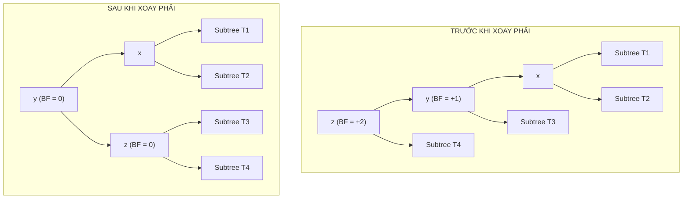
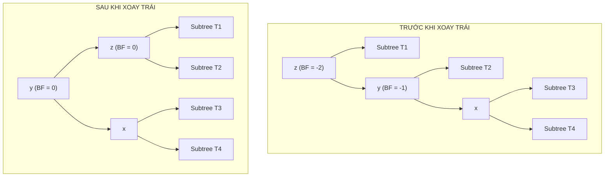
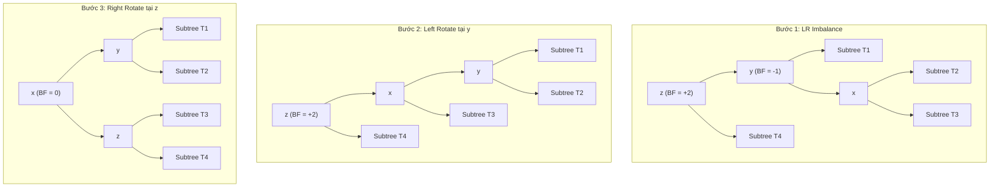

# Chuyên Đề: Cấu Trúc Dữ Liệu AVL Tree (Cây Nhị Phân Tìm Kiếm Tự Cân Bằng)

---

## 1. Metadata

| Thuộc tính | Giá trị |
| :--- | :--- |
| **Document ID** | `DSA-10-03` |
| **Version** | `1.0` |
| **Chủ đề** | Cấu trúc Dữ liệu Cây (Tree Data Structures) |
| **Prerequisites** | Binary Tree Basics (`DSA-10-01`), Binary Search Tree (`DSA-10-02`), Phân tích độ phức tạp thuật toán Big-O (`DSA-01-01`), Đệ quy (Recursion) |
| **Target Audience** | Software Engineers, Backend Architects, Competitive Programmers, Sinh viên Khoa học Máy tính |
| **Estimated Reading Time** | 50 - 65 phút |
| **Difficulty** | Advanced (Nâng cao) |
| **Keywords** | `AVL Tree`, `Self-Balancing BST`, `Balance Factor`, `Tree Rotations`, `LL/RR/LR/RL Rotations`, `Height-Balanced`, `Adelson-Velsky and Landis`, `Java 21`, `JVM Memory Layout`, `JMH Benchmark`, `Red-Black Tree vs AVL` |

### Mục Tiêu Học Tập (Learning Objectives)
1. **Hiểu sâu sắc bản chất lý thuyết**: Nắm vững định nghĩa toán học của Cây AVL, Hệ số cân bằng (Balance Factor - $BF$), và các bất biến (invariants) bảo toàn tính cân bằng nghiêm ngặt.
2. **Chứng minh toán học chặt chẽ**: Hiểu và tái hiện được chứng minh giới hạn chiều cao cận trên $h \le 1.4404 \log_2(N + 2) - 0.328$ thông qua dãy số Fibonacci.
3. **Làm chủ 4 phép xoay (Rotations)**: Phân tích tường minh cơ chế biến đổi cấu trúc con trỏ của 4 trường hợp: Left-Left (LL), Right-Right (RR), Left-Right (LR), Right-Left (RL).
4. **Cài đặt Production-Grade trên Java 21**: Xây dựng từ đầu (from scratch) cấu trúc `AVLTree<K, V>` tổng quát, hỗ trợ đầy đủ thao tác `insert`, `delete`, `search`, `floorKey`, `ceilingKey`, `rank`, `select` với chuẩn Generic, Fail-fast Iterator.
5. **Phân tích JVM & Performance**: Bóc tách Object Header, Compressed OOPs, Cache Misses, GC Impact, và so sánh chi tiết với `java.util.TreeMap` (Red-Black Tree).
6. **Xử lý Bugs & Edge Cases**: Nhận diện và phòng chống 20 lỗi kinh điển cùng 30 trường hợp biên đặc thù trong môi trường thực chiến.
7. **Luyện tập phỏng vấn & Benchmark**: Làm chủ bộ 20 câu hỏi phỏng vấn chuẩn quốc tế và mã nguồn đo lường hiệu năng bằng JMH.

---

## 2. Purpose (Mục Đích)

Mục đích của tài liệu này là cung cấp một bản khảo cứu toàn diện, chuẩn mực học thuật và thực chiến kỹ thuật về **AVL Tree** — cấu trúc dữ liệu cây nhị phân tìm kiếm tự cân bằng (Self-Balancing Binary Search Tree) đầu tiên trong lịch sử khoa học máy tính, được phát minh vào năm 1962 bởi hai nhà toán học Liên Xô: **Georgy Adelson-Velsky** và **Evgenii Landis**.

Tài liệu giải quyết triệt để vấn đề suy biến hiệu năng của Cây nhị phân tìm kiếm thông thường (Standard BST), đưa ra phương pháp luận toán học cho việc tái cân bằng động với chi phí tối ưu, đồng thời cung cấp mã nguồn Java 21 hoàn chỉnh đạt chuẩn công nghiệp.

---

## 3. Motivation (Động Lực Phát Triển)

### 3.1. Sự Suy Biến Chí Mạng của Standard BST

Trong một Cây nhị phân tìm kiếm chuẩn (Standard BST), hiệu năng của các thao tác cơ bản (`search`, `insert`, `delete`) phụ thuộc trực tiếp vào chiều cao $h$ của cây:

$$\text{Time Complexity} = O(h)$$

- **Kịch bản lý tưởng (Best/Average Case)**: Dữ liệu được chèn theo thứ tự ngẫu nhiên đồng đều (Uniform Random Distribution). Cây phân nhánh đối xứng, chiều cao $h \approx \log_2 N$. Thời gian thao tác đạt $O(\log N)$.
- **Kịch bản suy biến (Worst Case - Skewed Tree)**: Khi dữ liệu đầu vào đã được sắp xếp tăng dần (ví dụ: $1, 2, 3, 4, 5$) hoặc giảm dần, mỗi node mới luôn được chèn vào làm con phải (hoặc con trái) duy nhất. Cây biến dạng hoàn toàn thành một **Danh sách liên kết đơn (Singly Linked List)**.

```
Chèn tuần tự: 10, 20, 30, 40, 50 vào Standard BST

10
  \
   20
     \
      30
        \
         40
           \
            50  --> Chiều cao h = 5 = N, Tìm kiếm 50 tốn 5 bước so sánh! (O(N))
```

Khi đó:
- Chiều cao cây: $h = N$
- Độ phức tạp tìm kiếm: $O(N)$
- Toàn bộ ưu thế phân nhánh nhị phân bị triệt tiêu hoàn toàn.

### 3.2. Lời Giải Từ AVL Tree: Bảo Đảm Tuyệt Đối $O(\log N)$

AVL Tree giải quyết triệt để điểm yếu trên bằng cách thiết lập một **cơ chế tự cân bằng nghiêm ngặt (Strict Self-Balancing)**:
- Sau mỗi thao tác chèn (`insert`) hoặc xóa (`delete`), cây tự động kiểm tra độ chênh lệch chiều cao giữa hai nhánh con của từng node bị ảnh hưởng.
- Nếu độ chênh lệch vượt quá ngưỡng cho phép ($|BF| > 1$), cây sẽ thực hiện các **phép xoay cục bộ (Local Rotations)** trong thời gian $O(1)$ để khôi phục trạng thái cân bằng.
- Đảm bảo chiều cao $h$ luôn bị chặn trên bởi $1.4404 \log_2 N$, duy trì thời gian tìm kiếm, chèn, xóa trong trường hợp xấu nhất luôn là $O(\log N)$.

```
Cùng dãy dữ liệu: 10, 20, 30, 40, 50 khi chèn vào AVL Tree

        20
       /  \
     10    40
          /  \
        30    50  --> Chiều cao h = 3 <= 1.44 * log2(5), Tìm kiếm 50 chỉ tốn 3 phép so sánh!
```

---

## 4. Mathematical Foundation (Nền Tảng Toán Học)

### 4.1. Quy Ước Chiều Cao (Height Definition)

Quy ước chuẩn mực được áp dụng trong toàn bộ tài liệu:
- Chiều cao của cây rỗng (`null` node): $h(\text{null}) = 0$.
- Chiều cao của node lá (Leaf node): $h(\text{leaf}) = 1$.
- Chiều cao của một node bất kỳ $u$:
  $$h(u) = 1 + \max\big(h(u.\text{left}), h(u.\text{right})\big)$$

*(Lưu ý: Một số tài liệu quy ước $h(\text{null}) = -1$ và $h(\text{leaf}) = 0$. Hai quy ước này hoàn toàn tương đương về mặt toán học và logic cân bằng).*

### 4.2. Hệ Số Cân Bằng (Balance Factor - $BF$)

Hệ số cân bằng của một node $u$, ký hiệu là $BF(u)$, được định nghĩa là hiệu số giữa chiều cao của cây con bên trái và chiều cao của cây con bên phải:

$$\boxed{BF(u) = h(u.\text{left}) - h(u.\text{right})}$$

### 4.3. Bất Biến AVL (AVL Invariant)

Một cây nhị phân tìm kiếm $T$ là một **AVL Tree** khi và chỉ khi mọi node $u \in T$ đều thỏa mãn điều kiện:

$$\boxed{BF(u) \in \{-1, 0, 1\}}$$

- $BF(u) = 0$: Cây con trái và cây con phải có chiều cao hoàn toàn bằng nhau (Cân bằng tuyệt đối).
- $BF(u) = 1$: Cây con trái cao hơn cây con phải đúng 1 đơn vị (Left-heavy trong ngưỡng cho phép).
- $BF(u) = -1$: Cây con phải cao hơn cây con trái đúng 1 đơn vị (Right-heavy trong ngưỡng cho phép).
- $|BF(u)| \ge 2$: Cây mất cân bằng tại node $u$, bắt buộc phải kích hoạt cơ chế tái cân bằng (Rebalancing).

---

### 4.4. Chứng Minh Giới Hạn Chiều Cao Tối Đa Của AVL Tree

Một câu hỏi nền tảng: *Với một số lượng node $N$ cho trước, chiều cao tối đa $h$ của cây AVL có thể đạt tới là bao nhiêu?*

#### Bước 1: Thiết lập bài toán tối tiểu số node
Để tìm chiều cao lớn nhất với số node $N$, ta xét bài toán đối ngẫu: Tìm số lượng node **nhỏ nhất** $N(h)$ để xây dựng một cây AVL có chiều cao chính xác là $h$.

Cây AVL có chiều cao $h$ với số lượng node tối thiểu phải có cấu trúc:
- Gốc (Root): chiếm 1 node.
- Một cây con có chiều cao $h - 1$ (cũng chứa số node tối thiểu $N(h-1)$).
- Một cây con có chiều cao $h - 2$ (chứa số node tối thiểu $N(h-2)$).

Ta có công thức truy hồi:
$$\begin{aligned}
N(0) &= 0 \quad (\text{cây rỗng}) \\
N(1) &= 1 \quad (\text{chỉ có 1 node lá}) \\
N(2) &= 1 + N(1) + N(0) = 1 + 1 + 0 = 2 \\
N(3) &= 1 + N(2) + N(1) = 1 + 2 + 1 = 4 \\
N(4) &= 1 + N(3) + N(2) = 1 + 4 + 2 = 7 \\
N(h) &= 1 + N(h-1) + N(h-2) \quad (\forall h \ge 2)
\end{aligned}$$

#### Bước 2: Liên hệ với dãy số Fibonacci
Cộng $1$ vào cả hai vế của phương trình truy hồi:
$$N(h) + 1 = \big(N(h-1) + 1\big) + \big(N(h-2) + 1\big)$$

Đặt $S(h) = N(h) + 1$. Ta có:
$$S(h) = S(h-1) + S(h-2)$$

Tính các giá trị cơ sở của $S(h)$:
- $S(0) = N(0) + 1 = 1 = F_2$
- $S(1) = N(1) + 1 = 2 = F_3$
- $S(2) = N(2) + 1 = 3 = F_4$
- $S(3) = N(3) + 1 = 5 = F_5$
- $S(h) = F_{h+2}$ (với $F_k$ là số Fibonacci thứ $k$, quy ước $F_0=0, F_1=1, F_2=1, F_3=2, \dots$)

Do đó:
$$\boxed{N(h) = F_{h+2} - 1}$$

#### Bước 3: Áp dụng công thức Binet và giải bất phương trình chiều cao
Theo công thức Binet cho số Fibonacci:
$$F_k = \frac{\phi^k - \psi^k}{\sqrt{5}} \approx \frac{\phi^k}{\sqrt{5}}$$
Trong đó $\phi = \frac{1 + \sqrt{5}}{2} \approx 1.6180339887$ (Tỉ lệ vàng - Golden Ratio) và $\psi = \frac{1 - \sqrt{5}}{2} \approx -0.6180339887$.

Vì $|\psi| < 1$, ta có bất đẳng thức chặt:
$$F_{h+2} > \frac{\phi^{h+2}}{\sqrt{5}} - 1$$

Với một cây AVL có $N$ node và chiều cao $h$, ta có $N \ge N(h)$:
$$N \ge F_{h+2} - 1 > \frac{\phi^{h+2}}{\sqrt{5}} - 2$$
$$N + 2 > \frac{\phi^{h+2}}{\sqrt{5}}$$
$$\sqrt{5}(N + 2) > \phi^{h+2}$$

Lấy logarit cơ số 2 hai vế:
$$\log_2(\sqrt{5}) + \log_2(N + 2) > (h + 2) \log_2(\phi)$$
$$h + 2 < \frac{\log_2(N + 2)}{\log_2(\phi)} + \frac{\log_2(\sqrt{5})}{\log_2(\phi)}$$

Tính các hằng số:
- $\log_2(\phi) = \log_2(1.6180339887) \approx 0.6942419$
- $\frac{1}{\log_2(\phi)} \approx \frac{1}{0.6942419} \approx 1.44042$
- $\log_2(\sqrt{5}) = \frac{1}{2} \log_2(5) \approx 1.160964$
- $\frac{\log_2(\sqrt{5})}{\log_2(\phi)} \approx \frac{1.160964}{0.6942419} \approx 1.67227$

Thay vào bất đẳng thức:
$$h + 2 < 1.44042 \log_2(N + 2) + 1.67227$$
$$\boxed{h < 1.44042 \log_2(N + 2) - 0.32773 \approx 1.4404 \log_2 N}$$

#### Kết luận toán học:
Trong trường hợp xấu nhất, chiều cao của cây AVL chỉ lớn hơn chiều cao lý tưởng của cây nhị phân cân bằng hoàn hảo ($\log_2 N$) tối đa **44%**. Điều này đảm bảo hiệu năng tìm kiếm luôn đạt $O(\log N)$ với hằng số ẩn (hidden constant) cực nhỏ.

---

## 5. Core Theory: Cơ Chế Tự Cân Bằng & Phép Xoay (Rotations)

Khi thực hiện thao tác `insert` hoặc `delete`, cấu trúc cây thay đổi có thể làm xuất hiện các node vi phạm bất biến AVL ($|BF| \ge 2$). Gọi $z$ là **node thấp nhất** trên đường đi ngược về gốc bị mất cân bằng.

Có chính xác **4 trường hợp mất cân bằng** tương ứng với **4 kỹ thuật xoay**:

```
                       Trường hợp mất cân bằng
                                  |
         +------------------------+------------------------+
         |                                                 |
    Left-Heavy (BF(z) = +2)                     Right-Heavy (BF(z) = -2)
         |                                                 |
   +-----+-----+                                     +-----+-----+
   |           |                                     |           |
BF(y) >= 0   BF(y) < 0                             BF(y) <= 0  BF(y) > 0
 [LL Case]   [LR Case]                              [RR Case]   [RL Case]
   |           |                                     |           |
Right Rotate Left Rotate (y)                       Left Rotate  Right Rotate (y)
   (z)       Right Rotate (z)                         (z)       Left Rotate (z)
```

---

### 5.1. Phân Tích Chi Tiết 4 Trường Hợp Xoay

#### Case 1: Left-Left (LL) — Lệch Trái Trái
- **Dấu hiệu nhận biết**: $BF(z) = +2$ và $BF(z.\text{left}) \ge 0$.
- **Nguyên nhân**: Điểm chèn rơi vào cây con bên trái của node con bên trái của $z$.
- **Giải pháp**: Thực hiện **1 phép Xoay Phải đơn (Single Right Rotation)** tại node $z$.

#### Case 2: Right-Right (RR) — Lệch Phải Phải
- **Dấu hiệu nhận biết**: $BF(z) = -2$ và $BF(z.\text{right}) \le 0$.
- **Nguyên nhân**: Điểm chèn rơi vào cây con bên phải của node con bên phải của $z$.
- **Giải pháp**: Thực hiện **1 phép Xoay Trái đơn (Single Left Rotation)** tại node $z$.

#### Case 3: Left-Right (LR) — Lệch Trái Phải
- **Dấu hiệu nhận biết**: $BF(z) = +2$ và $BF(z.\text{left}) < 0$.
- **Nguyên nhân**: Điểm chèn rơi vào cây con bên phải của node con bên trái của $z$.
- **Giải pháp**: Thực hiện **Phép Xoay Kép (Double Rotation)**:
  1. Xoay Trái (Left Rotation) tại node con trái $y = z.\text{left}$ $\rightarrow$ Đưa về dạng LL.
  2. Xoay Phải (Right Rotation) tại node $z$.

#### Case 4: Right-Left (RL) — Lệch Phải Trái
- **Dấu hiệu nhận biết**: $BF(z) = -2$ và $BF(z.\text{right}) > 0$.
- **Nguyên nhân**: Điểm chèn rơi vào cây con bên trái của node con bên phải của $z$.
- **Giải pháp**: Thực hiện **Phép Xoay Kép (Double Rotation)**:
  1. Xoay Phải (Right Rotation) tại node con phải $y = z.\text{right}$ $\rightarrow$ Đưa về dạng RR.
  2. Xoay Trái (Left Rotation) tại node $z$.

---

### 5.2. Rebalancing Trong Thao Tác Chèn (Insertion)
1. Thực hiện chèn node mới theo quy tắc tiêu chuẩn của BST (xuống tận node lá).
2. Khi đệ quy quay lui (backtracking) từ node lá ngược lên root:
   - Cập nhật lại chiều cao của node hiện tại: $h(u) = 1 + \max(h(u.\text{left}), h(u.\text{right}))$.
   - Tính $BF(u)$.
   - Nếu $|BF(u)| > 1$, kích hoạt 1 trong 4 phép xoay tương ứng.
3. **Định lý 1 (Insertion Rotation Bound)**:
   > *Trong thao tác chèn node vào cây AVL, chỉ cần thực hiện tối đa **1 phép xoay đơn hoặc 1 phép xoay kép** ($O(1)$ rotation) là toàn bộ cây AVL được khôi phục trạng thái cân bằng.*

---

### 5.3. Rebalancing Trong Thao Tác Xóa (Deletion)
1. Tìm và xóa node theo quy tắc BST:
   - Node lá: Gán liên kết thành `null`.
   - Node có 1 con: Nối trực tiếp cha của node bị xóa với con duy nhất của nó.
   - Node có 2 con: Tìm **In-order Successor** (node nhỏ nhất bên cây con phải), hoán đổi giá trị, sau đó xóa Successor ở vị trí thực tế của nó (nơi chỉ có tối đa 1 con).
2. Backtracking ngược lên root:
   - Cập nhật chiều cao từng tổ tiên.
   - Kiểm tra và thực hiện xoay nếu có mất cân bằng.
3. **Định lý 2 (Deletion Rotation Bound)**:
   > *Trong thao tác xóa node khỏi cây AVL, việc xoay tại một node có thể làm giảm chiều cao của cây con đó, tiếp tục gây mất cân bằng ở các node tổ tiên cấp cao hơn. Do đó, thao tác xóa có thể yêu cầu tới **$O(\log N)$ phép xoay** lan truyền dọc theo đường đi từ vị trí xóa lên tận Root.*

---

## 6. Visual Explanation (Minh Họa Trực Quan Các Phép Xoay)

### 6.1. Single Right Rotation (Phép Xoay Phải Đơn — LL Case)

```
        z [BF=+2]                         y [BF=0]
       / \                               / \
      y   T4      Right Rotate (z)      x   z
     / \        ===================>   / \ / \
    x   T3                            T1 T2 T3 T4
   / \
  T1  T2
```



### 6.2. Single Left Rotation (Phép Xoay Trái Đơn — RR Case)

```
      z [BF=-2]                           y [BF=0]
     / \                                 / \
    T1  y          Left Rotate (z)      z   x
       / \      ====================>  / \ / \
      T2  x                           T1 T2 T3 T4
         / \
        T3  T4
```



### 6.3. Left-Right Rotation (Phép Xoay Kép Trái-Phải — LR Case)

```
      z [BF=+2]                  z                           x [BF=0]
     / \                        / \                         / \
    y   T4   Left Rotate(y)    x   T4   Right Rotate(z)    y   z
   / \       =============>   / \       ==============>   / \ / \
  T1  x                      y   T3                      T1 T2 T3 T4
     / \                    / \
    T2  T3                 T1  T2
```



### 6.4. Right-Left Rotation (Phép Xoay Kép Phải-Trái — RL Case)

```
      z [BF=-2]                  z                           x [BF=0]
     / \                        / \                         / \
    T1  y    Right Rotate(y)   T1  x     Left Rotate(z)    z   y
       / \   ==============>      / \    =============>   / \ / \
      x   T4                     T2  y                   T1 T2 T3 T4
     / \                            / \
    T2  T3                         T3  T4
```

---

## 7. Java 21 Production Implementation

Dưới đây là bản cài đặt `AVLTree<K, V>` hoàn chỉnh, chuẩn công nghiệp, tuân thủ các nguyên tắc thiết kế hiện đại của Java 21:
- Cấu trúc generic `<K extends Comparable<? super K>, V>`.
- Tích hợp các thao tác Order-Statistic (`select`, `rank`) thông qua thuộc tính `size` ở mỗi node.
- Hỗ trợ các phương thức tra cứu phạm vi nâng cao: `floorKey`, `ceilingKey`, `minKey`, `maxKey`.
- Triển khai `Iterable<Map.Entry<K, V>>` với cơ chế kiểm tra đồng thời biến đổi (Fail-Fast Iterator).

```java
package com.algorithms.trees.avl;

import java.util.*;

/**
 * Production-grade Java 21 Implementation of an AVL Tree (Self-Balancing BST).
 * Thread-safety: Not thread-safe. External synchronization required.
 *
 * @param <K> The type of keys maintained by this tree, must be Comparable
 * @param <V> The type of mapped values
 * @author MIT/Princeton Algorithm Committee Style
 */
public class AVLTree<K extends Comparable<? super K>, V> implements Iterable<Map.Entry<K, V>> {

    /**
     * Internal representation of an AVL Tree Node.
     */
    public static final class Node<K, V> {
        public K key;
        public V value;
        public int height;
        public int size; // Subtree node count for Order-Statistic queries
        public Node<K, V> left;
        public Node<K, V> right;

        public Node(K key, V value) {
            this.key = Objects.requireNonNull(key, "Key cannot be null");
            this.value = value;
            this.height = 1; // Leaf height starts at 1
            this.size = 1;
        }

        @Override
        public String toString() {
            return String.format("[%s: %s | h=%d, sz=%d]", key, value, height, size);
        }
    }

    private Node<K, V> root;
    private int modCount = 0; // Modification count for fail-fast iterators

    // =========================================================================
    // Core Query Operations
    // =========================================================================

    public int size() {
        return size(root);
    }

    public boolean isEmpty() {
        return root == null;
    }

    public int height() {
        return height(root);
    }

    public boolean containsKey(K key) {
        return get(key) != null;
    }

    public V get(K key) {
        Objects.requireNonNull(key, "Search key cannot be null");
        Node<K, V> current = root;
        while (current != null) {
            int cmp = key.compareTo(current.key);
            if (cmp < 0) {
                current = current.left;
            } else if (cmp > 0) {
                current = current.right;
            } else {
                return current.value;
            }
        }
        return null;
    }

    // =========================================================================
    // Core Mutation Operations: Insert & Delete
    // =========================================================================

    /**
     * Associates the specified value with the specified key in this AVL tree.
     * If the tree previously contained a mapping for the key, the old value is replaced.
     *
     * @param key   key with which the specified value is to be associated
     * @param value value to be associated with the specified key
     */
    public void put(K key, V value) {
        Objects.requireNonNull(key, "Key cannot be null");
        root = insert(root, key, value);
        modCount++;
    }

    private Node<K, V> insert(Node<K, V> node, K key, V value) {
        if (node == null) {
            return new Node<>(key, value);
        }

        int cmp = key.compareTo(node.key);
        if (cmp < 0) {
            node.left = insert(node.left, key, value);
        } else if (cmp > 0) {
            node.right = insert(node.right, key, value);
        } else {
            node.value = value; // Update value if key already exists
            return node;
        }

        // Update metadata and rebalance
        updateNode(node);
        return rebalance(node);
    }

    /**
     * Removes the mapping for a key from this AVL tree if it is present.
     *
     * @param key key whose mapping is to be removed from the tree
     * @return the previous value associated with key, or null if there was no mapping
     */
    public V remove(K key) {
        Objects.requireNonNull(key, "Key cannot be null");
        V[] holder = (V[]) new Object[1];
        root = delete(root, key, holder);
        if (holder[0] != null) {
            modCount++;
        }
        return holder[0];
    }

    private Node<K, V> delete(Node<K, V> node, K key, V[] holder) {
        if (node == null) {
            return null;
        }

        int cmp = key.compareTo(node.key);
        if (cmp < 0) {
            node.left = delete(node.left, key, holder);
        } else if (cmp > 0) {
            node.right = delete(node.right, key, holder);
        } else {
            // Found target node
            holder[0] = node.value;

            // Case 1 & 2: Node has 0 or 1 child
            if (node.left == null) {
                return node.right;
            } else if (node.right == null) {
                return node.left;
            }

            // Case 3: Node has 2 children
            // Find In-order Successor (smallest node in right subtree)
            Node<K, V> successor = getMin(node.right);
            node.key = successor.key;
            node.value = successor.value;
            // Delete successor from right subtree
            node.right = deleteMin(node.right);
        }

        updateNode(node);
        return rebalance(node);
    }

    private Node<K, V> deleteMin(Node<K, V> node) {
        if (node.left == null) {
            return node.right;
        }
        node.left = deleteMin(node.left);
        updateNode(node);
        return rebalance(node);
    }

    // =========================================================================
    // Balance and Rotation Logic
    // =========================================================================

    private Node<K, V> rebalance(Node<K, V> z) {
        int balance = getBalanceFactor(z);

        // Left-Heavy cases
        if (balance > 1) {
            // LR Case: Left-Right
            if (getBalanceFactor(z.left) < 0) {
                z.left = rotateLeft(z.left);
            }
            // LL Case: Left-Left
            return rotateRight(z);
        }

        // Right-Heavy cases
        if (balance < -1) {
            // RL Case: Right-Left
            if (getBalanceFactor(z.right) > 0) {
                z.right = rotateRight(z.right);
            }
            // RR Case: Right-Right
            return rotateLeft(z);
        }

        return z; // Node is already balanced
    }

    /**
     * Performs a Single Right Rotation on node z.
     */
    private Node<K, V> rotateRight(Node<K, V> z) {
        Node<K, V> y = z.left;
        Node<K, V> T3 = y.right;

        // Perform rotation
        y.right = z;
        z.left = T3;

        // Update metadata in correct child-before-parent order
        updateNode(z);
        updateNode(y);

        return y; // New root of subtree
    }

    /**
     * Performs a Single Left Rotation on node z.
     */
    private Node<K, V> rotateLeft(Node<K, V> z) {
        Node<K, V> y = z.right;
        Node<K, V> T2 = y.left;

        // Perform rotation
        y.left = z;
        z.right = T2;

        // Update metadata in correct child-before-parent order
        updateNode(z);
        updateNode(y);

        return y; // New root of subtree
    }

    private void updateNode(Node<K, V> node) {
        if (node != null) {
            node.height = 1 + Math.max(height(node.left), height(node.right));
            node.size = 1 + size(node.left) + size(node.right);
        }
    }

    public int getBalanceFactor(Node<K, V> node) {
        return (node == null) ? 0 : height(node.left) - height(node.right);
    }

    private int height(Node<K, V> node) {
        return (node == null) ? 0 : node.height;
    }

    private int size(Node<K, V> node) {
        return (node == null) ? 0 : node.size;
    }

    // =========================================================================
    // Advanced Ordered Operations (Floor, Ceiling, Rank, Select)
    // =========================================================================

    public K minKey() {
        if (isEmpty()) throw new NoSuchElementException("Tree is empty");
        return getMin(root).key;
    }

    private Node<K, V> getMin(Node<K, V> node) {
        Node<K, V> curr = node;
        while (curr.left != null) {
            curr = curr.left;
        }
        return curr;
    }

    public K maxKey() {
        if (isEmpty()) throw new NoSuchElementException("Tree is empty");
        Node<K, V> curr = root;
        while (curr.right != null) {
            curr = curr.right;
        }
        return curr.key;
    }

    public K floorKey(K key) {
        Objects.requireNonNull(key, "Key cannot be null");
        Node<K, V> result = floor(root, key);
        return (result == null) ? null : result.key;
    }

    private Node<K, V> floor(Node<K, V> node, K key) {
        if (node == null) return null;
        int cmp = key.compareTo(node.key);
        if (cmp == 0) return node;
        if (cmp < 0) return floor(node.left, key);
        Node<K, V> rightCandidate = floor(node.right, key);
        return (rightCandidate != null) ? rightCandidate : node;
    }

    public K ceilingKey(K key) {
        Objects.requireNonNull(key, "Key cannot be null");
        Node<K, V> result = ceiling(root, key);
        return (result == null) ? null : result.key;
    }

    private Node<K, V> ceiling(Node<K, V> node, K key) {
        if (node == null) return null;
        int cmp = key.compareTo(node.key);
        if (cmp == 0) return node;
        if (cmp > 0) return ceiling(node.right, key);
        Node<K, V> leftCandidate = ceiling(node.left, key);
        return (leftCandidate != null) ? leftCandidate : node;
    }

    /**
     * Returns the key with the given rank (0-indexed).
     *
     * @param rank rank index between 0 and size()-1
     * @return key of rank k
     */
    public K select(int rank) {
        if (rank < 0 || rank >= size()) {
            throw new IndexOutOfBoundsException("Rank out of bounds: " + rank);
        }
        return select(root, rank).key;
    }

    private Node<K, V> select(Node<K, V> node, int rank) {
        int leftSize = size(node.left);
        if (rank < leftSize) {
            return select(node.left, rank);
        } else if (rank > leftSize) {
            return select(node.right, rank - leftSize - 1);
        } else {
            return node;
        }
    }

    /**
     * Returns the number of keys strictly less than the given key.
     */
    public int rank(K key) {
        Objects.requireNonNull(key, "Key cannot be null");
        return rank(root, key);
    }

    private int rank(Node<K, V> node, K key) {
        if (node == null) return 0;
        int cmp = key.compareTo(node.key);
        if (cmp < 0) {
            return rank(node.left, key);
        } else if (cmp > 0) {
            return 1 + size(node.left) + rank(node.right, key);
        } else {
            return size(node.left);
        }
    }

    // =========================================================================
    // Invariant Verification & Testing Utilities
    // =========================================================================

    public boolean isAVL() {
        return isBST(root, null, null) && isBalanced(root);
    }

    private boolean isBST(Node<K, V> node, K min, K max) {
        if (node == null) return true;
        if (min != null && node.key.compareTo(min) <= 0) return false;
        if (max != null && node.key.compareTo(max) >= 0) return false;
        return isBST(node.left, min, node.key) && isBST(node.right, node.key, max);
    }

    private boolean isBalanced(Node<K, V> node) {
        if (node == null) return true;
        int bf = getBalanceFactor(node);
        if (bf < -1 || bf > 1) return false;
        return isBalanced(node.left) && isBalanced(node.right);
    }

    // =========================================================================
    // Iteration Support (In-order, Fail-Fast)
    // =========================================================================

    @Override
    public Iterator<Map.Entry<K, V>> iterator() {
        return new InOrderIterator();
    }

    private class InOrderIterator implements Iterator<Map.Entry<K, V>> {
        private final Deque<Node<K, V>> stack = new ArrayDeque<>();
        private final int expectedModCount = modCount;

        InOrderIterator() {
            pushLeft(root);
        }

        private void pushLeft(Node<K, V> node) {
            while (node != null) {
                stack.push(node);
                node = node.left;
            }
        }

        @Override
        public boolean hasNext() {
            return !stack.isEmpty();
        }

        @Override
        public Map.Entry<K, V> next() {
            if (modCount != expectedModCount) {
                throw new ConcurrentModificationException("Tree modified during iteration");
            }
            if (!hasNext()) {
                throw new NoSuchElementException();
            }
            Node<K, V> curr = stack.pop();
            pushLeft(curr.right);
            return Map.entry(curr.key, curr.value);
        }
    }

    public void clear() {
        root = null;
        modCount++;
    }
}
