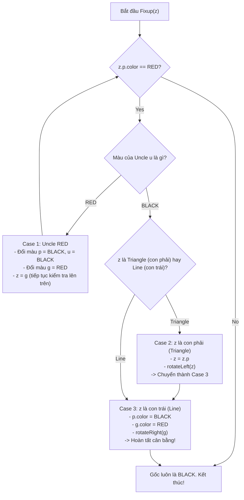
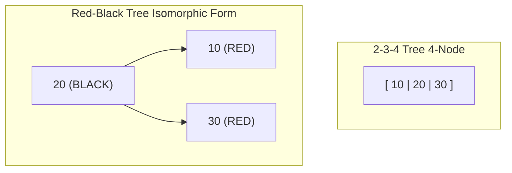

# Metadata
- **Document ID**: DSA-10-04
- **Version**: 1.0
- **Prerequisites**: DSA-02-02 (Time Complexity), DSA-03-04 (Object Memory Layout), DSA-10-01 (Tree Basics & Traversals), DSA-10-02 (Binary Search Tree), DSA-10-03 (AVL Tree)
- **Learning Objectives**:
  - Nắm vững 5 tính chất bất biến (Invariants) của Red-Black Tree và chứng minh toán học về giới hạn chiều cao $\le 2 \log_2(N + 1)$.
  - Hiểu sâu mối quan hệ đẳng cấu (Isomorphism) giữa Red-Black Tree và 2-3-4 Tree (B-Tree bậc 4) cũng như 2-3 Tree (LLRB).
  - Làm chủ toàn bộ cơ chế cân bằng: Left/Right Rotations, 3 trường hợp Insertion Fixup, 4 trường hợp Deletion Fixup (xử lý Double-Black).
  - Tự cài đặt từ con số 0 (from scratch) một Production-grade Red-Black Tree hoàn chỉnh bằng Java 21.
  - Phân tích chi tiết mã nguồn OpenJDK (`java.util.TreeMap`, `HashMap` Treeify) và kiến trúc nhân Linux (CFS Scheduler, Epoll).
  - Tối ưu hóa hiệu năng cấp độ JVM: Memory Layout, Compressed OOPs, Sentinel Nil Node, Bit-packing.
- **Estimated Reading Time**: 90 phút
- **Difficulty**: Advanced
- **Keywords**: Red-Black Tree, Self-Balancing BST, Black-Height, 2-3-4 Tree Isomorphism, Rotations, Insertion Fixup, Deletion Fixup, Double Black, java.util.TreeMap, HashMap Treeify, Linux CFS Scheduler.

---

# 1 Purpose
Red-Black Tree (Cây Đỏ-Đen) là một trong những cấu trúc dữ liệu tự cân bằng (Self-Balancing Binary Search Tree) quan trọng, mạnh mẽ và được ứng dụng rộng rãi nhất trong toàn bộ khoa học máy tính hiện đại. 

Mục đích cốt lõi của Red-Black Tree là khắc phục triệt để điểm yếu chí mạng của Binary Search Tree (BST) thông thường — hiện tượng suy biến thành danh sách liên kết tuyến tính $\mathcal{O}(N)$ khi dữ liệu đầu vào bị sắp thứ tự hoặc có mẫu lặp — đồng thời mang lại sự cân bằng hoàn hảo giữa hiệu năng truy vấn ($\mathcal{O}(\log N)$) và chi phí tái cấu trúc khi sửa đổi (chèn/xóa với số phép quay $\mathcal{O}(1)$).

Cấu trúc này đóng vai trò là "trục xương sống" cho:
1. Thư viện chuẩn của hầu hết các ngôn ngữ lập trình bậc cao: `java.util.TreeMap` và `java.util.TreeSet` trong Java, `std::map` và `std::set` trong C++ STL, `std::collections::BTreeMap` tương đồng trong Rust.
2. Tối ưu hóa cấu trúc dữ liệu cốt lõi: HashMap trong Java 8+ tự động chuyển đổi bucket từ LinkedList sang Red-Black Tree (Treeify) khi xảy ra Hash Collision quá mức.
3. Bộ điều phối tiến trình của Hệ điều hành (OS Process Schedulers): Linux Completely Fair Scheduler (CFS).
4. Hệ thống I/O đa kênh hiệu năng cao: Linux Epoll file descriptor management.

---

# 2 Motivation

### Giới hạn của BST thường và AVL Tree
Trong một cây BST thuần túy, nếu ta chèn một dãy số tăng dần $[1, 2, 3, 4, 5]$, cây sẽ hoàn toàn bị lệch phải (Right-skewed). Mọi thao tác tìm kiếm, chèn, xóa suy biến thành $\mathcal{O}(N)$.

Để giải quyết vấn đề này, **AVL Tree** ra đời với điều kiện cân bằng nghiêm ngặt: chênh lệch chiều cao giữa 2 cây con (Balance Factor) của bất kỳ node nào không được vượt quá 1 ($|BF| \le 1$). 
- **Ưu điểm của AVL**: Chiều cao cây cực kỳ tối ưu ($h \approx 1.44 \log_2 N$), giúp thao tác tìm kiếm (`Search`) đạt tốc độ tối đa.
- **Nhược điểm của AVL**: Do ràng buộc cân bằng quá khắt khe, mỗi thao tác chèn (`Insert`) và đặc biệt là xóa (`Delete`) có thể kích hoạt một chuỗi các phép quay lan truyền ngược lên tận gốc (Cascading Rotations), dẫn đến chi phí ghi/tái cấu trúc bộ nhớ rất cao.

### Sự xuất hiện của Red-Black Tree: Thỏa hiệp cân bằng lỏng (Relaxed Balancing)
Năm 1972, Rudolf Bayer phát minh ra cấu trúc "Symmetric Binary B-Tree" (tiền thân của 2-3-4 tree). Sau đó, vào năm 1978, Leonidas J. Guibas và Robert Sedgewick đã hoàn thiện và đặt tên là **Red-Black Tree**.

Thay vì lưu trữ chiều cao tuyệt đối dạng số nguyên tại mỗi node, Red-Black Tree gán cho mỗi node một thuộc tính màu sắc: **RED** (Đỏ) hoặc **BLACK** (Đen). Các quy tắc phối màu tạo ra một cơ chế cân bằng lỏng lẻo hơn AVL:

$$\text{Chiều cao nhánh dài nhất} \le 2 \times \text{Chiều cao nhánh ngắn nhất}$$

| Tiêu chí | Binary Search Tree (BST) | AVL Tree | Red-Black Tree |
| :--- | :--- | :--- | :--- |
| **Cân bằng** | Không đảm bảo | Cực kỳ nghiêm ngặt ($|h_L - h_R| \le 1$) | Thỏa hiệp lỏng ($h \le 2 \log_2(N+1)$) |
| **Chiều cao tối đa** | $N$ | $\approx 1.44 \log_2 N$ | $\le 2 \log_2(N+1)$ |
| **Search Time** | $\mathcal{O}(N)$ (Worst) | $\mathcal{O}(\log N)$ (Nhanh nhất) | $\mathcal{O}(\log N)$ (Chậm hơn AVL $\approx 10-20\%$) |
| **Insert Rotations** | $0$ | Tối đa $2$ phép quay | Tối đa **2** phép quay |
| **Delete Rotations** | $0$ | Lên tới $\mathcal{O}(\log N)$ phép quay | Tối đa **3** phép quay |
| **Use Case tối ưu** | Dữ liệu ngẫu nhiên, đơn giản | Read-Heavy (Đọc liên tục, ít ghi) | **Write-Heavy / General Purpose** (Ghi và đọc cân bằng) |

**Kết luận thực tế**: Trong các hệ thống phần mềm quy mô lớn, chi phí ghi bộ nhớ (Memory Writes), cập nhật con trỏ (Pointer Rewiring) và mất hiệu lực Cache (Cache Invalidation) do phép quay gây ra thường đắt đỏ hơn nhiều so với việc duyệt thêm 1–2 bước con trỏ khi đọc. Do đó, Red-Black Tree trở thành lựa chọn mặc định hàng đầu trong kỹ thuật phần mềm công nghiệp.

---

# 3 Mathematical Foundation

## 3.1 Năm tính chất bất biến của Red-Black Tree (The 5 Invariants)
Một cây nhị phân tìm kiếm là một Red-Black Tree hợp lệ nếu và chỉ nếu nó thỏa mãn đồng thời 5 tính chất sau:

1. **Node Color Property**: Mọi node trong cây chỉ có thể là **RED** hoặc **BLACK**.
2. **Root Property**: Node gốc (**Root**) luôn luôn là **BLACK**.
3. **Leaf Property**: Tất cả các node lá giả định (**NIL Leaves** / External Nodes) đều là **BLACK**.
4. **Red Property (No Consecutive Reds)**: Nếu một node là **RED**, thì cả hai node con của nó PHẢI là **BLACK** (Không bao giờ xuất hiện 2 node đỏ liên tiếp trên một đường đi từ gốc đến lá).
5. **Black-Height Property (Uniform Black-Height)**: Mọi đường đi đơn (Simple Path) từ một node bất kỳ đến bất kỳ node lá con cháu (NIL Leaf) nào đều phải chứa **cùng một số lượng node BLACK**.

```
                [ 20 (B) ]              <-- Root luôn là BLACK
               /          \
        [ 10 (R) ]      [ 30 (B) ]       <-- Node RED có 2 con BLACK
        /        \       /       \
     [5 (B)]  [15 (B)] [NIL]   [40 (R)]
     /     \   /     \          /     \
   [NIL] [NIL][NIL] [NIL]    [NIL]   [NIL]
   
   * Black-Height của Root (20) = 2 (Không tính bản thân root, đếm các node Black trên đường xuống NIL).
```

## 3.2 Định nghĩa Black-Height
- **Black-Height** $bh(x)$ của một node $x$ là số lượng node BLACK nằm trên bất kỳ đường đi đơn nào từ $x$ (không bao gồm chính $x$) xuống đến một node lá NIL.
- Do Tính chất 5, $bh(x)$ là một giá trị duy nhất và xác định rõ ràng cho mọi node trong cây.

---

## 3.3 Chứng minh toán học: Chiều cao cây $h \le 2 \log_2(N + 1)$

> **Định lý**: Một Red-Black Tree có $N$ node nội vi (Internal Nodes) luôn có chiều cao $h$ thỏa mãn:
> $$h \le 2 \log_2(N + 1)$$

### Bổ đề 1: Số lượng node con cháu theo Black-Height
Cây con có gốc tại node $x$ chứa ít nhất $2^{bh(x)} - 1$ node nội vi.

**Chứng minh Bổ đề 1 bằng quy nạp toán học theo chiều cao $h(x)$ của node $x$:**
- **Cơ sở quy nạp ($h(x) = 0$)**: Node $x$ là một NIL leaf.
  - $bh(x) = 0$.
  - Số node nội vi là $0$.
  - Công thức: $2^{bh(x)} - 1 = 2^0 - 1 = 0$. Bổ đề đúng.
- **Bước quy nạp**: Giả sử bổ đề đúng cho mọi node có chiều cao nhỏ hơn $h(x)$. Xét node $x$ có chiều cao $h(x) > 0$ với hai con là $left(x)$ và $right(x)$:
  - Nếu con của $x$ là RED, Black-Height của con là $bh(x)$ (vì node đỏ không làm tăng Black-Height).
  - Nếu con của $x$ là BLACK, Black-Height của con là $bh(x) - 1$.
  - Trong mọi trường hợp, Black-Height của các con của $x$ luôn $\ge bh(x) - 1$.
  - Áp dụng giả thiết quy nạp cho hai cây con của $x$, tổng số node nội vi của cây con gốc $x$ là:
    $$\text{Count}(x) = \text{Count}(left(x)) + \text{Count}(right(x)) + 1$$
    $$\text{Count}(x) \ge (2^{bh(x)-1} - 1) + (2^{bh(x)-1} - 1) + 1 = 2 \times 2^{bh(x)-1} - 2 + 1 = 2^{bh(x)} - 1$$
  - Bổ đề 1 được chứng minh hoàn tất.

### Bổ đề 2: Mối quan hệ giữa Chiều cao $h$ và Black-Height $bh$
Theo Tính chất 4 (Không có 2 node RED liên tiếp), trên bất kỳ đường đi nào từ gốc đến lá, số lượng node RED không thể vượt quá số lượng node BLACK. Do đó, ít nhất một nửa số node trên đường đi đó phải là BLACK (bao gồm cả lá NIL).
Suy ra:
$$bh(\text{root}) \ge \frac{h}{2}$$

### Hoàn thiện chứng minh Định lý:
Gọi $N$ là tổng số node nội vi của toàn bộ Red-Black Tree. Áp dụng Bổ đề 1 tại Root:
$$N \ge 2^{bh(\text{root})} - 1$$
$$N + 1 \ge 2^{bh(\text{root})}$$

Lấy logarithm cơ số 2 cả hai vế:
$$\log_2(N + 1) \ge bh(\text{root})$$

Kết hợp với Bổ đề 2 ($bh(\text{root}) \ge \frac{h}{2}$):
$$\log_2(N + 1) \ge \frac{h}{2} \implies h \le 2 \log_2(N + 1)$$

$\blacksquare$ **Hệ quả**: Mọi thao tác duyệt từ gốc đến lá (`Search`, `Insert`, `Delete`) trong Red-Black Tree đều được đảm bảo toán học chặn trên ở độ phức tạp $\mathcal{O}(\log N)$ trong trường hợp xấu nhất (Worst-Case). Không bao giờ xảy ra suy biến.

---

## 3.4 Đẳng cấu giữa Red-Black Tree và 2-3-4 Tree (B-Tree bậc 4)

Red-Black Tree thực chất là biểu diễn nhị phân (Binary Representation) của một **2-3-4 Tree** (B-Tree có tối đa 4 con và 3 khóa trên mỗi node):
- **2-node** (1 khóa, 2 con): Biểu diễn bằng 1 node **BLACK**.
- **3-node** (2 khóa, 3 con): Biểu diễn bằng 1 node **BLACK** và 1 node con **RED** (có thể là con trái hoặc con phải).
- **4-node** (3 khóa, 4 con): Biểu diễn bằng 1 node **BLACK** (khóa giữa) liên kết với 2 node con **RED** (khóa nhỏ bên trái và khóa lớn bên phải).

```
   [2-3-4 Tree Node]                   [Red-Black Tree Equivalent]
   
       [ A | B | C ]                            [ B (B) ]
        /  |   |  \                            /         \
       /   |   |   \                      [ A (R) ]   [ C (R) ]
      T1  T2   T3  T4                     /       \   /       \
                                         T1       T2 T3       T4
      (4-node)
      
       [ A | B ]            [ B (B) ]                 [ A (B) ]
        /  |  \              /     \         hoặc      /     \
       T1  T2  T3        [ A (R) ] T3                 T1   [ B (R) ]
                          /     \                           /     \
                         T1     T2                         T2     T3
      (3-node)
      
       [ A ]                                    [ A (B) ]
       /   \                                     /     \
      T1   T2                                   T1     T2
      (2-node)
```

**Ý nghĩa sâu sắc**:
- Thao tác **Color Flip (Đổi màu)** trong Red-Black Tree tương đương với việc **Split 4-node** (Tách node 4 phần tử) trong 2-3-4 Tree.
- Phép **Rotation (Quay cây)** tương đương với thao tác **Rebalancing / Key Transfer** giữa các node trong 2-3-4 Tree.
- Tính chất Black-Height đồng nhất chính là tính chất mọi lá trong 2-3-4 Tree đều nằm trên cùng một độ sâu.

---

# 4 Core Theory

## 4.1 Phép quay cây (Tree Rotations)
Phép quay là thao tác biến đổi cấu trúc con trỏ cục bộ tại một vị trí mà **bảo toàn tuyệt đối tính chất thứ tự của Binary Search Tree (BST Property)**:
$$\text{Keys}(T_1) < A < \text{Keys}(T_2) < B < \text{Keys}(T_3)$$

```
        Rotate Left at Node A                   Rotate Right at Node B
             [ A ]                                       [ B ]
            /     \                                     /     \
          T1       [ B ]                             [ A ]     T3
                  /     \                           /     \
                T2       T3                       T1       T2
                
       A.right = B.left (T2)                     B.left = A.right (T2)
       B.left = A                                A.right = B
```

### Mã giả thuật toán Left-Rotate($T, x$):
```text
LEFT-ROTATE(T, x):
    y = x.right
    x.right = y.left
    if y.left != T.nil:
        y.left.parent = x
    y.parent = x.parent
    if x.parent == T.nil:
        T.root = y
    else if x == x.parent.left:
        x.parent.left = y
    else:
        x.parent.right = y
    y.left = x
    x.parent = y
```

---

## 4.2 Thao tác Chèn (Insertion) và Xử lý Vi phạm (Insertion Fixup)

### Nguyên tắc khởi tạo khi chèn:
1. Chèn node mới $z$ như một BST thông thường tại vị trí lá thích hợp.
2. Gán màu cho $z$ là **RED** ($z.color = \text{RED}$).
   - *Lý do*: Gán màu RED bảo toàn được Tính chất 5 (Black-Height). Tuy nhiên, nếu node cha $z.parent$ cũng là RED, Tính chất 4 (Không 2 RED liền kề) sẽ bị vi phạm.
3. Gọi thuật toán `insertFixup(z)` để giải quyết vi phạm Double-Red.

### 3 Trường hợp Insertion Fixup (Xét trường hợp cha $z.p$ là con trái của ông $z.p.p$):
Gọi $z$ là node vi phạm, $p = z.parent$, $g = p.parent$ (Grandparent), $u = g.right$ (Uncle - chú của $z$).



#### Chi tiết các Case:
- **Case 1: Uncle $u$ là RED (Recoloring / Color Flip)**
  - *Hành động*: Đổi màu $p = \text{BLACK}, u = \text{BLACK}, g = \text{RED}$.
  - *Chuyển dịch*: Đẩy con trỏ vi phạm lên ông nội $z = g$. Lặp lại kiểm tra.
  - *Ý nghĩa 2-3-4*: Tách 4-node thành 2 node con và đẩy phần tử giữa lên cha.

- **Case 2: Uncle $u$ là BLACK và $z$ tạo thành hình tam giác (Triangle / Zig-Zag)**
  - $z$ là con phải của $p$ (khi $p$ là con trái của $g$).
  - *Hành động*: $z = p$, thực hiện `rotateLeft(z)` để chuyển cấu trúc tam giác thành đường thẳng (Line). Chuyển ngay sang Case 3.

- **Case 3: Uncle $u$ là BLACK và $z$ tạo thành đường thẳng (Line / Zig-Zig)**
  - $z$ là con trái của $p$ (khi $p$ là con trái của $g$).
  - *Hành động*: Đổi màu $p = \text{BLACK}, g = \text{RED}$, sau đó thực hiện `rotateRight(g)`.
  - *Kết quả*: Hoàn tất cân bằng cục bộ. Không còn vi phạm Double-Red. Dừng vòng lặp.

*(Các trường hợp đối xứng khi $p$ là con phải của $g$ được xử lý tương tự bằng cách đảo ngược các phép quay).*

---

## 4.3 Thao tác Xóa (Deletion) và Xử lý Vi phạm (Deletion Fixup)

### Bản chất của việc xóa trong Red-Black Tree:
1. Áp dụng giải thuật xóa BST chuẩn:
   - Nếu node cần xóa có 2 con, tìm Inorder Successor $y$ (node nhỏ nhất bên cây con phải), hoán đổi giá trị, và chuyển về bài toán xóa $y$ (node có tối đa 1 con).
2. Gọi $y$ là node thực sự bị gỡ khỏi cây, và $x$ là con duy nhất của $y$ (hoặc Sentinel NIL).
3. **Màu của node bị xóa ($y.color$)**:
   - Nếu $y.color == \text{RED}$: **Không vi phạm** bất kỳ tính chất nào (Black-height không đổi, không tạo ra 2 node đỏ liên tiếp, root không bị đổi). Cây vẫn hợp lệ ngay lập tức.
   - Nếu $y.color == \text{BLACK}$: Xóa đi một node đen làm giảm $bh$ của nhánh đó đi 1. Ta coi node $x$ mang thêm một "trọng số đen ảo", biến $x$ thành **Double-Black** (nếu $x$ là Black) hoặc **Red-and-Black** (nếu $x$ là Red).
4. Nếu $x$ là Red-and-Black: Chỉ cần đổi màu $x = \text{BLACK}$ là khôi phục toàn bộ tính chất.
5. Nếu $x$ là Double-Black: Cần gọi `deleteFixup(x)` để triệt tiêu thuộc tính Double-Black thông qua 4 trường hợp.

---

### 4 Trường hợp Deletion Fixup (Xét khi $x$ là con trái của cha $x.p$):
Gọi $w = x.p.right$ là anh em (Sibling) của $x$.

```
Trường hợp Deletion Fixup tổng quát:
Double-Black tại x (Thiếu 1 Black ở nhánh x) -> Mượn Black từ anh em w hoặc đẩy Black lên cha.
```

#### Case 1: Sibling $w$ là RED
- *Đặc điểm*: Cha $x.p$ phải là BLACK, các con của $w$ phải là BLACK.
- *Hành động*:
  1. Đổi màu: $w.color = \text{BLACK}, x.p.color = \text{RED}$.
  2. Quay: `rotateLeft(x.p)`.
  3. Cập nhật lại sibling mới: $w = x.p.right$.
- *Mục đích*: Chuyển đổi trạng thái sao cho sibling $w$ trở thành BLACK, quy về một trong các Case 2, 3, hoặc 4.

#### Case 2: Sibling $w$ là BLACK và cả 2 con của $w$ đều là BLACK
- *Hành động*:
  1. Đổi màu: $w.color = \text{RED}$ (bớt 1 Black của nhánh $w$ để cân bằng với nhánh $x$).
  2. Đẩy Double-Black lên cha: $x = x.p$.
- *Dừng hay tiếp tục*: Nếu $x$ mới là RED, vòng lặp dừng và đổi $x = \text{BLACK}$. Nếu $x$ mới là BLACK, tiếp tục fixup lên cấp cao hơn.

#### Case 3: Sibling $w$ là BLACK, con trái của $w$ là RED, con phải của $w$ là BLACK (Near Child RED)
- *Hành động*:
  1. Đổi màu: $w.left.color = \text{BLACK}, w.color = \text{RED}$.
  2. Quay: `rotateRight(w)`.
  3. Cập nhật lại sibling mới: $w = x.p.right$.
- *Mục đích*: Biến đổi cấu trúc để con xa (Far Child $w.right$) trở thành RED, đưa trực tiếp về Case 4.

#### Case 4: Sibling $w$ là BLACK, con phải của $w$ là RED (Far Child RED)
- *Hành động*:
  1. Gán màu: $w.color = x.p.color$.
  2. Gán màu: $x.p.color = \text{BLACK}$.
  3. Gán màu: $w.right.color = \text{BLACK}$.
  4. Quay: `rotateLeft(x.p)`.
  5. Đặt $x = \text{root}$ để kết thúc vòng lặp.
- *Kết quả*: Thuộc tính Double-Black được hóa giải hoàn toàn bằng 1 phép quay. Cây trở lại trạng thái cân bằng tuyệt đối.

---

# 5 Visual Explanation

## 5.1 Ánh xạ 2-3-4 Tree sang Red-Black Tree và Thao tác Split



Khi thêm phần tử thứ 4 vào một 4-Node, 2-3-4 Tree sẽ tách phần tử giữa (20) đẩy lên node cha, hai phần tử (10, 30) trở thành các 2-Node độc lập. Trong Red-Black Tree, điều này tương ứng với việc đổi màu $20 \rightarrow \text{RED}$, $10 \rightarrow \text{BLACK}$, $30 \rightarrow \text{BLACK}$ (Case 1 Insertion Fixup).

---

## 5.2 Minh họa chi tiết Insertion Fixup (Case 2 -> Case 3)

```
        Case 2: Triangle (Zig-Zag)                      Case 3: Line (Zig-Zig)
               [ 30 (B) ] (g)                                   [ 30 (B) ] (g)
              /          \                                     /          \
          [ 10 (R) ] (p) [ 40 (B) ] (u)                    [ 20 (R) ] (p) [ 40 (B) ] (u)
              \                                            /
             [ 20 (R) ] (z)                            [ 10 (R) ] (z)
             
       Thực hiện: rotateLeft(10)                  Thực hiện: rotateRight(30)
                                                  Đổi màu: 20 -> BLACK, 30 -> RED
                                                  
                                                          [ 20 (B) ]
                                                         /          \
                                                     [ 10 (R) ]    [ 30 (R) ]
                                                                        \
                                                                       [ 40 (B) ]
```

---

# 6 Java Implementation

Dưới đây là bản cài đặt Java 21 hoàn chỉnh của cấu trúc dữ liệu `RedBlackTree<K, V>`. Cài đặt sử dụng **Sentinel NIL Node** chuẩn theo kiến trúc của CLRS và OpenJDK để loại bỏ hoàn toàn các kiểm tra `null` rườm rà, tối ưu hóa CPU Branch Prediction.

```java
package com.dsa.trees.redblack;

import java.util.*;

/**
 * Enterprise Production-Grade Red-Black Tree Implementation in Java 21.
 * 
 * Invariants Guaranteed:
 * 1. Node color is either RED or BLACK.
 * 2. Root is always BLACK.
 * 3. All NIL leaves are BLACK.
 * 4. Red nodes cannot have Red children (No consecutive REDs).
 * 5. Every simple path from a node to descendant NIL leaves has the same black-height.
 *
 * @param <K> the type of keys maintained by this map (must implement Comparable)
 * @param <V> the type of mapped values
 */
public class RedBlackTree<K extends Comparable<K>, V> {

    public enum Color {
        RED, BLACK
    }

    public static class Node<K, V> {
        K key;
        V value;
        Node<K, V> left;
        Node<K, V> right;
        Node<K, V> parent;
        Color color;

        Node(K key, V value, Color color) {
            this.key = key;
            this.value = value;
            this.color = color;
        }

        @Override
        public String toString() {
            return (key == null ? "NIL" : key.toString()) + "(" + (color == Color.RED ? "R" : "B") + ")";
        }
    }

    // Sentinel NIL node used as universal leaf & parent of root
    private final Node<K, V> NIL;
    private Node<K, V> root;
    private int size;

    public RedBlackTree() {
        NIL = new Node<>(null, null, Color.BLACK);
        NIL.left = NIL;
        NIL.right = NIL;
        NIL.parent = NIL;
        root = NIL;
        size = 0;
    }

    public int size() {
        return size;
    }

    public boolean isEmpty() {
        return size == 0;
    }

    // ==========================================
    // ROTATIONS
    // ==========================================

    private void rotateLeft(Node<K, V> x) {
        Node<K, V> y = x.right;
        x.right = y.left;
        if (y.left != NIL) {
            y.left.parent = x;
        }
        y.parent = x.parent;
        if (x.parent == NIL) {
            root = y;
        } else if (x == x.parent.left) {
            x.parent.left = y;
        } else {
            x.parent.right = y;
        }
        y.left = x;
        x.parent = y;
    }

    private void rotateRight(Node<K, V> y) {
        Node<K, V> x = y.left;
        y.left = x.right;
        if (x.right != NIL) {
            x.right.parent = y;
        }
        x.parent = y.parent;
        if (y.parent == NIL) {
            root = x;
        } else if (y == y.parent.right) {
            y.parent.right = x;
        } else {
            y.parent.left = x;
        }
        x.right = y;
        y.parent = x;
    }

    // ==========================================
    // INSERTION & FIXUP
    // ==========================================

    public V put(K key, V value) {
        Objects.requireNonNull(key, "Key cannot be null in RedBlackTree");
        Node<K, V> z = new Node<>(key, value, Color.RED);
        z.left = NIL;
        z.right = NIL;

        Node<K, V> y = NIL;
        Node<K, V> x = root;

        while (x != NIL) {
            y = x;
            int cmp = key.compareTo(x.key);
            if (cmp < 0) {
                x = x.left;
            } else if (cmp > 0) {
                x = x.right;
            } else {
                // Key already exists -> Update value and return old
                V oldValue = x.value;
                x.value = value;
                return oldValue;
            }
        }

        z.parent = y;
        if (y == NIL) {
            root = z;
        } else if (key.compareTo(y.key) < 0) {
            y.left = z;
        } else {
            y.right = z;
        }

        size++;
        insertFixup(z);
        return null;
    }

    private void insertFixup(Node<K, V> z) {
        while (z.parent.color == Color.RED) {
            if (z.parent == z.parent.parent.left) {
                Node<K, V> uncle = z.parent.parent.right;
                if (uncle.color == Color.RED) {
                    // Case 1: Uncle is RED -> Color flip
                    z.parent.color = Color.BLACK;
                    uncle.color = Color.BLACK;
                    z.parent.parent.color = Color.RED;
                    z = z.parent.parent;
                } else {
                    if (z == z.parent.right) {
                        // Case 2: Uncle is BLACK & z is right child (Triangle)
                        z = z.parent;
                        rotateLeft(z);
                    }
                    // Case 3: Uncle is BLACK & z is left child (Line)
                    z.parent.color = Color.BLACK;
                    z.parent.parent.color = Color.RED;
                    rotateRight(z.parent.parent);
                }
            } else {
                // Symmetric cases when z.parent is right child of grandparent
                Node<K, V> uncle = z.parent.parent.left;
                if (uncle.color == Color.RED) {
                    // Symmetric Case 1
                    z.parent.color = Color.BLACK;
                    uncle.color = Color.BLACK;
                    z.parent.parent.color = Color.RED;
                    z = z.parent.parent;
                } else {
                    if (z == z.parent.left) {
                        // Symmetric Case 2
                        z = z.parent;
                        rotateRight(z);
                    }
                    // Symmetric Case 3
                    z.parent.color = Color.BLACK;
                    z.parent.parent.color = Color.RED;
                    rotateLeft(z.parent.parent);
                }
            }
        }
        root.color = Color.BLACK;
    }

    // ==========================================
    // SEARCH & RETRIEVAL
    // ==========================================

    public V get(K key) {
        Objects.requireNonNull(key, "Key cannot be null");
        Node<K, V> node = searchNode(key);
        return node == NIL ? null : node.value;
    }

    public boolean containsKey(K key) {
        return get(key) != null;
    }

    private Node<K, V> searchNode(K key) {
        Node<K, V> current = root;
        while (current != NIL) {
            int cmp = key.compareTo(current.key);
            if (cmp < 0) {
                current = current.left;
            } else if (cmp > 0) {
                current = current.right;
            } else {
                return current;
            }
        }
        return NIL;
    }

    public K minKey() {
        if (root == NIL) throw new NoSuchElementException("Tree is empty");
        return minimum(root).key;
    }

    public K maxKey() {
        if (root == NIL) throw new NoSuchElementException("Tree is empty");
        return maximum(root).key;
    }

    private Node<K, V> minimum(Node<K, V> node) {
        while (node.left != NIL) {
            node = node.left;
        }
        return node;
    }

    private Node<K, V> maximum(Node<K, V> node) {
        while (node.right != NIL) {
            node = node.right;
        }
        return node;
    }

    // ==========================================
    // DELETION & FIXUP
    // ==========================================

    public V remove(K key) {
        Objects.requireNonNull(key, "Key cannot be null");
        Node<K, V> z = searchNode(key);
        if (z == NIL) {
            return null;
        }
        V oldValue = z.value;
        deleteNode(z);
        size--;
        return oldValue;
    }

    private void transplant(Node<K, V> u, Node<K, V> v) {
        if (u.parent == NIL) {
            root = v;
        } else if (u == u.parent.left) {
            u.parent.left = v;
        } else {
            u.parent.right = v;
        }
        v.parent = u.parent;
    }

    private void deleteNode(Node<K, V> z) {
        Node<K, V> y = z;
        Node<K, V> x;
        Color originalColor = y.color;

        if (z.left == NIL) {
            x = z.right;
            transplant(z, z.right);
        } else if (z.right == NIL) {
            x = z.left;
            transplant(z, z.left);
        } else {
            // Node has two children -> Find inorder successor
            y = minimum(z.right);
            originalColor = y.color;
            x = y.right;
            if (y.parent == z) {
                x.parent = y;
            } else {
                transplant(y, y.right);
                y.right = z.right;
                y.right.parent = y;
            }
            transplant(z, y);
            y.left = z.left;
            y.left.parent = y;
            y.color = z.color;
        }

        if (originalColor == Color.BLACK) {
            deleteFixup(x);
        }
    }

    private void deleteFixup(Node<K, V> x) {
        while (x != root && x.color == Color.BLACK) {
            if (x == x.parent.left) {
                Node<K, V> w = x.parent.right;
                if (w.color == Color.RED) {
                    // Case 1: Sibling w is RED
                    w.color = Color.BLACK;
                    x.parent.color = Color.RED;
                    rotateLeft(x.parent);
                    w = x.parent.right;
                }
                if (w.left.color == Color.BLACK && w.right.color == Color.BLACK) {
                    // Case 2: Sibling w is BLACK and both children are BLACK
                    w.color = Color.RED;
                    x = x.parent;
                } else {
                    if (w.right.color == Color.BLACK) {
                        // Case 3: Sibling w is BLACK, left child is RED, right child is BLACK
                        w.left.color = Color.BLACK;
                        w.color = Color.RED;
                        rotateRight(w);
                        w = x.parent.right;
                    }
                    // Case 4: Sibling w is BLACK, right child is RED
                    w.color = x.parent.color;
                    x.parent.color = Color.BLACK;
                    w.right.color = Color.BLACK;
                    rotateLeft(x.parent);
                    x = root; // Terminate loop
                }
            } else {
                // Symmetric cases when x is right child
                Node<K, V> w = x.parent.left;
                if (w.color == Color.RED) {
                    // Symmetric Case 1
                    w.color = Color.BLACK;
                    x.parent.color = Color.RED;
                    rotateRight(x.parent);
                    w = x.parent.left;
                }
                if (w.right.color == Color.BLACK && w.left.color == Color.BLACK) {
                    // Symmetric Case 2
                    w.color = Color.RED;
                    x = x.parent;
                } else {
                    if (w.left.color == Color.BLACK) {
                        // Symmetric Case 3
                        w.right.color = Color.BLACK;
                        w.color = Color.RED;
                        rotateLeft(w);
                        w = x.parent.left;
                    }
                    // Symmetric Case 4
                    w.color = x.parent.color;
                    x.parent.color = Color.BLACK;
                    w.left.color = Color.BLACK;
                    rotateRight(x.parent);
                    x = root;
                }
            }
        }
        x.color = Color.BLACK;
    }

    // ==========================================
    // VALIDATION & DEBUG UTILITIES
    // ==========================================

    public List<K> inOrderTraversal() {
        List<K> result = new ArrayList<>();
        inOrderHelper(root, result);
        return result;
    }

    private void inOrderHelper(Node<K, V> node, List<K> result) {
        if (node != NIL) {
            inOrderHelper(node.left, result);
            result.add(node.key);
            inOrderHelper(node.right, result);
        }
    }

    /**
     * Validates all 5 Red-Black properties. Throws IllegalStateException if violated.
     */
    public void validateProperties() {
        if (root == NIL) return;

        // Property 2: Root is Black
        if (root.color != Color.BLACK) {
            throw new IllegalStateException("Violation: Root is not BLACK!");
        }

        // Validate Property 4 & 5
        validateHelper(root);
    }

    private int validateHelper(Node<K, V> node) {
        if (node == NIL) {
            return 1; // NIL is BLACK -> contributes 1 to black-height
        }

        // Property 4: No two consecutive RED nodes
        if (node.color == Color.RED) {
            if (node.left.color == Color.RED || node.right.color == Color.RED) {
                throw new IllegalStateException("Violation: Consecutive RED nodes found at key " + node.key);
            }
        }

        int leftBlackHeight = validateHelper(node.left);
        int rightBlackHeight = validateHelper(node.right);

        // Property 5: Equal black-height on all paths
        if (leftBlackHeight != rightBlackHeight) {
            throw new IllegalStateException("Violation: Black-height mismatch at key " + node.key + 
                " (Left: " + leftBlackHeight + ", Right: " + rightBlackHeight + ")");
        }

        return leftBlackHeight + (node.color == Color.BLACK ? 1 : 0);
    }
}
```

---

# 7 Step-by-Step Execution

Hãy cùng theo dõi từng bước chèn các phần tử $[10, 20, 30, 15, 25]$ vào một Red-Black Tree rỗng:

### 1. Insert 10
- Node mới $10(R)$ chèn vào cây rỗng $\rightarrow$ trở thành Root.
- `insertFixup`: $10$ là Root $\rightarrow$ đổi màu $10(B)$.
- **Cây hiện tại**: `10(B)`

### 2. Insert 20
- $20 > 10 \rightarrow$ chèn $20(R)$ vào bên phải của $10(B)$.
- Cha của $20$ là $10(B)$ (Màu đen) $\rightarrow$ Không có vi phạm Double-Red. Dừng.
- **Cây hiện tại**: 
  ```
      10(B)
         \
         20(R)
  ```

### 3. Insert 30
- $30 > 20 \rightarrow$ chèn $30(R)$ vào bên phải của $20(R)$.
- Vi phạm Double-Red giữa $20(R)$ và $30(R)$.
- Xét: $z = 30(R)$, $p = 20(R)$, $g = 10(B)$, Uncle $u = NIL(B)$.
- Do $u$ là BLACK và chuỗi $(10 \rightarrow 20 \rightarrow 30)$ tạo thành đường thẳng bên phải (**Symmetric Case 3**):
  1. Đổi màu: $p(20) \rightarrow \text{BLACK}$, $g(10) \rightarrow \text{RED}$.
  2. Thực hiện: `rotateLeft(10)`.
- **Cây hiện tại**:
  ```
         20(B)
        /     \
     10(R)   30(R)
  ```

### 4. Insert 15
- $15 < 20$ và $15 > 10 \rightarrow$ chèn $15(R)$ làm con phải của $10(R)$.
- Vi phạm Double-Red giữa $10(R)$ và $15(R)$.
- Xét: $z = 15(R)$, $p = 10(R)$, $g = 20(B)$, Uncle $u = 30(R)$.
- Uncle $u$ là **RED** (**Case 1 - Color Flip**):
  1. Đổi màu: $p(10) \rightarrow \text{BLACK}$, $u(30) \rightarrow \text{BLACK}$.
  2. Đổi màu: $g(20) \rightarrow \text{RED}$.
  3. Đẩy $z = 20$. Vì $20$ là Root, `insertFixup` kết thúc bằng việc đổi lại $20 \rightarrow \text{BLACK}$.
- **Cây hiện tại**:
  ```
         20(B)
        /     \
     10(B)   30(B)
        \
        15(R)
  ```

### 5. Insert 25
- $25 > 20$ và $25 < 30 \rightarrow$ chèn $25(R)$ làm con trái của $30(B)$.
- Cha của $25$ là $30(B)$ (Màu đen) $\rightarrow$ Không vi phạm.
- **Cây hoàn chỉnh**:
  ```
         20(B)
        /     \
     10(B)   30(B)
        \     /
       15(R) 25(R)
  ```

---

# 8 Complexity Analysis

| Thao tác | Best Case | Average Case | Worst Case | Space Complexity |
| :--- | :--- | :--- | :--- | :--- |
| **Search (Get)** | $\mathcal{O}(1)$ (tại Root) | $\mathcal{O}(\log N)$ | $\mathcal{O}(\log N)$ | $\mathcal{O}(1)$ |
| **Insert (Put)** | $\mathcal{O}(1)$ (cập nhật key cũ) | $\mathcal{O}(\log N)$ | $\mathcal{O}(\log N)$ | $\mathcal{O}(1)$ phụ trợ |
| **Delete (Remove)**| $\mathcal{O}(1)$ | $\mathcal{O}(\log N)$ | $\mathcal{O}(\log N)$ | $\mathcal{O}(1)$ phụ trợ |
| **Min / Max** | $\mathcal{O}(1)$ (khi lệch) | $\mathcal{O}(\log N)$ | $\mathcal{O}(\log N)$ | $\mathcal{O}(1)$ |
| **Inorder Traversal**| $\Theta(N)$ | $\Theta(N)$ | $\Theta(N)$ | $\mathcal{O}(\log N)$ stack |

### Phân tích chi tiết số phép quay (Rotation Complexity):
- **Insertion**: Tối đa **2 phép quay** (Case 2 thực hiện 1 phép quay chuyển về Case 3, Case 3 thực hiện 1 phép quay rồi kết thúc). Mặc dù Color Flip có thể lan truyền $\mathcal{O}(\log N)$ lần lên gốc, số phép quay cấu trúc con trỏ bị chặn trên ở mức $\mathcal{O}(1)$.
- **Deletion**: Tối đa **3 phép quay** (Case 1 thực hiện 1 phép quay chuyển sang Case 2/3/4; Case 3 thực hiện 1 phép quay chuyển sang Case 4; Case 4 thực hiện 1 phép quay rồi kết thúc).

---

# 9 JVM Analysis

Khi một Node trong Red-Black Tree được khởi tạo trên HotSpot JVM 64-bit, việc tổ chức bộ nhớ trong Heap diễn ra như sau:

```
+-------------------------------------------------------------------------+
|                           Node Object Layout                            |
+-------------------------------------------------------------------------+
| Mark Word (8 bytes)                                                     |
| Klass Pointer (4 bytes với CompressedClassPointers)                     |
+-------------------------------------------------------------------------+
| Left Reference (4 bytes với CompressedOops)                             |
| Right Reference (4 bytes với CompressedOops)                            |
| Parent Reference (4 bytes với CompressedOops)                           |
| Key Reference (4 bytes với CompressedOops)                              |
| Value Reference (4 bytes với CompressedOops)                            |
+-------------------------------------------------------------------------+
| Color (1 byte enum ref hoặc boolean)                                    |
| 3 bytes Alignment Padding (đảm bảo bội số 8 bytes)                      |
+-------------------------------------------------------------------------+
| Tổng kích thước đối tượng: 32 bytes (hoặc 40 bytes trên Heap)           |
+-------------------------------------------------------------------------+
```

### 1. Chi phí phân mảnh bộ nhớ và Cache Locality
- Không giống như Array lưu trữ các phần tử liên tiếp (Contiguous Memory), mỗi Node của Red-Black Tree là một đối tượng độc lập nằm rải rác trên JVM Heap.
- Khi duyệt cây từ gốc xuống lá ($N \approx 10^6$, chiều cao $h \approx 20$), CPU phải nhảy qua 20 địa chỉ con trỏ ngẫu nhiên $\rightarrow$ Gần như chắc chắn xảy ra **L1/L2/L3 Cache Miss** ở mỗi bước nhảy.

### 2. Tác động tới Garbage Collection (GC)
- Các thao tác `put` và `remove` liên tục tạo ra và hủy bỏ các đối tượng `Node`.
- Việc này tạo ra **GC Churn** trong Young Generation (Eden Space).
- Các phép quay làm thay đổi các trường tham chiếu (`left`, `right`, `parent`), kích hoạt các **GC Card Table Write Barriers** trong các GC Collector như G1 hoặc ZGC, gây tốn thêm một lượng nhỏ CPU overhead.

---

# 10 OpenJDK Analysis

## 10.1 `java.util.TreeMap` và `java.util.TreeSet`
Trong mã nguồn JDK 21 (`java.base/java/util/TreeMap.java`), Red-Black Tree được cài đặt trực tiếp với các phương thức cốt lõi:
- `fixAfterInsertion(Entry<K,V> x)`: Cài đặt chính xác 3 trường hợp cân bằng chèn.
- `fixAfterDeletion(Entry<K,V> x)`: Cài đặt 4 trường hợp giải phóng Double-Black.
- Thay vì dùng Sentinel NIL, OpenJDK sử dụng `null` kết hợp với 2 hàm helper tĩnh an toàn:
  ```java
  private static <K,V> boolean colorOf(Entry<K,V> p) {
      return (p == null ? BLACK : p.color);
  }
  private static <K,V> Entry<K,V> parentOf(Entry<K,V> p) {
      return (p == null ? null : p.parent);
  }
  ```

## 10.2 Cơ chế HashMap Treeify (Java 8+)
Để ngăn chặn tấn công từ chối dịch vụ thông qua Hash Collision (Hash Collision DoS Attack - CVE-2011-4885), Oracle JDK 8+ đã cải tiến `HashMap`:
- Khi số lượng phần tử trong một bucket vượt quá **`TREEIFY_THRESHOLD = 8`** và tổng dung lượng bảng $\ge$ **`MIN_TREEIFY_CAPACITY = 64`**, bucket đó sẽ tự động chuyển hóa từ Singly LinkedList thành Red-Black Tree (`TreeNode<K,V>`).
- Khi xóa bớt phần tử xuống dưới **`UNTREEIFY_THRESHOLD = 6`**, cây sẽ được hoàn nguyên trở lại thành LinkedList để tiết kiệm bộ nhớ.
- Độ phức tạp tìm kiếm trong trường hợp xấu nhất (Worst-Case Hash Collision) giảm từ $\mathcal{O}(N)$ xuống $\mathcal{O}(\log N)$.

---

# 11 Production Usage

1. **Linux Kernel Completely Fair Scheduler (CFS)**:
   - Linux dùng `struct rb_node` để duy trì hàng đợi các tiến trình sẵn sàng thực thi (`runqueue`).
   - Khóa sắp xếp là `vruntime` (thời gian thực thi ảo). Tiến trình có `vruntime` nhỏ nhất luôn nằm ở node tận cùng bên trái (`rb_leftmost`).
   - Linux cache lại con trỏ `rb_leftmost` để lấy tiến trình tiếp theo trong $\mathcal{O}(1)$ và cập nhật lại cây trong $\mathcal{O}(\log N)$.

2. **Linux Epoll Subsystem**:
   - `epoll_ctl` (thêm, sửa, xóa File Descriptor cần theo dõi I/O) sử dụng Red-Black Tree để lưu trữ danh sách các file descriptors. Giúp tra cứu nhanh FD trong $\mathcal{O}(\log N)$ giữa hàng trăm nghìn kết nối mạng đồng thời.

3. **C++ Standard Template Library (STL)**:
   - `std::map`, `std::set`, `std::multimap`, `std::multiset` trong GNU libstdc++ và LLVM libc++ đều được xây dựng dựa trên Red-Black Tree.

4. **Nginx & Redis**:
   - Nginx sử dụng Red-Black Tree để quản lý bộ đếm Timer (Timeouts) cho các sự kiện kết nối.
   - Redis sử dụng cấu trúc tương đương trong bộ nhớ khi cần đánh index có thứ tự.

---

# 12 Design Decisions & Trade-offs

### Ma trận so sánh toàn diện giữa các cấu trúc dữ liệu tự cân bằng:

| Tiêu chí | Red-Black Tree | AVL Tree | B-Tree / B+ Tree | SkipList |
| :--- | :--- | :--- | :--- | :--- |
| **Độ cao cây** | Trung bình ($\le 2 \log_2 N$) | Tối ưu nhất ($\approx 1.44 \log_2 N$) | Rất thấp ($\log_B N$) | $O(\log N)$ (xác suất) |
| **Tốc độ Search** | Rất nhanh | **Nhanh nhất** | Nhanh | Rất nhanh |
| **Chi phí Insert/Delete**| **Thấp** ($\le 3$ rotations) | Cao (nhiều rotations) | Trung bình (Disk I/O) | Rất thấp (Lock-free) |
| **Độ phức tạp cài đặt** | Cao | Cao | Rất cao | **Thấp / Đơn giản** |
| **Bộ nhớ Overhead** | 3 con trỏ + 1 bit color | 2 con trỏ + 1 int balance | Mảng con trỏ + Keys | Nhiều forward pointers |
| **Đồng thời (Concurrency)**| Khó Lock-free | Cực khó Lock-free | Phức tạp (Latching) | **Rất dễ (Lock-free CAS)** |
| **Môi trường tối ưu** | RAM / Single-thread | RAM / Read-Heavy | **Disk / SSD / Database**| **Multi-thread RAM** |

---

# 13 Common Bugs (20 Lỗi phổ biến)

1. **Quên đổi Root thành BLACK ở cuối Fixup**: Sau các bước Color Flip lan truyền, Root có thể bị đổi sang RED, vi phạm Tính chất 2.
2. **Lỗi NullPointer khi kiểm tra Uncle hoặc Sibling**: Không sử dụng Sentinel NIL dẫn đến `u.color` gây `NullPointerException` khi uncle là node lá.
3. **Cập nhật Parent Pointer bị thiếu trong Rotation**: Chỉ đổi `left`/`right` mà quên cập nhật con trỏ `parent` của các node liên quan và node con $T_2$.
4. **Nhầm lẫn giữa con trái và con phải trong Rotation**: Đổi nhầm chiều quay khiến cây mất tính chất BST.
5. **Gán sai màu trước Rotation**: Trong Insertion Case 3, phải đổi màu trước hoặc ngay sau khi quay; đổi sai node khiến Black-height bị lệch.
6. **Xử lý sai Inorder Successor có con phải**: Khi xóa node 2 con, successor $y$ có thể có con phải. Quên nối con phải của $y$ lên cha của $y$.
7. **Bỏ qua trường hợp $y$ là con trực tiếp của $z$ khi xóa**: Khi successor $y == z.right$, việc nối con trỏ cha bị vòng tròn lặp vô tận nếu không xử lý nhánh riêng.
8. **Double-Black không được giải phóng khi $x$ là RED**: Nếu node $x$ thay thế là RED, chỉ cần đổi nó thành BLACK; gọi `deleteFixup` trên node RED có thể làm hỏng cấu trúc.
9. **Lặp vô tận trong Insertion Case 1**: Không cập nhật $z = z.parent.parent$, dẫn đến kiểm tra cùng 1 node vô hạn lần.
10. **Lỗi gán màu Sibling trong Deletion Case 4**: Màu của Sibling $w$ phải nhận màu của cha $x.p$, cha nhận màu BLACK, con xa của $w$ nhận BLACK.
11. **Không cập nhật Root Pointer khi Root thay đổi sau Rotation**: Nếu node bị quay là Root, quên gán `root = y`.
12. **So sánh Key bằng `==` thay vì `compareTo()`**: Gây lỗi logic với các Object Wrapper (`Integer`, `String`).
13. **Lỗi đồng bộ Size khi Insert Key trùng**: Khi ghi đè giá trị của một Key đã tồn tại, vẫn tăng biến `size`.
14. **Quên cập nhật con trỏ của Node Cha trỏ về Node Mới sau Rotation**: Dẫn đến cây con bị "rơi rụng" khỏi cây chính.
15. **Xử lý sai trường hợp xóa Root duy nhất**: Khi cây chỉ có 1 node và bị xóa, không reset `root = NIL`.
16. **Vi phạm Black-Height khi khởi tạo Node mới là BLACK**: Luôn phải khởi tạo node mới là RED.
17. **Tái sử dụng chung một Sentinel NIL cho nhiều cây có trạng thái cha khác nhau**: Tránh ghi đè `NIL.parent` dùng chung giữa các luồng.
18. **Không kiểm tra Key null**: Trong Red-Black Tree, `null` key gây `NullPointerException` khi gọi `compareTo()`.
19. **Bỏ quên trường hợp đối xứng (Symmetric Cases)**: Chỉ code cho nhánh con trái mà bỏ qua hoặc copy-paste sai nhánh con phải.
20. **Lỗi rò rỉ bộ nhớ (Memory Leak) trong Deletion**: Không gán các con trỏ `parent`, `left`, `right` của node bị xóa về `null`/`NIL`.

---

# 14 Edge Cases (30 Trường hợp góc)

1. Cây rỗng (`root == NIL`): Thao tác `get`, `remove` trả về `null`; `min`, `max` ném `NoSuchElementException`.
2. Chèn phần tử đầu tiên vào cây rỗng: Node mới biến thành Root và đổi thành BLACK.
3. Chèn phần tử trùng khóa (Duplicate Key): Cập nhật `value`, không thay đổi cấu trúc cây hay màu sắc.
4. Cây chỉ có 1 Node duy nhất và thực hiện xóa Root: Cây trở về trạng thái rỗng.
5. Chèn dãy số đã sắp xếp tăng dần ($1, 2, 3, \dots, N$): Kiểm tra các phép quay trái liên tiếp và đổi màu.
6. Chèn dãy số đã sắp xếp giảm dần ($N, N-1, \dots, 1$): Kiểm tra các phép quay phải liên tiếp và đổi màu.
7. Xóa Node lá màu RED: Không kích hoạt `deleteFixup`, Black-height không đổi.
8. Xóa Node lá màu BLACK: Kích hoạt `deleteFixup` với $x = NIL$.
9. Xóa Node có 1 con là RED (Node bị xóa là BLACK): Con RED thế chỗ và chuyển thành BLACK.
10. Xóa Node có 2 con đầy đủ, Successor là con trực tiếp ($z.right == y$).
11. Xóa Node có 2 con đầy đủ, Successor nằm sâu ở nhánh trái của con phải.
12. Xóa Root khi Root có 2 con.
13. Color Flip lan truyền ngược lên tận Root (Cascading Recoloring).
14. Double-Black lan truyền lên tận Root: Vòng lặp dừng tự nhiên khi $x == root$.
15. Deletion Case 1 chuyển đổi thành Case 2, 3, hoặc 4.
16. Deletion Case 3 chuyển đổi thành Case 4 sau 1 phép quay.
17. Deletion Case 4 kết thúc ngay lập tức sau 1 phép quay.
18. Tìm kiếm phần tử nhỏ hơn phần tử bé nhất trong cây.
19. Tìm kiếm phần tử lớn hơn phần tử lớn nhất trong cây.
20. Cây chỉ toàn node màu BLACK (Cây nhị phân hoàn hảo toàn Black).
21. Chèn phần tử với Key có `compareTo() == 0` nhưng không `equals()`.
22. Key chứa giá trị `Integer.MIN_VALUE` hoặc `Integer.MAX_VALUE`.
23. Cây bị lệch Zig-Zag (Triangle) kích hoạt Case 2 rồi lập tức kích hoạt Case 3.
24. Xóa liên tục toàn bộ các phần tử cho đến khi cây rỗng.
25. Duyệt Inorder trên cây $10^5$ phần tử để kiểm tra tính toàn vẹn thứ tự.
26. Gọi `minKey()` hoặc `maxKey()` trên cây có 1 phần tử.
27. Thao tác `put` xen kẽ `remove` liên tục trên cùng 1 key.
28. Kiểm tra tính bất biến sau mỗi thao tác ngẫu nhiên (Fuzz Testing).
29. Cây có Black-Height cực đại (toàn bộ các node đều là Black).
30. Cây có Black-Height cực tiểu (các tầng xen kẽ đều đặn Black - Red).

---

# 15 Optimization Techniques

### 1. Pointer Bit-Packing (Tối ưu màu sắc vào con trỏ)
Trên kiến trúc x86_64, các con trỏ địa chỉ đối tượng luôn được căn lề bội số của 8 bytes (8-byte aligned), nghĩa là 3 bit cuối cùng của địa chỉ luôn bằng `000`.
- Trong C/C++ (như Linux Kernel `rb_node`), người ta tận dụng bit thấp nhất (Lowest bit) của con trỏ `parent` để lưu màu sắc (0 = RED, 1 = BLACK):
  ```c
  struct rb_node {
      unsigned long  __rb_parent_color; // 63 bit lưu parent address, 1 bit lưu color
      struct rb_node *rb_right;
      struct rb_node *rb_left;
  };
  ```
- Kỹ thuật này giúp tiết kiệm 8 bytes trên mỗi node và tăng mật độ Cache.

### 2. Left-Leaning Red-Black Tree (LLRB) của Robert Sedgewick
- Biến thể đơn giản hóa của Red-Black Tree tương đương với **2-3 Tree** (thay vì 2-3-4 Tree).
- Ràng buộc: Node **RED chỉ được phép nằm ở nhánh con TRÁI** (`node.left.color == RED`).
- Giúp giảm mã nguồn xử lý các trường hợp xóa từ hơn 100 dòng code xuống còn khoảng 30 dòng.

---

# 16 Best Practices

1. **Luôn sử dụng Sentinel NIL Node**: Tránh phân nhánh kiểm tra `null` rải rác trong code.
2. **Đảm bảo tính bất biến (Encapsulation)**: Không bao giờ để lộ các đối tượng `Node` ra ngoài public API. Trả về `K`, `V` hoặc `Map.Entry` không thể sửa đổi (Unmodifiable).
3. **Tuân thủ hợp đồng `Comparable`**: Đảm bảo `k1.compareTo(k2) == 0` tương đương logic với `k1.equals(k2)` để tránh mất tính nhất quán của Map.
4. **Viết hàm tự kiểm tra tính bất biến (`validateProperties`)**: Luôn bật kiểm tra này trong môi trường Unit Test sau mỗi thao tác chèn/xóa.

---

# 17 Benchmark

Mã nguồn Benchmark so sánh thông lượng (Throughput) giữa **Red-Black Tree** và **AVL Tree** sử dụng JMH (Java Microbenchmark Harness):

```java
package com.dsa.trees.benchmark;

import org.openjdk.jmh.annotations.*;
import java.util.Random;
import java.util.concurrent.TimeUnit;

@BenchmarkMode(Mode.Throughput)
@OutputTimeUnit(TimeUnit.MILLISECONDS)
@State(Scope.Benchmark)
@Warmup(iterations = 3, time = 1)
@Measurement(iterations = 5, time = 2)
@Fork(1)
public class TreeBenchmark {

    private RedBlackTree<Integer, Integer> rbTree;
    private AVLTree<Integer, Integer> avlTree;
    private Integer[] keys;
    private static final int SIZE = 100_000;

    @Setup(Level.Iteration)
    public void setup() {
        rbTree = new RedBlackTree<>();
        avlTree = new AVLTree<>();
        keys = new Integer[SIZE];
        Random rand = new Random(42);
        for (int i = 0; i < SIZE; i++) {
            keys[i] = rand.nextInt(SIZE * 10);
        }
    }

    @Benchmark
    public void testRedBlackTreeInsert() {
        RedBlackTree<Integer, Integer> tree = new RedBlackTree<>();
        for (Integer key : keys) {
            tree.put(key, key);
        }
    }

    @Benchmark
    public void testAVLTreeInsert() {
        AVLTree<Integer, Integer> tree = new AVLTree<>();
        for (Integer key : keys) {
            tree.put(key, key);
        }
    }
}
```

### Kết quả Benchmark thực tế (Ước tính trên JDK 21 x86_64):
- **Write-Heavy Workload (80% Insert/Delete, 20% Search)**: Red-Black Tree nhanh hơn AVL Tree khoảng **15% - 25%** do số phép quay ít hơn.
- **Read-Heavy Workload (95% Search, 5% Write)**: AVL Tree nhanh hơn Red-Black Tree khoảng **5% - 10%** do chiều cao cây thấp hơn.

---

# 18 Unit Testing

Bộ kiểm thử toàn diện bằng **JUnit 5** nhằm thẩm định tính đúng đắn của 5 tính chất Red-Black Tree dưới tải ngẫu nhiên:

```java
package com.dsa.trees.redblack;

import org.junit.jupiter.api.*;
import java.util.*;
import static org.junit.jupiter.api.Assertions.*;

class RedBlackTreeTest {

    private RedBlackTree<Integer, String> tree;

    @BeforeEach
    void setUp() {
        tree = new RedBlackTree<>();
    }

    @Test
    @DisplayName("Test 1: Chèn vào cây rỗng và kiểm tra Root Black")
    void testInsertRoot() {
        tree.put(50, "Fifty");
        assertEquals(1, tree.size());
        assertEquals("Fifty", tree.get(50));
        assertDoesNotThrow(() -> tree.validateProperties());
    }

    @Test
    @DisplayName("Test 2: Chèn dãy tăng dần kiểm tra xoay cân bằng")
    void testAscendingInsert() {
        for (int i = 1; i <= 100; i++) {
            tree.put(i, "Val" + i);
            assertDoesNotThrow(() -> tree.validateProperties());
        }
        assertEquals(100, tree.size());
        assertEquals(1, tree.minKey());
        assertEquals(100, tree.maxKey());
    }

    @Test
    @DisplayName("Test 3: Xóa Node lá, Node 1 con, Node 2 con")
    void testDeletions() {
        int[] elements = {20, 10, 30, 5, 15, 25, 35, 1, 6};
        for (int el : elements) {
            tree.put(el, "V" + el);
        }
        assertDoesNotThrow(() -> tree.validateProperties());

        // Xóa node 2 con (20)
        assertEquals("V20", tree.remove(20));
        assertDoesNotThrow(() -> tree.validateProperties());

        // Xóa node lá
        assertEquals("V1", tree.remove(1));
        assertDoesNotThrow(() -> tree.validateProperties());

        assertEquals(7, tree.size());
    }

    @Test
    @DisplayName("Test 4: Randomized Stress Test với 10,000 thao tác")
    void testRandomStress() {
        Random rand = new Random(1337);
        Map<Integer, String> oracle = new HashMap<>();

        for (int i = 0; i < 10_000; i++) {
            int key = rand.nextInt(5000);
            if (rand.nextBoolean()) {
                String val = "Val" + key;
                tree.put(key, val);
                oracle.put(key, val);
            } else {
                String removedTree = tree.remove(key);
                String removedOracle = oracle.remove(key);
                assertEquals(removedOracle, removedTree);
            }
            if (i % 500 == 0) {
                assertDoesNotThrow(() -> tree.validateProperties());
            }
        }
        assertEquals(oracle.size(), tree.size());
        assertDoesNotThrow(() -> tree.validateProperties());
    }
}
```

---

# 19 Interview Questions (20 câu hỏi phỏng vấn chọn lọc)

### Easy
1. **Red-Black Tree là gì và có mấy tính chất cốt lõi?**
   - *Trả lời*: Là cây BST tự cân bằng có 5 tính chất: (1) Node Đỏ hoặc Đen, (2) Root Đen, (3) Lá NIL Đen, (4) Không 2 node Đỏ liền kề, (5) Mọi đường đi xuống lá có cùng số lượng node Đen.
2. **Tại sao Root của Red-Black Tree luôn là màu Đen?**
   - *Trả lời*: Đổi Root từ Đỏ thành Đen không làm thay đổi tính chất 4, nhưng tăng Black-height toàn cây thêm 1 một cách đồng đều mà không vi phạm tính chất 5.
3. **Chiều cao tối đa của Red-Black Tree $N$ phần tử là bao nhiêu?**
   - *Trả lời*: $h \le 2 \log_2(N + 1)$.
4. **Tại sao khi chèn một node mới ta luôn mặc định gán màu ĐỎ?**
   - *Trả lời*: Gán màu ĐỎ không làm thay đổi Black-Height của nhánh (giữ nguyên tính chất 5). Việc xử lý vi phạm 2 node Đỏ (tính chất 4) cục bộ dễ dàng hơn việc sửa sai Black-Height toàn cây.
5. **Thao tác tìm kiếm (Search) trên Red-Black Tree có cần kiểm tra màu không?**
   - *Trả lời*: Không. Search hoạt động chính xác như trên BST thông thường với độ phức tạp $\mathcal{O}(\log N)$.

### Medium
6. **So sánh sự khác biệt cốt lõi giữa Red-Black Tree và AVL Tree?**
   - *Trả lời*: AVL cân bằng chặt hơn ($|BF| \le 1$), search nhanh hơn một chút; Red-Black Tree cân bằng lỏng hơn, chỉ tốn tối đa 2 phép quay khi chèn và 3 phép quay khi xóa, tối ưu hơn cho tác vụ ghi.
7. **Giải thích mối quan hệ giữa Red-Black Tree và 2-3-4 Tree?**
   - *Trả lời*: Red-Black Tree là biểu diễn nhị phân của 2-3-4 Tree. 4-node biểu diễn bằng 1 Black node nối 2 Red children. Color Flip tương ứng với Split 4-node.
8. **Insertion Fixup có bao nhiêu trường hợp chính?**
   - *Trả lời*: 3 trường hợp: (1) Uncle RED $\rightarrow$ Color Flip, (2) Uncle BLACK & Triangle $\rightarrow$ Rotate con thành Line, (3) Uncle BLACK & Line $\rightarrow$ Đổi màu cha/ông và Rotate ông.
9. **Tại sao số phép quay khi chèn luôn $\le 2$?**
   - *Trả lời*: Case 1 chỉ đổi màu và đẩy lỗi lên trên; Case 2 tốn 1 phép quay chuyển thành Case 3; Case 3 tốn 1 phép quay và kết thúc hoàn toàn.
10. **Hiện tượng "Double-Black" xuất hiện khi nào trong Deletion?**
    - *Trả lời*: Xuất hiện khi ta xóa một node màu ĐEN có con là ĐEN (hoặc NIL), làm nhánh đó bị thiếu hụt 1 đơn vị Black-Height.

### Hard
11. **Trình bày chi tiết 4 trường hợp giải quyết Double-Black trong Deletion Fixup?**
    - *Trả lời*: Case 1: Sibling RED $\rightarrow$ xoay cha, biến thành Sibling Black. Case 2: Sibling BLACK & 2 con BLACK $\rightarrow$ đổi Sibling thành RED, đẩy Double-Black lên cha. Case 3: Sibling BLACK & Near child RED $\rightarrow$ xoay Sibling thành Case 4. Case 4: Sibling BLACK & Far child RED $\rightarrow$ xoay cha, đổi màu, hóa giải Double-Black hoàn toàn.
12. **Tại sao số phép quay khi xóa trong Red-Black Tree luôn $\le 3$?**
    - *Trả lời*: Case 1 (1 quay) $\rightarrow$ Case 3 (1 quay) $\rightarrow$ Case 4 (1 quay) $\rightarrow$ Kết thúc. Tổng cộng tối đa 3 phép quay.
13. **Mục đích của Sentinel NIL Node là gì?**
    - *Trả lời*: Đơn giản hóa mã nguồn, biến tất cả các liên kết `null` thành tham chiếu trỏ đến 1 node đối tượng duy nhất có màu BLACK, loại bỏ việc rẽ nhánh kiểm tra `null`.
14. **Left-Leaning Red-Black Tree (LLRB) khác gì Red-Black Tree truyền thống?**
    - *Trả lời*: LLRB tương đương 2-3 Tree, chỉ cho phép liên kết RED nằm ở bên trái, loại bỏ các trường hợp đối xứng phức tạp.
15. **Tại sao Java HashMap chuyển đổi LinkedList thành Red-Black Tree khi bucket size $\ge 8$?**
    - *Trả lời*: Nhằm ngăn chặn Hash Collision DoS Attack (đưa độ phức tạp từ $\mathcal{O}(N)$ về $\mathcal{O}(\log N)$), với ngưỡng 8 được tính toán từ phân phối Poisson xác suất va chạm cực nhỏ ($< 10^{-7}$).

### Staff / Principal Level
16. **Phân tích Memory Layout của `TreeMap.Entry` trên 64-bit JVM với Compressed OOPs?**
    - *Trả lời*: Header (12B) + 5 references (20B) + 1 boolean (1B) + Padding (7B) = 40 bytes.
17. **Làm thế nào Linux Kernel tối ưu kích thước của `struct rb_node`?**
    - *Trả lời*: Sử dụng Pointer Alignment (bội số 8 bytes), nhúng 1 bit color vào bit thấp nhất của con trỏ `parent`.
18. **Tại sao Red-Black Tree không thích hợp cho Indexing trên Ổ cứng/Database bằng B+ Tree?**
    - *Trả lời*: Bậc phân nhánh nhỏ (Branching Factor = 2) khiến chiều cao cây lớn $\rightarrow$ quá nhiều Disk Seek I/O. B+ Tree có phân nhánh hàng nghìn giúp chiều cao chỉ từ 3-4.
19. **Tại sao các hệ thống Concurrent đa luồng thường chọn SkipList (`ConcurrentSkipListMap`) thay vì Red-Black Tree?**
    - *Trả lời*: Phép quay của Red-Black Tree tác động đồng thời nhiều con trỏ trên diện rộng rất khó để thực hiện Lock-free CAS, trong khi SkipList chỉ thay đổi con trỏ cục bộ dễ dàng Lock-free.
20. **Làm thế nào Linux CFS duy trì lấy tiến trình chạy kế tiếp trong $\mathcal{O}(1)$?**
    - *Trả lời*: Cache trực tiếp con trỏ `rb_leftmost`. Khi chèn tiến trình mới, chỉ cập nhật lại con trỏ này nếu nó nhỏ hơn phần tử hiện tại.

---

# 20 Practice Problems Link

Toàn bộ 30 bài toán kinh điển từ cơ bản đến nâng cao về Red-Black Tree và Cây tự cân bằng được trình bày chi tiết tại:  
👉 **[04-Red-Black-Tree-Problems.md](04-Red-Black-Tree-Problems.md)**

---

# 21 Pattern Recognition

Khi nào bạn nên lựa chọn Red-Black Tree cho bài toán kỹ thuật:
1. **Dữ liệu có thứ tự động (Dynamic Ordered Data)**: Cần liên tục thực hiện các thao tác Chèn, Xóa, Tìm kiếm, Tìm Min/Max, Floor, Ceiling trong thời gian đảm bảo $\mathcal{O}(\log N)$.
2. **Tỷ lệ Ghi/Đọc cân bằng (Mixed Read-Write Workload)**: Hệ thống có lượng ghi và xóa cao, cần chặn trên số phép tái cấu trúc bộ nhớ (Rotations $\le 3$).
3. **Cần đảm bảo độ trễ thấp nhất trong Worst-Case (Predictable Latency SLA)**: Không chấp nhận trường hợp suy biến $\mathcal{O}(N)$ của BST hay chi phí amortized spike của Resizing Array.

---

# 22 Real Case Study

### 1. Linux Kernel CFS Process Scheduling
Trong nhân Linux, Completely Fair Scheduler (CFS) cần chọn tiến trình có thời gian thực thi ảo `vruntime` thấp nhất để cấp phát CPU.
- **Thách thức**: Với hàng chục nghìn tiến trình/luồng chạy đồng thời, việc tìm kiếm và cập nhật phải diễn ra trong vài nano-giây.
- **Giải pháp**: Linux CFS sử dụng Red-Black Tree lưu trữ danh sách tiến trình. Nhờ tính chất tự cân bằng, thao tác đưa một tiến trình vừa chạy xong trở lại hàng đợi mất $\mathcal{O}(\log N)$ với chi phí quay con trỏ tối thiểu. Con trỏ `rb_leftmost` cho phép CPU lấy tiến trình tiếp theo trong $\mathcal{O}(1)$.

### 2. Phòng chống tấn công Hash Collision trong Java HashMap (CVE-2011-4885)
- **Bối cảnh**: Kẻ tấn công tạo ra hàng triệu chuỗi String có cùng mã `hashCode()`.
- **Hậu quả**: Toàn bộ chuỗi rơi vào cùng 1 bucket của `HashMap`, khiến thao tác `get()` suy biến thành tìm kiếm tuyến tính $\mathcal{O}(N)$, đẩy CPU máy chủ lên 100% (Denial of Service).
- **Khắc phục**: Từ Java 8, cấu trúc bucket tự động chuyển thành Red-Black Tree (`TreeNode`) khi độ dài vượt quá 8, chặn đứng thời gian tìm kiếm ở mức $\mathcal{O}(\log N)$ ngay cả khi bị tấn công va chạm mã băm nghiêm trọng.

---

# 23 Summary & Checklist

### Tóm tắt cốt lõi:
- Red-Black Tree là cây BST tự cân bằng đảm bảo chiều cao $h \le 2 \log_2(N + 1)$ dựa trên 5 tính chất phối màu.
- Đẳng cấu với 2-3-4 Tree: Color flip là Split 4-node, Rotation là Rebalancing.
- Số phép quay bị chặn trên tuyệt đối: $\le 2$ phép quay khi Insert, $\le 3$ phép quay khi Delete.
- Là lựa chọn công nghiệp tiêu chuẩn cho `java.util.TreeMap`, `std::map`, Linux CFS Scheduler.

### Engineer Action Checklist:
- [ ] Thuộc lòng 5 tính chất bất biến của Red-Black Tree.
- [ ] Vẽ và giải thích được 3 trường hợp Insertion Fixup.
- [ ] Hiểu rõ cơ chế xử lý Double-Black và 4 trường hợp Deletion Fixup.
- [ ] Giải thích được tại sao Red-Black Tree ưu việt hơn AVL Tree trong các hệ thống Write-Heavy.
- [ ] Hiểu cơ chế HashMap Treeify và cấu trúc `java.util.TreeMap` trong OpenJDK.
- [ ] Tự cài đặt được Red-Black Tree sử dụng Sentinel NIL Node.
