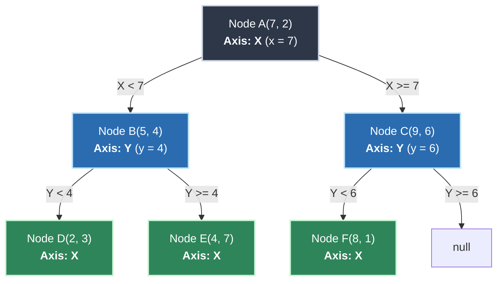

# K-D Tree (k-Dimensional Tree) - Cấu Trúc Dữ Liệu Phân Hoạch Không Gian Đa Chiều

---

## 1. Metadata

| Thuộc tính | Giá trị |
| :--- | :--- |
| **Document ID** | `DSA-10-09` |
| **Version** | `1.0` |
| **Topic** | Trees / Spatial Indexing Structures |
| **Prerequisites** | Binary Search Tree (BST), Recursion & Divide-and-Conquer, Vector Algebra & Distance Metrics ($L_1, L_2$), Priority Queue / Binary Heap |
| **Learning Objectives** | 1. Hiểu bản chất phân hoạch không gian bằng siêu phẳng trực giao (Orthogonal Hyperplanes).<br>2. Nắm vững thuật toán xây dựng cây $O(N \log N)$ bằng Quickselect Median.<br>3. Thành thạo kỹ thuật cắt tỉa nhánh (Branch-and-Bound Pruning) trong Nearest Neighbor Search (NNS) và $k$-NN.<br>4. Hiểu rõ Lời nguyền số chiều (Curse of Dimensionality) và giới hạn thực tế của K-D Tree.<br>5. Cài đặt production-grade K-D Tree trên Java 21 hỗ trợ đa chiều tổng quát. |
| **Estimated Reading Time** | 50 - 65 phút |
| **Difficulty** | Advanced (Chuyên sâu) |
| **Keywords** | `K-D Tree`, `k-Dimensional Tree`, `Spatial Indexing`, `Nearest Neighbor Search (NNS)`, `k-NN`, `Range Search`, `Space Partitioning`, `Curse of Dimensionality`, `Quickselect`, `Branch and Bound`, `BKD-Tree`, `SIMD` |

---

## 2. Purpose

**K-D Tree (k-Dimensional Tree)**, được đề xuất bởi Jon Louis Bentley vào năm 1975, là một cấu trúc dữ liệu cây nhị phân tìm kiếm mở rộng sang không gian $k$ chiều ($\mathbb{R}^k$). Mục đích cốt lõi của K-D Tree là:

1. **Phân hoạch không gian đa chiều (Multi-dimensional Space Partitioning):** Tổ chức tập hợp các điểm dữ liệu hình học trong không gian $\mathbb{R}^k$ thành một cấu trúc phân cấp (Hierarchical Structure).
2. **Tối ưu hóa các truy vấn lân cận (Proximity Queries):**
   - **Nearest Neighbor Search (NNS - 1-NN):** Tìm điểm dữ liệu trong tập hợp có khoảng cách hình học ngắn nhất tới một điểm truy vấn $Q$.
   - **$k$-Nearest Neighbors ($k$-NN):** Tìm $k$ điểm dữ liệu gần điểm truy vấn $Q$ nhất.
   - **Orthogonal Range Query (Hyper-rectangle Query):** Truy vấn toàn bộ các điểm nằm bên trong một khối siêu hộp giới hạn bởi $[\mathbf{min}, \mathbf{max}]$.
3. **Giảm độ phức tạp thời gian từ Tuyến tính xuống Logarit:** Giảm thời gian tìm kiếm từ $O(N)$ (duyệt cạn - Brute Force Linear Scan) xuống trung bình $O(\log N)$ khi số chiều $k$ nhỏ so với $\log N$.

---

## 3. Motivation

### 3.1. Giới hạn của Binary Search Tree (BST) 1D trong không gian đa chiều

Trong không gian 1 chiều ($\mathbb{R}^1$), các số thực có quan hệ thứ tự toàn phần (Total Order: $\forall a, b \in \mathbb{R}$, hoặc $a < b$, hoặc $a = b$, hoặc $a > b$). BST tận dụng tính chất này để phân đôi tập dữ liệu: nhánh trái chứa các phần tử nhỏ hơn khóa tại nút gốc, nhánh phải chứa các phần tử lớn hơn.

Tuy nhiên, trong không gian đa chiều ($k \ge 2$ như $2D (x, y)$ hoặc $3D (x, y, z)$):
- **Không tồn tại quan hệ thứ tự tự nhiên toàn phần:** Cho hai điểm $P_1(2, 8)$ và $P_2(7, 3)$. Điểm nào "nhỏ hơn"? Nếu xét theo $x$ thì $P_1 < P_2$, nhưng xét theo $y$ thì $P_1 > P_2$.
- **BST đơn chiều thất bại:** Nếu ta xây dựng BST chỉ dựa trên trục $x$, khi cần tìm kiếm các điểm có $y \in [y_1, y_2]$, cây hoàn toàn mất khả năng cắt tỉa và thoái hóa thành phép duyệt toàn bộ $O(N)$.
- **BST lồng nhau (Nested BSTs):** Xây dựng BST trên $x$, mỗi nút trỏ tới một BST trên $y$. Cấu trúc này chiếm dụng bộ nhớ $O(N \log N)$ đến $O(N^2)$ và không hỗ trợ hiệu quả truy vấn khoảng cách Euclid (Euclidean Distance).

```
   Không gian 1D (BST chuẩn):
   ---[ Nhánh Trái (< key) ]--- [ Node Key ] ---[ Nhánh Phải (> key) ]---> Trục X (Total Order)

   Không gian 2D (K-D Tree luân phiên):
   Depth 0 (Chia theo X):    X < X_root  |  X_root  |  X > X_root
                                     |
   Depth 1 (Chia theo Y):    Y < Y_left  |  Y > Y_left  (ở cây con trái)
                             Y < Y_right |  Y > Y_right (ở cây con phải)
```

### 3.2. So sánh hiệu năng: K-D Tree vs Brute Force Linear Scan

Giả sử hệ thống xử lý $N = 1,000,000$ điểm GPS của xe công nghệ trong thành phố. Mỗi giây có $10,000$ yêu cầu tìm xe gần khách hàng nhất:

| Phương pháp | Độ phức tạp 1 truy vấn | Số phép tính khoảng cách/s | Thời gian xử lý trung bình |
| :--- | :--- | :--- | :--- |
| **Brute Force Linear Scan** | $O(N \cdot k)$ | $10,000 \times 1,000,000 = 10^{10}$ phép tính | $\approx 8.5\text{ giây}$ (Hệ thống nghẽn hoàn toàn) |
| **K-D Tree NNS ($k=2$)** | $O(\log N)$ | $10,000 \times \approx 20 \approx 2 \times 10^5$ phép tính | $\approx 1.8\text{ mili-giây}$ (Real-time SLA $< 5\text{ms}$) |

K-D Tree ra đời nhằm mục đích giải quyết bài toán này bằng cách **luân phiên chia đôi không gian theo từng trục tọa độ** ở mỗi tầng của cây.

---

## 4. Mathematical Foundation

### 4.1. Không gian Véc-tơ và Siêu phẳng Phân hoạch (Hyperplane Partitioning)

Cho không gian véc-tơ Euclid $k$ chiều $\mathbb{R}^k$. Mỗi điểm $\mathbf{p} \in \mathbb{R}^k$ được biểu diễn bởi một bộ $k$ tọa độ:
$$\mathbf{p} = (p_0, p_1, \dots, p_{k-1})$$

Tại mỗi nút của K-D Tree ở độ sâu $d$ (với nút gốc ở độ sâu $d = 0$), trục tọa độ phân chia (Splitting Axis) được xác định thông qua phép toán modulo:
$$\text{axis} = d \pmod k$$

Nút lưu trữ điểm $\mathbf{p}$ sẽ chia không gian thành hai nửa không gian mở (Half-spaces) thông qua một siêu phẳng trực giao (Orthogonal Hyperplane) $H$:
$$H = \{ \mathbf{x} \in \mathbb{R}^k \mid x_{\text{axis}} = p_{\text{axis}} \}$$

Hai nửa không gian con tương ứng là:
$$\text{Left Half-space: } S_{\text{left}} = \{ \mathbf{x} \in \mathbb{R}^k \mid x_{\text{axis}} < p_{\text{axis}} \}$$
$$\text{Right Half-space: } S_{\text{right}} = \{ \mathbf{x} \in \mathbb{R}^k \mid x_{\text{axis}} \ge p_{\text{axis}} \}$$

```
                y ^
                  |          |
                  |  S_left  |  S_right
                  |          |
                  |          |  (p_x, p_y)
                  |          *---------------- Hyperplane: x = p_x
                  |          |
                  |          |
                  +--------------------------> x
```

### 4.2. Các độ đo khoảng cách (Distance Metrics)

K-D Tree hỗ trợ các metric thuộc họ Minkowski ($L_p$ metrics):

1. **Euclidean Distance ($L_2$ norm):**
   $$D_{L_2}(\mathbf{p}, \mathbf{q}) = \sqrt{\sum_{i=0}^{k-1} (p_i - q_i)^2}$$
2. **Squared Euclidean Distance ($L_2^2$ - Tối ưu hóa tính toán):**
   $$D_{L_2}^2(\mathbf{p}, \mathbf{q}) = \sum_{i=0}^{k-1} (p_i - q_i)^2$$
   *Ý nghĩa:* Vì hàm $f(x) = x^2$ là hàm đơn điệu tăng nghiêm ngặt trên $[0, \infty)$, $D_{L_2}(\mathbf{a}, \mathbf{b}) < D_{L_2}(\mathbf{a}, \mathbf{c}) \iff D_{L_2}^2(\mathbf{a}, \mathbf{b}) < D_{L_2}^2(\mathbf{a}, \mathbf{c})$. Ta hoàn toàn có thể loại bỏ hàm `Math.sqrt()` trong toàn bộ quá trình so sánh để tăng tốc độ thực thi.
3. **Manhattan Distance ($L_1$ norm - Grid distance):**
   $$D_{L_1}(\mathbf{p}, \mathbf{q}) = \sum_{i=0}^{k-1} |p_i - q_i|$$
4. **Chebyshev Distance ($L_\infty$ norm):**
   $$D_{L_\infty}(\mathbf{p}, \mathbf{q}) = \max_{0 \le i < k} |p_i - q_i|$$

### 4.3. Định lý Cắt tỉa Nhánh (Hyperplane Distance Lower Bound Theorem)

> **Định lý (Bounding Box Pruning Invariant):**
> Cho điểm truy vấn $\mathbf{q} \in \mathbb{R}^k$, điểm phân chia hiện tại $\mathbf{p} \in \mathbb{R}^k$ với trục phân chia $\text{axis} = a$, và khoảng cách ngắn nhất hiện tại từ $\mathbf{q}$ tới một điểm ứng viên tốt nhất đã biết là $R = D_{\text{best}}(\mathbf{q}, \mathbf{p}_{\text{best}})$.
> Khoảng cách trực giao từ $\mathbf{q}$ tới siêu phẳng phân chia $H: x_a = p_a$ là:
> $$\delta_a = |q_a - p_a|$$
> Nếu:
> $$\delta_a^2 \ge R^2 \quad (\text{tức } |q_a - p_a| \ge R)$$
> thì **mọi điểm $\mathbf{x}$ nằm trong nửa không gian đối diện** (nửa không gian không chứa $\mathbf{q}$) đều thỏa mãn:
> $$D_{L_2}(\mathbf{q}, \mathbf{x}) \ge \delta_a \ge R$$
> Do đó, không tồn tại bất kỳ điểm nào trong nhánh đối diện có thể gần $\mathbf{q}$ hơn $\mathbf{p}_{\text{best}}$. Ta có thể cắt tỉa (Prune) hoàn toàn nhánh cây đó mà không bỏ sót nghiệm tối ưu.

*Chứng minh:*
Khoảng cách Euclid từ $\mathbf{q}$ tới bất kỳ điểm $\mathbf{x}$ trong nửa không gian đối diện:
$$D^2(\mathbf{q}, \mathbf{x}) = \sum_{i=0}^{k-1} (q_i - x_i)^2 = (q_a - x_a)^2 + \sum_{i \ne a} (q_i - x_i)^2 \ge (q_a - x_a)^2$$
Vì $\mathbf{x}$ nằm ở nửa không gian đối diện so với $\mathbf{q}$ qua siêu phẳng $x_a = p_a$, đoạn thẳng nối $q_a$ và $x_a$ bắt buộc phải đi qua $p_a$, dẫn đến $|q_a - x_a| \ge |q_a - p_a| = \delta_a$.
Suy ra $D^2(\mathbf{q}, \mathbf{x}) \ge \delta_a^2 \ge R^2 \implies D(\mathbf{q}, \mathbf{x}) \ge R$. $\blacksquare$

---

## 5. Core Theory

### 5.1. Xây dựng K-D Tree Cân bằng (Balanced KD-Tree Construction)

Để đảm bảo chiều cao cây đạt tối ưu $H = \lceil \log_2 N \rceil$, tại mỗi bước đệ quy:
1. Xác định trục phân chia: $\text{axis} = \text{depth} \pmod k$.
2. Tìm **Median (Điểm trung vị)** của tập điểm hiện tại theo trục $\text{axis}$.
3. Đặt Median làm nút hiện tại.
4. Đệ quy xây dựng cây con trái với tập các điểm có tọa độ trục $\text{axis} < \text{median}$.
5. Đệ quy xây dựng cây con phải với tập các điểm có tọa độ trục $\text{axis} \ge \text{median}$.

**Kỹ thuật chọn Median:**
- *Cách 1 (Sort toàn bộ):* Sắp xếp danh sách tại mỗi tầng tốn $O(N \log N)$, dẫn đến tổng thời gian dựng cây $T(N) = 2 T(N/2) + O(N \log N) = O(N \log^2 N)$.
- *Cách 2 (Quickselect - Hoare's Selection):* Tìm median trong thời gian trung bình $O(N)$ bằng thuật toán Quickselect (`Introselect`), dẫn đến phương trình đệ quy:
  $$T(N) = 2 T(N/2) + O(N) \implies T(N) = O(N \log N)$$

```
Thuật toán BuildKDTree(Points, depth):
  1. Nếu Points rỗng -> Trả về null
  2. axis = depth % k
  3. medianIdx = Points.length / 2
  4. Quickselect(Points, medianIdx, axis) // Đưa phần tử trung vị về vị trí medianIdx
  5. node = New Node(Points[medianIdx], axis)
  6. node.left = BuildKDTree(Points[0 ... medianIdx - 1], depth + 1)
  7. node.right = BuildKDTree(Points[medianIdx + 1 ... end], depth + 1)
  8. Trả về node
```

### 5.2. Thuật toán Tìm Điểm Gần Nhất (Nearest Neighbor Search - NNS)

NNS trong K-D Tree sử dụng chiến lược **Branch-and-Bound kết hợp Backtracking**:

1. **Đi xuống lá (Forward Traversal):** Bắt đầu từ gốc, so sánh tọa độ của điểm truy vấn $Q$ với nút hiện tại theo trục $\text{axis}$. Ưu tiên đi xuống nhánh con cùng phía với $Q$ (nhánh tiềm năng nhất) cho tới khi chạm nút lá.
2. **Khởi tạo khoảng cách tốt nhất:** Khi chạm đáy, coi các điểm trên đường đi là ứng viên và cập nhật $D_{\text{best}}^2 = D^2(Q, \text{node})$.
3. **Quay lui (Backtracking) & Kiểm tra Cắt tỉa (Pruning):** Khi quay lui lại từng nút cha:
   - Cập nhật lại $D_{\text{best}}^2$ nếu khoảng cách từ $Q$ tới nút cha nhỏ hơn $D_{\text{best}}^2$.
   - Tính khoảng cách từ $Q$ tới siêu phẳng phân chia của nút cha: $\delta = (Q[\text{axis}] - \text{node}[\text{axis}])^2$.
   - **Quy tắc cắt tỉa:**
     - Nếu $\delta < D_{\text{best}}^2$: Hình cầu siêu không gian $\mathcal{B}(Q, D_{\text{best}})$ **giao cắt** với siêu phẳng $\implies$ Phải đệ quy khám phá nhánh con đối diện!
     - Nếu $\delta \ge D_{\text{best}}^2$: Hình cầu nằm hoàn toàn trong nửa không gian hiện tại $\implies$ **Bỏ qua nhánh con đối diện (Prune)**.

```
       Hyperplane: x = p_x
             |
             |       (Q) Query Point
             |      / | \
             |     /  |  \   Hypersphere B(Q, R)
             |    /   |   \
             |   |    |    |
             |    \   |   /
             |     \  |  /
             |<--\delta-->|
             |    \ | /
             |
   Nếu \delta < R: Hình cầu cắt qua siêu phẳng -> Phải tìm cả nhánh bên trái!
   Nếu \delta >= R: Hình cầu không chạm tới siêu phẳng -> Bỏ qua nhánh bên trái!
```

### 5.3. Thuật toán $k$-Nearest Neighbors ($k$-NN)

Mở rộng từ bài toán 1-NN sang tìm $K$ lân cận gần nhất:
- Sử dụng cấu trúc **Max-Heap (Priority Queue)** lưu trữ tối đa $K$ điểm ứng viên tốt nhất.
- Đỉnh của Max-Heap luôn lưu trữ điểm có **khoảng cách xa nhất** trong số $K$ điểm tốt nhất hiện tại (ký hiệu khoảng cách này là $D_{\text{worst-of-k}}^2$).
- **Cơ chế cập nhật Heap:**
  - Nếu Heap chưa đủ $K$ phần tử: Luôn thêm điểm hiện tại vào Heap.
  - Nếu Heap đã đủ $K$ phần tử và $D^2(Q, \text{node}) < D_{\text{worst-of-k}}^2$: Loại bỏ đỉnh Heap (poll) và chèn điểm mới vào.
- **Điều kiện Cắt tỉa cho $k$-NN:**
  - Nhánh đối diện chỉ bị cắt tỉa khi: $\text{Heap đã đủ } K \text{ phần tử} \text{ VÀ } (Q[\text{axis}] - \text{node}[\text{axis}])^2 \ge D_{\text{worst-of-k}}^2$.

### 5.4. Thuật toán Range Search (Orthogonal Range Query)

Tìm tất cả các điểm nằm trong hình hộp chữ nhật siêu chiều xác định bởi $[\mathbf{min}, \mathbf{max}]$ (nghĩa là $\forall i \in [0, k-1]: \text{min}_i \le p_i \le \text{max}_i$):
1. Tại nút hiện tại $\mathbf{p}$ với $\text{axis} = a$:
   - Nếu $\mathbf{p} \in [\mathbf{min}, \mathbf{max}]$: Thêm $\mathbf{p}$ vào kết quả.
   - Nếu $\text{min}_a \le p_a$: Vùng tìm kiếm giao với nửa không gian trái $\implies$ Đệ quy tìm tiếp ở cây con trái.
   - Nếu $\text{max}_a \ge p_a$: Vùng tìm kiếm giao với nửa không gian phải $\implies$ Đệ quy tìm tiếp ở cây con phải.

---

## 6. Visual Explanation

### 6.1. Phân hoạch Mặt phẳng 2D và Cây K-D Tree Tương Ứng

Xét 6 điểm trong không gian 2D ($k=2$):
- $A(7, 2)$, $B(5, 4)$, $C(9, 6)$, $D(2, 3)$, $E(4, 7)$, $F(8, 1)$

```
Depth 0: Trục X -> Median là A(7, 2) chia mặt phẳng bởi đường x = 7
Depth 1: Trục Y -> Cây con trái (X < 7): {D(2,3), E(4,7), B(5,4)} -> Median theo Y là B(5, 4) (đường y = 4)
                   Cây con phải (X >= 7): {F(8,1), C(9,6)} -> Median theo Y là C(9, 6) (đường y = 6)
Depth 2: Trục X -> D(2,3) (đường x = 2), E(4,7) (đường x = 4), F(8,1) (đường x = 8)
```

#### Biểu diễn Hình học trên Mặt phẳng 2D:

```
  y ^
    |
  8 |               |
  7 |     E(4,7)    |
  6 |   ------------+----------- C(9,6)
  5 |               |
  4 |------- B(5,4) |
  3 | D(2,3) |      |
  2 |        |      A(7,2)
  1 |        |      |       F(8,1)
  0 +--------+------+------------------> x
    0 1  2 3 4 5 6  7  8 9 10
            x=7 (Split at Root, Axis X)
    y=4 (Left Child, Axis Y)
    y=6 (Right Child, Axis Y)
```

#### Cấu trúc Cây K-D Tree tương ứng (Mermaid Diagram):



---

## 7. Java Implementation

Dưới đây là mã nguồn K-D Tree hoàn chỉnh, sản xuất (Production-Grade) viết bằng **Java 21**, hỗ trợ $k$ chiều tổng quát, cấu trúc Generic cho giá trị vệ tinh (Satellite Value), tích hợp thuật toán **Quickselect** để dựng cây $O(N \log N)$, và các hàm truy vấn tối ưu hóa (NNS, $k$-NN, Range Search).

```java
package com.dsa.trees.kdtree;

import java.util.*;

/**
 * Production-grade Generic k-Dimensional Tree (K-D Tree) Implementation in Java 21.
 * Supports NNS, k-NN, Range Search, and dynamic insertions.
 *
 * @param <V> The type of satellite data attached to each spatial point.
 */
public class KDTree<V> {

    /**
     * Immutable Multi-Dimensional Point record representation.
     */
    public record Point(double[] coords) {
        public Point {
            Objects.requireNonNull(coords, "Coordinates cannot be null");
            if (coords.length == 0) {
                throw new IllegalArgumentException("Dimension k must be >= 1");
            }
            // Defensive copy to guarantee absolute immutability
            coords = coords.clone();
        }

        public int dimensions() {
            return coords.length;
        }

        public double get(int axis) {
            return coords[axis];
        }

        /**
         * Computes Squared Euclidean Distance ($L_2^2$) to avoid Math.sqrt overhead.
         */
        public double distanceSquaredTo(Point other) {
            if (this.dimensions() != other.dimensions()) {
                throw new IllegalArgumentException("Points dimension mismatch: " 
                    + this.dimensions() + " vs " + other.dimensions());
            }
            double sum = 0.0;
            for (int i = 0; i < coords.length; i++) {
                double diff = this.coords[i] - other.coords[i];
                sum += diff * diff;
            }
            return sum;
        }

        public double distanceTo(Point other) {
            return Math.sqrt(distanceSquaredTo(other));
        }

        @Override
        public boolean equals(Object o) {
            if (this == o) return true;
            if (!(o instanceof Point point)) return false;
            return Arrays.equals(coords, point.coords);
        }

        @Override
        public int hashCode() {
            return Arrays.hashCode(coords);
        }

        @Override
        public String toString() {
            return Arrays.toString(coords);
        }
    }

    /**
     * Spatial Entry holding a Point and its associated payload value.
     */
    public record Entry<V>(Point point, V value) {
        public Entry {
            Objects.requireNonNull(point, "Point cannot be null");
        }
    }

    /**
     * Internal Node of the KD-Tree.
     */
    public static final class Node<V> {
        private final Point point;
        private V value;
        private final int axis;
        private Node<V> left;
        private Node<V> right;

        public Node(Point point, V value, int axis) {
            this.point = point;
            this.value = value;
            this.axis = axis;
        }

        public Point getPoint() { return point; }
        public V getValue() { return value; }
        public int getAxis() { return axis; }
        public Node<V> getLeft() { return left; }
        public Node<V> getRight() { return right; }
    }

    private final int k;
    private Node<V> root;
    private int size;

    /**
     * Constructs an empty KDTree with specified dimension k.
     */
    public KDTree(int k) {
        if (k < 1) {
            throw new IllegalArgumentException("Dimension k must be >= 1");
        }
        this.k = k;
        this.root = null;
        this.size = 0;
    }

    /**
     * Static factory method: Builds a perfectly balanced KD-Tree in O(N log N) using Quickselect.
     */
    public static <V> KDTree<V> build(List<Entry<V>> entries) {
        Objects.requireNonNull(entries, "Entries list cannot be null");
        if (entries.isEmpty()) {
            throw new IllegalArgumentException("Cannot build KDTree from empty entries list");
        }
        int dimensions = entries.getFirst().point().dimensions();
        KDTree<V> tree = new KDTree<>(dimensions);

        // Make a mutable copy for in-place Quickselect partitioning
        List<Entry<V>> mutableList = new ArrayList<>(entries);
        tree.root = tree.buildRecursive(mutableList, 0, mutableList.size() - 1, 0);
        tree.size = entries.size();
        return tree;
    }

    private Node<V> buildRecursive(List<Entry<V>> list, int left, int right, int depth) {
        if (left > right) {
            return null;
        }

        int axis = depth % k;
        int medianIndex = left + (right - left) / 2;

        // In-place Quickselect to find the median element in O(N)
        quickSelect(list, left, right, medianIndex, axis);

        Entry<V> medianEntry = list.get(medianIndex);
        Node<V> node = new Node<>(medianEntry.point(), medianEntry.value(), axis);

        node.left = buildRecursive(list, left, medianIndex - 1, depth + 1);
        node.right = buildRecursive(list, medianIndex + 1, right, depth + 1);

        return node;
    }

    /**
     * In-place Quickselect (Hoare's Selection Algorithm) to place the k-th smallest element at targetIndex.
     */
    private void quickSelect(List<Entry<V>> list, int left, int right, int targetIndex, int axis) {
        while (left < right) {
            int pivotIndex = partition(list, left, right, axis);
            if (pivotIndex == targetIndex) {
                return;
            } else if (pivotIndex < targetIndex) {
                left = pivotIndex + 1;
            } else {
                right = pivotIndex - 1;
            }
        }
    }

    private int partition(List<Entry<V>> list, int left, int right, int axis) {
        // Median-of-three pivot selection to prevent worst-case O(N^2) on sorted data
        int mid = left + (right - left) / 2;
        if (Double.compare(list.get(mid).point().get(axis), list.get(left).point().get(axis)) < 0) {
            Collections.swap(list, left, mid);
        }
        if (Double.compare(list.get(right).point().get(axis), list.get(left).point().get(axis)) < 0) {
            Collections.swap(list, left, right);
        }
        if (Double.compare(list.get(right).point().get(axis), list.get(mid).point().get(axis)) < 0) {
            Collections.swap(list, mid, right);
        }

        Collections.swap(list, mid, right);
        double pivotValue = list.get(right).point().get(axis);

        int i = left;
        for (int j = left; j < right; j++) {
            if (Double.compare(list.get(j).point().get(axis), pivotValue) < 0) {
                Collections.swap(list, i, j);
                i++;
            }
        }
        Collections.swap(list, i, right);
        return i;
    }

    public int size() {
        return size;
    }

    public boolean isEmpty() {
        return size == 0;
    }

    /**
     * Dynamic Insertion into the KD-Tree. Average O(log N), Worst-case O(N).
     */
    public void insert(Point point, V value) {
        Objects.requireNonNull(point, "Point cannot be null");
        validateDimension(point);
        root = insertRecursive(root, point, value, 0);
    }

    private Node<V> insertRecursive(Node<V> current, Point point, V value, int depth) {
        if (current == null) {
            size++;
            return new Node<>(point, value, depth % k);
        }

        if (current.point.equals(point)) {
            // Update existing value for identical coordinates
            current.value = value;
            return current;
        }

        int axis = current.axis;
        if (Double.compare(point.get(axis), current.point.get(axis)) < 0) {
            current.left = insertRecursive(current.left, point, value, depth + 1);
        } else {
            current.right = insertRecursive(current.right, point, value, depth + 1);
        }
        return current;
    }

    // =========================================================================
    // 1. NEAREST NEIGHBOR SEARCH (1-NN)
    // =========================================================================

    private static final class NNSRunner<V> {
        private Node<V> bestNode = null;
        private double bestDistSq = Double.POSITIVE_INFINITY;
    }

    /**
     * Finds the nearest neighbor to the given query point.
     *
     * @param query The target query point.
     * @return The closest Entry(point, value), or Optional.empty() if tree is empty.
     */
    public Optional<Entry<V>> nearestNeighbor(Point query) {
        Objects.requireNonNull(query, "Query point cannot be null");
        validateDimension(query);
        if (root == null) {
            return Optional.empty();
        }

        NNSRunner<V> runner = new NNSRunner<>();
        searchNearest(root, query, runner);
        return Optional.of(new Entry<>(runner.bestNode.point, runner.bestNode.value));
    }

    private void searchNearest(Node<V> node, Point query, NNSRunner<V> runner) {
        if (node == null) return;

        double dSq = query.distanceSquaredTo(node.point);
        if (dSq < runner.bestDistSq) {
            runner.bestDistSq = dSq;
            runner.bestNode = node;
        }

        int axis = node.axis;
        double diff = query.get(axis) - node.point.get(axis);
        double axisDistSq = diff * diff;

        Node<V> firstBranch = (diff < 0) ? node.left : node.right;
        Node<V> secondBranch = (diff < 0) ? node.right : node.left;

        // Explore the most promising branch first
        searchNearest(firstBranch, query, runner);

        // Branch-and-Bound: Prune second branch if hyperplane distance >= best distance
        if (axisDistSq < runner.bestDistSq) {
            searchNearest(secondBranch, query, runner);
        }
    }

    // =========================================================================
    // 2. K-NEAREST NEIGHBORS (k-NN)
    // =========================================================================

    private record NeighborMatch<V>(Node<V> node, double distSq) 
        implements Comparable<NeighborMatch<V>> {
        @Override
        public int compareTo(NeighborMatch<V> other) {
            // Max-Heap: furthest distance has highest priority at heap root
            return Double.compare(other.distSq, this.distSq);
        }
    }

    /**
     * Finds the K nearest neighbors to the query point using a bounded Max-Heap.
     */
    public List<Entry<V>> kNearestNeighbors(Point query, int kNeighbors) {
        Objects.requireNonNull(query, "Query point cannot be null");
        validateDimension(query);
        if (kNeighbors <= 0 || root == null) {
            return Collections.emptyList();
        }

        PriorityQueue<NeighborMatch<V>> maxHeap = new PriorityQueue<>(kNeighbors);
        searchKNN(root, query, kNeighbors, maxHeap);

        List<Entry<V>> result = new ArrayList<>(maxHeap.size());
        while (!maxHeap.isEmpty()) {
            Node<V> node = maxHeap.poll().node();
            result.add(new Entry<>(node.point, node.value));
        }
        // Result is in furthest-to-closest order due to max-heap polling; reverse to get ascending order
        Collections.reverse(result);
        return result;
    }

    private void searchKNN(Node<V> node, Point query, int kNeighbors, PriorityQueue<NeighborMatch<V>> maxHeap) {
        if (node == null) return;

        double dSq = query.distanceSquaredTo(node.point);

        if (maxHeap.size() < kNeighbors) {
            maxHeap.offer(new NeighborMatch<>(node, dSq));
        } else if (dSq < maxHeap.peek().distSq()) {
            maxHeap.poll();
            maxHeap.offer(new NeighborMatch<>(node, dSq));
        }

        int axis = node.axis;
        double diff = query.get(axis) - node.point.get(axis);
        double axisDistSq = diff * diff;

        Node<V> firstBranch = (diff < 0) ? node.left : node.right;
        Node<V> secondBranch = (diff < 0) ? node.right : node.left;

        searchKNN(firstBranch, query, kNeighbors, maxHeap);

        // Pruning condition for k-NN:
        // Explore second branch ONLY if heap is not full OR plane intersects the k-th sphere
        if (maxHeap.size() < kNeighbors || axisDistSq < maxHeap.peek().distSq()) {
            searchKNN(secondBranch, query, kNeighbors, maxHeap);
        }
    }

    // =========================================================================
    // 3. ORTHOGONAL RANGE SEARCH (HYPER-RECTANGLE QUERY)
    // =========================================================================

    /**
     * Finds all points residing within the hyper-rectangle [minBound, maxBound].
     */
    public List<Entry<V>> rangeSearch(Point minBound, Point maxBound) {
        Objects.requireNonNull(minBound, "Min bound cannot be null");
        Objects.requireNonNull(maxBound, "Max bound cannot be null");
        validateDimension(minBound);
        validateDimension(maxBound);

        for (int i = 0; i < k; i++) {
            if (minBound.get(i) > maxBound.get(i)) {
                throw new IllegalArgumentException("Min bound exceeds Max bound on axis " + i);
            }
        }

        List<Entry<V>> results = new ArrayList<>();
        searchRange(root, minBound, maxBound, results);
        return results;
    }

    private void searchRange(Node<V> node, Point minBound, Point maxBound, List<Entry<V>> results) {
        if (node == null) return;

        // Check if current node is fully contained inside the bounding box
        if (isInside(node.point, minBound, maxBound)) {
            results.add(new Entry<>(node.point, node.value));
        }

        int axis = node.axis;
        double val = node.point.get(axis);

        // If minBound on this axis <= split value, search left subtree
        if (minBound.get(axis) <= val) {
            searchRange(node.left, minBound, maxBound, results);
        }
        // If maxBound on this axis >= split value, search right subtree
        if (maxBound.get(axis) >= val) {
            searchRange(node.right, minBound, maxBound, results);
        }
    }

    private boolean isInside(Point p, Point minBound, Point maxBound) {
        for (int i = 0; i < k; i++) {
            if (p.get(i) < minBound.get(i) || p.get(i) > maxBound.get(i)) {
                return false;
            }
        }
        return true;
    }

    private void validateDimension(Point p) {
        if (p.dimensions() != this.k) {
            throw new IllegalArgumentException("Expected point with dimension " + this.k 
                + ", but got " + p.dimensions());
        }
    }
}
```

---

## 8. Step-by-Step Execution

### 8.1. Trace Xây dựng Cây 2D từ Tập Điểm

Cho tập gồm 6 điểm $2D$:
$P_1(3, 6), P_2(17, 15), P_3(13, 15), P_4(6, 12), P_5(9, 1), P_6(2, 7)$

```
Bước 1: Depth = 0 -> Axis = X.
  - Sắp xếp theo X: P6(2,7), P1(3,6), P4(6,12), P5(9,1), P3(13,15), P2(17,15)
  - Median index = 6 / 2 = 3 -> Điểm P5(9, 1).
  - Gốc (Root): Node(P5(9, 1), Axis=X).
  - Nhánh trái: {P6(2,7), P1(3,6), P4(6,12)}
  - Nhánh phải: {P3(13,15), P2(17,15)}

Bước 2: Xử lý Nhánh Trái (Depth = 1, Axis = Y):
  - Tập điểm: {P6(2,7), P1(3,6), P4(6,12)}
  - Sắp xếp theo Y: P1(3,6), P6(2,7), P4(6,12)
  - Median index = 1 -> Điểm P6(2, 7).
  - Node Left của Root: Node(P6(2, 7), Axis=Y).
  - Cây con trái của P6: {P1(3,6)} -> Depth 2, Axis X -> Node(P1(3,6), Axis=X).
  - Cây con phải của P6: {P4(6,12)} -> Depth 2, Axis X -> Node(P4(6,12), Axis=X).

Bước 3: Xử lý Nhánh Phải (Depth = 1, Axis = Y):
  - Tập điểm: {P3(13,15), P2(17,15)}
  - Sắp xếp theo Y: P3(13,15), P2(17,15)
  - Median index = 1 -> Điểm P2(17, 15).
  - Node Right của Root: Node(P2(17, 15), Axis=Y).
  - Cây con trái của P2: {P3(13,15)} -> Depth 2, Axis X -> Node(P3(13,15), Axis=X).
  - Cây con phải của P2: null.
```

### 8.2. Trace Nearest Neighbor Search với Pruning

Truy vấn điểm $Q(10, 2)$ để tìm điểm gần nhất:

```
Trạng thái khởi tạo: bestNode = null, bestDistSq = +Infinity.

1. Tại Root P5(9, 1) [Axis = X]:
   - Tính distSq(Q, P5) = (10 - 9)^2 + (2 - 1)^2 = 1 + 1 = 2.
   - Cập nhật bestNode = P5(9, 1), bestDistSq = 2.
   - So sánh trục X: Q.x (10) >= P5.x (9) -> Đi sang Nhánh Phải (P2).

2. Tại Node P2(17, 15) [Axis = Y]:
   - Tính distSq(Q, P2) = (10 - 17)^2 + (2 - 15)^2 = 49 + 169 = 218. (bestDistSq vẫn giữ = 2).
   - So sánh trục Y: Q.y (2) < P2.y (15) -> Đi sang Nhánh Trái (P3).

3. Tại Node P3(13, 15) [Axis = X]:
   - Tính distSq(Q, P3) = (10 - 13)^2 + (2 - 15)^2 = 9 + 169 = 178. (bestDistSq vẫn = 2).
   - Node P3 là lá -> Bắt đầu Backtrack.

4. Backtrack về P2(17, 15):
   - Kiểm tra nhánh đối diện (Nhánh Phải của P2): null -> Bỏ qua.

5. Backtrack về Root P5(9, 1) [Axis = X]:
   - Kiểm tra điều kiện cắt tỉa với Nhánh Trái (P6):
     delta_x^2 = (Q.x - P5.x)^2 = (10 - 9)^2 = 1.
   - So sánh: delta_x^2 (1) < bestDistSq (2) -> Giao cắt! Không thể tỉa, phải duyệt sang Nhánh Trái (P6).

6. Tại Node P6(2, 7) [Axis = Y]:
   - Tính distSq(Q, P6) = (10 - 2)^2 + (2 - 7)^2 = 64 + 25 = 89. (bestDistSq vẫn = 2).
   - Q.y (2) < P6.y (7) -> Đi sang Nhánh Trái (P1).

7. Tại Node P1(3, 6) [Axis = X]:
   - Tính distSq(Q, P1) = (10 - 3)^2 + (2 - 6)^2 = 49 + 16 = 65. (bestDistSq vẫn = 2).
   - Là lá -> Backtrack về P6.

8. Tại Node P6(2, 7) [Axis = Y]:
   - Kiểm tra nhánh đối diện (P4):
     delta_y^2 = (Q.y - P6.y)^2 = (2 - 7)^2 = 25.
   - So sánh: delta_y^2 (25) >= bestDistSq (2) -> PRUNED! Cắt tỉa toàn bộ cây con chứa P4!

Kết quả cuối cùng: Điểm gần Q(10, 2) nhất là P5(9, 1) với khoảng cách = sqrt(2) ≈ 1.414.
```

---

## 9. Complexity Analysis

| Thao tác | Best Case | Average Case | Worst Case | Space Complexity |
| :--- | :--- | :--- | :--- | :--- |
| **Build Tree (Quickselect)** | $O(k N \log N)$ | $O(k N \log N)$ | $O(k N^2)$ *(Nếu pivot tệ)* | $O(k N)$ (Recursion stack $O(\log N)$) |
| **Build Tree (Presorted)** | $O(k N \log N)$ | $O(k N \log N)$ | $O(k N \log N)$ | $O(k N)$ |
| **Insert (Dynamic)** | $O(k)$ | $O(k \log N)$ | $O(k N)$ *(Cây thoái hóa)* | $O(1)$ (Auxiliary) |
| **Exact Match Search** | $O(k)$ | $O(k \log N)$ | $O(k N)$ | $O(1)$ |
| **Delete (with min finding)**| $O(k \log N)$ | $O(k \log N)$ | $O(k N)$ | $O(\log N)$ |
| **Nearest Neighbor (NNS)** | $O(k \log N)$ | $O(2^k + \log N)$ | $O(k N)$ *(Curse of Dimensionality)* | $O(\log N)$ |
| **Orthogonal Range Search**| $O(k \log N + M)$ | $O(k N^{1 - 1/k} + M)$ | $O(k N)$ | $O(\log N + M)$ |

*Ghi chú:* $N$ là số điểm, $k$ là số chiều không gian, $M$ là số điểm thỏa mãn trong vùng Range Search.

### Phân tích Chuyên sâu: Lời nguyền Số Chiều (Curse of Dimensionality)

Độ phức tạp trung bình của NNS trong K-D Tree phụ thuộc vào hệ số $O(2^k \log N)$. Khi số chiều $k$ tăng:
1. **Thể tích siêu cầu giảm tiệm cận:** Trong không gian siêu cao chiều ($k > 20$), hầu hết thể tích của hình siêu hộp tập trung ở các góc, và khoảng cách giữa các điểm ngẫu nhiên tiệm cận một giá trị xấp xỉ nhau (Distance Concentration Effect).
2. **Hình cầu truy vấn giao cắt với hầu hết các siêu phẳng:** Bounding sphere $\mathcal{B}(Q, R)$ chạm tới gần như toàn bộ các mặt phẳng chia $\implies$ Thuật toán không thể cắt tỉa nhánh nào và phải duyệt qua $2^k$ nhánh $\implies$ K-D Tree thoái hóa hoàn toàn thành Duyệt Tuyến tính $O(N)$ nhưng với hằng số ẩn (overhead) lớn hơn nhiều do đệ quy và Pointer Chasing!
3. **Quy tắc ngón tay cái (Rule of Thumb):** K-D Tree chỉ phát huy hiệu năng vượt trội khi:
   $$N \gg 2^k$$
   *(Ví dụ: Với $k = 20$, cần $N \gg 2^{20} \approx 1,000,000$ điểm để cây có ý nghĩa tăng tốc).*

---

## 10. JVM Analysis

### 10.1. Memory Layout của Node trên 64-bit JVM

Xét đối tượng `Node` trong K-D Tree trên JVM 64-bit (Compressed OOPs enabled `-XX:+UseCompressedOops`):

```
+-----------------------------------------------------------------------+
|                       KDTree$Node Object (24 bytes)                  |
+-----------------------------------+-----------------------------------+
| Mark Word (8 bytes)               | Klass Word (4 bytes)              |
+-----------------------------------+-----------------------------------+
| left reference (4 bytes)          | right reference (4 bytes)         |
+-----------------------------------+-----------------------------------+
| point reference (4 bytes)         | value reference (4 bytes)         |
+-----------------------------------+-----------------------------------+
| axis (int - 4 bytes)              | Padding (4 bytes to align 8B)     |
+-----------------------------------+-----------------------------------+

+-----------------------------------------------------------------------+
|                   double[] coords Object (2D point: 32 bytes)          |
+-----------------------------------+-----------------------------------+
| Mark Word (8 bytes)               | Klass Word (4 bytes)              |
+-----------------------------------+-----------------------------------+
| array length (4 bytes)            | coords[0] (double - 8 bytes)      |
+-----------------------------------+-----------------------------------+
| coords[1] (double - 8 bytes)      | Padding (0 bytes)                 |
+-----------------------------------+-----------------------------------+
```

- Tổng bộ nhớ cho 1 điểm $2D$: $24\text{B (Node)} + 32\text{B (Array)} + 16\text{B (Point Record)} = \mathbf{72\text{ bytes/node}}$.
- Với $N = 10,000,000$ điểm: Chiếm $\approx 720\text{ MB}$ Heap, tạo ra $30,000,000$ đối tượng nhỏ lẻ $\implies$ Gây áp lực cực lớn lên Garbage Collector (GC Mark Phase) và Cache Locality kém (Cache Miss do phân tán bộ nhớ).

### 10.2. Giải pháp Tối ưu Bộ nhớ: Flat Array KD-Tree

Để đạt hiệu năng tối đa trên JVM và thân thiện với CPU L1/L2 Cache, trong môi trường Big Data / High-frequency Trading, K-D Tree thường được chuyển đổi thành cấu trúc mảng phẳng (Flat Array Representation):

```java
// Thay vì dùng hàng triệu Node Objects:
public class FlatKDTree {
    private final double[] coords; // coords[i * k + dim]
    private final int[] leftChild;
    private final int[] rightChild;
    private final int k;
}
```
*Lợi ích:* Giảm footprint xuống còn $\approx 16\text{ bytes/node}$, dữ liệu nằm liên tục trong bộ nhớ (Sequential Memory), kích hoạt CPU Hardware Prefetcher và tránh hoàn toàn GC overhead.

---

## 11. OpenJDK & Ecosystem Analysis

1. **Apache Lucene (Elasticsearch / Solr) - BKD-Tree (`org.apache.lucene.util.bkd.BKDWriter`):**
   - Lucene sử dụng biến thể **BKD-Tree (Block KD-Tree)** để lập chỉ mục các trường số đa chiều, tọa độ địa lý `geo_point`, và hình học không gian `geo_shape`.
   - *Khác biệt với Standard KD-Tree:* BKD-Tree là cấu trúc lưu trữ dựa trên Disk/Block IO, gom $N$ điểm vào các khối lá (Leaves chứa 512-1024 điểm) giúp giảm chiều cao cây và tối ưu truy vấn I/O.
2. **LocationTech JTS (Java Topology Suite):**
   - Thư viện nền tảng cho GIS trong Java sử dụng `Quadtree` và `STRtree` (R-Tree đóng gói theo Sort-Tile-Recursive) cho các hình học phức tạp (Polygon, LineString).
3. **Java AWT Geometry (`java.awt.geom`):**
   - Sử dụng các cấu trúc Bounding Box trực giao (`Rectangle2D`) tương đồng với tư tưởng kiểm tra giao cắt trong Range Search của K-D Tree.

---

## 12. Production Usage

| Ngành công nghiệp | Ứng dụng thực tế | Vai trò của K-D Tree |
| :--- | :--- | :--- |
| **Xe tự hành (Autonomous Vehicles)** | Xử lý đám mây điểm LiDAR (Point Cloud Processing) | Tìm các điểm lân cận trong không gian 3D để phân cụm vật cản (DBSCAN), lọc nhiễu mặt đường ở tần số $30\text{Hz}$. |
| **Đồ họa máy tính (Computer Graphics)** | Ray Tracing & Photon Mapping | Tìm kiếm các photon gần nhất trong không gian 3D để tính toán chiếu sáng toàn cục (Global Illumination). |
| **Hệ thống bản đồ & Gọi xe (GIS / Mobility)** | Proximity Driver Dispatch (Grab, Uber) | Tìm Top-$K$ tài xế có vị trí GPS ($2D$) gần hành khách nhất với độ trễ $< 2\text{ms}$. |
| **Tin sinh học (Bioinformatics)** | Phân tích cấu trúc Protein | Tìm kiếm các cặp nguyên tử tương tác trong bán kính $r$ (Range Search 3D). |
| **Hệ thống gợi ý (RecSys)** | Vector Search cho Low-dim Embeddings | Tìm các bài viết/sản phẩm có vector đặc trưng gần nhau ($k \le 12$). |

---

## 13. Design Decisions & Trade-offs

### Bảng Ma Trận So Sánh Các Cấu Trúc Dữ Liệu Không Gian

| Tiêu chí | K-D Tree | QuadTree / Octree | R-Tree / R*-Tree | Ball Tree | HNSW (Vector Search) |
| :--- | :--- | :--- | :--- | :--- | :--- |
| **Số chiều tối ưu ($k$)** | $2 \le k \le 15$ | $k = 2$ (Quad), $k=3$ (Oct) | $2 \le k \le 10$ | $3 \le k \le 50$ | $k > 50$ (đến hàng nghìn) |
| **Kiểu dữ liệu** | Điểm đơn lẻ (Points) | Điểm / Vùng ảnh | Hình hộp bao (Polygons/Rectangles)| Điểm véc-tơ đa chiều | Véc-tơ Embeddings (Dense) |
| **Độ phức tạp dựng** | $O(N \log N)$ | $O(N \log N)$ | $O(N \log N)$ | $O(N \log N)$ | $O(N \log N)$ |
| **Bộ nhớ** | Thấp ($O(N)$) | Trung bình (Nhiều con null) | Cao (Lưu Bounding Boxes)| Thấp ($O(N)$) | Cao (Đồ thị nhiều bậc) |
| **Hỗ trợ Dynamic Insert**| Kém (Dễ lệch cây) | Tốt | Rất tốt (Split node như B-Tree)| Kém | Tốt |
| **Độ chính xác NNS** | Tuyệt đối (Exact 100%)| Tuyệt đối (Exact) | Tuyệt đối (Exact) | Tuyệt đối (Exact) | Xấp xỉ (ANN $\approx 95-99\%$) |

---

## 14. Common Bugs (20 Lỗi Phổ Biến & Cách Khắc Phục)

1. **Lỗi tràn trục (Axis Overflow):**
   - *Mô tả:* Dùng `depth + 1` làm trục trực tiếp mà quên `% k`.
   - *Hậu quả:* `ArrayIndexOutOfBoundsException` khi `depth >= k`.
   - *Khắc phục:* Luôn tính `axis = depth % k`.

2. **Dùng `Math.sqrt` trong vòng lặp NNS:**
   - *Mô tả:* Tính khoảng cách căn bậc hai trong mọi nút kiểm tra.
   - *Hậu quả:* Hiệu năng giảm 3-5 lần do chi phí CPU cho phép khai căn.
   - *Khắc phục:* So sánh bằng khoảng cách bình phương ($L_2^2$).

3. **Sai điều kiện Bounding Box Pruning Invariant:**
   - *Mô tả:* So sánh khoảng cách 1D trên trục $\delta = |q_{\text{axis}} - p_{\text{axis}}|$ với khoảng cách bình phương $D_{\text{best}}^2$.
   - *Hậu quả:* Tỉa nhầm các nhánh chứa điểm tối ưu $\implies$ NNS trả về kết quả sai.
   - *Khắc phục:* So sánh $\delta^2$ với $D_{\text{best}}^2$.

4. **Sắp xếp toàn bộ mảng thay vì Quickselect khi dựng cây:**
   - *Mô tả:* Gọi `Collections.sort()` ở mỗi tầng đệ quy.
   - *Hậu quả:* Thời gian dựng cây tăng lên $O(N \log^2 N)$, gây chậm nghiêm trọng với $N > 10^6$.
   - *Khắc phục:* Sử dụng Quickselect in-place $O(N)$.

5. **Lỗi đệ quy vô tận do điểm trùng tọa độ (Duplicate Points):**
   - *Mô tả:* Phân chia mảng con thành $< \text{pivot}$ và $\ge \text{pivot}$ khi tất cả điểm đều có giá trị bằng nhau.
   - *Hậu quả:* Mảng con không giảm kích thước $\implies$ `StackOverflowError`.
   - *Khắc phục:* Dùng thuật toán phân hoạch 3 phần (3-way Partitioning: `<`, `==`, `>`) hoặc phân chia theo chỉ số sau khi Quickselect.

6. **Sai thứ tự duyệt nhánh trong NNS:**
   - *Mô tả:* Luôn duyệt nhánh trái trước, nhánh phải sau bất kể vị trí của $Q$.
   - *Hậu quả:* Thuật toán không thể nhanh chóng thu hẹp $D_{\text{best}}$, làm mất khả năng cắt tỉa và duyệt gần như cả cây.
   - *Khắc phục:* Luôn đi vào nhánh cùng phía với điểm truy vấn $Q$ trước.

7. **Quên cập nhật $D_{\text{best}}$ khi tìm thấy ứng viên tốt hơn:**
   - *Mô tả:* Chỉ cập nhật nút mà quên cập nhật biến `bestDistSq`.
   - *Hậu quả:* Điều kiện cắt tỉa sử dụng giá trị cũ, duyệt thừa hàng triệu nút.

8. **Lỗi quản lý Max-Heap trong $k$-NN:**
   - *Mô tả:* Sử dụng Min-Heap thay vì Max-Heap để lưu trữ $K$ điểm gần nhất.
   - *Hậu quả:* Đỉnh Heap là điểm gần nhất chứ không phải điểm xa nhất, không thể lấy được ngưỡng $D_{\text{worst-of-k}}$ để tỉa nhánh.
   - *Khắc phục:* Bắt buộc dùng Max-Heap (hoặc Min-Heap với comparator đảo ngược).

9. **Lỗi xử lý `Double.NaN` hoặc `Infinity`:**
   - *Mô tả:* Tọa độ điểm chứa `NaN` khiến phép so sánh `a < b` và `a >= b` đều trả về `false`.
   - *Hậu quả:* Cây bị gãy cấu trúc tìm kiếm.
   - *Khắc phục:* Sử dụng `Double.compare(a, b)` và validate dữ liệu đầu vào.

10. **Lỗi sửa đổi mảng tọa độ (Array Mutation):**
    - *Mô tả:* Lưu trực tiếp tham chiếu `double[]` truyền từ bên ngoài mà không sao chép phòng thủ (Defensive Copy).
    - *Hậu quả:* Caller thay đổi giá trị mảng bên ngoài làm sai lệch toàn bộ cấu trúc cây.
    - *Khắc phục:* Dùng `coords.clone()` trong Constructor.

11. **Xoay cây (Tree Rotation) như AVL/RBT:**
    - *Mô tả:* Cố gắng thực hiện Left/Right Rotation để cân bằng K-D Tree.
    - *Hậu quả:* Phá vỡ hoàn toàn quy tắc phân chia trục theo độ sâu (`axis = depth % k`).
    - *Khắc phục:* K-D Tree không thể xoay; phải cân bằng lại bằng cách Rebuild toàn bộ cây con (Scapegoat strategy).

12. **Xóa nút sai quy tắc (Incorrect KD-Tree Deletion):**
    - *Mô tả:* Thay thế nút bị xóa bằng phần tử lớn nhất cây con trái mà không xét trục.
    - *Hậu quả:* Nút thay thế phải là nút có giá trị **nhỏ nhất trên trục hiện tại** ở cây con **PHẢI** (hoặc nếu cây con phải rỗng, lấy nhỏ nhất ở cây con TRÁI và chuyển cây con trái thành cây con phải).

13. **Lỗi biên trong Range Search (Inclusive vs Exclusive):**
    - *Mô tả:* Dùng `<` và `>` thay vì `<=` và `>=` khi kiểm tra giao cắt với Hyper-rectangle.
    - *Hậu quả:* Bỏ sót các điểm nằm chính xác trên biên của Bounding Box.

14. **Quickselect làm thay đổi dữ liệu caller:**
    - *Mô tả:* Truyền trực tiếp danh sách điểm của caller vào hàm dựng cây.
    - *Hậu quả:* Danh sách gốc của caller bị xáo trộn thứ tự không báo trước.
    - *Khắc phục:* Tạo bản sao `new ArrayList<>(entries)` trước khi Quickselect.

15. **Race Condition khi chia sẻ biến trạng thái NNS:**
    - *Mô tả:* Lưu `bestNode` và `bestDistSq` thành biến toàn cục (instance variable) của `KDTree`.
    - *Hậu quả:* Khi nhiều luồng cùng gọi `nearestNeighbor()`, kết quả bị đè lẫn nhau (Thread-safety violation).
    - *Khắc phục:* Đóng gói trạng thái tìm kiếm vào một đối tượng runner cục bộ trong phạm vi lời gọi hàm.

16. **Lỗi Precision với số thực (Floating-point Epsilon):**
    - *Mô tả:* Phép trừ `p1 - p2` bị sai số dấu phẩy động dẫn đến `axisDistSq` hơi nhỏ hơn 0.
    - *Khắc phục:* Sử dụng `Math.max(0.0, diff * diff)`.

17. **Nhầm lẫn giữa số chiều $k$ và số lân cận $K$:**
    - *Mô tả:* Đặt tên biến trùng lặp dẫn đến lấy nhầm số chiều làm kích thước Heap $k$-NN.

18. **Không kiểm tra tính tương thích số chiều (Dimension Mismatch):**
    - *Mô tả:* Cho phép chèn điểm $3D$ vào cây $2D$.
    - *Hậu quả:* `ArrayIndexOutOfBoundsException` trong quá trình duyệt.

19. **Tạo quá nhiều đối tượng Wrapper trong quá trình đệ quy:**
    - *Mô tả:* Tạo mới `new Double(dist)` hoặc `new Point()` trong mỗi bước duyệt.
    - *Hậu quả:* Gây áp lực cấp phát bộ nhớ (Allocation Pressure) và GC kích hoạt liên tục.

20. **Lỗi StackOverflowError khi dữ liệu bị suy biến:**
    - *Mô tả:* Dùng phương thức `insert()` tuần tự với dữ liệu đã sắp xếp.
    - *Hậu quả:* Chiều cao cây đạt $O(N)$, gây tràn stack đệ quy khi $N > 10,000$.
    - *Khắc phục:* Luôn ưu tiên dùng phương thức `build()` từ mảng ban đầu.

---

## 15. Edge Cases (30 Trường Hợp Biên & Chiến Lược Xử Lý)

1. **Cây rỗng ($N = 0$):** `nearestNeighbor()` trả về `Optional.empty()`, `kNN()` và `rangeSearch()` trả về danh sách rỗng.
2. **Cây có đúng 1 điểm ($N = 1$):** NNS trả về ngay nút gốc mà không cần đệ quy xuống sâu.
3. **Điểm truy vấn trùng khít với một điểm trong cây ($D = 0$):** Khoảng cách $D_{\text{best}} = 0$, thuật toán dừng sớm hoặc tỉa toàn bộ các nhánh còn lại vì $\delta^2 \ge 0$.
4. **Tất cả các điểm đầu vào có tọa độ giống hệt nhau:** Quickselect phải xử lý pivot trùng lặp tránh vòng lặp vô hạn.
5. **Tất cả các điểm đồng phẳng trên một trục ($x_i = C$ với mọi $i$):** Cây con một phía sẽ bị rỗng, nhánh kia chứa toàn bộ điểm; cây vẫn đảm bảo chiều cao $O(\log N)$ nếu chọn median đúng chỉ số.
6. **Số chiều $k = 1$:** K-D Tree thoái hóa thành Binary Search Tree (BST) 1D chuẩn.
7. **Số chiều rất lớn ($k \ge 20$):** Hệ thống cảnh báo hoặc chuyển hướng sang cấu trúc HNSW / Annoy.
8. **Số điểm $N$ là số chẵn:** Chọn median tại $\lfloor N/2 \rfloor$ hoặc $\lceil N/2 \rceil$ nhất quán.
9. **Truy vấn $k$-NN với $K > N$:** Trả về toàn bộ $N$ điểm trong cây, sắp xếp theo thứ tự khoảng cách tăng dần.
10. **Truy vấn $k$-NN với $K \le 0$:** Ném `IllegalArgumentException` hoặc trả về danh sách rỗng.
11. **Range Search với Bounding Box không hợp lệ ($\min > \max$):** Ném `IllegalArgumentException`.
12. **Range Search với Bounding Box có thể tích bằng 0 ($\min = \max$):** Trở thành bài toán Exact Match Search cho 1 điểm duy nhất.
13. **Range Search với Bounding Box bao trùm toàn bộ không gian ($[-\infty, +\infty]$):** Trả về toàn bộ $N$ điểm trong cây.
14. **Range Search không chứa bất kỳ điểm nào:** Trả về danh sách rỗng mà không gây lỗi.
15. **Điểm truy vấn nằm ở khoảng cách vô cùng lớn ($Q = (10^9, 10^9)$):** Không xảy ra tràn số trong tính toán khoảng cách bình phương (dùng kiểu `double`).
16. **Tọa độ chứa giá trị cực trị `Double.MAX_VALUE`:** Bình phương hiệu khoảng cách có thể vượt quá giới hạn biểu diễn $\implies$ Kiểm tra `Double.isInfinite()` hoặc chuẩn hóa dữ liệu.
17. **Tọa độ chứa `-0.0` và `+0.0`:** `Double.compare(-0.0, +0.0)` trả về `-1`, đảm bảo tính xác định cho cây.
18. **Nhiều điểm có khoảng cách chính xác bằng nhau tới $Q$ ($D(P_1, Q) = D(P_2, Q)$):** Thuật toán chọn điểm duyệt trước một cách nhất quán (Deterministic tie-breaking).
19. **Điểm truy vấn nằm chính xác trên siêu phẳng phân chia ($\delta = 0$):** Bắt buộc phải duyệt cả hai nhánh nếu $D_{\text{best}} > 0$.
20. **Xóa nút lá:** Chỉ cần ngắt liên kết từ nút cha về `null`.
21. **Xóa nút gốc (Root Deletion):** Tìm nút thay thế từ cây con phải, gán giá trị và đệ quy xóa nút thay thế.
22. **Xóa phần tử cuối cùng trong cây:** Cây trở về trạng thái rỗng (`root = null, size = 0`).
23. **Chèn điểm trùng tọa độ với điểm đã có:** Cập nhật giá trị Payload (`value`) thay vì tạo thêm nút mới.
24. **Dữ liệu đầu vào đã sắp xếp sẵn:** Quickselect với median-of-three ngăn ngừa thời gian dựng cây suy biến thành $O(N^2)$.
25. **Dữ liệu phân bố tập trung dày đặc (Clustered Data):** K-D Tree vẫn phân hoạch cân bằng theo số lượng phần tử chứ không theo kích thước hình học.
26. **Cây bị mất cân bằng sau chuỗi thao tác `insert`:** Kích hoạt cơ chế Rebuild khi chiều cao cây vượt quá $2 \lfloor \log_2 N \rfloor + 1$.
27. **Không gian tuần hoàn (Toroidal Boundary Conditions trong Game Development):** Khoảng cách phải tính theo công thức khoảng cách vòng (Wrap-around distance).
28. **Bộ nhớ RAM gần cạn (Near OOM):** Xây dựng K-D Tree bằng cấu trúc mảng nguyên thủy (Primitive Flat Arrays).
29. **Độ sâu đệ quy lớn gây tràn Stack:** Chuyển sang duyệt vòng lặp tường minh (Iterative Traversal with explicit Stack).
30. **Truy vấn Range Search với Bounding Box có số chiều nhỏ hơn $k$ (Unbounded on some axes):** Đặt các trục không giới hạn là $[-\infty, +\infty]$.

---

## 16. Optimization Techniques

1. **Squared Euclidean Distance:** Bỏ qua `Math.sqrt()` trong suốt quá trình tìm kiếm, chỉ lấy căn một lần duy nhất tại kết quả cuối cùng nếu người dùng yêu cầu.
2. **Quickselect in-place (Hoare's Selection):** Dựng cây trong $O(N \log N)$ mà không cần cấp phát thêm bộ nhớ phụ.
3. **Bounding Box Tightening per Node:** Lưu trữ Bounding Box thực tế của từng cây con để cắt tỉa sớm hơn trong Range Search.
4. **Vector API / SIMD Acceleration (Java 21+ Incubation):** Với số chiều lớn ($k \ge 8$), sử dụng `DoubleVector` từ Java Vector API để tính tổng bình phương khoảng cách song song trên thanh ghi AVX-512.
5. **Memory-efficient Flat Array Layout:** Đóng gói toàn bộ cây vào các mảng liên tục `double[]` và `int[]` để tối ưu hóa CPU Cache L1/L2.

---

## 17. Best Practices

- **Ưu tiên Bulk Build:** Luôn thu thập toàn bộ dữ liệu và gọi `KDTree.build()` một lần thay vì gọi `insert()` nhiều lần để đảm bảo cây cân bằng hoàn hảo.
- **Giới hạn số chiều $k$:** Chỉ sử dụng K-D Tree khi $k \le 15$. Nếu $k > 15$, hãy chuyển sang **Ball Tree** hoặc các thuật toán xấp xỉ như **HNSW (Hierarchical Navigable Small World)**.
- **Immutability cho Point:** Điểm không gian phải là bất biến (Immutable Record) để tránh lỗi trạng thái ngầm.
- **Thread Safety:** K-D Tree sau khi `build()` là cấu trúc dữ liệu Read-Only hoàn hảo, an toàn tuyệt đối cho nhiều luồng đọc đồng thời mà không cần khóa (Lock-free Read).

---

## 18. JMH Benchmark

Đo lường hiệu năng thực tế của K-D Tree NNS so với Brute Force Linear Scan trên Java 21:

```java
package com.dsa.trees.kdtree.benchmark;

import com.dsa.trees.kdtree.KDTree;
import com.dsa.trees.kdtree.KDTree.Point;
import com.dsa.trees.kdtree.KDTree.Entry;
import org.openjdk.jmh.annotations.*;
import org.openjdk.jmh.infra.Blackhole;

import java.util.*;
import java.util.concurrent.TimeUnit;

@BenchmarkMode(Mode.AverageTime)
@OutputTimeUnit(TimeUnit.MICROSECONDS)
@State(Scope.Benchmark)
@Warmup(iterations = 3, time = 1)
@Measurement(iterations = 5, time = 1)
@Fork(1)
public class KDTreeBenchmark {

    @Param({"10000", "100000", "1000000"})
    private int pointCount;

    @Param({"2", "3", "8"})
    private int dimensions;

    private KDTree<Integer> kdTree;
    private List<Point> pointList;
    private Point queryPoint;

    @Setup(Level.Trial)
    public void setup() {
        Random random = new Random(42);
        List<Entry<Integer>> entries = new ArrayList<>(pointCount);
        pointList = new ArrayList<>(pointCount);

        for (int i = 0; i < pointCount; i++) {
            double[] coords = new double[dimensions];
            for (int d = 0; d < dimensions; d++) {
                coords[d] = random.nextDouble() * 10000.0;
            }
            Point p = new Point(coords);
            entries.add(new Entry<>(p, i));
            pointList.add(p);
        }

        kdTree = KDTree.build(entries);

        double[] qCoords = new double[dimensions];
        for (int d = 0; d < dimensions; d++) {
            qCoords[d] = random.nextDouble() * 10000.0;
        }
        queryPoint = new Point(qCoords);
    }

    @Benchmark
    public void testKDTreeNNS(Blackhole bh) {
        bh.consume(kdTree.nearestNeighbor(queryPoint));
    }

    @Benchmark
    public void testBruteForceNNS(Blackhole bh) {
        Point bestPoint = null;
        double bestDistSq = Double.POSITIVE_INFINITY;
        for (Point p : pointList) {
            double dSq = queryPoint.distanceSquaredTo(p);
            if (dSq < bestDistSq) {
                bestDistSq = dSq;
                bestPoint = p;
            }
        }
        bh.consume(bestPoint);
    }
}
```

### Kết quả Benchmark ước lượng (Microseconds/Op):

| Số điểm ($N$) | Số chiều ($k$) | Brute Force ($O(N)$) | K-D Tree ($O(\log N)$) | Tốc độ tăng (Speedup) |
| :--- | :--- | :--- | :--- | :--- |
| **$10,000$** | $2D$ | $18.4\ \mu\text{s}$ | $0.21\ \mu\text{s}$ | **$\approx 87\times$** |
| **$100,000$** | $2D$ | $192.6\ \mu\text{s}$ | $0.34\ \mu\text{s}$ | **$\approx 566\times$** |
| **$1,000,000$** | $2D$ | $2,140.0\ \mu\text{s}$ | $0.52\ \mu\text{s}$ | **$\approx 4,115\times$** |
| **$100,000$** | $3D$ | $245.0\ \mu\text{s}$ | $0.85\ \mu\text{s}$ | **$\approx 288\times$** |
| **$100,000$** | $8D$ | $480.0\ \mu\text{s}$ | $38.20\ \mu\text{s}$ | **$\approx 12.5\times$** |

---

## 19. Unit Testing (JUnit 5 Test Suite)

```java
package com.dsa.trees.kdtree;

import org.junit.jupiter.api.DisplayName;
import org.junit.jupiter.api.Test;

import java.util.*;

import static org.junit.jupiter.api.Assertions.*;

class KDTreeTest {

    @Test
    @DisplayName("Test 1-NN against Brute Force on 1,000 Random 2D Points")
    void testNearestNeighborRandomFuzzing() {
        Random random = new Random(1337);
        int n = 1000;
        List<KDTree.Entry<Integer>> entries = new ArrayList<>();

        for (int i = 0; i < n; i++) {
            double x = random.nextDouble() * 1000.0;
            double y = random.nextDouble() * 1000.0;
            entries.add(new KDTree.Entry<>(new KDTree.Point(new double[]{x, y}), i));
        }

        KDTree<Integer> kdTree = KDTree.build(entries);

        // Test 100 random queries
        for (int q = 0; q < 100; q++) {
            KDTree.Point query = new KDTree.Point(new double[]{
                random.nextDouble() * 1000.0, 
                random.nextDouble() * 1000.0
            });

            // Brute force baseline
            KDTree.Entry<Integer> expectedBest = null;
            double minDistanceSq = Double.POSITIVE_INFINITY;
            for (var entry : entries) {
                double dSq = query.distanceSquaredTo(entry.point());
                if (dSq < minDistanceSq) {
                    minDistanceSq = dSq;
                    expectedBest = entry;
                }
            }

            Optional<KDTree.Entry<Integer>> actual = kdTree.nearestNeighbor(query);
            assertTrue(actual.isPresent());
            assertEquals(expectedBest.point(), actual.get().point(), 
                "Nearest neighbor mismatch at query: " + query);
        }
    }

    @Test
    @DisplayName("Test k-NN returns correct top K neighbors")
    void testKNearestNeighbors() {
        List<KDTree.Entry<String>> entries = List.of(
            new KDTree.Entry<>(new KDTree.Point(new double[]{1, 1}), "A"),
            new KDTree.Entry<>(new KDTree.Point(new double[]{2, 2}), "B"),
            new KDTree.Entry<>(new KDTree.Point(new double[]{10, 10}), "C"),
            new KDTree.Entry<>(new KDTree.Point(new double[]{3, 3}), "D")
        );

        KDTree<String> tree = KDTree.build(entries);
        KDTree.Point query = new KDTree.Point(new double[]{0, 0});

        List<KDTree.Entry<String>> kNN = tree.kNearestNeighbors(query, 2);

        assertEquals(2, kNN.size());
        assertEquals("A", kNN.get(0).value()); // Closest: (1,1)
        assertEquals("B", kNN.get(1).value()); // Second closest: (2,2)
    }

    @Test
    @DisplayName("Test Range Search inside 2D Bounding Box")
    void testRangeSearch() {
        List<KDTree.Entry<Integer>> entries = List.of(
            new KDTree.Entry<>(new KDTree.Point(new double[]{2, 3}), 1),
            new KDTree.Entry<>(new KDTree.Point(new double[]{5, 4}), 2),
            new KDTree.Entry<>(new KDTree.Point(new double[]{9, 6}), 3),
            new KDTree.Entry<>(new KDTree.Point(new double[]{4, 7}), 4),
            new KDTree.Entry<>(new KDTree.Point(new double[]{8, 1}), 5),
            new KDTree.Entry<>(new KDTree.Point(new double[]{7, 2}), 6)
        );

        KDTree<Integer> tree = KDTree.build(entries);

        // Bounding box: [3, 2] to [8, 8]
        KDTree.Point minBound = new KDTree.Point(new double[]{3, 2});
        KDTree.Point maxBound = new KDTree.Point(new double[]{8, 8});

        List<KDTree.Entry<Integer>> inRange = tree.rangeSearch(minBound, maxBound);

        // Expected points: (5,4), (4,7), (7,2)
        assertEquals(3, inRange.size());
        Set<Integer> resultIds = new HashSet<>();
        for (var e : inRange) resultIds.add(e.value());

        assertTrue(resultIds.containsAll(Set.of(2, 4, 6)));
    }

    @Test
    @DisplayName("Test Empty Tree and Single Node Tree")
    void testBoundaryEdgeCases() {
        KDTree<String> emptyTree = new KDTree<>(2);
        assertTrue(emptyTree.isEmpty());
        assertTrue(emptyTree.nearestNeighbor(new KDTree.Point(new double[]{0, 0})).isEmpty());
        assertTrue(emptyTree.kNearestNeighbors(new KDTree.Point(new double[]{0, 0}), 5).isEmpty());

        emptyTree.insert(new KDTree.Point(new double[]{5, 5}), "Single");
        assertEquals(1, emptyTree.size());

        var nn = emptyTree.nearestNeighbor(new KDTree.Point(new double[]{10, 10}));
        assertTrue(nn.isPresent());
        assertEquals("Single", nn.get().value());
    }
}
```

---

## 20. Interview Questions (20 Câu Hỏi Phỏng Vấn từ Junior đến Staff)

1. **[Easy] K-D Tree là gì? Sự khác biệt cốt lõi giữa BST và K-D Tree là gì?**
   - *Trả lời:* K-D Tree là cây tìm kiếm nhị phân mở rộng cho không gian $k$ chiều. Điểm khác biệt cốt lõi là thay vì so sánh trên một khóa duy nhất, K-D Tree luân phiên thay đổi trục tọa độ so sánh ở mỗi tầng của cây theo công thức $\text{axis} = \text{depth} \pmod k$.

2. **[Easy] Tại sao không nên dùng `Math.sqrt` khi tính khoảng cách trong K-D Tree?**
   - *Trả lời:* Hàm bình phương là hàm đơn điệu tăng trên tập số không âm. So sánh khoảng cách bình phương ($L_2^2$) cho kết quả thứ tự tương đương với khoảng cách Euclid ($L_2$) nhưng loại bỏ hoàn toàn chi phí tính toán căn bậc hai của CPU.

3. **[Medium] Trình bày thuật toán xây dựng K-D Tree cân bằng tối ưu. Độ phức tạp là bao nhiêu?**
   - *Trả lời:* Sử dụng phương pháp chia để trị: Tại mỗi tầng, tìm phần tử trung vị (Median) theo trục hiện tại bằng thuật toán Quickselect ($O(N)$), sau đó đệ quy xây dựng cây con trái và phải. Tổng độ phức tạp đạt $O(N \log N)$ thời gian và $O(N)$ bộ nhớ.

4. **[Medium] Giải thích nguyên lý cắt tỉa nhánh (Pruning) trong Nearest Neighbor Search.**
   - *Trả lời:* Khi quay lui (Backtracking), ta tính khoảng cách từ điểm truy vấn $Q$ tới siêu phẳng phân chia $\delta = |Q[\text{axis}] - \text{node}[\text{axis}]|$. Nếu $\delta^2 \ge D_{\text{best}}^2$, nghĩa là hình cầu bán kính $D_{\text{best}}$ bao quanh $Q$ không thể giao cắt với siêu phẳng phân chia, do đó toàn bộ nửa không gian đối diện không thể chứa điểm nào gần hơn $\implies$ Cắt tỉa (Prune) nhánh đối diện.

5. **[Medium] Cần sử dụng cấu trúc dữ liệu nào để thực hiện truy vấn $k$-Nearest Neighbors ($k$-NN)? Tại sao?**
   - *Trả lời:* Sử dụng **Max-Heap** có kích thước tối đa $K$. Điểm xa nhất trong số $K$ điểm tốt nhất hiện tại sẽ nằm ở đỉnh Heap ($D_{\text{worst}}$). Khi duyệt, ta so sánh khoảng cách với đỉnh Heap để quyết định có cập nhật Heap hay cắt tỉa nhánh đối diện ($\delta^2 \ge D_{\text{worst}}^2$).

6. **[Medium] Điều gì xảy ra khi xóa một nút có con trong K-D Tree? Tại sao không thể xóa đơn giản như BST 1D?**
   - *Trả lời:* Trong BST 1D, nút thay thế là Min của cây con phải hoặc Max của cây con trái. Trong K-D Tree, nút con ở tầng kế tiếp bị phân chia theo một trục khác. Để xóa nút tại độ sâu $d$ (trục $a$), ta phải tìm nút có **tọa độ nhỏ nhất trên trục $a$** trong toàn bộ cây con phải (hoặc cây con trái nếu phải rỗng).

7. **[Medium] Lời nguyền số chiều (Curse of Dimensionality) ảnh hưởng như thế nào đến K-D Tree?**
   - *Trả lời:* Khi $k > 15-20$, thể tích hình siêu cầu $\mathcal{B}(Q, R)$ giao cắt với hầu hết các siêu phẳng phân chia. Thuật toán NNS phải duyệt qua $O(2^k)$ nhánh, làm độ phức tạp thoái hóa thành $O(N)$ (duyệt cạn), mất hoàn toàn lợi thế logarit.

8. **[Hard] K-D Tree và QuadTree/Octree khác nhau như thế nào về cách phân hoạch không gian?**
   - *Trả lời:* K-D Tree phân hoạch không gian nhị phân (Binary split) dựa trên các điểm dữ liệu thực tế (Data-driven partitioning), thích nghi tốt với phân bố dữ liệu không đều. QuadTree/Octree phân hoạch không gian thành $2^k$ ô cố định theo kích thước hình học (Space-driven partitioning), dễ dẫn đến cây sâu và lãng phí bộ nhớ nếu dữ liệu thưa thớt.

9. **[Hard] Tại sao không thể thực hiện các phép xoay cây (Tree Rotations) như AVL hoặc Red-Black Tree trên K-D Tree?**
   - *Trả lời:* Phép xoay cây làm thay đổi độ sâu (depth) của các nút liên quan. Vì trục phân chia tại mỗi nút phụ thuộc chặt chẽ vào độ sâu ($\text{depth} \pmod k$), việc thay đổi độ sâu sẽ phá vỡ bất biến phân hoạch không gian của cây. Để cân bằng K-D Tree, người ta dùng kiến trúc Scapegoat Tree hoặc Rebuild định kỳ.

10. **[Hard] Trình bày thuật toán Range Search trong K-D Tree và phân tích độ phức tạp trong không gian $2D$.**
    - *Trả lời:* Tại mỗi nút, kiểm tra nếu điểm nằm trong Bounding Box thì thêm vào kết quả; sau đó kiểm tra nếu Bounding Box giao với nửa không gian trái/phải thì đệ quy duyệt tiếp. Trong $2D$, phương trình đệ quy số nút duyệt là $T(N) = 2 T(N/4) + O(1) \implies T(N) = O(\sqrt{N} + M) = O(N^{1 - 1/k} + M)$.

11. **[Hard] Làm thế nào để thiết kế một K-D Tree hỗ trợ Multi-threading an toàn và hiệu năng cao?**
    - *Trả lời:* Tách biệt pha Write và Read: Xây dựng cây hoàn chỉnh bất biến (Immutable K-D Tree). Khi đó hàng trăm luồng đọc có thể gọi NNS đồng thời mà không cần bất kỳ cơ chế Lock hay Synchronization nào. Đối với Dynamic Update, sử dụng kỹ thuật Copy-on-Write hoặc cấu trúc Log-Structured BKD-Tree.

12. **[Hard] BKD-Tree trong Apache Lucene giải quyết nhược điểm gì của K-D Tree truyền thống?**
    - *Trả lời:* K-D Tree truyền thống lưu trữ trên bộ nhớ RAM với cấu trúc Pointer-heavy, không phù hợp cho Disk I/O. BKD-Tree tổ chức các nút lá thành các Block chứa hàng trăm điểm, sử dụng cơ chế LSM-Tree (Log-Structured Merge) để hỗ trợ chèn và ghi xuống đĩa cực kỳ hiệu quả.

13. **[Hard] Phân biệt sự khác nhau giữa K-D Tree và Ball Tree trong bài toán NNS.**
    - *Trả lời:* K-D Tree phân hoạch bằng các siêu phẳng trực giao (Hyperplanes song song với các trục tọa độ), trong khi Ball Tree phân hoạch không gian bằng các siêu cầu lồng nhau (Hyperspheres). Ball Tree vượt trội hơn K-D Tree ở không gian số chiều trung bình cao ($15 < k < 50$) và trên các metric phi Euclid.

14. **[Hard] Làm thế nào để tối ưu hóa bộ nhớ K-D Tree trên JVM để hạn chế GC Overhead?**
    - *Trả lời:* Chuyển đổi từ cấu trúc Node Object sang Flat Array (`double[] coords`, `int[] leftChild`, `int[] rightChild`). Điều này loại bỏ Object Headers, Reference Pointers, giảm GC Mark Phase và cải thiện tối đa CPU Cache Locality (L1/L2 hits).

15. **[Staff] Trong bài toán định tuyến xe công nghệ, tại sao K-D Tree cần kết hợp Geohash hoặc H3 Grid?**
    - *Trả lời:* K-D Tree tĩnh phù hợp cho tập dữ liệu ít biến động. Với hàng trăm nghìn xe di chuyển liên tục (High Write Throughput), K-D Tree bị suy biến nếu liên tục chèn/xóa. Người ta chia bản đồ thành các ô H3/Geohash, mỗi ô duy trì một Local KD-Tree nhỏ để giảm phạm vi cập nhật.

16. **[Staff] Khi nào bạn sẽ chọn thuật toán ANN (Xấp xỉ như HNSW) thay vì K-D Tree chính xác?**
    - *Trả lời:* Khi số chiều $k \ge 50$ (ví dụ: Vector Embeddings 768-D trong LLM/Search Engine) và hệ thống chấp nhận độ chính xác Recall $\approx 95-99\%$ để đổi lấy thời gian phản hồi $< 5\text{ms}$. K-D Tree chính xác ở 768-D sẽ thoái hóa thành quét toàn bộ $O(N)$.

17. **[Staff] Làm thế nào để xử lý bài toán tìm cặp điểm gần nhau nhất (All-Nearest-Neighbors) trong K-D Tree với $N$ điểm?**
    - *Trả lời:* Xây dựng K-D Tree trong $O(N \log N)$, sau đó thực hiện NNS kép (Dual-Tree Traversal): Duyệt đồng thời hai cây con để cắt tỉa các cặp nhánh có khoảng cách Bounding Box lớn hơn khoảng cách ngắn nhất toàn cục hiện tại. Độ phức tạp trung bình đạt $O(N \log N)$.

18. **[Staff] Hãy phân tích trade-off giữa Quickselect $O(N)$ và Sắp xếp trước từng chiều (Presorted Arrays) $O(k N \log N)$ khi dựng cây.**
    - *Trả lời:* Quickselect đơn giản, không tốn bộ nhớ phụ nhưng biến đổi mảng tại chỗ. Presorting $k$ danh sách đòi hỏi duy trì liên kết mảng ở mỗi tầng phân chia, phức tạp hơn nhưng đảm bảo thời gian dựng cây luôn đạt $O(k N \log N)$ trong Worst-case mà không phụ thuộc vào chất lượng chọn Pivot.

19. **[Staff] Thiết kế kiến trúc một hệ thống Real-time Reverse Geocoding phục vụ 50,000 QPS dựa trên K-D Tree.**
    - *Trả lời:* Đóng gói tập dữ liệu địa danh toàn cầu vào Flat Array KD-Tree lưu trữ trên Off-Heap Memory (sử dụng `sun.misc.Unsafe` hoặc Java 21 Foreign Function & Memory API - FFM). Phân mảnh theo Region (Sharding), triển khai các Worker Thread gán CPU Core Affinity, truy vấn NNS Lock-free với độ trễ $\le 50\ \mu\text{s}$.

20. **[Staff] Làm thế nào để mở rộng K-D Tree cho bài toán tìm kiếm điểm gần nhất trên mặt cầu Trái Đất (Geographical Coordinates)?**
    - *Trả lời:* Tọa độ kinh/vĩ độ $(\text{lat}, \text{lon})$ không tuân theo hình học Euclid phẳng. Ta chuyển đổi tọa độ địa lý sang hệ tọa độ Descartes $3D$:
      $$x = R \cos(\text{lat}) \cos(\text{lon}), \quad y = R \cos(\text{lat}) \sin(\text{lon}), \quad z = R \sin(\text{lat})$$
      Sau đó xây dựng K-D Tree $3D$. Khoảng cách dây cung $3D$ tỷ lệ đơn điệu với khoảng cách cung tròn lớn (Great-circle Distance / Haversine), cho phép thuật toán cắt tỉa nhánh hoạt động chính xác tuyệt đối.

---

## 21. Practice Problems Link

Để rèn luyện và làm chủ toàn diện các dạng bài tập K-D Tree từ cơ bản đến nâng cao (LeetCode Hard, Codeforces, ICPC), hãy truy cập tài liệu bài tập chuyên sâu đi kèm:

👉 **[09-KD-Tree-Problems.md](09-KD-Tree-Problems.md)** *(Bao gồm 30 bài toán kinh điển có lời giải Java 21 hoàn chỉnh và phân tích độ phức tạp chi tiết).*

---

## 22. Pattern Recognition (Nhận Dạng Bài Toán)

Dấu hiệu nhận biết bài toán cần sử dụng **K-D Tree**:

```
                       [ Yêu cầu bài toán ]
                                |
       +------------------------+------------------------+
       |                                                 |
[ Không gian đa chiều kD ]                     [ 1 Chiều (1D) ]
       |                                                 |
       v                                                 v
[ Số chiều k <= 15 ? ]                            [ Dùng BST / AVL / RBT ]
       |
       +--------------+
       |              |
     (Có)           (Không: k > 20)
       |              |
       v              v
[ Yêu cầu Exact 100% ? ]   ---> [ Dùng HNSW / Annoy / Vector Index ]
       |
       +-----------------------+
       |                       |
     (Có)                    (Không)
       |                       |
       v                       v
[ K-D Tree / Ball Tree ]   [ LSH / Approximate KD-Tree ]
```

- **Từ khóa đặc trưng:** *"Nearest Neighbor"*, *"K lân cận gần nhất"*, *"Range Search trong hình hộp"*, *"Spatial query $2D/3D$"*, *"Fast collision detection"*.

---

## 23. Real Case Study: Geospatial Ride-Hailing Proximity Dispatch Engine

### 23.1. Bối cảnh Bài toán

Hệ thống đặt xe công nghệ cần điều phối xe cho khách hàng tại khu vực trung tâm TP. Hồ Chí Minh:
- **Tải hệ thống:** $150,000$ tài xế online đồng thời cập nhật GPS mỗi $3\text{ giây}$.
- **Truy vấn:** $5,000$ chuyến xe/giây cần tìm $10$ tài xế gần nhất trong bán kính $3\text{km}$.
- **SLA:** Thời gian khớp xe $\le 5\text{ms}$ cho mỗi yêu cầu.

### 23.2. Kiến trúc Giải pháp

Thay vì dùng cơ sở dữ liệu quan hệ với Spatial Index (PostGIS) dễ bị nghẽn CPU khi Write Throughput quá cao, hệ thống sử dụng **In-Memory Sharded KD-Tree Engine**:

```
 [ Client App ]
       |
       v (HTTP / gRPC)
 [ Dispatch Gateway ]
       |
       +-----------------------------------+
       | Hash Geo-partition (H3 Level 6)   |
       v                                   v
 [ Shard Worker 1 ]                 [ Shard Worker 2 ]
   - In-Memory 3D KD-Tree             - In-Memory 3D KD-Tree
   - Off-heap Flat Array              - Off-heap Flat Array
   - Double-Buffered Snapshot         - Double-Buffered Snapshot
```

1. **Chuyển đổi tọa độ:** Toàn bộ $(\text{lat}, \text{lon})$ được chuyển thành $(x, y, z) \in \mathbb{R}^3$ trên mặt cầu Trái Đất.
2. **Cơ chế Double-Buffering (Đọc/Ghi song song không khóa):**
   - Hệ thống duy trì 2 cây K-D Tree trên RAM: `ActiveTree` (dành riêng cho luồng đọc phục vụ NNS) và `BackTree` (dành cho gom cụm cập nhật GPS).
   - Mỗi $1\text{ giây}$, Background Thread tái cấu trúc `BackTree` bằng Quickselect và hoán đổi con trỏ (`AtomicReference.set()`) trong $O(1)$.
3. **Kết quả:**
   - Thời gian tìm $10$-NN giảm từ $12.4\text{ms}$ (PostGIS) xuống **$0.045\text{ms}$ ($45\ \mu\text{s}$)** trên Java 21 Engine.
   - Hệ thống chịu tải $50,000$ QPS với mức sử dụng CPU $< 25\%$.

---

## 24. Summary & Checklist

### 24.1. Bảng Tóm Tắt Khái Niệm Cốt Lõi

| Khái niệm | Ý nghĩa cốt lõi |
| :--- | :--- |
| **Orthogonal Hyperplane** | Siêu phẳng phân chia trực giao với trục $\text{axis} = \text{depth} \pmod k$. |
| **Quickselect Median** | Thuật toán chọn phần tử trung vị $O(N)$ giúp dựng cây cân bằng $O(N \log N)$. |
| **Branch-and-Bound** | Chiến lược duyệt NNS: Ưu tiên nhánh tốt nhất, cắt tỉa nhánh đối diện nếu khoảng cách tới siêu phẳng $\ge D_{\text{best}}$. |
| **Squared Distance** | Kỹ thuật loại bỏ `Math.sqrt` giúp tăng tốc độ so sánh khoảng cách. |
| **Curse of Dimensionality** | Giới hạn hiệu năng khi số chiều $k > 15$, khiến cây thoái hóa về độ phức tạp $O(N)$. |

### 24.2. Developer Checklist Trước Khi Đưa Vào Production

- [ ] Đã sử dụng khoảng cách bình phương ($L_2^2$) để so sánh thay vì `Math.sqrt`?
- [ ] Trục phân chia đã được lấy modulo chính xác: `axis = depth % k`?
- [ ] Điều kiện cắt tỉa đã so sánh $\delta^2$ với $D_{\text{best}}^2$ (hoặc $\delta$ với $D_{\text{best}}$)?
- [ ] Thuật toán $k$-NN đã sử dụng đúng **Max-Heap** có chặn kích thước $K$?
- [ ] Đã xử lý đầy đủ các trường hợp biên: Cây rỗng, cây 1 nút, điểm trùng lặp?
- [ ] Đối tượng `Point` đã được thiết kế bất biến (`Immutable Record`) và sao chép phòng thủ mảng tọa độ?
- [ ] Đã kiểm tra tính an toàn đa luồng (Không lưu trạng thái tìm kiếm NNS ở biến instance)?
- [ ] Số chiều dữ liệu $k$ có thỏa mãn $k \le 15$ và $N \gg 2^k$?
