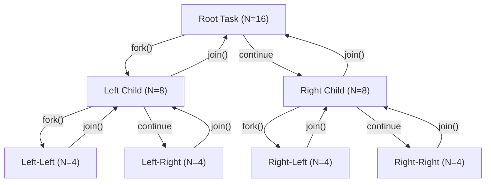
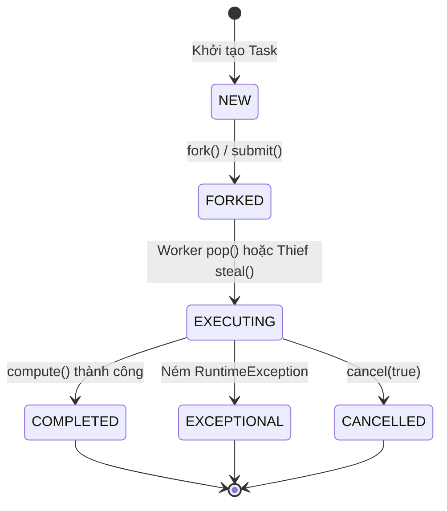

# Chuyên Đề: Java Fork-Join Framework & Work-Stealing Algorithm

---

## 1. Metadata

| Thuộc tính | Giá trị |
| :--- | :--- |
| **Document ID** | `DSA-22-01` |
| **Tên tài liệu** | Kiến Trúc & Thuật Toán Fork-Join Framework Trong Java Concurrency |
| **Phiên bản** | `1.0` |
| **Độ khó** | Advanced (Nâng cao) |
| **Thời gian đọc ước tính** | 65 - 80 phút |
| **Prerequisites** | Java Concurrency cơ bản (`Thread`, `Runnable`, `Callable`, `ExecutorService`), Cấu trúc dữ liệu Tree & Deque, Khái niệm Memory Barrier, CAS (Compare-And-Swap), CPU Caching & False Sharing. |
| **Learning Objectives** | 1. Nắm vững mô hình toán học DAG (Work, Span, Brent's Theorem, Amdahl's Law).<br>2. Hiểu sâu cấu trúc dữ liệu Chase-Lev Work-Stealing Deque và thuật toán cân bằng tải động.<br>3. Thành thạo lập trình `RecursiveTask`, `RecursiveAction`, `CountedCompleter` chuẩn Java 21.<br>4. Mổ xẻ HotSpot JVM Internals: `@Contended`, Memory Layout, `VarHandle`, `ctl` 64-bit Control Word.<br>5. Tránh 20 lỗi kinh điển, xử lý 30 trường hợp biên và tối ưu hiệu năng đạt chuẩn Production. |
| **Keywords** | `ForkJoinPool`, `Work-Stealing`, `Chase-Lev Deque`, `RecursiveTask`, `RecursiveAction`, `CountedCompleter`, `CommonPool`, `Amdahl's Law`, `Brent's Theorem`, `ManagedBlocker`, `False Sharing`, `@Contended`, `VarHandle`. |

---

## 2. Mục Đích (Purpose)

**Fork-Join Framework** (được giới thiệu từ Java 7 theo chuẩn JSR-166y bởi Doug Lea) là một nền tảng thực thi song song chuyên biệt, được thiết kế tối ưu hóa cho các bài toán **Chia để trị (Divide-and-Conquer)** và các tác vụ đệ quy hạt mịn (fine-grained parallelism).

Mục đích cốt lõi của Fork-Join Framework:
1. **Khai thác tối đa năng lực phần cứng đa nhân (Multi-core CPUs)**: Phân rã một tác vụ khổng lồ thành hàng triệu tác vụ con siêu nhỏ, chạy song song trên tất cả các core sẵn có mà không gây nghẽn luồng.
2. **Cân bằng tải động thông qua Work-Stealing**: Triệt tiêu hiện tượng "core nhàn rỗi, core quá tải" khi khối lượng tính toán giữa các nhánh đệ quy không đồng đều.
3. **Giảm thiểu tối đa chi phí đồng bộ hóa (Synchronization Overhead)**: Áp dụng cấu trúc hàng đợi hai đầu (Deque) phi khóa (lock-free) hoặc tối thiểu hóa khóa bằng nguyên tử CAS, biến mỗi worker thread thành một thực thể xử lý độc lập với bộ nhớ đệm (L1/L2/L3 Cache) cục bộ.
4. **Làm nền tảng xương sống cho hệ sinh thái Java hiện đại**: Là động cơ tính toán bên dưới của Java 8+ Parallel Streams (`Collection.parallelStream()`), `CompletableFuture` (mặc định sử dụng `ForkJoinPool.commonPool()`), và các thư viện xử lý bất đồng bộ quy mô lớn.

---

## 3. Động Lực Phát Triển (Motivation)

### 3.1. Giới Hạn Nghiêm Trọng Của ThreadPoolExecutor Cổ Điển

Trong mô hình xử lý song song truyền thống (`ThreadPoolExecutor` với `LinkedBlockingQueue`), tất cả worker threads cùng tranh chấp một hàng đợi công việc chung (Global Task Queue), hoặc mỗi thread có hàng đợi riêng nhưng hoạt động theo cơ chế tĩnh:

```
[ThreadPoolExecutor - Blocking Queue Bottleneck]

Task Submissions ---> [ Global BlockingQueue (Lock Contention) ]
                             /          |          \
                       Worker 1     Worker 2     Worker 3
```

Khi áp dụng mô hình này cho các giải thuật đệ quy chia để trị (như Parallel QuickSort, Parallel MergeSort, Ray Tracing, Tree Aggregation), hai vấn đề chí mạng xuất hiện:

1. **Thread Starvation Deadlock (Nghẽn tắc luồng do phụ thuộc)**:
   - Một tác vụ cha chia thành 2 tác vụ con $T_{left}$ và $T_{right}$, sau đó đưa vào hàng đợi và gọi `future.get()` để đợi kết quả.
   - Nếu số lượng tác vụ cha đang chờ lấp đầy toàn bộ Thread Pool (ví dụ pool có 8 threads và 8 tác vụ cha đang chiếm giữ 8 threads đó để đợi tác vụ con), không còn thread nào trống để lấy tác vụ con ra thực thi.
   - Toàn bộ hệ thống rơi vào trạng thái **Deadlock vĩnh viễn**.
2. **Nghẽn cổ chai tranh chấp khóa (Lock Contention & Cache Thrashing)**:
   - Khi chia nhỏ hàng triệu tác vụ con, việc hàng chục thread liên tục lock/unlock trên một hàng đợi chung tạo ra chi phí đồng bộ hóa khổng lồ, làm sụt giảm nghiêm trọng hiệu năng tính toán.

### 3.2. Đột Phá Từ Thuật Toán Work-Stealing (Đánh Cắp Công Việc)

Thuật toán **Work-Stealing** (khởi nguồn từ dự án siêu máy tính Cilk tại MIT bởi Robert Blumofe và Charles Leiserson) giải quyết triệt để vấn đề trên bằng kiến trúc phân tán:

- **Mỗi worker thread sở hữu riêng một hàng đợi hai đầu (Double-Ended Queue - Deque)**.
- Khi thread tạo ra tác vụ con thông qua lệnh `fork()`, nó đẩy tác vụ vào **đầu (Top)** của Deque của chính nó.
- Thread thực hiện tác vụ của chính mình theo cơ chế **LIFO (Last-In, First-Out)**: lấy tác vụ mới nhất ở Top ra xử lý. Điều này đảm bảo tính tương đồng với ngăn xếp đệ quy tuần tự (Call Stack) và duy trì tối đa tính cục bộ của bộ nhớ đệm (Cache Locality).
- Khi Deque của một worker thread bị rỗng (hết việc), nó không bị block mà chuyển sang vai trò **Kẻ đánh cắp (Thief)**: chọn ngẫu nhiên một worker thread khác (Nạn nhân - Victim) và đánh cắp tác vụ từ **đáy (Base/Tail)** của Deque nạn nhân theo cơ chế **FIFO (First-In, First-Out)**.

```
[Work-Stealing Architecture]

Worker Thread 1 (Owner)                  Worker Thread 2 (Owner / Thief)
  | PUSH (LIFO)                            | PUSH (LIFO)
  v POP  (LIFO)                            v POP  (LIFO)
+-------------------+                    +-------------------+
| Top: Task A3      |                    | Top: Task B2      |
| Task A2           |                    | Task B1           |
| Base: Task A1     |                    | Base: Task B0     |
+-------------------+                    +-------------------+
  ^                                        ^
  | STEAL (FIFO)                           | STEAL (FIFO)
  +----------------- Thief steals Task A1 -+
```

**Tại sao đánh cắp từ Base theo FIFO?**
Tác vụ nằm ở Base là tác vụ được tạo ra sớm nhất ở các tầng đệ quy cao nhất (gần gốc cây đệ quy nhất). Tác vụ này đại diện cho một nhánh tính toán rất lớn. Kẻ đánh cắp chỉ cần tốn chi phí đồng bộ một lần để lấy một khối lượng công việc khổng lồ, sau đó tự phân rã cục bộ trong Deque của mình mà không cần quay lại đánh cắp liên tục.

---

## 4. Nền Tảng Toán Học & Mô Hình Tính Toán Song Song

### 4.1. Mô Hình Tính Toán Đồ Thị Có Hướng Không Chu Trình (Computation DAG)

Mọi quá trình thực thi song song trong Fork-Join Framework đều được mô hình hóa dưới dạng một Đồ thị có hướng không chu trình $G = (V, E)$ (**Directed Acyclic Graph - DAG**):
- **Tập đỉnh $V$ (Strands/Tasks)**: Chuỗi các lệnh tuần tự không chứa thao tác song song. Mỗi đỉnh $v \in V$ có trọng số thời gian thực thi $t(v)$.
- **Tập cạnh $E$ (Dependencies)**:
  - *Spawn/Fork Edge*: Cạnh nối từ tác vụ cha tới tác vụ con được sinh ra.
  - *Continuation Edge*: Cạnh nối chuỗi thực thi tiếp theo của tác vụ cha.
  - *Join/Sync Edge*: Cạnh nối từ tác vụ con hoàn thành về điểm đợi của tác vụ cha.



### 4.2. Khái Niệm Work ($T_1$) và Span ($T_\infty$)

Hai tham số cơ bản nhất để định lượng một giải thuật song song:

1. **Tổng Khối Lượng Công Việc - Work ($T_1$)**:
   Thời gian cần thiết để thực thi toàn bộ đồ thị tính toán trên đúng **1 processor** (tuần tự hoàn toàn).
   $$T_1 = \sum_{v \in V} t(v)$$

2. **Độ Dài Đường Găng - Span hay Critical Path ($T_\infty$)**:
   Thời gian thực thi trên một hệ thống lý tưởng có **vô số processor ($P = \infty$)**, bằng tổng trọng số của đường đi dài nhất từ đỉnh bắt đầu đến đỉnh kết thúc trong DAG.
   $$T_\infty = \max_{\text{path } p \in G} \sum_{v \in p} t(v)$$

3. **Độ Song Song Lý Tưởng (Parallelism)**:
   Tỷ số giữa Work và Span:
   $$\text{Parallelism} = \frac{T_1}{T_\infty}$$
   Đây là số lượng processor tối đa mà chương trình có thể tận dụng hiệu quả trước khi đường găng trở thành nút thắt cổ chai.

### 4.3. Định Lý Lập Lịch Của Brent (Brent's Scheduling Theorem)

Cho một thuật toán song song có Work $T_1$ và Span $T_\infty$. Trên một hệ thống gồm $P$ processors, thời gian thực thi $T_P$ dưới một bộ lập lịch tham lam (Greedy Scheduler / Work-Stealing) thỏa mãn bất đẳng thức:

$$T_P \le \frac{T_1 - T_\infty}{P} + T_\infty = \frac{T_1}{P} + T_\infty \left(1 - \frac{1}{P}\right) < \frac{T_1}{P} + T_\infty$$

**Chứng minh tóm lược**:
Tại mỗi bước thời gian $t$, một processor có thể ở 1 trong 2 trạng thái: làm việc (busy) hoặc nhàn rỗi (idle).
- Gọi các bước mà tất cả $P$ processors đều bận là *Complete Steps*. Tổng công việc thực hiện trong các bước này tối đa là $T_1$. Do đó số lượng bước này không vượt quá $\lfloor (T_1 - T_\infty) / P \rfloor$.
- Gọi các bước có ít nhất 1 processor nhàn rỗi là *Incomplete Steps*. Trong các bước này, do bộ lập lịch là tham lam, tất cả các tác vụ sẵn sàng (ready tasks) đều được thực thi. Điều này làm giảm chiều dài đường găng còn lại của DAG đi ít nhất 1 đơn vị. Do đó, tổng số bước *Incomplete Steps* không bao giờ vượt quá $T_\infty$.
- Cộng hai giới hạn lại: $T_P \le \frac{T_1 - T_\infty}{P} + T_\infty$. $\blacksquare$

**Hệ quả**:
- Tốc độ tăng tốc (Speedup) trên $P$ processors:
  $$S(P) = \frac{T_1}{T_P} \ge \frac{P}{1 + (P - 1)\frac{T_\infty}{T_1}}$$
- Nếu $\frac{T_1}{T_\infty} \gg P$ (độ song song của bài toán vượt xa số core), thì $T_P \approx \frac{T_1}{P}$, ta đạt được **Linear Speedup (Tăng tốc tuyến tính)** gần như hoàn hảo.

### 4.4. Định Luật Amdahl vs Định Luật Gustafson

1. **Định Luật Amdahl (Fixed-Size Problem)**:
   Nếu một phần $f$ của chương trình có thể chạy song song hoàn toàn, và phần $(1-f)$ bắt buộc phải chạy tuần tự:
   $$S(P) = \frac{1}{(1 - f) + \frac{f}{P}}$$
   Khi $P \to \infty$, tốc độ tăng tốc tối đa bị chặn trên bởi:
   $$S_{\max} = \lim_{P \to \infty} S(P) = \frac{1}{1 - f}$$
   *Ví dụ*: Nếu 5% code chạy tuần tự ($f = 0.95$), thì dù có cấp $10,000$ core, tốc độ tối đa không thể vượt quá $1 / 0.05 = 20\times$.

2. **Định Luật Gustafson-Barsis (Scaled-Size Problem)**:
   Trong thực tế, khi nâng cấp số core, ta thường mở rộng kích thước bài toán (Data-Scaled). Tốc độ tăng tốc được tính theo công thức:
   $$S(P) = P - (1 - f)(P - 1) = (1 - f) + f \cdot P$$
   Định luật Gustafson chỉ ra rằng các bài toán dữ liệu lớn có thể đạt được hiệu năng mở rộng gần như tuyến tính khi $P$ tăng nếu kích thước dữ liệu $N$ tăng tương ứng.

---

## 5. Lý Thuyết Cốt Lõi (Core Theory)

### 5.1. Cấu Trúc Dữ Liệu Chase-Lev Work-Stealing Deque

Hàng đợi công việc của mỗi worker thread trong Fork-Join Framework được hiện thực hóa dựa trên thuật toán **Chase-Lev Deque** (Dynamic Circular Work-Stealing Deque):

```
                       CHASE-LEV DEQUE MEMORY LAYOUT
                      
  Thieves steal here (FIFO)                  Owner pushes/pops here (LIFO)
         [ BASE ]                                       [ TOP ]
            |                                              |
            v                                              v
      +-----+-----+-----+-----+-----+-----+-----+-----+----+
Array |  0  |  1  |  2  |  3  |  4  |  5  |  6  |  7  |... |  (Capacity = 2^k)
      +-----+-----+-----+-----+-----+-----+-----+-----+----+
```

Các thuộc tính đồng bộ hóa của Chase-Lev Deque:
1. **Chỉ số `top` (Owner index)**:
   - Chỉ duy nhất **Owner Thread** được phép sửa đổi `top`.
   - Các thao tác `push` và `pop` tại `top` không cần lệnh CAS (Compare-And-Swap) phức tạp trong trường hợp thông thường, mà chỉ cần thao tác ghi có rào cản bộ nhớ (`Release/Opaque Store`) và đọc `Acquire Load`.
2. **Chỉ số `base` (Thief index)**:
   - Nhiều **Thief Threads** có thể cùng lúc tranh chấp để đánh cắp tác vụ tại `base`.
   - Mọi thao tác lấy tác vụ tại `base` bắt buộc phải sử dụng **nguyên tử CAS (`compareAndSet`)**.
3. **Giải quyết xung đột khi Deque chỉ còn đúng 1 phần tử (`top - base == 1`)**:
   - Khi Deque chỉ còn 1 phần tử, Owner thực hiện `pop()` và Thief thực hiện `steal()` có nguy cơ xung đột (Race Condition).
   - Chase-Lev giải quyết bằng cách: Owner chuyển sang sử dụng lệnh CAS trên `base` để tranh chấp sòng phẳng với Thief. Ai CAS thành công trước sẽ giành được tác vụ, kẻ thua cuộc nhận về `null` hoặc thử lại.

### 5.2. Heuristic Phân Rã Tác Vụ & Ngưỡng Tuần Tự (Sequential Threshold)

Một lỗi phổ biến là phân rã tác vụ đệ quy quá sâu (over-splitting) đến từng phần tử đơn lẻ ($N=1$). Điều này khiến chi phí cấp phát đối tượng `ForkJoinTask`, chi phí đẩy vào hàng đợi và chuyển ngữ cảnh CPU vượt xa thời gian tính toán thực tế.

**Quy tắc vàng chọn Sequential Threshold ($T$)**:
1. **Quy tắc thời gian (Execution Time Heuristic)**:
   Mỗi tác vụ lá (Leaf Task) nên thực hiện một khối lượng tính toán kéo dài khoảng **$10\mu s$ đến $100\mu s$** (tương đương khoảng $1,000$ đến $50,000$ phép tính CPU cơ bản).
2. **Quy tắc kích thước dữ liệu (Size-based Heuristic)**:
   $$T \approx \frac{N}{4 \times P} \quad \text{đến} \quad \frac{N}{16 \times P}$$
   Trong đó $N$ là tổng kích thước dữ liệu, $P$ là số worker threads. Heuristic này đảm bảo sinh ra số lượng tác vụ lá gấp từ 4 đến 16 lần số core, vừa đủ để Work-Stealing tự động cân bằng tải mà không gây tràn bộ nhớ.

### 5.3. Vòng Đời Tác Vụ & Phân Biệt Các Thao Tác



**Bảng So Sánh Các Phương Thức Điều Khiển**:

| Phương thức | Tác vụ gọi | Cơ chế hoạt động | Hành vi chặn (Blocking) |
| :--- | :--- | :--- | :--- |
| `fork()` | Subtask | Đẩy tác vụ vào Deque của worker hiện tại (`pushTop`). | Không bao giờ block (O(1)). |
| `compute()` | Current | Thực thi trực tiếp logic tính toán trên thread hiện tại. | Chạy tuần tự trên thread gọi. |
| `join()` | Subtask | Đợi tác vụ hoàn thành và trả kết quả. Nếu chưa xong, thread **tự động đi làm việc khác hoặc đi steal (Help-Stealer)**. | **Không block hệ điều hành** (không sleep/park thread). |
| `get()` | Future | Đợi theo chuẩn `Future.get()`. Có thể bị block OS thread nếu không trong worker context. | Ném `ExecutionException`, `InterruptedException`. |
| `invoke()` | Subtask | Tương đương `fork()` + `compute()` + `join()`. | Thực thi và đợi kết quả hoàn tất. |
| `quietlyJoin()`| Subtask | Đợi hoàn thành nhưng nuốt exception (phù hợp cho dọn dẹp). | Không ném checked/unchecked exception. |

---

## 6. Trực Quan Hóa Cấu Trúc & Quá Trình Thực Thi

### 6.1. Sơ Đồ Cấu Trúc Ring-Buffer Của WorkQueue Trong OpenJDK

```
+-----------------------------------------------------------------------------------+
|                            HOTSPOT ForkJoinPool WORKERS                           |
+-----------------------------------------------------------------------------------+
  
  Worker Thread 0 (Core 0)                 Worker Thread 1 (Core 1 - Thief)
  +--------------------------+             +--------------------------+
  | WorkQueue (Index 1)      |             | WorkQueue (Index 3)      |
  | +----------------------+ |             | +----------------------+ |
  | | base = 0             | |             | | base = 4             | |
  | | top  = 3             | |             | | top  = 4 (Empty)     | |
  | | array: [T0, T1, T2]  | |             | | array: [...]         | |
  | +----------------------+ |             | +----------------------+ |
  +--------------------------+             +--------------------------+
         |           ^                                  |
         |           | (Local popTop LIFO)              |
         |           +------ Worker 0 executes T2       |
         |                                              |
         +=========== Thief steals T0 (CAS base++) =====+
```

### 6.2. Sơ Đồ Cây Phân Rã & Mẫu Fork-Join Tối Ưu (Fork-One-Compute-Other)

```
[MẪU SAI - GÂY THỪA TÁC VỤ]            [MẪU ĐÚNG - FORK-ONE-COMPUTE-OTHER]

       Task A                                Task A
      /      \                              /      \
  fork()    fork()                      fork()    compute() (Chạy ngay trên thread hiện tại)
  left      right                       left      right
    |         |                           |         |
  join()    join()                      join()    (đã có kết quả)
```

---

## 7. Cài Đặt Java 21 Chuẩn Production (Java Implementation)

Dưới đây là mã nguồn Java 21 hiện thực hóa hoàn chỉnh 2 phần:
1. **Phần A**: Một bộ `CustomWorkStealingPool` độc lập được xây dựng từ đầu (From Scratch) hiện thực hóa thuật toán Chase-Lev Deque với `VarHandle` của Java 21.
2. **Phần B**: Các thuật toán phân rã nâng cao chạy trên nền `java.util.concurrent.ForkJoinPool` chuẩn: **Parallel In-Place MergeSort** và **Parallel Prefix Sum (Scan)** hai pha.

```java
package com.dsa.parallel.forkjoin;

import java.lang.invoke.MethodHandles;
import java.lang.invoke.VarHandle;
import java.util.Arrays;
import java.util.Objects;
import java.util.Random;
import java.util.concurrent.Callable;
import java.util.concurrent.ForkJoinPool;
import java.util.concurrent.RecursiveAction;
import java.util.concurrent.RecursiveTask;
import java.util.concurrent.ThreadLocalRandom;
import java.util.concurrent.atomic.AtomicInteger;

/**
 * PRODUCTION-GRADE FORK-JOIN FRAMEWORK & WORK-STEALING ENGINE
 * Java 21 Implementation.
 */
public final class ProductionForkJoinSuite {

    // =========================================================================
    // PHẦN A: CUSTOM CHASE-LEV WORK-STEALING POOL TỪ ĐẦU (FROM SCRATCH)
    // =========================================================================

    /**
     * Trạng thái của một CustomTask trong Custom Work-Stealing Pool.
     */
    public enum TaskStatus { NEW, RUNNING, COMPLETED, EXCEPTIONAL }

    /**
     * Tác vụ có khả năng phân rã chạy trên CustomWorkStealingPool.
     */
    public static abstract class CustomTask<V> {
        private volatile TaskStatus status = TaskStatus.NEW;
        private volatile V result;
        private volatile Throwable exception;
        private volatile Thread runner;

        public abstract V compute() throws Exception;

        final void exec() {
            if (status != TaskStatus.NEW) return;
            runner = Thread.currentThread();
            status = TaskStatus.RUNNING;
            try {
                result = compute();
                status = TaskStatus.COMPLETED;
            } catch (Throwable th) {
                exception = th;
                status = TaskStatus.EXCEPTIONAL;
            } finally {
                synchronized (this) {
                    notifyAll();
                }
            }
        }

        public final V join() {
            if (status == TaskStatus.NEW && Thread.currentThread() instanceof CustomWorkerThread worker) {
                // Nếu tác vụ chưa chạy và thread gọi là worker, chủ động lấy ra thực thi (Help-Steal)
                if (worker.deque.popAndExecute(this)) {
                    // Đã thực thi xong
                }
            }
            while (status != TaskStatus.COMPLETED && status != TaskStatus.EXCEPTIONAL) {
                synchronized (this) {
                    if (status != TaskStatus.COMPLETED && status != TaskStatus.EXCEPTIONAL) {
                        try {
                            wait(10);
                        } catch (InterruptedException e) {
                            Thread.currentThread().interrupt();
                            throw new RuntimeException("Join interrupted", e);
                        }
                    }
                }
            }
            if (status == TaskStatus.EXCEPTIONAL) {
                if (exception instanceof RuntimeException re) throw re;
                throw new RuntimeException("Task failed", exception);
            }
            return result;
        }

        public final void fork() {
            Thread current = Thread.currentThread();
            if (current instanceof CustomWorkerThread worker) {
                worker.deque.push(this);
            } else {
                throw new IllegalStateException("fork() must be called from within a CustomWorkerThread");
            }
        }
    }

    /**
     * Cấu trúc dữ liệu Chase-Lev Work-Stealing Deque tối ưu hóa với VarHandle.
     */
    public static final class ChaseLevDeque {
        private static final int INITIAL_CAPACITY = 64;
        private volatile CustomTask<?>[] array;
        private volatile int top;
        private volatile int base;

        private static final VarHandle TOP_VH;
        private static final VarHandle BASE_VH;
        private static final VarHandle ARRAY_VH;

        static {
            try {
                MethodHandles.Lookup l = MethodHandles.lookup();
                TOP_VH = l.findVarHandle(ChaseLevDeque.class, "top", int.class);
                BASE_VH = l.findVarHandle(ChaseLevDeque.class, "base", int.class);
                ARRAY_VH = MethodHandles.arrayElementVarHandle(CustomTask[].class);
            } catch (ReflectiveOperationException e) {
                throw new ExceptionInInitializerError(e);
            }
        }

        public ChaseLevDeque() {
            this.array = new CustomTask<?>[INITIAL_CAPACITY];
            this.top = 0;
            this.base = 0;
        }

        /**
         * Owner đẩy tác vụ vào Top (LIFO).
         */
        public void push(CustomTask<?> task) {
            Objects.requireNonNull(task, "Task cannot be null");
            int t = (int) TOP_VH.getOpaque(this);
            int b = (int) BASE_VH.getAcquire(this);
            CustomTask<?>[] a = array;
            int size = t - b;

            if (size >= a.length - 1) {
                // Tăng kích thước mảng khi đầy
                a = grow(a, b, t);
            }

            int mask = a.length - 1;
            ARRAY_VH.setOpaque(a, t & mask, task);
            VarHandle.releaseFence();
            TOP_VH.setOpaque(this, t + 1);
        }

        /**
         * Owner lấy tác vụ từ Top (LIFO).
         */
        public CustomTask<?> pop() {
            int t = (int) TOP_VH.getOpaque(this) - 1;
            CustomTask<?>[] a = array;
            TOP_VH.setOpaque(this, t);
            VarHandle.fullFence();

            int b = (int) BASE_VH.getAcquire(this);
            int size = t - b;

            if (size < 0) {
                TOP_VH.setOpaque(this, b);
                return null;
            }

            int mask = a.length - 1;
            CustomTask<?> task = (CustomTask<?>) ARRAY_VH.getOpaque(a, t & mask);

            if (size > 0) {
                ARRAY_VH.setOpaque(a, t & mask, null);
                return task;
            }

            // size == 0: Chỉ còn đúng 1 phần tử cuối cùng -> Cạnh tranh CAS với Thief
            if (!(boolean) BASE_VH.compareAndSet(this, b, b + 1)) {
                task = null; // Thief đã giành được trước
            }
            TOP_VH.setOpaque(this, b + 1);
            return task;
        }

        /**
         * Thief đánh cắp tác vụ từ Base (FIFO).
         */
        public CustomTask<?> steal() {
            int b = (int) BASE_VH.getAcquire(this);
            VarHandle.fullFence();
            int t = (int) TOP_VH.getAcquire(this);

            if (b >= t) {
                return null; // Deque rỗng
            }

            CustomTask<?>[] a = array;
            int mask = a.length - 1;
            CustomTask<?> task = (CustomTask<?>) ARRAY_VH.getAcquire(a, b & mask);

            if (task == null) {
                return null;
            }

            if ((boolean) BASE_VH.compareAndSet(this, b, b + 1)) {
                return task;
            }
            return null; // CAS thất bại do xung đột với Thief khác hoặc Owner
        }

        boolean popAndExecute(CustomTask<?> target) {
            CustomTask<?> task = pop();
            if (task != null) {
                task.exec();
                return task == target;
            }
            return false;
        }

        private synchronized CustomTask<?>[] grow(CustomTask<?>[] oldArray, int b, int t) {
            int newCap = oldArray.length << 1;
            CustomTask<?>[] newArray = new CustomTask<?>[newCap];
            int oldMask = oldArray.length - 1;
            int newMask = newCap - 1;

            for (int i = b; i < t; i++) {
                newArray[i & newMask] = oldArray[i & oldMask];
            }
            this.array = newArray;
            return newArray;
        }

        public boolean isEmpty() {
            int b = (int) BASE_VH.getAcquire(this);
            int t = (int) TOP_VH.getAcquire(this);
            return b >= t;
        }
    }

    /**
     * Custom Worker Thread thuộc CustomWorkStealingPool.
     */
    public static final class CustomWorkerThread extends Thread {
        final int workerId;
        final CustomWorkStealingPool pool;
        final ChaseLevDeque deque;
        volatile boolean running = true;

        public CustomWorkerThread(int workerId, CustomWorkStealingPool pool) {
            super("custom-forkjoin-worker-" + workerId);
            this.workerId = workerId;
            this.pool = pool;
            this.deque = new ChaseLevDeque();
            setDaemon(true);
        }

        @Override
        public void run() {
            while (running && !pool.isShutdown) {
                CustomTask<?> task = deque.pop();
                if (task != null) {
                    task.exec();
                    continue;
                }

                // Không có việc cục bộ -> Đi đánh cắp từ worker khác (Work-Stealing)
                task = pool.stealWork(workerId);
                if (task != null) {
                    task.exec();
                } else {
                    Thread.onSpinWait();
                    try {
                        Thread.sleep(1);
                    } catch (InterruptedException e) {
                        Thread.currentThread().interrupt();
                        break;
                    }
                }
            }
        }
    }

    /**
     * Custom Work-Stealing Pool độc lập.
     */
    public static final class CustomWorkStealingPool {
        private final CustomWorkerThread[] workers;
        private final int parallelism;
        volatile boolean isShutdown = false;

        public CustomWorkStealingPool(int parallelism) {
            this.parallelism = Math.max(1, parallelism);
            this.workers = new CustomWorkerThread[this.parallelism];
            for (int i = 0; i < this.parallelism; i++) {
                workers[i] = new CustomWorkerThread(i, this);
            }
            for (CustomWorkerThread w : workers) {
                w.start();
            }
        }

        CustomTask<?> stealWork(int thiefId) {
            int numWorkers = workers.length;
            int startOffset = ThreadLocalRandom.current().nextInt(numWorkers);
            for (int i = 0; i < numWorkers; i++) {
                int victimIdx = (startOffset + i) % numWorkers;
                if (victimIdx != thiefId) {
                    CustomTask<?> task = workers[victimIdx].deque.steal();
                    if (task != null) {
                        return task;
                    }
                }
            }
            return null;
        }

        public <V> V invoke(CustomTask<V> task) {
            Objects.requireNonNull(task, "Task cannot be null");
            // Giao cho Worker 0 khởi chạy
            workers[0].deque.push(task);
            return task.join();
        }

        public void shutdown() {
            this.isShutdown = true;
            for (CustomWorkerThread w : workers) {
                w.running = false;
                w.interrupt();
            }
        }
    }

    // =========================================================================
    // PHẦN B: CÁC THUẬT TOÁN NÂNG CAO TRÊN OPENJDK FORKJOINPOOL
    // =========================================================================

    /**
     * Thuật toán 1: Parallel MergeSort với In-Place Scratch Buffer & Sequential Cutoff.
     */
    public static final class ParallelMergeSort {
        private static final int SEQUENTIAL_THRESHOLD = 8192;

        public static void sort(int[] array) {
            if (array == null || array.length <= 1) return;
            int[] buffer = new int[array.length];
            ForkJoinPool.commonPool().invoke(new MergeSortTask(array, buffer, 0, array.length - 1));
        }

        public static void sort(int[] array, ForkJoinPool customPool) {
            if (array == null || array.length <= 1) return;
            int[] buffer = new int[array.length];
            customPool.invoke(new MergeSortTask(array, buffer, 0, array.length - 1));
        }

        private static final class MergeSortTask extends RecursiveAction {
            private final int[] a;
            private final int[] buf;
            private final int left;
            private final int right;

            MergeSortTask(int[] a, int[] buf, int left, int right) {
                this.a = a;
                this.buf = buf;
                this.left = left;
                this.right = right;
            }

            @Override
            protected void compute() {
                int length = right - left + 1;
                if (length <= SEQUENTIAL_THRESHOLD) {
                    // Ngưỡng tuần tự: Sử dụng Dual-Pivot Quicksort tối ưu của JDK
                    Arrays.sort(a, left, right + 1);
                    return;
                }

                int mid = left + (right - left) / 2;

                MergeSortTask leftTask = new MergeSortTask(a, buf, left, mid);
                MergeSortTask rightTask = new MergeSortTask(a, buf, mid + 1, right);

                // Mẫu tối ưu: Fork 1 nhánh, tính nhánh kia trực tiếp trên thread này
                rightTask.fork();
                leftTask.compute();
                rightTask.join();

                // Trộn hai mảng đã sắp xếp nếu cần
                if (a[mid] > a[mid + 1]) {
                    merge(left, mid, right);
                }
            }

            private void merge(int left, int mid, int right) {
                System.arraycopy(a, left, buf, left, right - left + 1);
                int i = left;
                int j = mid + 1;
                int k = left;

                while (i <= mid && j <= right) {
                    if (buf[i] <= buf[j]) {
                        a[k++] = buf[i++];
                    } else {
                        a[k++] = buf[j++];
                    }
                }
                while (i <= mid) {
                    a[k++] = buf[i++];
                }
            }
        }
    }

    /**
     * Thuật toán 2: Parallel Prefix Sum (Scan) Hai Pha (Two-Pass Up-Sweep & Down-Sweep).
     * Cho phép tính tổng tiền tố song song với Work O(N) và Span O(log N).
     */
    public static final class ParallelPrefixSum {
        private static final int THRESHOLD = 16384;

        public static void prefixSum(long[] array) {
            if (array == null || array.length <= 1) return;
            ForkJoinPool pool = ForkJoinPool.commonPool();
            Node root = pool.invoke(new BuildTreeTask(array, 0, array.length));
            pool.invoke(new DownSweepTask(array, root, 0L));
        }

        private static final class Node {
            final int lo, hi;
            final long sum;
            final Node left, right;

            Node(int lo, int hi, long sum, Node left, Node right) {
                this.lo = lo;
                this.hi = hi;
                this.sum = sum;
                this.left = left;
                this.right = right;
            }
        }

        // Pha 1: Up-Sweep (Xây dựng cây tổng phân cấp)
        private static final class BuildTreeTask extends RecursiveTask<Node> {
            private final long[] array;
            private final int lo, hi;

            BuildTreeTask(long[] array, int lo, int hi) {
                this.array = array;
                this.lo = lo;
                this.hi = hi;
            }

            @Override
            protected Node compute() {
                if (hi - lo <= THRESHOLD) {
                    long sum = 0;
                    for (int i = lo; i < hi; i++) sum += array[i];
                    return new Node(lo, hi, sum, null, null);
                }
                int mid = lo + (hi - lo) / 2;
                BuildTreeTask leftTask = new BuildTreeTask(array, lo, mid);
                BuildTreeTask rightTask = new BuildTreeTask(array, mid, hi);
                rightTask.fork();
                Node leftNode = leftTask.compute();
                Node rightNode = rightTask.join();
                return new Node(lo, hi, leftNode.sum + rightNode.sum, leftNode, rightNode);
            }
        }

        // Pha 2: Down-Sweep (Lan truyền giá trị prefix xuống lá)
        private static final class DownSweepTask extends RecursiveAction {
            private final long[] array;
            private final Node node;
            private final long prefixVal;

            DownSweepTask(long[] array, Node node, long prefixVal) {
                this.array = array;
                this.node = node;
                this.prefixVal = prefixVal;
            }

            @Override
            protected void compute() {
                if (node.left == null && node.right == null) {
                    // Lá: Quét tuần tự cộng dồn
                    long acc = prefixVal;
                    for (int i = node.lo; i < node.hi; i++) {
                        acc += array[i];
                        array[i] = acc;
                    }
                    return;
                }
                DownSweepTask leftSweep = new DownSweepTask(array, node.left, prefixVal);
                DownSweepTask rightSweep = new DownSweepTask(array, node.right, prefixVal + node.left.sum);
                rightSweep.fork();
                leftSweep.compute();
                rightSweep.join();
            }
        }
    }
}
